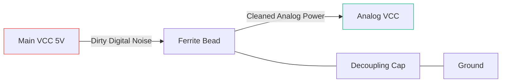

हाई-स्पीड डिजिटल इलेक्ट्रॉनिक्स बहुत अधिक विद्युत चुम्बकीय शोर पैदा करते हैं। शमन के बिना, यह उच्च-आवृत्ति हस्तक्षेप संवेदनशील एनालॉग लाइनों में प्रवाहित होता है या बाहर की ओर विकिरण करता है, जिससे आपका उपकरण एफसीसी उत्सर्जन परीक्षण में शानदार ढंग से विफल हो जाता है।

इस हस्तक्षेप के विरुद्ध प्राथमिक हथियार **फेराइट बीड** है। इसके योजनाबद्ध प्रतीक और प्लेसमेंट को समझना यह तय करता है कि आपका सर्किट साफ-सुथरा संचालित होता है या अपने ही शोर में डूब जाता है।

## 1. फेराइट बीड प्रतीक की कल्पना करना

फेराइट बीड स्वाभाविक रूप से एक भारी हानिपूर्ण प्रारंभकर्ता की तरह काम करता है। इस वजह से, इसका योजनाबद्ध प्रतीक मानक प्रारंभकर्ता प्रतीक से निकटता से संबंधित है, लेकिन इसकी विशिष्ट भूमिका पर जोर देने के लिए तैयार किया गया है।

```mermaid
graph LR
    A[Inductor Basis] --> B(Standard Inductor Symbol)
    A --> C(Rectangle Over Wire)
    B -.-> D(Addition of a dashed line or solid bar)
    D --> E[IEEE Ferrite Symbol]
    C --> F[IEC Ferrite Symbol]
    
    style E fill:#0f172a,stroke:#3b82f6
    style F fill:#0f172a,stroke:#10b981
```

| गुण | आईईईई/एएनएसआई मानक | आईईसी मानक | नोट्स |
| :--- | :--- | :--- | :--- |
| **आकार** | एक बार/बॉक्स के साथ अर्धवृत्तों की श्रृंखला | एक ठोस आयताकार ब्लॉक | कार्यात्मक रूप से परिणाम में समान |
| **डिजाइनेटर उपसर्ग** | `एफबी` | `एफबी` या `एल` | पावर इंडक्टर्स के साथ भ्रम को रोकने के लिए `एफबी` का उपयोग करने की अत्यधिक अनुशंसा की जाती है
| **माप इकाई** | विशिष्ट मेगाहर्ट्ज पर ओम (Ω) | विशिष्ट मेगाहर्ट्ज पर ओम (Ω) | हेनरी (एच) में मापे गए प्रेरकों के विपरीत |

> **महत्वपूर्ण अंतर:** कभी भी फेराइट बीड को प्रेरण के आधार पर रेट न करें। फेराइट मोतियों को एक विशिष्ट आवृत्ति** (आमतौर पर 100 मेगाहर्ट्ज) पर उनके **प्रतिबाधा (ओम में) द्वारा निर्दिष्ट किया जाता है।

## 2. कोर ऑपरेशनल मैकेनिक्स

मानक प्रारंभकर्ता के स्थान पर फेराइट बीड का उपयोग क्यों करें?

* एक **प्रेरक** ऊर्जा संग्रहीत करता है और इसे सर्किट में लौटाता है। यह अत्यधिक प्रतिक्रियाशील है और ऊर्जा को संरक्षित रखता है।
* एक **फेराइट बीड** को सक्रिय रूप से *हानिकारक* बनाने के लिए डिज़ाइन किया गया है। उच्च आवृत्तियों पर, यह एक अवरोधक की तरह व्यवहार करता है, अवांछित उच्च-आवृत्ति शोर को सीधे गर्मी में परिवर्तित करता है।

| फ़्रिक्वेंसी रेंज | फेराइट मनका व्यवहार | सर्किट पर परिणाम |
| :--- | :--- | :--- |
| **कम आवृत्ति/डीसी** | 1 मेगाहर्ट्ज से कम | एक साधारण तार (~0 Ω) की तरह कार्य करता है। डीसी बिजली स्वतंत्र रूप से गुजरती है। |
| **गुंजयमान आवृत्ति** | अत्यधिक प्रतिक्रियाशील | ऊर्जा को संक्षेप में संग्रहित करता है। |
| **उच्च आवृत्ति** | 50 मेगाहर्ट्ज+ से अधिक | एक उच्च-मूल्य अवरोधक की तरह कार्य करता है। गर्मी के रूप में आरएफ शोर को रोकता और नष्ट करता है। |

## 3. योजनाबद्ध प्लेसमेंट के लिए सर्वोत्तम अभ्यास

एफबी प्रतीक का उचित उपयोग करने के लिए रणनीतिक प्लेसमेंट की आवश्यकता होती है। योजनाबद्ध तरीके से फेराइट मोतियों को बेतरतीब ढंग से थपथपाने से वास्तव में रिंगिंग और प्रतिध्वनि खराब हो सकती है।

### डिकूपलिंग विद्युत आपूर्ति (पाई-फ़िल्टर)

`एफबी` प्रतीक के लिए सबसे आम उपयोग गंदे डिजिटल पावर को स्वच्छ एनालॉग पावर से अलग करना है।

उपरोक्त कॉन्फ़िगरेशन (पीआई-फ़िल्टर का हिस्सा) में, फेराइट बीड उच्च-आवृत्ति क्षणकों को एवीसीसी लाइन में प्रवेश करने से रोकता है, जबकि संधारित्र किसी भी शेष तरंग को जमीन पर गिरा देता है।

### डेटा लाइन ईएमआई दमन

लंबे यूएसबी डेटा केबल या एचडीएमआई ट्रेस को रूट करते समय, `एफबी` प्रतीकों को अक्सर कनेक्टर के पास श्रृंखला में रखा जाता है। यह सुनिश्चित करता है कि लंबा, भौतिक रूप से खुला तार एंटीना के रूप में कार्य नहीं करता है और पूरे कमरे में सीपीयू शोर नहीं फैलाता है।

अपने अगले योजनाबद्ध में फेराइट बीड जोड़ने के लिए, **[सर्किट आरेख संपादक](/संपादक/)** खोलें, "फेराइट" खोजें और अपनी प्रतिबाधा रेटिंग निर्दिष्ट करें!