पावर इन्वर्टर का निर्माण - घरेलू उपकरणों को चलाने में सक्षम 12V कार बैटरी को 220V प्रत्यावर्ती धारा में परिवर्तित करना - इलेक्ट्रॉनिक्स इंजीनियरों के लिए एक संस्कार है।

टांका लगाने वाले लोहे को उठाने से पहले, आपको अंतर्निहित योजना की त्रुटिहीन समझ हासिल करनी होगी। उच्च-वोल्टेज सर्किटरी अक्षम्य है, और एक बुरी तरह से खींचा गया आरेख जले हुए MOSFETs या गंभीर बिजली के झटके की गारंटी देता है। यह गाइड एक मौलिक स्क्वायर-वेव इन्वर्टर की वास्तुकला को तोड़ता है।

> **सुरक्षा चेतावनी:** 220V AC पावर घातक है। यह लेख योजनाबद्ध तर्क और सैद्धांतिक डिजाइन की खोज है, न कि कोई विनिर्माण ब्लू-प्रिंट। उन्नत विद्युत प्रशिक्षण के बिना कभी भी हाई-वोल्टेज सर्किट न बनाएं।

## तीन स्तंभों वाली वास्तुकला

कोई फर्क नहीं पड़ता कि आधुनिक इन्वर्टर कितना जटिल है, योजनाबद्ध को हमेशा दृष्टिगत और तार्किक रूप से तीन अलग-अलग कार्यात्मक ब्लॉकों में विभाजित किया जा सकता है।

```mermaid
flowchart LR
    DC_SRC[(12V DC Battery)] --> OSC[1. Oscillator Block]
    OSC -- Low Power Square Wave --> AMP[2. Power Switch Block]
    AMP -- High Current 12V Wave --> TX[3. Step-Up Transformer]
    TX -- Magnetic Induction --> AC_OUT((220V AC Output))
    
    style OSC fill:#0f172a,stroke:#3b82f6
    style AMP fill:#0f172a,stroke:#f59e0b
    style TX fill:#0f172a,stroke:#ef4444
```

### स्टेज 1: ऑसिलेटर (दिमाग)

बैटरी से डायरेक्ट करंट (DC) एक सीधी रेखा में प्रवाहित होता है। ट्रांसफार्मर एक सीधी रेखा को आगे नहीं बढ़ा सकते; उन्हें उतार-चढ़ाव वाले चुंबकीय क्षेत्र की आवश्यकता होती है। इसलिए, हमें डीसी को एक कृत्रिम एसी तरंग (आमतौर पर भौगोलिक क्षेत्र के आधार पर 50 हर्ट्ज या 60 हर्ट्ज) में परिवर्तित करना होगा।

| प्रयुक्त घटक | योजनाबद्ध भूमिका | इसे क्यों चुना गया है |
| :--- | :--- | :--- |
| **सीडी4047 आईसी/555 टाइमर** | अस्थिर मल्टीवाइब्रेटर | आरसी समय स्थिरांक की गणना के माध्यम से उल्लेखनीय रूप से स्थिर वर्ग तरंग का उत्पादन करता है। |
| **प्रतिरोधक और संधारित्र नेटवर्क** | समय अंशशोधक | मान (उदाहरण के लिए, `R=100kΩ`, `C=0.1μF`) विशिष्ट रूप से सटीक 50Hz आवृत्ति निर्धारित करते हैं। |

### चरण 2: पावर स्विच (मांसपेशियाँ)

लॉजिक चिप एक प्राचीन 50Hz तरंग उत्पन्न करती है, लेकिन असाधारण रूप से कम वर्तमान सीमा पर (अक्सर 20mA से कम)। यदि आपने इसे ट्रांसफार्मर में डाला है, तो यह लाइटबल्ब चलाने के लिए पर्याप्त चुंबकीय प्रवाह उत्पन्न नहीं करेगा।

हम ऑसिलेटर और ट्रांसफार्मर कॉइल के बीच उच्च-शक्ति ट्रांजिस्टर रखते हैं।

1. ऑसिलेटर का कमजोर सिग्नल एक विशाल एन-चैनल MOSFET (जैसे IRF3205) के **गेट** से टकराता है।
2. MOSFET एक इलेक्ट्रॉनिक हेवी-ड्यूटी रिले के रूप में कार्य करता है।
3. यह 12V बैटरी से बड़े पैमाने पर एम्परेज को सीधे ट्रांसफार्मर कॉइल के माध्यम से प्रति सेकंड 50 बार स्विच करता है।

### चरण 3: स्टेप-अप ट्रांसफार्मर

योजनाबद्ध रूप से इस बिंदु पर, हमारे पास भारी मात्रा में 12V करंट आगे और पीछे स्पंदित हो रहा है। अंतिम चरण में ट्रांसफार्मर के प्राथमिक कॉइल के माध्यम से इसे रूट करने की आवश्यकता होती है।

| फ़ीचर | योजनाबद्ध विवरण | वास्तविक दुनिया निहितार्थ |
| :--- | :--- | :--- |
| **प्राथमिक कुंडल (बाएं)** | केंद्र-टैप कॉन्फ़िगरेशन (`12वी - 0 - 12वी`) | दो वैकल्पिक MOSFETs से आगे-पीछे पुश-पुल स्विचिंग की अनुमति देता है। |
| **कोर लाइन्स** | लंबवत खींची गई दो ठोस रेखाएँ | उच्च दक्षता वाले चुंबकीय प्रेरण के लिए आवश्यक लौह/फेराइट कोर का प्रतिनिधित्व करता है। |
| **सेकेंडरी कॉइल (दाएं)** | बड़े पैमाने पर बढ़ा हुआ वाइंडिंग अनुपात | भौतिकी स्पंदित 12V चुंबकीय प्रवाह को एक घातक, अस्थिर 220V तरंग में बदल देती है। |

## ड्राइंग विचार

इस डिज़ाइन का मसौदा तैयार करने के लिए **[सर्किट आरेख संपादक](/संपादक/)** का उपयोग करते समय, लेआउट की सर्वोत्तम प्रथाओं को याद रखें:

* कम-पावर ऑसिलेटर लाइनों की तुलना में 12V बैटरी करंट ले जाने वाली भारी लाइनें खींचें।
* MOSFET स्रोत पिन को स्पष्ट और विशिष्ट रूप से ग्राउंड करें; शोर युग्मन को रोकने के लिए उन्हें संवेदनशील ऑसिलेटर ग्राउंड के पास वापस न ले जाएं।
* 220V आउटपुट को ग्राफ़िक रूप से चित्रित करें! शून्य में समाप्त होने वाले नंगे तारों को छोड़ने के बजाय चेतावनी लेबल और आउटपुट पोर्ट (सॉकेट प्रतीक की तरह) रखें।