किसी जटिल योजना को पहली बार खोलना किसी विदेशी भाषा को घूरने जैसा लगता है। दर्जनों प्रतिच्छेदी रेखाएं, गूढ़ संक्षिप्ताक्षर और दांतेदार प्रतीक दृश्य शोर की दीवार में विलीन हो जाते हैं।

हालाँकि, अनुभवी इंजीनियर पूरे पृष्ठ को देखकर योजनाएँ नहीं पढ़ते हैं। वे अलग-थलग करते हैं, पता लगाते हैं और जीतते हैं। यहां किसी भी सर्किट आरेख को समझने के लिए चरण-दर-चरण पद्धति दी गई है।

## चरण 1: कोर पावर इन्फ्रास्ट्रक्चर को अलग करें

यह समझने से पहले कि सर्किट क्या करता है*, आपको यह समझना होगा कि यह कैसे सांस लेता है।

प्रत्येक योजनाबद्ध में विद्युत ऊर्जा के लिए प्रवेश बिंदु होते हैं। आपका पहला कार्य सभी प्रमुख वोल्टेज रेल और ग्राउंड संदर्भों का पता लगाना है।

```mermaid
flowchart TD
    A[Start: Scan Edges] --> B{Look for Power Symbols}
    B -- Found Battery/Jack --> C[Trace the initial VCC and GND lines]
    B -- Found Net Labels --> D[Locate generic +5V, +3.3V pads]
    C --> E[Are there Voltage Regulators?]
    D --> E
    E -- Yes --> F[Mentally divide circuit into Voltage Zones]
    E -- No --> G[Circuit runs on single voltage]
    
    style A fill:#0f172a,stroke:#3b82f6
    style F fill:#1e293b,stroke:#f59e0b
```



| प्रतीक/पाठ | मतलब | कार्रवाई की आवश्यकता |
| :--- | :--- | :--- |
| `वीसीसी` / `वीडीडी` | आईसी के लिए सकारात्मक आपूर्ति वोल्टेज। | यह सुनिश्चित करने के लिए इसका पता लगाएं कि प्रत्येक आईसी को बिजली मिल रही है। |
| `जीएनडी` / `वीएसएस` | सामान्य आधार संदर्भ. | मान लें कि ये सभी प्रतीक भौतिक रूप से एक साथ जुड़ते हैं। |
| `एलडीओ` / `हिरन` | एक चिप विनियमन वोल्टेज नीचे. | Note what components are down-stream utilizing the new lower voltage. |

## चरण 2: "दिमाग" (आईसीएस) का रहस्य उजागर करें

एक बार जब आपको पता चल जाए कि बिजली कहां प्रवाहित हो रही है, तो पृष्ठ पर सबसे बड़े आयतों को देखें। इंटीग्रेटेड सर्किट (आईसी) योजनाबद्ध के प्राथमिक कार्य को निर्देशित करते हैं।

यदि आपको `NE555` या `ATmega328P` जैसे गुप्त भाग संख्या के साथ `U1` लेबल वाला आईसी मिलता है, तो योजनाबद्ध पढ़ना तुरंत बंद कर दें। एक नया टैब खोलें और **डेटाशीट** खींचें।

आपको आंतरिक अर्धचालक भौतिकी को समझने की आवश्यकता नहीं है; बस डेटाशीट के "पिनआउट आरेख" को देखें। यदि पिन 4 `रीसेट` है और पिन 8 `वीसीसी` है, तो तुरंत उस तर्क को ड्राइंग पर वापस मैप करें।

## चरण 3: इनपुट और आउटपुट को ट्रैक करें

सर्किट कार्यात्मक मशीनें हैं। वे पर्यावरणीय इनपुट प्राप्त करते हैं, उसे संसाधित करते हैं और परिणाम देते हैं।

```mermaid
quadrantChart
    title Input/Output Hardware Identification
    x-axis Analog/Physical --> Digital/Data
    y-axis Input Devices --> Output Devices
    quadrant-1 Digital Receivers (e.g. WiFi)
    quadrant-2 Digital Displays (e.g. OLEDs)
    quadrant-3 Physical Actuators (e.g. Motors)
    quadrant-4 Physical Sensors (e.g. Thermistors)
    "Push Button": [0.1, 0.4]
    "Photoresistor": [0.2, 0.2]
    "UART RX": [0.8, 0.4]
    "UART TX": [0.8, 0.6]
    "Speaker": [0.3, 0.8]
    "LED": [0.4, 0.7]
```

केंद्रीय आईसी से बाहर की ओर तारों का पता लगाएं। यदि एक आईसी पिन एक एलईडी से जुड़ता है, तो यह एक दृश्य आउटपुट है। यदि कोई पिन जमीन पर जाने वाले एसपीएसटी स्विच से जुड़ता है, तो वह एक मानव इनपुट है।

## चरण 4: जंक्शनों और क्रॉसिंगों को मान्य करें

शुरुआती लोगों के लिए सबसे आम पढ़ने की त्रुटि में एक दूसरे को पार करने वाले तारों की गलतफहमी शामिल है।

* **एक बिंदु एक गाँठ बनाता है:** यदि दो प्रतिच्छेदी रेखाओं के क्रॉसिंग पर एक ठोस बिंदु होता है, तो वे भौतिक रूप से एक साथ जुड़े/जुड़े होते हैं। उनके बीच करंट प्रवाहित हो सकता है।
* **कोई बिंदु पुल नहीं बनाता:** यदि दो रेखाएं एक सादा क्रॉस (+) बनाती हैं, तो वे स्पर्श *नहीं* करती हैं। वे एक ओवरपास पर एक दूसरे के ऊपर से गुजरने वाले दो राजमार्गों के समान हैं।

## चरण 5: उप-सर्किट (गुप्त हथियार) को पहचानें

इंजीनियर शायद ही कभी सर्किट को पूरी तरह से डिज़ाइन करते हैं। वे मानक मॉड्यूलर उप-सर्किट को एक साथ चिपकाते हैं। एक बार जब आप इन दृश्य 'शब्दों' को पहचानना सीख जाते हैं, तो आप अलग-अलग 'अक्षरों' को पढ़ना बंद कर देते हैं।

| दृश्य पैटर्न | मानक उप-सर्किट | कार्य |
| :--- | :--- | :--- |
| कैपेसिटर एक आईसी के ठीक बगल से `वीसीसी` से `जीएनडी` तक पार कर रहा है। | **डिकॉउलिंग कैपेसिटर** | शोर को अवशोषित करता है. तार्किक प्रवाह का विश्लेषण करते समय इसे अनदेखा करें। |
| डिजिटल पिन से `+5V` तक का अवरोधक। | **पुल-अप रेसिस्टर** | फ्लोटिंग पिन को रोकता है; एक स्थिर उच्च डिफ़ॉल्ट स्थिति सुनिश्चित करता है। |
| वोल्टेज और जमीन के बीच श्रृंखला में रखे गए दो प्रतिरोधक, बीच में टैप किए गए। | **वोल्टेज डिवाइडर** | सेंसर पिन द्वारा सुरक्षित रूप से पढ़े जाने के लिए वोल्टेज को आनुपातिक रूप से गिराता है। |

इस सिद्धांत को व्यवहार में लाओ. **[सर्किट आरेख संपादक](/संपादक/)** खोलें, एक टेम्पलेट लोड करें, और अपने लिए पावर, मस्तिष्क, इनपुट और आउटपुट को मैप करें!