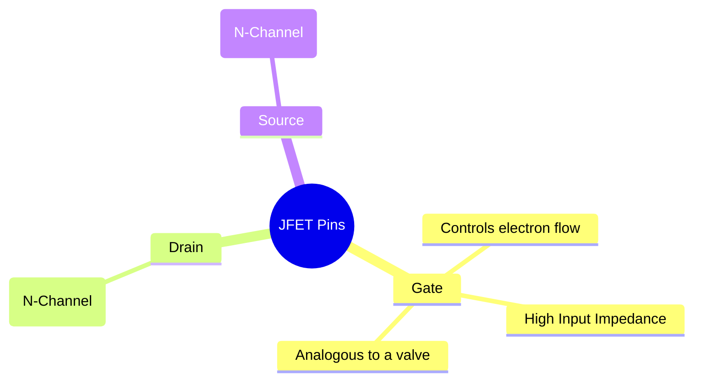

MOSFETs के बड़े पैमाने पर प्रसार से पहले, **JFET** (जंक्शन फील्ड-इफेक्ट ट्रांजिस्टर) उच्च इनपुट प्रतिबाधा प्रवर्धन का राजा था। हालाँकि आधुनिक डिजिटल लॉजिक में इनका अक्सर उपयोग नहीं किया जाता है, फिर भी वे उच्च-निष्ठा वाले ऑडियो प्रीएम्प्लीफायर, संवेदनशील उपकरण और आरएफ सर्किटरी में अपरिहार्य कलाकृतियाँ बने हुए हैं।

जेएफईटी योजनाबद्ध प्रतीक को समझना असतत एनालॉग सर्किट डिजाइन में तल्लीन करने वाले किसी भी व्यक्ति के लिए आवश्यक है।

## 1. जेएफईटी प्रतीक की शारीरिक रचना

बाइपोलर जंक्शन ट्रांजिस्टर (बीजेटी) के विपरीत, जो करंट-नियंत्रित डिवाइस हैं, जेएफईटी एक **वोल्टेज-नियंत्रित** डिवाइस है। योजनाबद्ध प्रतीक इसके आंतरिक अर्धचालक चैनल के भौतिक निर्माण को दृश्य रूप से दर्शाने का प्रयास करता है।

प्रतीक में चैनल का प्रतिनिधित्व करने वाली एक सीधी ऊर्ध्वाधर रेखा होती है, जिसमें दो क्षैतिज रेखाएं (नाली और स्रोत) जुड़ी होती हैं। एक तीसरी लंबवत रेखा गेट बनाती है, जो एक तीर से पूर्ण होती है जो अर्धचालक ध्रुवता को निर्देशित करती है।

### एन-चैनल बनाम पी-चैनल जेएफईटी

जैसे BJTs में NPN और PNP होते हैं, JFETs दो अलग-अलग स्वादों में आते हैं।

| विशेषता | एन-चैनल जेएफईटी | पी-चैनल जेएफईटी |
| :--- | :--- | :--- |
| **प्रतीक तीर** | चैनल लाइन की ओर बिंदु **IN** | चैनल से पॉइंट **आउट** दूर |
| **अधिकांश वाहक** | इलेक्ट्रॉन | छेद |
| **पिंच-ऑफ के लिए वीजीएस** | नकारात्मक वोल्टेज (जैसे, -5V) | सकारात्मक वोल्टेज (जैसे, +5V) |
| **विशिष्ट संचालन**| सामान्य रूप से चालू -> बंद करने के लिए नकारात्मक वोल्टेज सरणी लागू करें | सामान्य रूप से चालू -> बंद करने के लिए सकारात्मक वोल्टेज सरणी लागू करें |

> **मेमोरी ट्रिक:** "पॉइंटिंग इन" का अर्थ है **एन**-चैनल। गेट पर लगे तीर को देखो. यदि यह रेखा की ओर अंदर की ओर इंगित करता है, तो आप एक एन-चैनल जेएफईटी (लोकप्रिय 2एन5457 की तरह) के साथ काम कर रहे हैं।

## 2. ऑपरेशन: डिप्लेशन मोड

JFET की सबसे खास विशेषताओं में से एक यह है कि यह एक **डिप्लेशन मोड** डिवाइस है। यह काफी हद तक इस बात को प्रभावित करता है कि आप उनके चारों ओर योजनाएं कैसे डिज़ाइन करते हैं।

* **MOSFETs (एन्हांसमेंट मोड):** सामान्य रूप से बंद हैं। आपको गेट को चालू करने के लिए उस पर वोल्टेज लगाना होगा।
* **जेएफईटी (डिप्लिशन मोड):** सामान्य रूप से चालू हैं। गेट पर 0 वोल्ट के साथ, अधिकतम धारा नाली से स्रोत तक प्रवाहित होती है। आपको कमी क्षेत्र का विस्तार करने के लिए *रिवर्स बायस* वोल्टेज (एन-चैनल के लिए नकारात्मक) लागू करना होगा और डिवाइस को बंद करके इलेक्ट्रॉनों के प्रवाह को "चुटकी से बंद" करना होगा।

```mermaid
flowchart LR
    VGS[V_GS = 0V] --> I1[Maximum Drain Current flows]
    VGS2[V_GS = -2V] --> I2[Current is restricted]
    VGS3[V_GS = -5V] --> I3[Pinch-Off reached. Circuit is OFF]
    
    style VGS fill:#1e293b,stroke:#f59e0b
    style VGS3 fill:#1e293b,stroke:#ef4444
```

## 3. विशिष्ट योजनाबद्ध अनुप्रयोग

चूँकि ऑपरेशन के दौरान JFET का गेट रिवर्स-बायस्ड होता है, इसलिए अनिवार्य रूप से इसमें शून्य करंट प्रवाहित होता है। इससे खगोलीय रूप से उच्च इनपुट प्रतिबाधा उत्पन्न होती है (अक्सर सैकड़ों मेगाओम में मापा जाता है)।

| सर्किट अनुप्रयोग | JFETs को क्यों चुना जाता है | योजनाबद्ध सुराग |
| :--- | :--- | :--- |
| **ऑडियो प्रीएम्प्लीफायर्स** | बेहद कम शोर और विशाल इनपुट प्रतिबाधा संवेदनशील इलेक्ट्रिक गिटार पिकअप को लोड करने से रोकता है। | अक्सर सोर्स फॉलोअर बफर स्टेज के रूप में कार्य करते देखा जाता है। |
| **एनालॉग स्विच** | क्योंकि वे बिना किसी गेट करंट के पूरी तरह से वोल्टेज नियंत्रित होते हैं, वे सिग्नल पथ में शून्य स्विचिंग ट्रांजिस्टर इंजेक्ट करते हैं। | ड्रेन-सोर्स चैनल से गुजरने वाले एनालॉग सिग्नल के साथ श्रृंखला में रखा गया। |
| **निरंतर चालू स्रोत** | जब गेट सीधे स्रोत से बंधा होता है तो JFET मूल रूप से एक निरंतर चालू सिंक के रूप में व्यवहार करता है। | गेट टर्मिनल को सीधे स्रोत टर्मिनल के चारों ओर तार दिया गया है। |

इन विशेष एनालॉग सर्किटों का आरेख बनाते समय, परिशुद्धता महत्वपूर्ण है। सुनिश्चित करें कि विनिर्माण विफलताओं को रोकने के लिए आपका गेट एरो ओरिएंटेशन सही है। अपने अगले कैनवास पर मानक एन-चैनल और पी-चैनल जेएफईटी प्रतीकों को सटीक रूप से रखने के लिए **[सर्किट आरेख निर्माता](/संपादक/)** में क्यूरेटेड असतत अर्धचालक लाइब्रेरी का उपयोग करें।