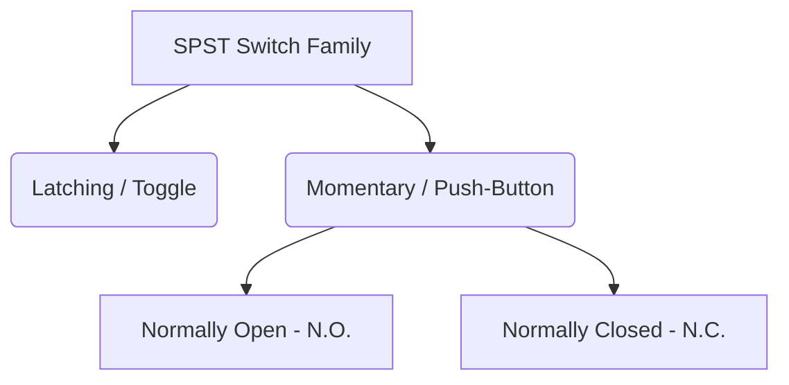

बिजली को नियंत्रित करने के लिए मनुष्य द्वारा उपयोग किए जाने वाले प्रत्येक इंटरफ़ेस के केंद्र में यांत्रिक स्विच होता है। इस घटक का सबसे सरल, सबसे सर्वव्यापी अवतार **एसपीएसटी**, या सिंगल पोल सिंगल थ्रो स्विच है।

चाहे आप एक हाई-वोल्टेज पावर मेन ब्रेकर डिज़ाइन कर रहे हों या बस Arduino ब्रेडबोर्ड पर एक पुश-बटन मैप कर रहे हों, SPST प्रतीक आपका तार्किक प्रारंभिक बिंदु है।

## 1. एसपीएसटी का वास्तव में क्या मतलब है

इंजीनियर दो वेरिएबल्स का उपयोग करके स्विच को वर्गीकृत करते हैं: **पोल्स** और **थ्रोज़**।

* **पोल (पी):** स्विच एक साथ नियंत्रित कर सकने वाले स्वतंत्र विद्युत सर्किटों की संख्या। 
* **फेंकें (टी):** प्रत्येक ध्रुव में बंद अवस्थाओं (स्थितियों पर) की संख्या।

इसलिए, एक एसपीएसटी एक *सिंगल पोल* (एक सर्किट को नियंत्रित करता है) और *सिंगल थ्रो* (केवल एक बंद, प्रवाहकीय स्थिति है) है।

```mermaid
flowchart LR
    A[Human Input] --> B((SPST Mechanism))
    B -- Open / Default --> C[Infinite Resistance / OFF]
    B -- Closed / Actuated --> D[Zero Resistance / ON]
    
    style B fill:#0f172a,stroke:#f59e0b
```

## 2. एसपीएसटी योजनाबद्ध प्रतीक को पढ़ना

एसपीएसटी स्विच के लिए मानक आईईईई प्रतीक अत्यधिक सहज है - यह वस्तुतः वैसा ही दिखता है जैसा यह करता है।

| दृश्य तत्व | वास्तविक दुनिया में अर्थ |
| :--- | :--- |
| **दो खुले वृत्त** | स्थिर विद्युत संपर्क पैड जहां तार समाप्त होते हैं। |
| **विकर्ण टूटी हुई रेखा** | यांत्रिक प्रवाहकीय भुजा, 'खुली' डिफ़ॉल्ट स्थिति को इंगित करने के लिए दूसरे पैड से भौतिक रूप से अलग हो जाती है। |
| **डिजाइनेटर (`S` या `SW`)** | मानक संदर्भ टैग. उदाहरण के लिए, `SW1`. |

> **सामान्य स्थिति धारणा:** जब तक अन्यथा निर्दिष्ट न हो, यांत्रिक स्विच उनकी **अक्रियाशील, आराम की स्थिति** में खींचे जाते हैं। एक मानक एसपीएसटी लाइट स्विच के लिए, इसका मतलब है कि योजनाबद्ध इसे बंद के रूप में दर्शाता है।

## 3. एसपीएसटी की विविधताएँ: पुश-बटन

टॉगल स्विच वहीं रहता है जहां आप इसे रखते हैं (लैचिंग)। पुश-बटन केवल तभी सक्रिय होता है जब आपकी उंगली उस पर होती है (क्षणिक)। एसपीएसटी पदनाम दोनों पर लागू होता है, लेकिन मानव संपर्क मोड को अलग करने के लिए प्रतीक थोड़ा बदल जाते हैं।

| स्विच प्रकार | योजनाबद्ध परिवर्तन | वास्तविक दुनिया का उदाहरण |
| :--- | :--- | :--- |
| **पुश-बटन (एन.ओ.)** | एक कोणीय भुजा के बजाय, एक सपाट पुल दो संपर्क पैडों के *ऊपर* मंडराता है। नीचे धकेलने से अंतर पाट जाता है। | कीबोर्ड की चाबियाँ, कंप्यूटर पावर बटन, डोरबेल बटन। |
| **पुश-बटन (एन.सी.)** | फ्लैट ब्रिज *नीचे* या पैड को छूता हुआ रहता है, जिससे सर्किट डिफ़ॉल्ट रूप से चालू रहता है। नीचे धकेलने से कनेक्शन टूट जाता है। | भारी मशीनरी पर आपातकालीन स्टॉप (ई-स्टॉप) बटन। |

## 4. हार्डवेयर कार्यान्वयन चेतावनियाँ

जब एक SPST स्विच को डिजिटल लॉजिक सर्किट (रास्पबेरी पाई GPIO पिन की तरह) में शामिल किया जाता है, तो एक अनुभवहीन योजनाबद्ध डिज़ाइन विनाशकारी रूप से अप्रत्याशित सॉफ़्टवेयर व्यवहार को जन्म देगा।

### "फ्लोटिंग पिन" समस्या

यदि आप SPST स्विच के एक तरफ को 5V से और दूसरे हिस्से को सीधे माइक्रोकंट्रोलर पिन से कनेक्ट करते हैं, तो स्विच खुला होने पर क्या होता है? पिन 0V नहीं पढ़ रहा है - यह डिस्कनेक्ट हो गया है और "फ़्लोटिंग" कर रहा है, जो आसपास के विद्युत चुंबकत्व को पकड़ने वाले एंटीना की तरह काम कर रहा है।

**फिक्स: पुल-डाउन रेसिस्टर्स**

हमेशा डिजिटल पिन और ग्राउंड के बीच जुड़ा एक अवरोधक (आमतौर पर 10kΩ) शामिल करें।

1. **स्विच ऑफ:** पिन अवरोधक के माध्यम से 0V को सुरक्षित रूप से पढ़ता है।
2. **स्विच ऑन:** 5V आपूर्ति अवरोधक पर हावी हो जाती है, जिससे एक सुरक्षित उच्च स्थिति शुरू हो जाती है।

**[सर्किट आरेख संपादक](/संपादक/)** के माध्यम से अपने डिज़ाइन में एसपीएसटी विविधताओं को सुरक्षित रूप से शामिल करें। एन.ओ. खोजने के लिए बाईं 'स्विचेस' लाइब्रेरी का विस्तार करें। और एन.सी. कार्यान्वयन!