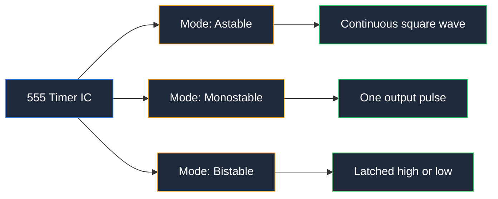
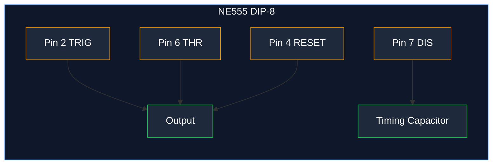
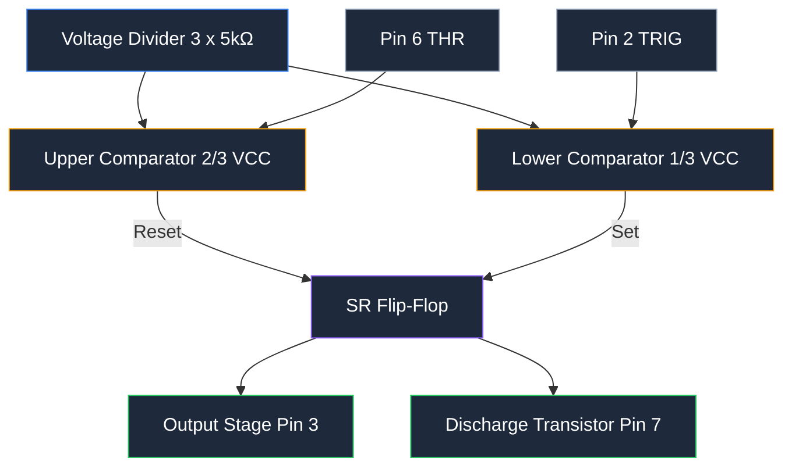
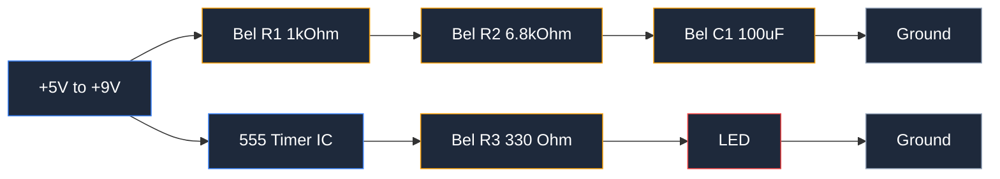
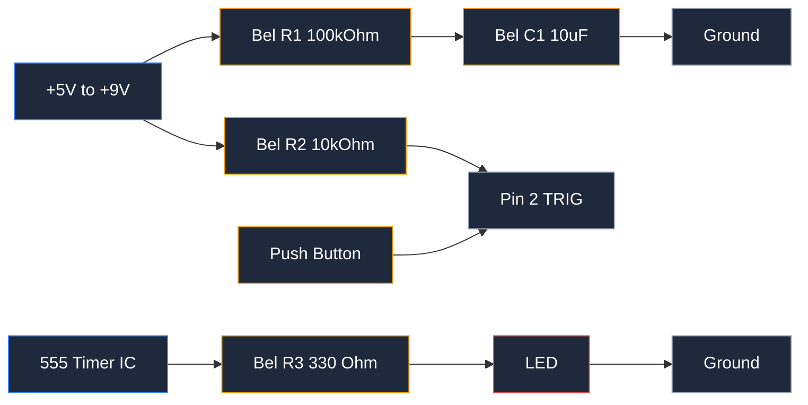
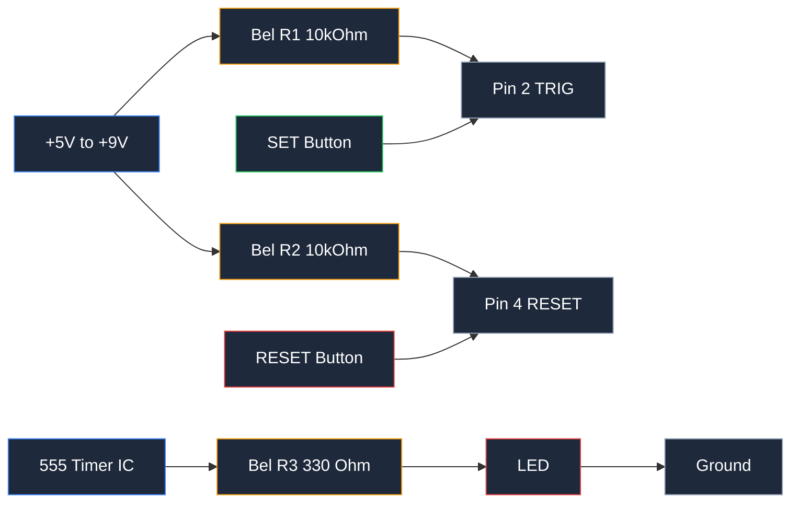
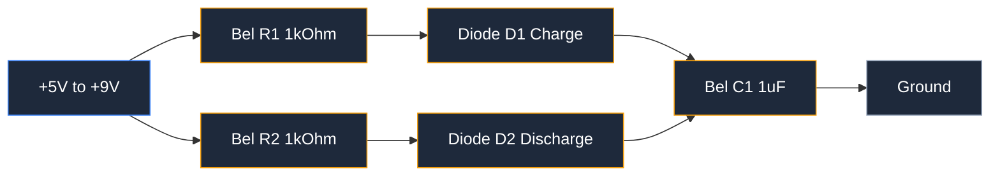
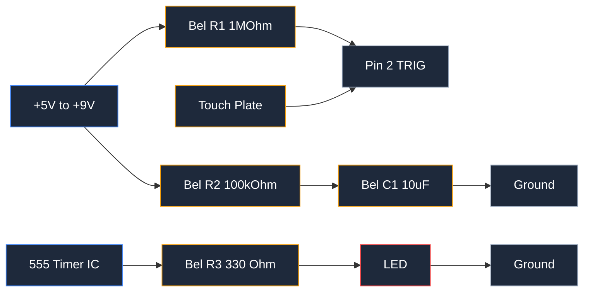

**Sirkuit 555 timer adalah sirkuit waktu dan osilasi yang dibangun di sekitar IC 555 timer, sebuah IC 8-pin yang menghasilkan penundaan waktu yang presisi dan sinyal output gelombang persegi.** Setiap sirkuit 555 timer bekerja dalam salah satu dari tiga mode operasi: mode astable, mode monostable, atau mode bistable. Mode astable menghasilkan gelombang persegi terus-menerus dengan frekuensi dan duty cycle yang ditetapkan. Mode monostable menghasilkan satu pulsa output dengan lebar pulsa yang ditetapkan. Mode bistable mengunci output tinggi atau rendah dan mempertahankannya sampai diperintahkan lain.

Sirkuit 555 timer menawarkan 4 manfaat utama: biayanya hanya beberapa sen per IC, beroperasi pada rentang suplai yang lebar 4.5V hingga 16V, mampu menggerakkan beban hingga 200mA secara langsung, dan hanya membutuhkan beberapa komponen waktu. Komponen waktu tersebut adalah resistor waktu, kapasitor waktu, dan kapasitor bypass suplai.

Sirkuit 555 timer muncul dalam puluhan proyek elektronik. Penggunaan umum meliputi LED flasher, timer satu kali untuk debouncing tombol, generator PWM untuk pengaturan kecerahan LED dan kontrol kecepatan motor, dan sakelar sentuh sederhana. Dalam panduan ini Anda akan membangun kelima sirkuit tersebut di breadboard.

Bagian utama dari sirkuit 555 timer adalah IC 555 timer itu sendiri, dua komparator, flip-flop SR, dan pembagi tegangan yang terdiri dari tiga resistor 5kΩ. Bagian eksternal meliputi resistor waktu dan kapasitor waktu yang mengatur waktu, ditambah resistor proteksi dan logika. Anda dapat menggambar skematik lengkap untuk setiap sirkuit di sini dalam hitungan detik dengan [alat pembuat diagram sirkuit online](https://www.circuitdiagrammaker.com/), lalu membangunnya di breadboard nyata.



## Pengenalan IC 555 Timer

IC 555 timer muncul pada tahun 1971, dirancang oleh Hans Camenzind di Signetics. IC ini menjadi salah satu IC terlaris dalam sejarah, dengan lebih dari 1 miliar unit terjual per tahun selama beberapa dekade. Nama 555 berasal dari tiga resistor internal 5kΩ yang membentuk pembagi tegangannya.

IC 555 timer memiliki 3 mode operasi. Mode astable berjalan sebagai osilator bebas yang menghasilkan gelombang persegi. Mode monostable menunggu pemicu lalu menghasilkan satu pulsa berwaktu. Mode bistable bekerja sebagai latch yang menyetel dan mereset dari dua input terpisah. Dalam artikel ini, contoh 1 dan 4 menggunakan mode astable, contoh 2 dan 5 menggunakan mode monostable, dan contoh 3 menggunakan mode bistable.

### Pinout 555 Timer

IC 555 timer standar hadir dalam paket dual in-line 8-pin (DIP). Masing-masing dari 8 pin memiliki satu fungsi.

| Pin | Nama | Fungsi |
|-----|------|----------|
| 1 | GND | Ground (0V) |
| 2 | TRIG | Pemicu: tegangan di bawah 1/3 VCC memulai pengaturan waktu dan mengatur output tinggi |
| 3 | OUT | Output: menyuplai atau menarik arus untuk menggerakkan beban |
| 4 | RESET | Reset: level rendah memaksa output rendah terlepas dari pin lain |
| 5 | CTRL | Tegangan kontrol: override opsional untuk ambang 2/3 VCC |
| 6 | THR | Threshold: tegangan di atas 2/3 VCC mengakhiri pengaturan waktu dan mengatur output rendah |
| 7 | DIS | Discharge: menarik kapasitor waktu ke ground selama interval rendah |
| 8 | VCC | Suplai positif dari 4.5V hingga 16V |



### Diagram Blok Internal

Di dalam IC 555 timer terdapat pembagi tegangan, dua komparator, flip-flop SR, transistor discharge, dan tahap output.

Pembagi tegangan adalah 3 resistor 5kΩ yang disusun bertumpuk antara VCC dan ground. Komponen ini menetapkan input non-invertor dari komparator atas pada 2/3 VCC dan input invertor dari komparator bawah pada 1/3 VCC.

Komparator atas membandingkan pin threshold dengan 2/3 VCC. Ketika pin threshold naik di atas 2/3 VCC, komparator atas mereset flip-flop dan output menjadi rendah. Komparator bawah membandingkan pin trigger dengan 1/3 VCC. Ketika pin trigger turun di bawah 1/3 VCC, komparator bawah menyetel flip-flop dan output menjadi tinggi.

Transistor discharge membuka pin discharge ke ground ketika output rendah. Pin tersebut menguras kapasitor waktu untuk mereset siklus. Tahap output kemudian menggerakkan hingga 200mA, cukup untuk menyalakan LED, menggerakkan speaker kecil, atau langsung mengalihkan transistor.



## Cara Menghitung Komponen Waktu

Dua rumus mengontrol setiap sirkuit 555 timer: rumus frekuensi astable dan rumus lebar pulsa monostable. Keduanya bergantung pada nilai resistor waktu dan kapasitor waktu.

### Rumus Mode Astable

Dalam mode astable, output bergantian antara tinggi dan rendah dengan sendirinya. Waktu tinggi adalah `t_high = 0.693 × (R1 + R2) × C`. Waktu rendah adalah `t_low = 0.693 × R2 × C`.

Total periode adalah jumlah keduanya:

```
t_high = 0.693 × (R1 + R2) × C
t_low  = 0.693 × R2 × C
T      = 0.693 × (R1 + 2 × R2) × C
```

Frekuensi adalah kebalikan dari periode:

```
f = 1 / T = 1.44 / ((R1 + 2 × R2) × C)
```

Duty cycle adalah pecahan dari setiap periode saat output tetap tinggi:

```
Duty cycle (%) = (R1 + R2) / (R1 + 2 × R2) × 100
```

R1 adalah resistor waktu pertama, R2 adalah resistor waktu kedua, dan C adalah kapasitor waktu.

### Rumus Mode Monostable

Dalam mode monostable, output menghasilkan satu pulsa setelah pemicu. Lebar pulsa hanya bergantung pada satu resistor dan kapasitor waktu:

```
pulse width t = 1.1 × R × C
```

R adalah resistor waktu dalam ohm, C adalah kapasitor waktu dalam farad, dan t adalah lebar pulsa dalam detik. Input pemicu harus kembali tinggi sebelum pulsa berikutnya dimulai.

### Contoh Perhitungan: LED Flasher 1 Hz

Bangun LED flasher 1 Hz dengan rumus astable. Output 1 Hz berkedip LED sekali per detik, yaitu periode T sebesar 1 detik.

Pilih kapasitor waktu yang nyaman terlebih dahulu. Pilih C = 100 µF (0.0001 F) dan R1 = 1 kΩ. Selesaikan rumus frekuensi untuk R2:

```
1 = 1.44 / ((1000 + 2 × R2) × 0.0001)
R2 = 6.8 kΩ (nilai standar terdekat)
```

Periksa hasil dengan nilai standar terdekat R2 = 6.8 kΩ:

```
f = 1.44 / ((1000 + 13600) × 0.0001) = 0.99 Hz
Duty cycle = (1000 + 6800) / (1000 + 13600) × 100 = 53%
```

LED berkedip dengan frekuensi yang sangat dekat 1 Hz dengan duty cycle 53%.

### Tips Memilih Nilai Standar

Resistor hadir dalam nilai standar E24, dan kapasitor juga hadir dalam nilai standar. Pilih komponen standar terdekat dan periksa kembali rumus dengan nilai sebenarnya. Gunakan resistor metal-film toleransi 1% untuk ketepatan waktu. Untuk kapasitor waktu, gunakan jenis poliester atau keramik kebocoran rendah; kapasitor elektrolit bergeser dengan suhu dan memiliki toleransi yang lebar. Pertahankan R1 di atas 1 kΩ untuk membatasi arus discharge dan pertahankan kapasitor di bawah 1000 µF untuk menghindari waktu pengisian yang lama. Ketika Anda membutuhkan penundaan yang lama, tingkatkan resistor terlebih dahulu dan pertahankan kapasitor tetap kecil.

## Contoh 1: Multivibrator Astable (LED Flasher)

Multivibrator astable adalah sirkuit 555 timer yang paling umum. Sirkuit ini menyalakan LED dengan pola kedipan stabil tanpa input dari Anda.

### Skematik dan Nilai Komponen

| Komponen | Nilai | Fungsi |
|-----------|-------|---------|
| U1 | IC NE555 timer | Osilator waktu |
| R1 | 1 kΩ | Resistor waktu pertama |
| R2 | 6.8 kΩ | Resistor waktu kedua |
| C1 | 100 µF elektrolit | Kapasitor waktu |
| C2 | 0.1 µF keramik | Dekoupling suplai |
| LED1 | LED 5mm (warna apa saja) | Beban output |
| R3 | 330 Ω | Pembatas arus LED |
| SV1 | Suplai 5V hingga 9V | Input daya |



### Cara Kerja Sirkuit

Ketika daya dinyalakan, kapasitor waktu mengisi melalui R1 dan R2 secara seri. Output tetap tinggi dan LED menyala saat kapasitor mengisi. Ketika kapasitor mencapai 2/3 VCC, komparator threshold mereset flip-flop, output menjadi rendah, dan pin discharge menarik kapasitor ke ground hanya melalui R2. LED mati. Ketika kapasitor turun ke 1/3 VCC, komparator trigger menyetel flip-flop lagi dan siklus berulang.

Hasilnya adalah gelombang persegi. LED menyala selama sekitar 540ms dan mati selama sekitar 470ms, menghasilkan kedipan yang terlihat.

### Tata Letak Breadboard

Tempatkan IC 555 timer di tengah celah breadboard dengan pin 1 di sisi rel kiri. Jalankan rel ground ke pin 1 dan rel suplai ke pin 8. Hubungkan R1 antara pin 7 dan rel suplai. Hubungkan R2 antara pin 7 dan pin 6. Hubungkan pin 6 dan pin 2 bersama-sama dengan jumper, lalu jalankan kapasitor waktu dari simpul tersebut ke rel ground. Hubungkan pin 4 ke rel suplai agar input reset tidak pernah mengambang. Tambahkan kapasitor 0.1 µF antara pin 8 dan GND, tepat di samping chip. Hubungkan LED dan resistor 330 Ω dari pin 3 ke ground, dengan kaki LED yang lebih panjang di sisi pin-3.

### Mengatur Kecepatan Kedipan

Dua nilai komponen mengontrol kecepatan kedipan. Tingkatkan kapasitor waktu C1 untuk kedipan yang lebih lambat. Turunkan C1 untuk kedipan yang lebih cepat. Tingkatkan R2 untuk memperlambat waktu discharge rendah dan secara keseluruhan siklus. Untuk mengubah hanya waktu LED menyala, atur R1. Menggandakan C1 dari 100 µF menjadi 200 µF menurunkan frekuensi menjadi sekitar 0.49 Hz. Membagi dua menjadi 47 µF meningkatkan frekuensi menjadi sekitar 2 Hz.

## Contoh 2: Mode Monostable (Timer Satu Kali)

Sirkuit 555 timer mode monostable menghasilkan satu pulsa output setiap kali Anda memicunya. Output tetap tinggi selama lebar pulsa yang ditetapkan, lalu turun rendah dan menunggu pemicu berikutnya.

### Skematik dan Nilai Komponen

| Komponen | Nilai | Fungsi |
|-----------|-------|---------|
| U1 | IC NE555 timer | Timer satu kali |
| R1 | 100 kΩ | Resistor waktu |
| C1 | 10 µF elektrolit | Kapasitor waktu |
| R2 | 10 kΩ | Pull-up pemicu |
| SW1 | Tombol tekan | Input pemicu |
| LED1 | LED 5mm | Beban output |
| R3 | 330 Ω | Pembatas arus LED |



### Perilaku Pemicu dan Output

Pin trigger tetap tinggi melalui resistor pull-up 10 kΩ. Menekan tombol tekan menghubungkan pin trigger ke ground. Ketika tegangan trigger turun di bawah 1/3 VCC, komparator bawah menyetel flip-flop dan output melompat tinggi. Kapasitor waktu mulai mengisi melalui R1. Ketika kapasitor mencapai 2/3 VCC, komparator threshold mereset flip-flop, output turun rendah, dan pin discharge menguras kapasitor. Output kemudian tetap rendah sampai penekanan berikutnya.

Satu penekanan menghasilkan tepat satu pulsa. Menahan tombol tidak mengubah apa pun karena input pemicu kembali tinggi sebelum kapasitor dapat mencapai 2/3 VCC; pengaturan waktu sudah dimulai pada tepi turun pertama.

### Aplikasi: Debouncing Tombol atau Membuat Penundaan

Sirkuit 555 timer monostable melakukan debouncing tombol mekanis. Kontak sakelar dapat memantul selama beberapa milidetik, menghasilkan beberapa sinyal palsu. Monostable dengan pulsa 20ms menelan pantulan dan melewati satu pulsa bersih. Sirkuit yang sama membuat penundaan: picu, lalu baca status output setelah lebar pulsa telah berlalu. Timer kipas 5V membiarkan motor DC tetap berjalan selama waktu tertentu setelah sensor memicunya.

### Cara Menghitung Durasi Pulsa

Gunakan rumus monostable: `t = 1.1 × R × C`. Dengan R1 = 100 kΩ dan C1 = 10 µF, lebar pulsa adalah:

```
t = 1.1 × 100,000 × 0.00001 = 1.1 detik
```

Untuk penundaan 5 detik, pilih C1 = 10 µF dan selesaikan untuk R: R = 5 / (1.1 × 0.00001) = 455 kΩ. Gunakan nilai standar terdekat 470 kΩ, yang menghasilkan 5.2 detik.

## Contoh 3: Mode Bistable (Sakelar Flip-Flop)

Sirkuit 555 timer mode bistable bekerja sebagai flip-flop atau latch. Output diatur tinggi atau rendah dari dua tombol tekan dan mempertahankan status tersebut sampai tombol lain ditekan. Tidak ada kapasitor waktu yang terlibat.

### Skematik dan Nilai Komponen

| Komponen | Nilai | Fungsi |
|-----------|-------|---------|
| U1 | IC NE555 timer | Sakelar pengunci |
| R1 | 10 kΩ | Pull-up pemicu |
| R2 | 10 kΩ | Pull-up reset |
| SW1 | Tombol tekan SET | Mengatur output tinggi |
| SW2 | Tombol tekan RESET | Mengatur output rendah |
| LED1 | LED 5mm | Indikator output |
| R3 | 330 Ω | Pembatas arus LED |



### Fungsionalitas Set/Reset

Dua input kontrol adalah pin trigger (pin 2) dan pin reset (pin 4). Keduanya memiliki resistor pull-up untuk mempertahankannya tetap tinggi. Menekan tombol SET menarik pin 2 rendah, flip-flop disetel, dan output menjadi tinggi. Menekan tombol RESET menarik pin 4 rendah, flip-flop direset, dan output turun rendah. Di antara penekanan, output mengunci status terakhirnya. Pin threshold waktu dan pin discharge dibiarkan tidak terhubung dalam mode ini.

### Aplikasi: Sakelar Toggle atau Elemen Memori

Sirkuit 555 timer bistable dapat menggantikan sakelar on/off mekanis. Gunakan untuk mengontrol transistor atau relay yang mengendalikan lampu, pompa, atau motor. Sirkuit ini juga berfungsi sebagai elemen memori 1-bit: status terbaca sebagai logika tinggi atau rendah, dan bertahan selama daya tetap terhubung. Dua tombol memberi Anda panel kontrol set/reset klasik yang mengembalikan status terakhir saat daya menyala jika Anda menghubungkan tombol sebagai kontak momen.

### Cara Menggunakannya sebagai Pengontrol On/Off

Bangun sirkuit, lalu gerakkan transistor dengan output. Output menyuplai hingga 200mA secara langsung, yang menyalakan LED secara langsung. Untuk beban yang lebih besar, tambahkan tahap transistor: pin 3 menggerakkan basis transistor melalui resistor 1 kΩ, dan transistor mengalihkan relay atau motor pada kolektornya. Tekan SET untuk menyalakan beban. Tekan RESET untuk mematikannya.

## Contoh 4: Generator PWM (LED Dimmer)

Sirkuit 555 timer menghasilkan modulasi lebar pulsa (PWM) dengan menambahkan dua dioda dan potensiometer ke osilator astable. Frekuensi tetap terjaga sementara duty cycle berubah, yang mengatur kecerahan LED atau mengontrol kecepatan motor tanpa mengubah kecepatan kedipan.

### Skematik dan Nilai Komponen

| Komponen | Nilai | Fungsi |
|-----------|-------|---------|
| U1 | IC NE555 timer | Osilator PWM |
| R1 | 1 kΩ | Resistor pengisi minimum |
| R2 | 1 kΩ | Resistor discharge minimum |
| VR1 | Potensiometer 10 kΩ | Kontrol duty cycle |
| D1, D2 | Dioda 1N4148 | Mengarahkan jalur pengisian dan discharge |
| C1 | 1 µF keramik | Kapasitor waktu |
| C2 | 0.1 µF keramik | Dekoupling suplai |
| LED1 | LED 5mm | Beban teredam |
| R3 | 330 Ω | Pembatas arus LED |



### Cara Mengubah Duty Cycle dengan Potensiometer

Potensiometer membagi resistansi waktu menjadi dua lengan. Dioda D1 mengirim arus pengisian melalui satu lengan, dan dioda D2 mengembalikan arus discharge melalui lengan lainnya. Karena setiap dioda hanya mengalirkan arus dalam satu arah, jalur pengisian dan jalur discharge menggunakan separuh potensiometer yang berbeda. Memutar poros memindahkan resistansi dari satu lengan ke lengan lainnya, sehingga waktu output tinggi meningkat sementara waktu rendah berkurang. Total periode tetap sama, sehingga frekuensi tidak pernah berubah.

### Aplikasi: LED Dimmer atau Kontrol Kecepatan Motor

Sirkuit ini mengatur kecerahan LED dari mati sepenuhnya hingga menyala sepenuhnya dengan satu putaran pot. Output yang sama menggerakkan basis transistor NPN untuk kontrol kecepatan motor. Motor DC merata-ratakan duty cycle PWM, sehingga duty cycle 40% menjalankan motor dengan kecepatan sekitar 40%. Kontrol motor PWM lebih dingin daripada resistor seri karena transistor beralih sepenuhnya menyala dan sepenuhnya mati daripada mendispersikan daya di antaranya.

### Cara Menghitung Frekuensi dan Rentang Duty Cycle

Dua lengan potensiometer bertindak sebagai resistor waktu RA dan RB, di mana RA + RB selalu sama dengan nilai pot penuh. Rumus menjadi:

```
f = 1.44 / ((RA + RB) × C) = 1.44 / (10,000 × 0.000001) = 144 Hz
Duty cycle = RA / (RA + RB) × 100
```

Memutar pot mengubah duty cycle dari sekitar 2% hingga 98%. Frekuensi 144 Hz berada di atas rentang kedipan yang terlihat oleh mata, sehingga LED terlihat halus di setiap pengaturan. Jika pot mencapai ujung resistansi minimum, resistor seri 1 kΩ mempertahankan arus pada dioda pada tingkat yang aman.

## Contoh 5: 555 Timer sebagai Sakelar Sentuh

Sirkuit 555 timer monostable berubah menjadi sakelar sentuh dengan mengganti tombol tekan dengan pelat sentuh logam telanjang. Menyentuh pelat memicu pulsa berwaktu yang menyalakan LED atau membunyikan buzzer.

### Skematik dan Nilai Komponen

| Komponen | Nilai | Fungsi |
|-----------|-------|---------|
| U1 | IC NE555 timer | Satu kali terkontrol sentuh |
| R1 | 1 MΩ | Pull-up pemicu dan kontrol sensitivitas |
| R2 | 100 kΩ | Resistor waktu |
| C1 | 10 µF elektrolit | Kapasitor waktu |
| PLATE | Pelat tembaga telanjang | Sensor sentuh |
| LED1 | LED 5mm | Indikator output |
| R3 | 330 Ω | Pembatas arus LED |



### Cara Pelat Sentuh Memicu Timer

Pin trigger tetap tinggi melalui resistor pull-up 1 MΩ. Tubuh Anda memiliki resistansi dan kapasitansi; ketika Anda menyentuh pelat dan menyelesaikan jalur ke ground, pin trigger tertarik di bawah 1/3 VCC. Komparator menyetel flip-flop dan output menjadi tinggi untuk lebar pulsa penuh. Output kemudian kembali rendah dan sirkuit menunggu sentuhan berikutnya.

Pencitraan sentuh bekerja secara andal pada suplai 5V. Pada tegangan suplai yang lebih tinggi, kebocoran yang diinduksi tubuh mungkin tidak menarik pin di bawah ambang batas, jadi pertahankan suplai antara 5V dan 9V untuk build ini.

### Aplikasi: LED Aktif-Sentuh atau Buzzer

Hubungkan output ke LED untuk lampu aktif-sentuh. Ganti LED dengan buzzer piezo kecil untuk alarm sentuh atau tombol game. Pulsa output bertahan `1.1 × R2 × C1 = 1.1 detik` dengan nilai di atas, cukup lama untuk dilihat atau didengar dengan jelas. Untuk relay daya, gerakkan melalui tahap transistor seperti pada contoh 3.

### Tips Penyesuaian Sensitivitas

Tiga perubahan mengatur sensitivitas. Turunkan R1 dari 1 MΩ ke 470 kΩ untuk membuat pemicu kurang sensitif terhadap noise liar. Tingkatkan ke 2.2 MΩ untuk mendeteksi sentuhan yang lebih ringan. Buat pelat sentuh lebih besar untuk meningkatkan sensitivitas. Pertahankan kabel trigger tetap pendek dan jauh dari kabel AC, atau sirkuit akan terpicu oleh dengung jaringan. Tambahkan resistor 100 kΩ dari pelat ke ground untuk menguras muatan statis dan mencegah pemicu palsu.

## Tips Breadboard dan Kesalahan Umum

Lima kebiasaan mencegah sebagian besar kegagalan build breadboard.

- Tambahkan kapasitor dekoupling 0.1 µF antara VCC (pin 8) dan GND (pin 1), ditempatkan di samping IC. Kapasitor ini menyerap noise suplai yang dapat menyebabkan pemicu palsu dan waktu yang tidak stabil.
- Periksa polaritas kapasitor elektrolit. Kapasitor waktu 100 µF memiliki kaki negatif yang ditandai. Membalik kapasitor elektrolit menyebabkan kebocoran dan akhirnya gagal.
- Hubungkan setiap ground ke rel ground yang sama. Ground mengambang meninggalkan komparator tanpa referensi tegangan, dan timer tidak melakukan apa pun.
- Verifikasi dengan multimeter. Ukur suplai antara pin 8 dan pin 1 terlebih dahulu. Lalu pastikan setiap pin membaca tegangan yang diharapkan sebelum melakukan pemecahan masalah waktu.
- Dorong setiap kaki dengan kuat ke breadboard. Kabel yang duduk satu milimeter kurang dari pelat memberikan kontak terputus-putus yang terlihat seperti kesalahan dalam sirkuit.

5 kesalahan paling umum dalam sirkuit 555 timer adalah koneksi pin yang salah, resistor pull-up yang hilang pada pin 4 atau pin 2, kapasitor elektrolit yang terbalik, tidak ada kapasitor dekoupling, dan kapasitor waktu yang terhubung ke pin yang salah. Karena 555 timer hanya memiliki 8 pin, memeriksa setiap koneksi terhadap tabel pinout di atas menangkap setiap kesalahan ini.

## Pemecahan Masalah Sirkuit 555 Timer Anda

Ketika sirkuit berperilaku tidak benar, kerjakan 5 pemeriksaan ini secara berurutan.

- Tidak ada output: ukur pin 8 dan pastikan suplai hadir, lalu pastikan pin 1 terhubung ke ground yang sama. Periksa bahwa pin 4 terhubung ke VCC, karena pin reset yang mengambang rendah menahan output rendah.
- Waktu yang tidak benar: verifikasi nilai resistor waktu dan kapasitor waktu terhadap rumus. Resistor 1 kΩ yang digunakan di tempat yang seharusnya 100 kΩ membuat sirkuit berjalan 100 kali terlalu cepat. Periksa toleransi resistor; komponen 5% bergeser cukup untuk mengubah frekuensi secara nyata.
- Output macet tinggi: pin trigger terlalu rendah, menjaga flip-flop tetap disetel. Pastikan pin trigger tetap di atas 1/3 VCC saat tidak ada yang menekannya.
- Output macet rendah: pin threshold berada di atas 2/3 VCC, menjaga flip-flop tetap direset, atau pin reset mengambang rendah. Verifikasi tegangan pin 6 dan koneksi pin 4.
- Osilasi tidak berfungsi: kapasitor waktu harus terhubung antara simpul pin 6/pin 2 dan ground. Jika kapasitor hanya terhubung ke pin 7, transistor discharge langsung mengurasnya dan sirkuit tidak pernah mengisi.

Gunakan osiloskop atau probe logika untuk debug. Osiloskop menampilkan gelombang di pin 3, naik-turun di kapasitor, dan perbandingan bersih dari keduanya. Probe logika menunjukkan apakah setiap pin membaca tinggi, rendah, atau berubah-ubah, yang mengisolasi pin mati dengan cepat. Jika satu IC tidak menghasilkan perubahan di pin 3, ganti dengan NE555 baru sebelum mengerjakan ulang tata letak.

## Varian 555 Timer dan Memilih yang Tepat

Tidak semua IC 555 timer identik. Empat keluarga mendominasi: NE555, LM555, TLC555, dan versi CMOS seperti TLC555 yang sudah disebutkan ditambah LMC555. Mereka berbeda dalam tegangan suplai, kecepatan, daya output, dan penggunaan daya.

| Varian | Tipe | Rentang Suplai | Frekuensi Maks | Daya Output | Arus Suplai |
|---------|------|--------------|---------------|--------------|----------------|
| NE555 | Bipolar | 4.5V – 16V | 500 kHz | ±200 mA | 3 mA – 10 mA |
| LM555 | Bipolar | 4.5V – 16V | 500 kHz | ±200 mA | 3 mA – 10 mA |
| TLC555 | CMOS | 2V – 15V | 2.1 MHz | ±10 mA | 250 µA |
| LMC555 | CMOS | 1.5V – 15V | 3 MHz | ±50 mA | 250 µA |

Pilih bipolar NE555 atau LM555 untuk proyek umum dengan beban LED, kecepatan sedang, dan suplai 5V. Versi bipolar menangani daya output 200mA yang tidak dapat ditandingi oleh komponen CMOS. Pilih TLC555 atau LMC555 ketika proyek berjalan dari baterai koin 3V, beroperasi pada frekuensi tinggi, atau harus meminimalkan pengurasan baterai; komponen CMOS menggunakan sekitar 1/40 arus suplai. Batas suplai rendah dari komponen CMOS, hingga 1.5V, cocok untuk sistem 3.3V modern.

Opsi paket mempengaruhi cara Anda membangun. DIP 8-pin pas di breadboard dan paling mudah disolder manual. Paket permukaan SOIC-8 cocok untuk papan sirkuit cetak yang dirakit. Varian CMOS SOT-23 yang kecil pas dalam desain yang terbatas ruang. Untuk prototipe breadboard, beli paket DIP.

## Pertanyaan yang Sering Diajukan

**Apa perbedaan antara mode astable, monostable, dan bistable?**

Mode astable menjalankan osilator bebas, menghasilkan gelombang persegi terus-menerus dengan frekuensi dan duty cycle yang ditetapkan. Mode monostable menghasilkan satu pulsa output per pemicu, dengan lebar pulsa yang ditetapkan dari resistor waktu dan kapasitor waktu. Mode bistable mengunci output tinggi atau rendah dari dua input dan mempertahankan status sampai input berikutnya mengubahnya.

**Berapa tegangan suplai maksimum untuk sirkuit 555 timer?**

NE555 dan LM555 bipolar beroperasi dari 4.5V hingga 16V. TLC555 dan LMC555 CMOS beroperasi dari 2V (atau 1.5V untuk LMC555) hingga 15V. Tetap di dalam rentang yang dinilai untuk varian Anda, dan tambahkan kapasitor dekoupling 0.1 µF di atas pin suplai.

**Bagaimana cara mendapatkan duty cycle 50% dalam mode astable?**

Rumus astable standar selalu memberikan duty cycle di atas 50% karena output tinggi. Untuk mencapai duty cycle tepat 50%, tambahkan satu dioda di jalur pengisian dan satu di jalur discharge sehingga setiap jalur menggunakan resistornya sendiri; waktu pengisian kemudian sama dengan waktu discharge ketika kedua resistor cocok. Pasangan dioda yang sama adalah dasar dari generator PWM pada contoh 4.

**Mengapa sirkuit 555 timer saya tidak berosilasi?**

Periksa 4 koneksi terlebih dahulu: pin 4 (RESET) harus terhubung ke VCC agar chip tetap aktif, pin 2 dan pin 6 harus diikat bersama melalui jaringan waktu, kapasitor waktu harus terhubung ke ground dengan polaritas elektrolit yang benar, dan pin 8 dan pin 1 harus mencapai suplai dan ground yang sama.

**Dapatkah output 555 timer menggerakkan relay atau motor secara langsung?**

Output menggerakkan hingga 200mA, yang menyalakan LED dan beban kecil secara langsung. Kumparan relay atau motor mengambil arus lebih besar dalam kebanyakan kasus, jadi tambahkan tahap transistor NPN yang digerakkan dari pin 3 melalui resistor seri, dengan dioda flyback di atas beban induktif.

<script type="application/ld+json">
{
  "@context": "https://schema.org",
  "@type": "FAQPage",
  "mainEntity": [
    {
      "@type": "Question",
      "name": "Apa perbedaan antara mode astable, monostable, dan bistable?",
      "acceptedAnswer": {
        "@type": "Answer",
        "text": "Mode astable menjalankan osilator bebas, menghasilkan gelombang persegi terus-menerus dengan frekuensi dan duty cycle yang ditetapkan. Mode monostable menghasilkan satu pulsa output per pemicu, dengan lebar pulsa yang ditetapkan dari resistor waktu dan kapasitor waktu. Mode bistable mengunci output tinggi atau rendah dari dua input dan mempertahankan status sampai input berikutnya mengubahnya."
      }
    },
    {
      "@type": "Question",
      "name": "Berapa tegangan suplai maksimum untuk sirkuit 555 timer?",
      "acceptedAnswer": {
        "@type": "Answer",
        "text": "NE555 dan LM555 bipolar beroperasi dari 4.5V hingga 16V. TLC555 dan LMC555 CMOS beroperasi dari 2V atau 1.5V untuk LMC555 hingga 15V. Tetap di dalam rentang yang dinilai untuk varian Anda, dan tambahkan kapasitor dekoupling 0.1 µF di atas pin suplai."
      }
    },
    {
      "@type": "Question",
      "name": "Bagaimana cara mendapatkan duty cycle 50% dalam mode astable?",
      "acceptedAnswer": {
        "@type": "Answer",
        "text": "Rumus astable standar selalu memberikan duty cycle di atas 50% karena output tinggi. Untuk mencapai duty cycle tepat 50%, tambahkan satu dioda di jalur pengisian dan satu di jalur discharge sehingga setiap jalur menggunakan resistornya sendiri; waktu pengisian kemudian sama dengan waktu discharge ketika kedua resistor cocok."
      }
    },
    {
      "@type": "Question",
      "name": "Mengapa sirkuit 555 timer saya tidak berosilasi?",
      "acceptedAnswer": {
        "@type": "Answer",
        "text": "Periksa empat koneksi terlebih dahulu: pin RESET harus terhubung ke VCC agar chip tetap aktif, pin TRIG dan THR harus diikat bersama melalui jaringan waktu, kapasitor waktu harus terhubung ke ground dengan polaritas elektrolit yang benar, dan pin suplai dan ground harus mencapai rel daya."
      }
    },
    {
      "@type": "Question",
      "name": "Dapatkah output 555 timer menggerakkan relay atau motor secara langsung?",
      "acceptedAnswer": {
        "@type": "Answer",
        "text": "Output menggerakkan hingga 200mA, yang menyalakan LED dan beban kecil secara langsung. Kumparan relay atau motor mengambil arus lebih besar dalam kebanyakan kasus, jadi tambahkan tahap transistor NPN yang digerakkan dari pin 3 melalui resistor seri, dengan dioda flyback di atas beban induktif."
      }
    }
  ]
}
</script>

## Kesimpulan dan Langkah Selanjutnya

Panduan ini mencakup 5 sirkuit 555 timer yang berfungsi: LED flasher astable, timer satu kali monostable, sakelar flip-flop bistable, LED dimmer PWM, dan sakelar sentuh. Masing-masing menggunakan kembali IC 8-pin yang sama dan dua rumus waktu yang sama. Pelajari cara membaca pita warna resistor dan memverifikasi nilai kapasitor, dan setiap rumus dalam artikel ini memberikan sirkuit yang berfungsi pada percobaan pertama.

Ubah kelima sirkuit dengan nilai komponen baru. Tingkatkan kapasitor waktu pada flasher untuk kedipan yang lebih lambat. Ganti LED pada monostable dengan relay. Ganti rentang pot PWM agar sesuai dengan motor. Setiap perubahan melatih keterampilan inti yang sama: pilih resistor dan kapasitor, jalankan rumus, dan konfirmasi hasilnya.

Untuk memahami skematik apa pun yang Anda rencanakan untuk dibangun kembali, mulai dengan panduan kami tentang [cara membaca diagram sirkuit](/blog/how-to-read-a-circuit-diagram-step-by-step-guide/). Ketika Anda siap untuk menggambar tata letak Anda sendiri, buat skematik dengan [pembuat diagram sirkuit](https://www.circuitdiagrammaker.com/), lalu bangun di breadboard dan verifikasi waktunya dengan rumus di atas.
