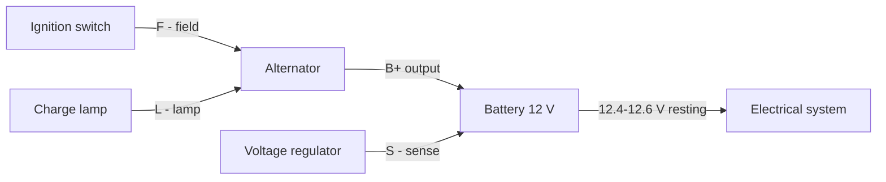
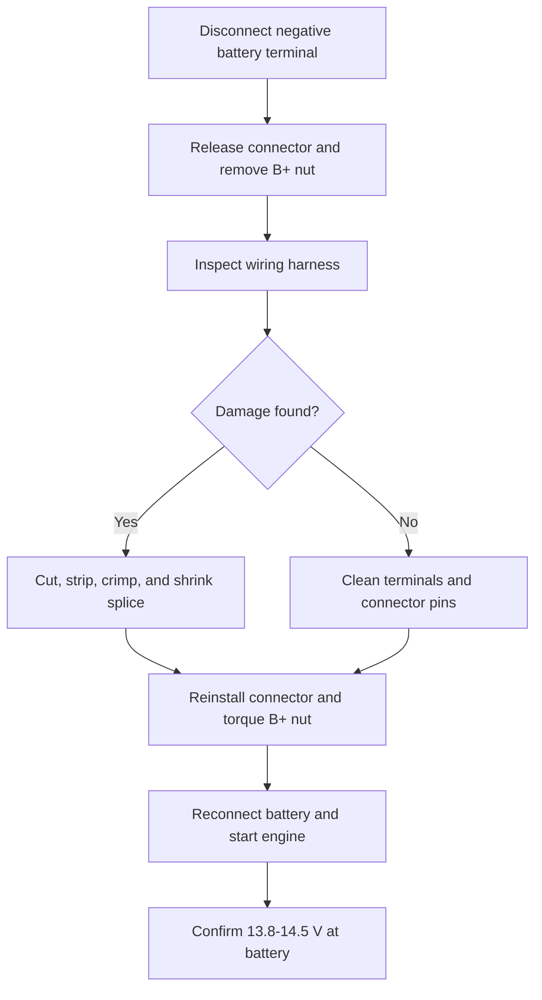
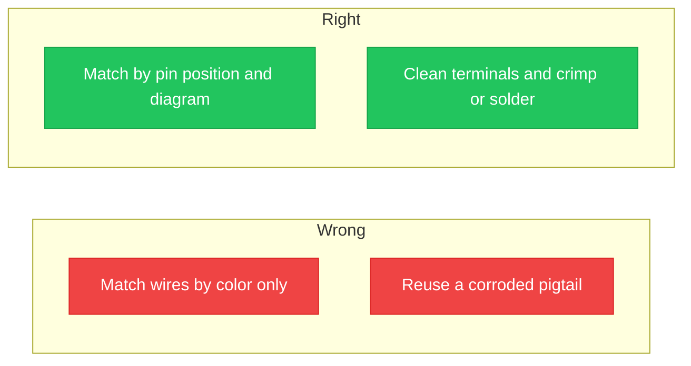

## Pengenalan Diagram Kabel Alternator

**<b>Diagram kabel alternator adalah skema yang menunjukkan cara alternator, baterai, pengatur tegangan, dan rangkaian kabel terhubung di dalam sirkuit pengisian kendaraan.</b> Gambar tersebut memetakan setiap terminal, kabel, konektor, dan titik massa dari output alternator ke baterai dan bagian lain dari sistem kelistrikan.

Alternator mengubah daya mekanis mesin yang disalurkan oleh belt serpentine menjadi daya listrik. Alternator yang sehat menjaga baterai tetap terisi dan menyuplai arus untuk sistem pengapian, lampu, dan aksesoris saat mesin berjalan. Sebagian besar alternator kendaraan penumpang menghasilkan 13,8–14,5 volt (V) dengan arus 60–180 ampere (A), tergantung pada kendaraan.

Ada 3 manfaat utama membaca diagram kabel alternator:

1. Mendiagnosis kerusakan pengisian sebelum mengganti suku cadang
2. Menghubungkan kembali alternator atau pigtail dengan benar setelah perbaikan
3. Menghindari kerusakan pengatur tegangan akibat koneksi terbalik

Diagram kabel alternator memiliki 4 kegunaan utama: penggantian alternator, pemecahan masalah sistem pengisian, perbaikan rangkaian dan konektor, serta pemeriksaan tegangan terhadap output yang tercatat. Sirkuit pengisian memiliki 5 bagian utama: alternator, baterai, pengatur tegangan, rangkaian lampu charge, dan rangkaian kabel yang menghubungkan semuanya.

Masalah umum pada kabel alternator meliputi koneksi baterai yang longgar, terminal yang terkorosi, rangkaian kabel yang rusak, pengatur tegangan yang gagal, dan fusible link yang putus.

## Memahami Diagram Kabel

Untuk membaca diagram, pelajari terlebih dahulu simbol-simbolnya. Alternator ditampilkan sebagai lingkaran dengan baut output; baterai ditampilkan sebagai pelat bertumpuk; konektor ditampilkan sebagai blok kecil dengan pin bernomor; massa ditampilkan sebagai tiga garis menurun. Garis pada diagram merepresentasikan kabel, dan setiap garis membawa label warna yang sesuai dengan rangkaian kendaraan.

Kode warna bervariasi menurut pabrikan. Warna dasar standar SAE muncul di sebagian besar diagram, dan kode dua karakter menempatkan warna dasar terlebih dahulu dan garis-garis (stripe) kedua. Kode seperti W/R dibaca sebagai kabel putih dengan garis merah. Manual pabrikan kendaraan mencantumkan kode pasti untuk setiap model.

Diagram juga mencatat fungsi komponen seperti input sensing pengatur tegangan dan output excite lampu. Manual pabrikan memadukan setiap tata letak dengan instruksi langkah demi langkah dan tips perawatan untuk sambungan kabel.

Tata letak kabel berbeda menurut keluarga kendaraan. Tiga tata letak umum:

| Keluarga kendaraan | Terminal pada konektor | Catatan |
| :--- | :--- | :--- |
| **GM Delco SI** | BAT, #1, #2 | BAT adalah output; #1 menyalakan medan melalui lampu; #2 mendeteksi tegangan baterai |
| **Ford** | I, S, A | I memberi daya pengapian; S mendeteksi tegangan baterai; A membaca output armatur; sistem pengisian cerdas menambahkan jalur data LIN |
| **Toyota dan Honda** | B, IG, S, L | B adalah output; IG memberi daya pengapian; S mendeteksi tegangan; L menggerakkan lampu peringatan |

Kabel yang akurat penting untuk 3 alasan: jalur sensing yang terbalik menjaga alternator di bawah tegangan target, jalur lampu yang terbuka menghentikan medan dari eksitasi saat awal start, dan sambungan output yang longgar menambahkan hambatan yang memanaskan kabel B+. Setiap kerusakan menarik baterai di bawah tegangan istirahat sehat 12,4 V.

## Masalah Umum Kabel Alternator

Ada 6 gejala umum masalah kabel alternator:

1. Lampu peringatan pengisian tetap menyala saat berkendara
2. Lampu depan meredup saat idle dan terang seiring kecepatan mesin
3. Baterai habis semalam
4. Aksesoris kelistrikan berkedip
5. Bau terbakar pada soket alternator
6. Mesin mati atau gagal hidup kembali

| Gejala | Kemungkinan penyebab | Pemeriksaan pertama |
| :--- | :--- | :--- |
| Lampu tetap menyala | Rangkaian lampu terbuka atau pengatur rusak | Periksa kabel L pada konektor |
| Lampu depan meredup saat idle | Output rendah, belt longgar, atau B+ berhambatan tinggi | Ukur 13,8–14,5 V pada baterai |
| Habis semalam | Baterai terkuras atau diode rusak | Uji arus saat mesin mati |
| Aksesoris berkedip | Sambungan kabel longgar | Kencangkan dan bersihkan sambungan baterai |
| Bau terbakar pada soket | Pin konektor terkorosi atau meleleh | Periksa pigtail rangkaian kabel |
| Mesin mati | Sirkuit pengisian turun di bawah minimum | Periksa rangkaian kabel dan tali massa |

Ikuti proses pemecahan masalah langkah demi langkah berikut:

1. Ukur baterai saat mesin mati; pembacaan di bawah 12,4 V berarti baterai terkuras atau rusak
2. Hidupkan mesin dan ukur kembali; sistem pengisian yang sehat menunjukkan 13,8–14,5 V
3. Jika tegangan tetap mendekati nilai istirahat, periksa ketegangan belt dan pastikan pulley alternator berputar
4. Matikan mesin, lepaskan terminal negatif baterai, dan periksa rangkaian kabel dari plastik yang meleleh, korosi, atau pin yang hangus
5. Periksa fusible link antara baut B+ dan baterai
6. Uji tali massa dari mesin ke sasis untuk hambatan tinggi
7. Hubungkan kembali semua komponen, hidupkan mesin, dan pastikan lampu charge mati

> Jika alternator pengganti masih tidak mengisi, kerusakan ada pada rangkaian kabel atau massa, bukan pada alternator baru. Uji rangkaian konektor sebelum mengganti suku cadang untuk kedua kalinya.

## Panduan Perbaikan Kabel Langkah demi Langkah

Kumpulkan 8 alat dan perlengkapan keselamatan sebelum memulai: multimeter, obeng berinsulasi, pengupas kabel, konektor crimp, selang penyusut panas (heat-shrink tubing), kacamata keselamatan, sarung tangan kerja, dan diagram kabel pabrikan kendaraan.

Ikuti proses perbaikan langkah demi langkah berikut:

1. Lepaskan terminal negatif baterai dan amankan kabel dari baterai
2. Lepas kunci konektor alternator dan tarik soket lurus ke atas
3. Lepas mur B+ dan angkat terminal ring output dari baut
4. Periksa rangkaian kabel dari korosi, pelelehan, atau insulasi yang rusak
5. Potong bagian kabel yang rusak dan kupas 6–8 mm (1/4–3/8 inci) insulasi
6. Crimp sambungan, susutkan selang di atasnya, dan ganti pin atau konektor sesuai kebutuhan
7. Pasang kembali konektor, kencangkan mur B+ sesuai spesifikasi, dan hubungkan kembali baterai
8. Hidupkan mesin dan pastikan tegangan 13,8–14,5 V pada baterai dengan multimeter

Ambil 3 tindakan pencegahan keselamatan selama perbaikan: jauhkan kabel negatif yang dilepas dari baterai, jangan pernah menyamarkan baut B+ ke bodi dengan kunci pas, dan periksa sekring sebelum menyalakan kembali sirkuit. Baut B+ tetap hidup setiap kali baterai terhubung.

## Alat Bantu Visual dan Diagram

Tata letak kabel di bagian atas panduan ini menunjukkan jalur B+ melalui fusible link dan rangkaian konektor alternator tipikal. Gambar di bawah memetakan setiap terminal ke fungsinya dan warna kabel yang umum:

Diagram menunjukkan 5 terminal: B+, L, S, F, dan GND. Setiap kartu mencantumkan huruf terminal, nama sirkuit, dan fungsi fisik yang dilakukan kabel. Gunakan gambar selama perbaikan untuk mengonfirmasi fungsi setiap kabel sebelum menghubungkan kembali.

Kesalahan kabel umum muncul sebagai kebiasaan yang salah atau benar. Bandingkan dua kolom:

Ada 4 kesalahan kabel umum yang harus dihindari:

1. Mencocokkan rangkaian konektor berdasarkan warna alih-alih posisi pin
2. Menggunakan kembali pigtail yang meleleh atau terkorosi
3. Membiarkan mur B+ longgar atau terlalu kencang
4. Melewati pelepasan negatif baterai dan memercikkan baut B+ ke bodi

Alat bantu visual memiliki 3 tujuan dalam perbaikan: menandai fungsi terminal yang tepat, membandingkan kabel yang benar dan salah secara berdampingan, dan mempercepat diagnosis untuk mekanik DIY yang bekerja tanpa manual pabrikan.

## Tindakan Keselamatan Saat Bekerja dengan Kabel

Lepaskan terminal negatif baterai sebelum menyentuh kabel alternator mana pun. Baut B+ membawa tegangan baterai penuh setiap saat, dan kunci pas yang menyentuh baut dan bodi alternator akan memercikkan percikan api yang hebat.

Peralatan dan alat keselamatan penting: kacamata keselamatan, obeng dan soket berinsulasi, sarung tangan kerja, multimeter, dan pemadam api kelas kebakaran listrik.

Bahaya umum dalam pekerjaan kabel kendaraan:

- Sengatan listrik dari baut B+ yang hidup
- Ledakan baterai dari gas hidrogen dan percikan api
- Luka bakar dari bodi alternator yang panas
- Percikan api saat alat menjembatani sambungan baterai

Ikuti 8 praktik kerja aman berikut:

1. Lepaskan terminal negatif baterai terlebih dahulu dan pasang kembali terakhir
2. Gunakan alat berinsulasi di sekitar baut B+
3. Lepas perhiasan logam sebelum bekerja
4. Kenakan kacamata keselamatan dan sarung tangan kerja
5. Bekerjalah pada mesin yang dingin; bodi alternator menjadi panas
6. Jauhkan percikan api dari baterai; gas hidrogen mudah terbakar
7. Kencangkan mur B+ sesuai spesifikasi
8. Periksa polaritas kembali sebelum menghubungkan kembali baterai

> Kabel negatif baterai menjadi massa untuk seluruh bodi kendaraan. Melepasnya mengisolasi sirkuit pengisian dan merupakan langkah paling penting sebelum perbaikan kelistrikan apa pun.

## Kesimpulan dan Sumber Tambahan

Memahami diagram kabel alternator menjaga sistem pengisian tetap andal dan membuat perbaikan DIY menjadi aman. Skema tersebut memetakan 5 bagian utama, menunjukkan output B+ ke baterai, dan menelusuri rangkaian konektor kecil ke lampu charge, sensing, dan medan. Membaca kode warna sebelum menyentuh kabel apa pun mencegah koneksi terbalik yang merusak pengatur tegangan.

Untuk tata letak spesifik model, lihat [diagram kabel alternator 2005 Kia Sedona](/blog/sedona-alternator-wiring-diagram/). Untuk berlatih membaca skema, mulailah dari [panduan langkah demi langkah membaca diagram sirkuit](/blog/how-to-read-a-circuit-diagram-step-by-step-guide/).

Buat dan simpan skema sistem pengisian Anda sendiri di editor browser gratis: [buka editor sirkuit](/editor/). Anda juga dapat [membuat diagram sirkuit secara online](/blog/how-to-make-circuit-diagram-online/) tanpa menginstal perangkat lunak.

Bagikan pertanyaan atau pengalaman kabel alternator Anda di kolom komentar. Tim akan menjawab topik sistem pengisian baru di panduan berikutnya.
