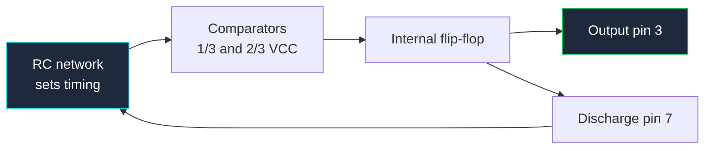

**Skematik analog dinilai dari satu hal: bisakah pembaca melihat jalur umpan balik?** Penguatan, lebar pita, stabilitas, dan frekuensi osilasi semuanya ditentukan oleh umpan balik, dan umpan balik adalah *loop* — satu-satunya struktur yang tidak dapat direpresentasikan secara alami oleh konvensi gambar kiri-ke-kanan. Belajar menggambar loop sehingga terlihat jelas dan tidak membingungkan adalah sebagian besar yang membedakan skematik analog yang rapi dari yang berantakan.

Panduan ini mencakup konvensi gambar untuk op-amp, komparator, 555 timer, dan jaringan RC yang menentukan perilakunya, kemudian menerapkannya pada rangkaian penguat audio dan osilator yang nyata. Panduan ini termasuk dalam [panduan lengkap diagram rangkaian](/blog/complete-guide-to-circuit-diagrams/) kami, yang mencakup aturan tata letak universal.

## Segitiga Op-Amp

Simbol op-amp adalah segitiga yang menunjuk ke kanan. Anatominya:

| Elemen | Posisi | Aturan |
| :--- | :--- | :--- |
| **Input inverting** | Sisi kiri, ditandai `−` | Secara konvensional input atas |
| **Input non-inverting** | Sisi kiri, ditandai `+` | Secara konvensional input bawah |
| **Output** | Puncak, kanan | Satu pin, selalu titik segitiga |
| **Suplai positif** | Sisi atas | Sering disembunyikan pada lembar multi-op-amp |
| **Suplai negatif** | Sisi bawah | Sama |

Dua aturan mengatur segitiga, dan aturan kedua adalah tempat desain hancur.

**Anda boleh membalik input.** Meletakkan `+` di atas dan `−` di bawah sepenuhnya dapat diterima ketika membuat jaringan umpan balik lebih bersih, dan desainer berpengalaman melakukannya terus-menerus.

**Anda harus memindahkan label saat membalik.** Penandaan `+` dan `−` mendefinisikan pin — geometri tidak. Segitiga yang digambar terbalik tetapi diberi label tidak terbalik adalah kesalahan simbol yang paling mahal dalam desain analog, karena rangkaian mensimulasikan dengan benar dari netlist yang Anda *inginkan* dan bergerak atau terkunci dalam perangkat keras. Periksa setiap simbol op-amp terhadap nomor pinnya sebelum dirilis.

**Pin suplai.** Pada lembar dengan satu atau dua op-amp, gambar pin suplai secara eksplisit dengan kapasitor decouplingnya. Pada lembar dengan delapan, gunakan pin suplai tersembunyi yang terikat ke net bernama, dan berikan catatan pada lembar yang menyatakan jalur mana yang terhubung plus blok decoupling terpisah. Yang tidak boleh Anda lakukan adalah diam-diam menghilangkan suplai dan tidak memberikan catatan — pembaca tidak dapat mengetahui apakah komponen tersebut menggunakan suplai tunggal atau ganda, dan itu mengubah seluruh skema biasing.

## Menggambar Umpan Balik sehingga Loop Terlihat Jelas

Konvensinya sederhana dan hampir universal: **komponen umpan balik berada tepat di atas badan penguat**, dengan loop berjalan output → naik → kiri → turun ke node input.

Ini menghasilkan persegi panjang tertutup yang duduk di atas segitiga. Pembaca melihat persegi panjang dan langsung mengetahui dua hal: penguat memiliki umpan balik negatif, dan komponen di dalam persegi panjang menentukan penguatan. Tidak perlu melacak.

Aturan yang menjaga loop tetap mudah dibaca:

- **Umpan balik di atas, input dari kiri.** Node penjumlah — tempat `Rin` dan `Rf` bertemu di input inverting — harus berupa simpul T yang bersih dengan titik yang terlihat.
- **Jangan pernah merutekan umpan balik di bawah penguat.** Di bawah adalah tempat ground return dan jaringan bias. Mencampurnya membuat loop tidak terbaca.
- **Satu loop per penguat, tertutup secara visual.** Jika jalur umpan balik Anda berkeliling melalui enam sudut, pindahkan penguatnya.
- **Annotasikan penguatan.** Tulis `Av = −Rf/Rin = −10` di sebelah blok. Biayanya hanya satu label teks dan menghilangkan aritmatika pembaca.

| Konfigurasi | Topologi | Penguatan | Ciri gambar |
| :--- | :--- | :--- | :--- |
| **Inverting** | Input melalui `Rin` ke `−`, `Rf` output ke `−`, `+` ke ground | `−Rf/Rin` | Persegi panjang umpan balik di atas, `+` terhubung ke bawah |
| **Non-inverting** | Input langsung ke `+`, divider dari output ke `−` | `1 + Rf/Rg` | Divider menggantung di bawah jalur umpan balik |
| **Voltage follower** | Output terhubung langsung ke `−`, input ke `+` | `1` | Loop kawat kosong, tanpa komponen |
| **Komparator** | Referensi ke satu input, sinyal ke lainnya | Loop terbuka | *Tanpa* persegi panjang umpan balik sama sekali |
| **Difference amp** | Dua divider yang serasi | `Rf/Rin` | Simetris — gambar secara simetris |

Kasus komparator perlu ditekankan: *ketiadaan* persegi panjang umpan balik itu sendiri adalah informasi. Ketika pembaca melihat segitiga op-amp tanpa apa pun di atasnya, mereka harus se menyimpulkan "loop terbuka, ini adalah komparator." Jadi jangan meninggalkan resistor umpan balik pada penguat secara tidak sengaja — Anda tidak hanya menghilangkan komponen, tetapi secara aktif mengkomunikasikan sesuatu yang salah.

Tambahkan histeresis pada komparator dan persegi panjang umpan balik kecil muncul, tetapi kembali ke input **non-inverting** bukan input inverting. Perbedaan itu — umpan balik ke `+` berarti umpan balik positif berarti histeresis atau osilasi — terlihat dalam gambar jika Anda disiplin tentang mana input yang ditempatkan di mana.

## 555 Timer: Blok Diagram atau Pinout?

555 dapat digambar dengan dua cara yang sangat berbeda, dan memilih dengan benar tergantung pada audiens Anda.

**Sebagai persegi panjang pinout.** Kotak polos dengan delapan pin dilabeli berdasarkan fungsinya. Ini yang Anda gunakan dalam desain nyata. Kompak, masuk ke skematik seperti IC lain, dan memberi pembangun semua yang mereka butuhkan.

**Sebagai diagram blok internal.** Dua komparator, divider tiga resistor, flip-flop SR, transistor discharge, dan buffer output. Ini adalah gambar *pengajaran*. Ini milik dokumentasi dan tutorial, tidak pernah dalam skematik desain, karena menyiratkan bahwa Anda dapat mengakses node yang tidak dibawa ke pin.

Tampilan internal memang menjelaskan komponen tersebut. Divider adalah tiga resistor sama besar di seberang suplai, menetapkan ambang batas pada sepertiga dan dua pertiga VCC. Komparator bawah memantau pin trigger terhadap ⅓ VCC; komparator atas memantau pin threshold terhadap ⅔ VCC. Output mereka mengatur dan mereset flip-flop internal, yang kondisinya menggerakkan output pin dan transistor discharge. Setiap rangkaian 555 hanyalah jaringan RC yang diatur untuk melewati dua ambang batas tersebut.

| Pin | Nama | Fungsi |
| :--- | :--- | :--- |
| 1 | GND | Ground return |
| 2 | TRIG | Memulai siklus waktu saat ditarik di bawah ⅓ VCC |
| 3 | OUT | Output push-pull, menghasilkan dan menyerap ~200 mA |
| 4 | RESET | Aktif rendah — memaksa output rendah. **Hubungkan ke VCC jika tidak digunakan** |
| 5 | CTRL | Tegangan kontrol, mengambil node ⅔ VCC. Bypass dengan 10 nF jika tidak digunakan |
| 6 | THR | Mengakhiri siklus waktu saat didorong di atas ⅔ VCC |
| 7 | DIS | Discharge — open collector yang menguras kapasitor waktu |
| 8 | VCC | Suplai, 4,5 V hingga 15 V untuk versi bipolar |

Dua dari pin tersebut menyebabkan sebagian besar kegagalan 555 di lapangan, dan kedua kegagalan tersebut adalah kegagalan *menggambar*:

- **Pin 4 dibiarkan melayang.** Reset aktif rendah; pin melayang menangkap kebisingan dan secara acak mereset timer. Gambar secara eksplisit terhubung ke VCC.
- **Pin 5 dibiarkan telanjang.** Node kontrol impedansi tinggi dan berada di dalam divider threshold. Gambar kapasitor bypass 10 nF ke ground.

Keduanya adalah kasus di mana "skematik tidak menyuruh untuk melakukannya" menjadi "papan tidak berfungsi."

## Menggambar Jaringan RC Waktu

Dalam rangkaian 555 atau osilator, jaringan RC adalah bagian yang paling ingin ditemukan pembaca, karena menentukan frekuensi. Buat mudah ditemukan:

**Kelompokkan komponen waktu.** `R1`, `R2`, dan `C1` harus membentuk kolom vertikal yang terlihat jelas di sebelah IC, bukan tersebar di antara decoupling dan pull-up.

**Gambar jalur pengisian dari atas ke bawah.** Resistornya turun dari VCC, kapasitor berada di bawah menuju ground, dan node waktu — tempat threshold dan trigger terhubung — adalah simpul di antara mereka. Susunan vertikal itu sesuai dengan konvensi tegangan dan membuat arah pengisian terlihat jelas.

**Annotasikan rumus pada lembar.** Untuk konfigurasi astable:

```
f = 1.44 / ((R1 + 2·R2) · C1)
duty = (R1 + R2) / (R1 + 2·R2)
```

Dan untuk monostable:

```
t = 1.1 · R · C
```

Menulis yang relevan di sebelah jaringan mengubah skematik Anda menjadi dokumen yang dapat dimodifikasi dengan benar oleh seseorang. Tanpanya, orang berikutnya mengubah `R2` untuk menyesuaikan frekuensi dan terkejut ketika siklus tugas juga bergerak.

**Toleransi tanda di tempat yang penting.** Kapasitor waktu harus dianotasi dengan dielektrik dan toleransinya. Keramik Y5V ±20% dalam slot waktu membuat frekuensi hanya saran. [Panduan rangkaian 555 timer](/blog/555-timer-circuit/) kami membahas set rumus lengkap dengan pilihan komponen praktis.



Loop kembali dari pin discharge ke jaringan RC adalah seluruh osilator. Gambar sebagai jalur tertutup yang terlihat dan konfigurasi astable menjelaskan dirinya sendiri.

## Diagram Rangkaian Penguat Audio

### LM386: Penguat Audio Sederhana

LM386 adalah penguat audio sinyal kecil standar, dan skematiknya memiliki sekumpulan komponen khusus yang harus semuanya muncul:

| Pin | Fungsi | Apa yang harus digambar |
| :--- | :--- | :--- |
| 1 | Pengaturan gain | Biarkan terbuka untuk gain 20 |
| 2 | Input inverting | Biasanya ke ground melalui jaringan input |
| 3 | Input non-inverting | Sinyal masuk, melalui kapasitor kopling dan potensio volume |
| 4 | GND | Ground |
| 5 | Output | Kapasitor kopling ke speaker, plus jaringan Zobel |
| 6 | VS | Suplai, dengan decoupling |
| 7 | Bypass | 10 µF ke ground |
| 8 | Pengaturan gain | 10 µF dari pin 1 ke pin 8 meningkatkan gain menjadi 200 |

Susunan pengaturan gain antara pin 1 dan 8 adalah ciri khas LM386 dan hal yang paling sering salah digambar oleh pemula. Terbuka berarti gain 20. Kapasitor 10 µF di antara keduanya berarti gain 200. Resistor seri dengan kapasitor itu menetapkan nilai menengah. Annotasikan mana yang Anda inginkan — `GAIN = 200` di sebelah kapasitor — karena komponen itu sendiri tidak mengkomunikasikan keputusan desain.

Dua lagi yang sering ditinggalkan dan tidak boleh ditinggalkan:

- **Kapasitor kopling output.** Beberapa ratus µF antara pin 5 dan speaker. Tanpanya, DC mengalir melalui voice coil.
- **Jaringan Zobel.** Sekitar 10 Ω seri dengan 50 nF dari output ke ground. Ini menstabilkan penguat terhadap beban induktif speaker. Terlihat seperti dua komponen yang tidak berguna sampai penguat bergerak tanpanya, jadi gambar di sebelah output pin dan beri label pasangan `ZOBEL`.

### TDA2030: Subwoofer dan Penguat Daya

Untuk daya nyata Anda beralih ke chip seperti TDA2030 — sekitar 14 W ke 4 Ω. Lima pin dalam paket Pentawatt:

| Pin | Fungsi |
| :--- | :--- |
| 1 | Input non-inverting |
| 2 | Input inverting |
| 3 | −VS (suplai negatif, atau ground dalam desain suplai tunggal) |
| 4 | Output |
| 5 | +VS (suplai positif) |

Catatan gambar khusus untuk penguat daya kelas ini:

- **Suplai ganda berarti konvensi vertikal benar-benar bekerja.** `+VS` di atas lembar, ground di tengah, `−VS` di bawah. Jaringan bias input merujuk ke ground; digambar dengan benar, simetrisnya terlihat.
- **Jaringan umpan balik tetap di atas badan**, persis seperti op-amp sinyal kecil. Gain ditentukan oleh rasio dalam divider itu, dan untuk saluran subwoofer Anda biasanya akan menjalankan gain 20 hingga 30.
- **Gambar decoupling suplai sebagai dua pasang**: elektrolit besar dan keramik pada setiap jalur, bersebelahan dengan pin suplai. Penguat daya menarik arus dalam burst pada frekuensi sinyal, dan di sinilah Anda menyatakannya.
- **Tunjukkan diode proteksi** dari setiap output ke setiap jalur jika desain menggunakannya. Pada beban induktif mereka bukan opsional.
- **Annotasikan kebutuhan heatsink** sebagai catatan teks. Penguat 14 W yang membuang panas dalam paket gaya TO-220 adalah desain termal, dan skematik adalah tempat hal itu ditandai.

Untuk subwoofer secara spesifik, filter low-pass di depan penguat termasuk dalam gambar sebagai blok berlabel tersendiri — biasanya filter aktif Sallen-Key sekitar op-amp dengan frekuensi sudutnya dianotasi. Pertahankan secara visual terpisah dari tahap daya: filter di kiri, penguat di kanan, satu jalur sinyal bersih di antara mereka.

## Rangkaian Osilator

### Rangkaian Pembangkit Gelombang Sinus

**Osilator Wien bridge** adalah sumber sinus distorsi rendah standar. Op-amp dengan RC seri dan RC paralel dalam jalur umpan balik bergerak pada:

```
f = 1 / (2 · π · R · C)
```

Batasan desain kritis adalah penguatan penguat harus *tepat* 3 — cukup untuk mempertahankan osilasi, tidak cukup untuk memotong. Itu berarti divider penguatan non-inverting perlu rasio 2, ditambah beberapa elemen penstabil amplitudo: diode berhadapan, termistor, atau lampu pijar kecil dalam versi klasik.

Aturan gambar yang penting di sini:

- **Jaringan penentu frekuensi berada di sisi input**, digambar sebagai pasangan yang dapat dikenali: RC seri di atas, RC paralel di bawah.
- **Divider pengatur gain berada dalam persegi panjang umpan balik** pada input lain. Dua jaringan, dua lokasi, tidak ada ambiguitas tentang mana yang menentukan frekuensi dan mana yang menentukan gain.
- **Annotasikan elemen penstabil amplitudo** dengan catatan yang menjelaskan tujuannya, karena lampu atau pasangan diode dalam jalur umpan balik terlihat seperti kesalahan bagi siapa pun yang belum melihat topologi tersebut.

**Osilator phase-shift** mengambil jalur alternatif: tiga bagian RC berjenjang masing-masing memberikan pergeseran fase 60°, dibungkus di sekitar penguat inverting. Gambar tiga bagian RC sebagai tiga tahap yang secara visual identik berjajar — pengulangan *adalah* penjelasan, dan ketidaksimetrisan apa pun dalam gambar Anda akan dibaca sebagai detail desain bukan kecelakaan menggambar.

### Multivibrator Monostable Menggunakan Op-Amp

Monostable menghasilkan satu pulsa output tetap panjang per pemicu. Dibangun dari op-amp, ini adalah komparator dengan umpan balik positif yang menetapkan ambang batas dan jaringan RC yang menetapkan durasi.

Karena umpan balik di sini *positif*, gambar harus membuatnya tidak salah: persegi panjang umpan balik kembali ke input **non-inverting**, dan jaringan waktu RC terhubung ke input **inverting**. Dua jaringan, dua input, dan label input membedakan monostable dari penguat linier. Tambahkan catatan — `POSITIVE FEEDBACK — SCHMITT ACTION` — di sebelah resistor umpan balik. Ini adalah salah satu dari sedikit kasus di mana anotasi teks mencegah pembacaan salah yang nyata dari gambar yang benar.

### 555 Counter dan Rangkaian Reaction-Timer

Kombinasikan 555 astable dengan counter dan Anda mendapatkan serangkaian proyek praktis.

**555 seven-segment counter** adalah tiga blok dalam satu lembar: 555 astable yang menghasilkan clock pulse di kiri, decade counter dengan decoder seven-segment built-in seperti 4026 atau 4033 di tengah, dan display di kanan. Gambar output seven segment sebagai bus bukan tujuh kawat paralel, dan beri label pin display berdasarkan huruf segmen, bukan nomor pin.

**555 reaction timer** menambahkan gerbang: clock berjalan ke counter hanya saat sinyal start aktif, dan tombol pemain menghentikannya. Logika gating adalah gerbang AND tunggal atau pin clock-inhibit counter itu sendiri, dan gambar harus menempatkan kontrol yang menghadap manusia — tombol start, tombol stop, reset — dikelompokkan bersama di satu tepi lembar dengan label yang jelas. Rantai counter dan sequencer 4017 yang sering menggantikan decoder dibahas dalam [panduan diagram rangkaian gerbang logika](/blog/logic-gate-circuit-diagrams/).

## Checklist Skematik Analog

1. Setiap label `+` dan `−` op-amp diverifikasi terhadap nomor pin, terutama di mana simbol dibalik.
2. Jaringan umpan balik digambar di atas badan penguat, membentuk persegi panjang tertutup yang terlihat.
3. Gain dianotasi sebagai rumus dan angka.
4. Komparator jelas loop terbuka, atau umpan balik histeresis jelas menuju ke input non-inverting.
5. Pin suplai digambar dengan decoupling atau dicakup oleh catatan lembar eksplisit.
6. 555 pin 4 terhubung ke VCC, pin 5 di-bypass — digambar, bukan diasumsikan.
7. Komponen waktu dikelompokkan dalam satu kolom dengan rumus frekuensi ditulis di sebelahnya.
8. Dielektrik dan toleransi kapasitor waktu ditentukan.
9. Kapasitor kopling pada setiap input dan output AC-coupled, dengan nilai.
10. Jaringan Zobel atau snubber digambar bersebelahan dengan output pin yang distabilkan, dan diberi label.
11. Jaringan bias dirujuk ke jalur yang benar, dengan referensi mid-suplai dinyatakan secara eksplisit dalam desain suplai tunggal.
12. Catatan heatsink dan pembuangan panas pada setiap perangkat di atas sekitar 1 W.

**[Mulai menggambar skematik Anda sendiri sekarang.](/editor/)** Segitiga op-amp, komparator, blok 555, kapasitor terpolarisasi, dan pasif yang Anda butuhkan untuk jaringan RC semuanya ada di perpustakaan, dan grid snap menjaga persegi panjang umpan balik tetap persegi. Ketika osilator Anda perlu diverifikasi di bench, [panduan rangkaian pengukuran dan pengujian](/blog/measurement-test-circuit-diagrams/) mencakup cara menggambar titik uji dan beban probe yang Anda butuhkan.