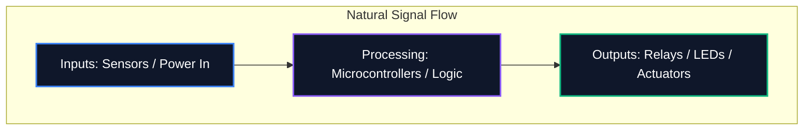

Baik Anda membagikan diagram di forum atau mengirimkannya untuk fabrikasi PCB profesional, keterbacaan skema Anda sama pentingnya dengan kebenaran logisnya. Skema yang berantakan menyebabkan kesalahan perutean, komponen yang salah dipahami, dan waktu yang terbuang.

Panduan ini menguraikan praktik terbaik inti yang digunakan oleh insinyur elektronik profesional untuk membuat diagram sirkuit yang bersih, mudah dipelihara, dan mudah dibaca.

## 1. Alur Skema: Kiri ke Kanan, Atas ke Bawah

Skema adalah dokumen teknis, dan seperti dokumen lainnya, skema harus dibaca secara alami. Dalam desain elektronik, konvensi standar menyatakan bahwa masukan mengalir dari kiri, dan keluaran keluar ke kanan.

Demikian pula, tegangan yang lebih tinggi harus secara eksplisit ditempatkan di bagian atas skema, dan tegangan yang lebih rendah atau ground di bagian bawah.



## 2. Simbol Kekuatan dan Tanah

Jangan pernah menarik kabel panjang dan berliku yang menghubungkan setiap pin ground menjadi satu. Ini menciptakan jaring laba-laba yang tidak mungkin terbaca. Sebagai gantinya, gunakan simbol daya dan ground lokal pada komponen.

| Praktek Buruk | Praktik Terbaik | Mengapa Itu Penting |
| :--- | :--- | :--- |
| Mengikat semua ground dengan satu kawat kontinu | Memanfaatkan simbol `GND` lokal di setiap komponen | Mengurangi kekacauan visual; secara eksplisit mendefinisikan jalur kembali tanpa penelusuran yang rumit |
| Menempatkan garis VCC melintasi jejak sinyal | Menggunakan simbol `VCC` / `+5V` lokal yang mengarah ke atas | Mencegah garis sinyal menjadi bingung secara visual dengan penyaluran daya |
| Memberi label pada tempat yang berbeda dengan simbol yang sama | Membedakan Analog Ground (AGND) dan Digital Ground (DGND) | Penting untuk menghindari ground loop dan perambatan kebisingan dalam desain sinyal campuran |

## 3. Titik Persimpangan vs. Penyeberangan

Salah satu kesalahan paling berbahaya dalam desain skema adalah ambiguitas pada persilangan kabel.

```mermaid
graph TD
    A[Is it a connection?]
    A --> B{Is there a junction dot?}
    B -- Yes --> C[Wires are electrically connected (Node)]
    B -- No --> D[Wires are crossing without connecting]
    
    style A fill:#1e293b,stroke:#f59e0b
    style C fill:#1e293b,stroke:#10b981
    style D fill:#1e293b,stroke:#ef4444
```

> **Tips Pro:** Jangan sekali-kali menggunakan persimpangan "4 arah" (bentuk salib seperti '+'). Jika empat kabel harus bertemu, imbangi kabel tersebut menjadi dua sambungan 'T' 3 arah. Hal ini sepenuhnya menghilangkan ambiguitas; jika titik persimpangan menghilang saat mencetak atau menskala, bentuk 'T' tetap menyiratkan adanya koneksi, sedangkan tanda silang tidak.

## 4. Pengelompokan Komponen Logis

Ketika berhadapan dengan skema besar yang berisi mikrokontroler dengan 64+ pin, mencoba menarik setiap kabel secara fisik ke komponen adalah sia-sia. Sebaliknya, alat profesional menggunakan **Net Labels**.

Kelompokkan blok fungsional sirkuit Anda ke dalam zona visual. Misalnya, letakkan catu daya di salah satu sudut, MCU di tengah, dan driver motor di sudut lain. Hubungkan semuanya secara murni menggunakan Label Net deskriptif (misalnya, `SPI_MOSI`, `UART_TX`, `MOTOR_PWM`).

## 5. Referensi Penanda dan Nilai

Simbol resistor telanjang tidak memberi tahu apa pun kepada pemirsa. Setiap komponen harus memiliki penanda referensi unik dan nilai eksplisit.

| Kategori Komponen | Awalan Standar | Contoh |
| :--- | :--- | :--- |
| **Resistor** | `R` | `R1 (10kΩ)` |
| **Kapasitor** | `C` | `C4 (100nF)` |
| **Sirkuit Terpadu** | `U` atau `IC` | `U2 (LM358)` |
| **Dioda / LED** | `D` | `D1 (1N4148)` |
| **Transistor / MOSFET** | `Q` | `Q1 (2N2222)` |
| **Induktor** | `L` | `L1 (4,7μH)` |
| **Konektor/Header** | `J` atau `P` | `J1 (Colokan Listrik)` |

Mematuhi konvensi ini menjamin bahwa skema Anda akan langsung dipahami oleh insinyur mana pun, di mana pun di dunia. Mulai terapkan aturan ini sekarang juga di [Editor Diagram Sirkuit](/editor/).