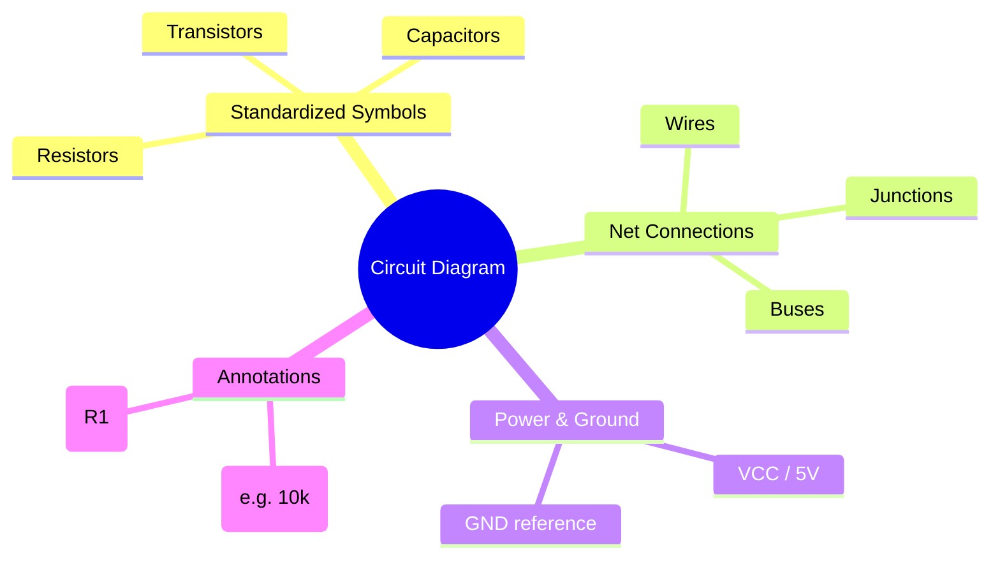
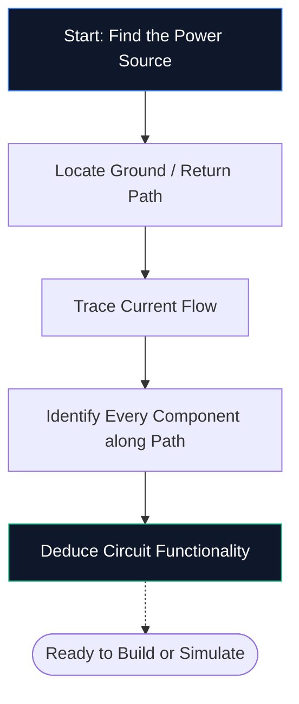

Jika Anda belum pernah membuka editor skema sebelumnya, ini adalah satu-satunya panduan yang Anda perlukan. Kita akan membahas dasar-dasarnya — apa itu diagram sirkuit, cara memecahkan kode simbol, dan cara menggambar skema pertama Anda di dalam **Pembuat Diagram Sirkuit** — semuanya tanpa menginstal perangkat lunak apa pun.

## Apa Sebenarnya Diagram Sirkuit Itu?

Diagram sirkuit adalah peta listrik. Sama seperti peta kereta bawah tanah yang menunjukkan bagaimana stasiun terhubung tanpa menggambarkan terowongan yang diukur, diagram sirkuit menunjukkan bagaimana komponen elektronik terhubung tanpa mengkhawatirkan ukuran fisik atau penempatan papan.

Alih-alih gambar realistis, skema menggunakan **simbol standar**. Resistor muncul sebagai garis zigzag, kapasitor sebagai dua pelat sejajar, dan dioda sebagai segitiga yang bertemu dengan batang. Singkatan universal ini membuat diagram tetap bersih, dapat dicetak, dan dibaca di setiap negara dan bahasa.

> **Mengapa abstraksi penting:** Resistor fisik berbentuk silinder kecil dengan pita berwarna, namun pada skema 50 komponen, detail tersebut akan menimbulkan kekacauan visual. Simbol memampatkan gambar sehingga otak Anda dapat fokus pada *bagaimana segala sesuatunya terhubung* daripada *seperti apa*.

## 10 Simbol Yang Wajib Diketahui Setiap Pemula

Sebelum Anda dapat membaca — atau menggambar — sebuah skema, Anda perlu mengenali blok penyusun inti. Hafalkan tabel di bawah ini dan Anda akan dapat memecahkan kode sebagian besar sirkuit penghobi yang terlihat.

| Bentuk Simbol | Komponen | Fungsi Utama | Penunjuk |
| :--- | :--- | :--- | :--- |
| **Garis zigzag** | Resistor | Membatasi aliran arus | `R` |
| **Dua garis sejajar** | Kapasitor | Menyimpan biaya, menyaring kebisingan | `C` |
| **Rangkaian loop** | Induktor | Menyimpan energi dalam medan magnet | `L` |
| **Segitiga + batang** | Dioda | Memungkinkan arus dalam satu arah | `D` |
| **Segitiga + batang + panah** | LED | Memancarkan cahaya bila bias maju | `D` / `LED` |
| **Garis sejajar panjang/pendek** | Baterai | Memberikan tegangan DC | `BT` |
| **Tiga baris bertumpuk** | Tanah | Titik referensi pada 0 V | `GND` |
| **Bentuk segitiga** | Op-Amp | Memperkuat perbedaan tegangan | `U` / `IC` |
| **Persegi panjang dengan pin** | Sirkuit Terpadu | Melakukan fungsi kompleks | `U` / `IC` |
| **Garis lurus** | Kabel | Membawa arus antar komponen | *(Tidak ada)* |

## Cara Membaca Skema dalam Lima Langkah

Membaca diagram sirkuit mengikuti proses mental yang sama setiap saat. Latih lima langkah ini pada skema apa pun dan polanya akan menjadi kebiasaan.

1. **Temukan sumber listrik** — Cari simbol atau label baterai seperti VCC, 5 V, atau 3,3 V. Di sinilah energi listrik masuk ke rangkaian.
2. **Temukan ground** — Temukan simbol ground tiga baris atau label GND. Setiap sirkuit pasti mempunyai jalur balik.
3. **Melacak aliran arus** — Ikuti kabel dari terminal positif, melalui setiap komponen, dan kembali ke ground. Arus konvensional mengalir dari positif ke negatif.
4. **Identifikasi setiap komponen** — Cocokkan setiap simbol dengan tabel di atas, lalu baca label di sebelahnya untuk mengetahui nilai pastinya (misalnya 10 kΩ berarti 10.000 ohm).
5. **Pahami tujuannya** — Tanyakan pada diri Anda apa fungsi sirkuit tersebut. LED plus resistor adalah lampu indikator sederhana. Op-amp dengan resistor umpan balik adalah penguat sinyal.

## Skema Pertama Anda: Sirkuit LED

Setiap pemula di bidang elektronik memulai dari sini - LED yang ditenagai melalui resistor pembatas arus. Buka [editor Pembuat Diagram Sirkuit](/editor/) dan ikuti.

**Pipa Arsitektur Sirkuit:**

```mermaid
graph LR
    PWR(Battery 9V) -- Positive Wire --> R1(Resistor 330Ω)
    R1 -- Controlled Current --> D1((Red LED))
    D1 -- Return Path --> GND(Ground)
    
    style PWR fill:#1e293b,stroke:#f59e0b
    style R1 fill:#1e293b,stroke:#3b82f6
    style D1 fill:#1e293b,stroke:#ef4444
    style GND fill:#1e293b,stroke:#64748b
```

**Petunjuk langkah demi langkah:**

1. Seret simbol **Baterai** dari bar samping ke kanvas.
2. Tempatkan **Resistor** di sebelah kanan baterai.
3. Tempatkan **LED** di sebelah kanan resistor.
4. Tekan **W** untuk mengaktifkan mode Kawat.
5. Klik terminal positif baterai, lalu klik pin kiri resistor untuk menarik kabel.
6. Hubungkan pin kanan resistor ke anoda LED.
7. Hubungkan kembali katoda LED ke terminal negatif baterai.
8. Klik dua kali resistor dan ketik **330 Ω**.
9. Klik **Ekspor → SVG** untuk menyimpan file berkualitas publikasi.

## Lima Kesalahan Umum (dan Cara Menghindarinya)

| Kesalahan | Apa yang Salah | Perbaikan Cepat |
| :--- | :--- | :--- |
| **Jalur dasar tidak ada** | Sirkuit tampak terbuka; arus tidak dapat mengalir | Selalu sambungkan jalur kembali ke ground |
| **Persimpangan kawat tanpa titik** | Dua kabel yang bersilangan tampak tersambung padahal tidak | Tambahkan titik persimpangan hanya di tempat kabel benar-benar bergabung |
| **Tidak ada nilai komponen** | Peninjau tidak dapat memverifikasi desain Anda | Labeli setiap resistor, kapasitor, dan IC |
| **Kabel berantakan** | Kabel diagonal atau tumpang tindih mengurangi keterbacaan | Gunakan perutean Manhattan (hanya horizontal dan vertikal) |
| **Tidak ada penanda referensi** | Daftar bagian menjadi tidak mungkin dibuat | Beri label pada setiap bagian R1, C1, U1, D1, dan seterusnya |

## Kemana Tujuan Selanjutnya

Setelah Anda merasa nyaman menggambar skema dasar, jelajahi sumber daya berikut untuk naik level:

* **[Penjelasan Simbol Diagram Sirkuit](/blog/sirkuit-diagram-symbols-explained/)** — mendalami setiap kategori simbol
* **[Cara Membuat Diagram Sirkuit Online](/blog/cara-membuat-diagram-rangkaian-online/)** — teknik tingkat lanjut dan tip alur kerja
* **[Perpustakaan Komponen](/components/)** — menelusuri 40+ simbol yang tersedia di Pembuat Diagram Sirkuit