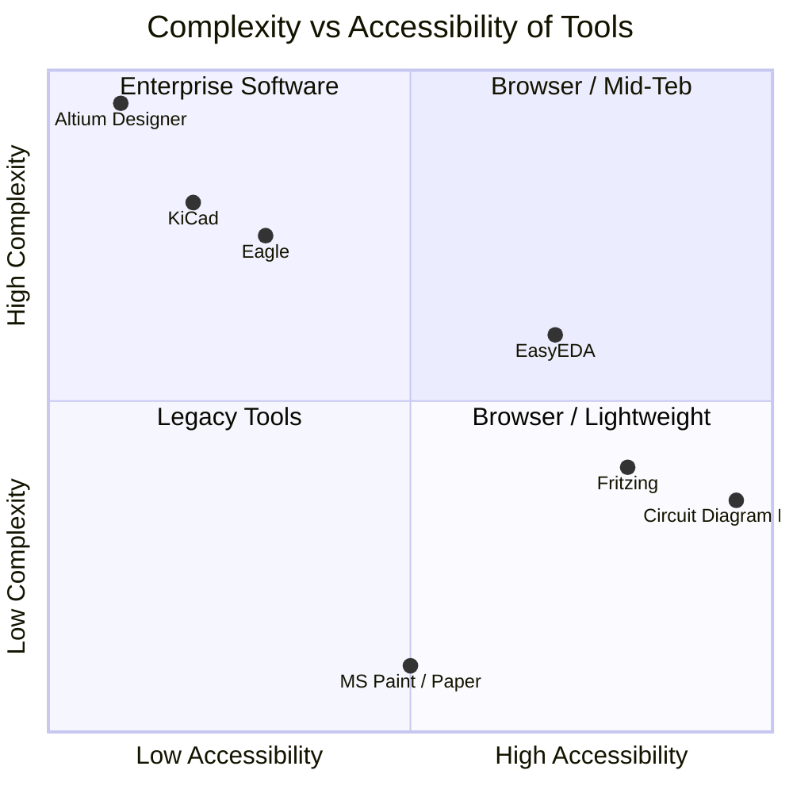
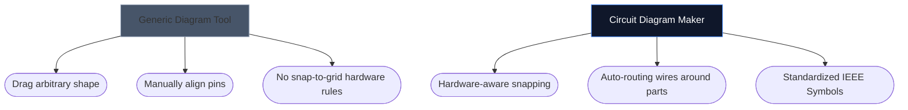

Memilih alat yang tepat untuk menggambar skema elektronik sering kali dapat menentukan seberapa cepat Anda dapat melakukan iterasi pada proyek perangkat keras baru. Meskipun perancang PCB tingkat lanjut memerlukan lingkungan desktop kelas berat, penghobi, pelajar, dan pembuat sering kali membutuhkan sesuatu yang sama sekali berbeda: aksesibilitas dan kecepatan.

Di bawah ini, kami menganalisis bagaimana alat kami dibandingkan dengan alternatif industri utama.

## Matriks Kategorisasi Alat

Sebelum mempelajari masing-masing alat, penting untuk memahami tingkat perangkat lunak apa yang sebenarnya dibutuhkan proyek Anda. Menggunakan perangkat lunak PCB perusahaan untuk membuat sketsa tata letak LED 4 komponen adalah tindakan yang berlebihan.

## 1. Pembuat Diagram Sirkuit vs. Fritzing

Fritzing terkenal karena menjembatani kesenjangan antara pembuatan prototipe papan tempat memotong roti dan skema. Namun, Fritzing memerlukan instalasi dan kesulitan dengan pembaruan pemeliharaan selama bertahun-tahun.

| Fitur | Pembuat Diagram Sirkuit | Menggerek |
| :--- | :--- | :--- |
| **Fokus Utama** | Tata Letak Skema Standar | Visualisasi Papan Tempat Memotong Roti |
| **Instalasi** | Tidak ada (100% berbasis browser) | Diperlukan Instalasi Desktop |
| **Biaya** | 100% Gratis | Berbayar (Donationware) |
| **Kurva Pembelajaran** | Sangat Rendah | Sedang |

> **Putusan:** Jika Anda secara khusus perlu memvisualisasikan kabel fisika yang dimasukkan ke papan tempat memotong roti, Fritzing lebih unggul. Jika Anda memerlukan skema elektronik standar dan universal *secara instan*, gunakan Pembuat Diagram Sirkuit.

## 2. Pembuat Diagram Sirkuit vs. KiCad & Altium

KiCad adalah rangkaian PCB sumber terbuka yang legendaris, dan Altium Designer adalah standar industri perusahaan. Mereka sangatlah kuat.

| Lapisan Kemampuan | Pembuat Diagram Sirkuit | KiCad / Altium |
| :--- | :--- | :--- |
| **Jenis Keluaran** | Citra SVG/PNG | File Gerber, BOM, Pilih&Tempat |
| **Simulasi** | Visual / Sederhana | Integrasi SPICE Mendalam |
| **Kecepatan ke Skema Pertama** | < 10 detik | 10–30 Menit (Pengaturan/Konfigurasi) |

> **Putusan:** Gunakan KiCad atau Altium saat Anda mengirim lapisan tembaga ke pabrik di Shenzhen. Gunakan Pembuat Diagram Sirkuit saat Anda melampirkan skema ke tugas fisika, postingan blog, atau pertanyaan forum.

## 3. Pembuat Diagram Sirkuit vs. draw.io / Lucidchart

Alat diagram umum seperti draw.io sangat populer untuk diagram alur. Namun, mereka kurang memahami semantik elektronik.

Saat Anda menggunakan alat elektronik khusus, editor memahami bahwa kabel tidak bisa begitu saja "berakhir" secara acak tanpa sambungan, dan kabel tersebut secara inheren memetakan properti standar (seperti Ohm ke resistor).

## Alat Mana yang Tepat untuk Anda?

Alat terbaik adalah alat yang menghalangi Anda. Untuk ide cepat, tugas pendidikan, dan publikasi web, [Pembuat Diagram Sirkuit](/editor/) menawarkan kombinasi kecepatan dan estetika modern yang tiada duanya.