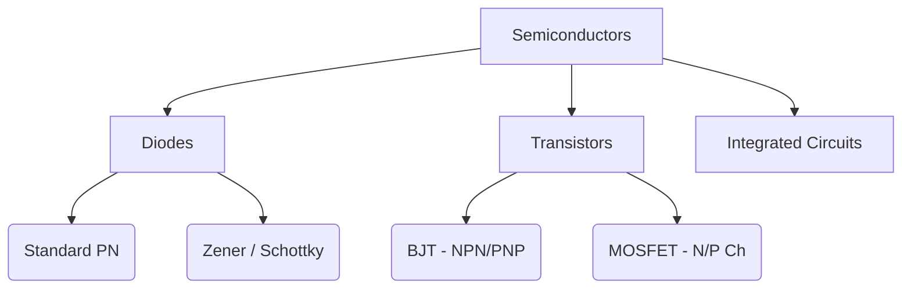

Simbol elektronik adalah bahasa universal rekayasa perangkat keras. Sama seperti not musik yang menentukan nada dan ritme, simbol sirkuit menyampaikan fungsi listrik, properti, dan konektivitas melalui selembar kertas.

Dalam panduan komprehensif ini, kami membedah morfologi visual dari elemen terpenting yang akan Anda temui dalam skema apa pun.

## Perbedaan Standar Global: IEEE vs. IEC

Sebelum mendalami simbol tertentu, penting untuk menyadari bahwa simbol dapat terlihat berbeda tergantung di mana skema tersebut digambar. Dua standar yang dominan adalah **IEEE/ANSI** (kebanyakan di Amerika) dan **IEC** (Eropa dan internasional).

```mermaid
flowchart LR
    subgraph Regional Standards
    A((Schematic Origin))
    A -- US / Americas --> B[IEEE / ANSI]
    A -- Europe / Int'l --> C[IEC]
    end
    
    B -.-> D(Zigzag Resistors)
    C -.-> E(Rectangle Resistors)
    
    style B fill:#1e293b,stroke:#f59e0b
    style C fill:#1e293b,stroke:#3b82f6
```

Di Circuit Diagram Maker, kami terutama menggunakan standar IEEE/ANSI, karena standar ini tetap sangat populer di ekosistem digital dan penghobi, meskipun keduanya secara teknis benar.

## Komponen Pasif

Komponen pasif tidak memerlukan sumber daya eksternal untuk beroperasi dan tidak dapat memperkuat sinyal.

| Komponen | Penampilan Simbol Standar | Deskripsi Fungsional |
| :--- | :--- | :--- |
| **Resistor** | Didefinisikan oleh garis zigzag yang tajam dan bergerigi. Varian variabel menampilkan panah yang menembus garis. | Menghilangkan daya sebagai panas untuk membatasi aliran arus listrik. |
| **Kapasitor** | Dua garis sejajar yang dipisahkan oleh sebuah celah. Varian terpolarisasi melengkungkan salah satu garis untuk menunjukkan terminal negatif. | Menyimpan energi listrik sementara dalam medan listrik. |
| **Induktor** | Serangkaian putaran bulat atau setengah lingkaran yang melambangkan gulungan kawat. | Menentang perubahan aliran arus dengan menyimpan energi dalam medan magnet. |

## Komponen Aktif (Semikonduktor)

Komponen aktif memerlukan sumber listrik dan dapat mengontrol aliran listrik, seringkali memperkuat sinyal.

| Komponen | Indikator Visual | Penggunaan Inti |
| :--- | :--- | :--- |
| **Dioda** | Segitiga yang mengarah ke garis datar. Garis tersebut menunjukkan katoda (negatif). | Katup satu arah untuk listrik. |
| **LED** | Simbol dioda standar dengan dua panah kecil mengarah ke luar, menandakan emisi cahaya. | Indikator visual dan optoelektronik. |
| **Transistor BJT** | Garis vertikal diapit oleh tiga sambungan: basis, kolektor, dan emitor dengan panah yang menentukan NPN atau PNP. | Sakelar dan amplifier yang dikontrol arus. |
| **MOSFET** | Menampilkan garis batas terpisah yang menyoroti gerbang terisolasi dan dioda substrat internal. | Peralihan yang dikontrol tegangan untuk daya tinggi. |

## Perangkat Mekanik dan Output

Bagian-bagian ini berinteraksi dengan dunia fisik, baik menerima masukan manusia atau menghasilkan keluaran fisik.

| Komponen | Singkatan Skema | Aplikasi |
| :--- | :--- | :--- |
| **Beralih (SPST)** | Garis putus-putus yang dapat berputar ke bawah untuk menyelesaikan rangkaian. | Kontrol daya ON/OFF dasar. |
| **Relai** | Biasanya digambarkan sebagai induktor (kumparan internal) yang digabungkan dengan kontak saklar terisolasi. | Mengalihkan beban tegangan tinggi melalui mikrokontroler tegangan rendah. |
| **Motor** | Lingkaran berisi huruf 'M', seringkali dengan terminal positif dan negatif. | Mengubah arus listrik menjadi kinetika rotasi. |

> **Tips Desain:** Setiap kali menggunakan sakelar atau relai mekanis, selalu sertakan *dioda flyback* pada beban induktif untuk melindungi komponen semikonduktor Anda dari lonjakan tegangan!

Memahami simbol-simbol ini adalah langkah pertama menuju kelancaran rangkaian. Kunjungi [editor online](/editor/) kami untuk menarik, melepas, dan bereksperimen dengan bentuk-bentuk ini secara instan.