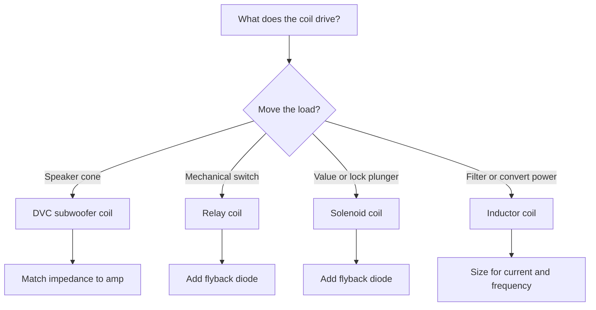
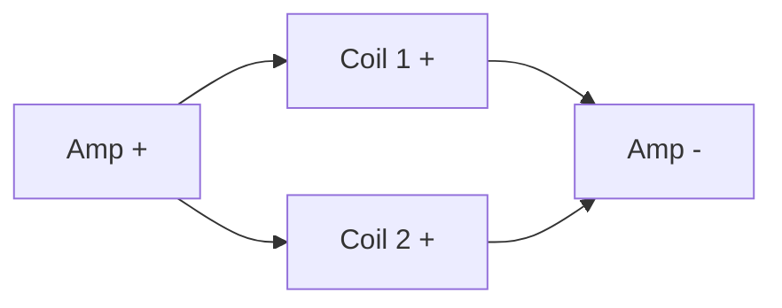
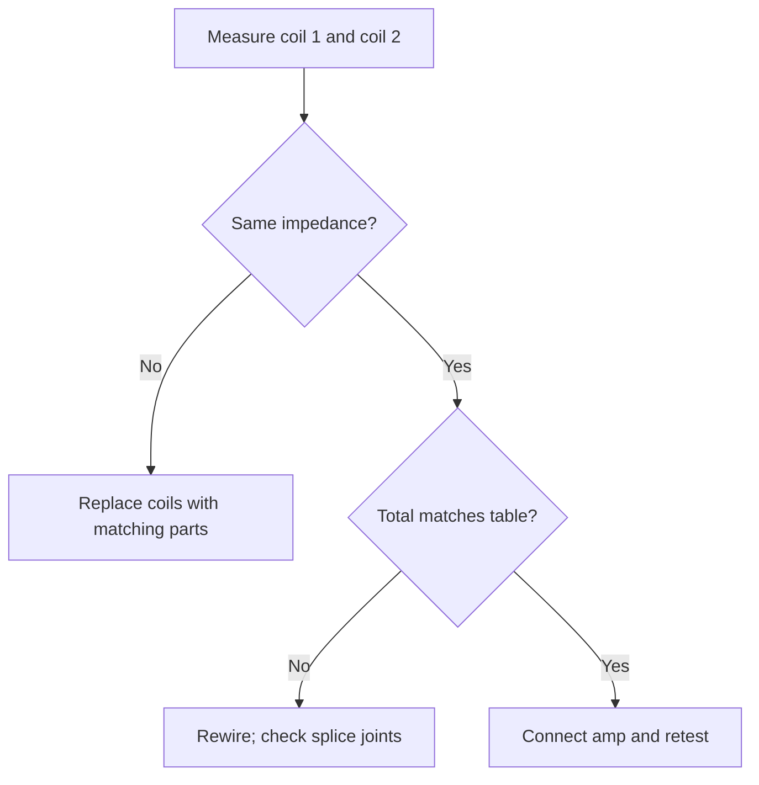

## Pengenalan Pengkabelan Coil

**<b>Diagram pengkabelan coil adalah skema yang menunjukkan bagaimana coil terhubung ke daya, ground, dan komponen yang digerakkan, termasuk coil relay, coil solenoid, induktor, dan speaker dual voice coil.</b> Coil adalah seutas kawat yang dililitkan menjadi loop yang menyimpan energi dalam medan magnet. Diagram tersebut memetakan setiap terminal coil ke sirkuit penggerak dan komponen pelindung di sekitarnya.

Pengkabelan coil penting dalam proyek Arduino karena relay, katup solenoid, dan induktor daya semuanya bergantung pada coil. Dalam proyek Arduino, diagram tersebut menunjukkan bagaimana output digital menggerakkan coil melalui transistor dan diode flyback alih-alih menghubungkan coil langsung ke board.

Ada 3 manfaat utama membaca diagram pengkabelan coil:

1. Memprediksi impedansi dan penanganan daya coil audio sebelum pengkabelan
2. Menggerakkan coil relay dan solenoid dari mikrokontroler tanpa merusak board
3. Menemukan gangguan tanpa daya, dengung, dan coil rusak dari tata letak pengkabelan

Diagram tersebut memiliki 4 penggunaan utama: pengkabelan subwoofer dual voice coil (DVC), modul relay Arduino, aktuator solenoid, dan sirkuit daya berbasis induktor. Tata letak pengkabelan memiliki 5 bagian utama: coil, sumber daya, peranti switching, pelindung flyback, dan beban listrik.

## Jenis Coil dan Aplikasinya

**<b>Subwoofer dual voice coil (DVC) memiliki 2 coil terpisah yang dililitkan pada bekas speaker yang sama.</b> Setiap coil memiliki pasangan terminal tersendiri dan nilai impedansinya sendiri, biasanya 2 atau 4 ohm (Ω).**

Subwoofer DVC menawarkan 3 keunggulan:

1. Menyesatkan beban amplifier dengan pengkabelan seri dan paralel
2. Mengkabelkan satu subwoofer ke amplifier mono atau amplifier bridged
3. Mencapai impedansi akhir yang rendah ketika amplifier tidak dapat menggerakkan beban impedansi tinggi dengan baik pada daya rendah

<table>
  <thead>
    <tr><th>Jenis coil</th><th>Fungsi coil</th><th>Penilaian umum</th><th>Penggunaan umum</th></tr>
  </thead>
  <tbody>
    <tr>
      <td><strong>Coil speaker DVC</strong></td>
      <td>Menggerakkan kerucut subwoofer; impedansi bertambah dalam seri dan setengah dalam paralel</td>
      <td>2 Ω atau 4 Ω per coil</td>
      <td>Pengkabelan subwoofer dalam sistem audio</td>
    </tr>
    <tr>
      <td><strong>Coil relay</strong></td>
      <td>Mengaktifkan elektromagnet yang menutup kontak sakelar</td>
      <td>5 V atau 12 V DC</td>
      <td>Proyek Arduino dan otomasi rumah</td>
    </tr>
    <tr>
      <td><strong>Coil solenoid</strong></td>
      <td>Menarik pelatuh untuk menggerakkan katup atau kunci</td>
      <td>6–24 V DC</td>
      <td>Katup irigasi dan kunci pintu</td>
    </tr>
    <tr>
      <td><strong>Coil induktor</strong></td>
      <td>Menyimpan energi magnet dan menghaluskan arus</td>
      <td>Mikrohenry (µH) hingga henry (H)</td>
      <td>Filter dan konverter boost</td>
    </tr>
  </tbody>
</table>

Pilih jenis coil dari kebutuhan pengkabelan sebelum merancang sirkuit:

Dalam sistem audio, subwoofer DVC dikabelkan ke amplifier subwoofer mono. Satu subwoofer DVC menghasilkan sekitar dua kali lipat kendali kerucut dibanding subwoofer single voice coil (SVC) setara ketika amplifier cocok dengan impedansi akhir yang lebih rendah. Gambar di bawah menunjukkan 4 jenis coil:

## Diagram Pengkabelan Langkah demi Langkah

Dua metode pengkabelan berlaku untuk subwoofer DVC: pengkabelan seri dan pengkabelan paralel.

**<b>Pengkabelan seri menghubungkan coil 2 ke coil 1 dan menjumlahkan impedansinya. Pengkabelan paralel menghubungkan kedua coil pada terminal amplifier yang sama dan membagi impedansi menjadi setengah.</b>**

Tabel tersebut menunjukkan kedua hasil untuk impedansi coil yang umum:

| Impedansi masing-masing coil | Total seri | Total paralel |
| :--- | :--- | :--- |
| 2 Ω | 4 Ω | 1 Ω |
| 4 Ω | 8 Ω | 2 Ω |

Pilih metode pengkabelan untuk menyesuaikan dengan rentang impedansi stabil amplifier. Amplifier mono dengan nilai 4 ohm (Ω) pada 500 watt (W) menerima 2 coil DVC secara seri, masing-masing 2 Ω, untuk total 4 Ω. Amplifier dengan nilai 1 Ω menerima coil yang sama secara paralel dengan total 1 Ω, dan penanganan daya terbagi di antara 2 coil tersebut.

Gunakan 5 tips pengkabelan ini:

1. Samakan total impedansi dengan rentang nilai amplifier untuk beban yang stabil
2. Hubungkan coil 1 dan coil 2 dari subwoofer yang sama ke saluran amplifier yang sama
3. Periksa bahwa kedua coil memiliki impedansi dan daya yang sama
4. Ukur terminal dengan multimeter sebelum menghubungkan amplifier
5. Tandai terminal + dan − pada kedua coil untuk menghindari keterbalikan

## Pemecahan Masalah Masalah Pengkabelan Umum

Ada 6 kesalahan pengkabelan umum dalam sirkuit coil:

1. Membalik polaritas pada satu coil speaker, dan kerucut bertarung dengan dirinya sendiri
2. Mencampur coil 2 Ω dan 4 Ω dalam satu subwoofer dan beban menjadi tidak rata
3. Mengkabelkan impedansi bersih di bawah nilai amplifier, dan amplifier memasuki mode proteksi
4. Meninggalkan sambungan longgar atau solder dingin pada sirkuit coil arus tinggi
5. Melewatkan diode flyback pada coil relay Arduino
6. Menggunakan kawat yang terlalu kecil pada sirkuit coil daya tinggi

Selesaikan masalah pengkabelan DVC dengan multimeter:

1. Atur multimeter ke resistansi (Ω)
2. Ukur coil 1 pada terminalnya; harapkan 2 Ω atau 4 Ω
3. Ukur coil 2; harapkan nilai yang sama
4. Kabelkan seri atau paralel, lalu ukur terminal kedua coil lagi sesuai tabel

> "Saya mengkabelkan dua coil 4 Ω secara seri untuk mencapai 8 Ω untuk amplifier saya. Multimeter menunjukkan 8,1 Ω dan amplifier tetap dingin alih-alih memutus." — Postingan forum audio mobil klasik

> "Modul relay Arduino yang saya buat terus mereset. Diode flyback yang hilang adalah keseluruhan masalahnya. Satu 1N4007 memperbaikinya." — Pengguna forum elektronik hobi

Langkah pencegahan: pasang sekring pada garis daya sesuai arus coil, solder setiap sambungan, dan gunakan selongsong panas pada sambungan yang terpapar.

## Langkah Keselamatan Saat Bekerja dengan Coil

Coil menyimpan energi magnet, dan arus coil yang terputus menghasilkan lonjakan tegangan tinggi. Lonjakan tersebut mencapai ratusan volt pada coil relay yang digerakkan pada 12 V. Pengkabelan coil membawa 3 risiko utama: sengatan listrik, kerusakan akibat coil kickback, dan hubungan pendek dari kawat yang longgar.

Ikuti 8 langkah keselamatan ini:

1. Cabut sumber daya sebelum mengkabelkan atau mengkabelkan ulang coil apa pun
2. Lepaskan muatan kapasitor daya sebelum menyentuh sirkuit
3. Pasang diode flyback pada setiap coil relay dan solenoid
4. Gunakan peralatan berisolasi dan alat pengupas kawat dengan die yang bersih
5. Periksa polaritas pada kedua coil sebelum menghubungkan amplifier
6. Pasang sekring pada garis daya pada atau di bawah arus nominal coil
7. Gunakan kacamata keselamatan ketika pelatuh solenoid dapat berputar kembali
8. Verifikasi coil menunjukkan resistansi nominal sebelum menerapkan daya

> Diode flyback (1N4007 untuk sebagian besar coil DC) berfungsi di setiap sirkuit coil yang diputus oleh mikrokontroler atau sakelar. Diode menghadap ke belakang pada coil dan menyerap lonjakan kickback saat coil mati.

Periksa isolasi dua kali. Retakan pada jaket kawat dekat casing logam coil menyebabkan hubungan pendek ke ground. Gunakan selongsong panas pada setiap sambungan agar konduktor telanjang tidak pernah menyentuh rangka.

## Contoh Kasus Nyata dan Studi Kasus

**Studi kasus 1: Sakelar relay Arduino.** Sistem otomasi rumah menyalakan pompa kebun 12 V dengan coil relay. Relay mengonsumsi 85 milliampere (mA) pada 12 V, jauh di atas 20 mA Arduino per pin. Rangkaian menggunakan transistor 2N2222, resistor basis 1 kΩ, dan diode flyback 1N4007 pada coil. Pin Arduino mengaktifkan transistor, coil aktif, dan pompa berjalan. Pelajaran yang dipetik: tanpa diode flyback, lonjakan coil mereset Arduino pada setiap pemadaman.

**Studi kasus 2: Rangkaian subwoofer mobil.** Subwoofer DVC 2 Ω menggerakkan amplifier mono stabil 1 Ω. Pemasang mengkabelkan coil secara paralel untuk total 1 Ω, mengalirkan kawat speaker 16 AWG ke kedua coil, dan memasang sekring daya sesuai nilai amplifier; dyno kit menunjukkan output bersih di seluruh rentang frekuensi. Percobaan kedua dengan pengkabelan seri menghasilkan 4 Ω dengan setengah konsumsi arus tetapi daya lebih rendah.

**Studi kasus 3: Konverter boost dengan coil induktor.** Konverter boost DIY 5 V ke 12 V menggunakan induktor 100 µH, diode Schottky, dan sakelar yang digerakkan oleh output PWM (pulse-width modulation) Arduino. Indktor menyimpan energi setiap siklus switching dan menghasilkan 12 V yang stabil di output. Pelajaran yang dipetik: induktor harus dinilai untuk arus switching penuh, atau inti jenuh dan tegangan output runtuh.

3 penggunaan inovatif pengkabelan coil dalam elektronik DIY:

1. Kunci pintu magnet yang digerakkan oleh Arduino dan modul relay
2. Pengkabelan subwoofer DVC dalam pembangunan speaker home theater 2.1
3. Coil induksi buatan tangan yang digunakan dalam percobaan pengisian daya nirkabel

## Kesimpulan dan Sumber Tambahan

Diagram pengkabelan coil menghubungkan coil, sumber daya, penggerak, pelindung flyback, dan beban menjadi satu tata letak yang mudah dibaca. Pengkabelan seri menambah impedansi; pengkabelan paralel membaginya menjadi setengah. Subwoofer DVC bergantung pada kecocokan impedansi tersebut, dan sirkuit Arduino bergantung pada diode flyback. Terapkan langkah keselamatan sebelum setiap sambungan, ukur dengan ohmmeter, dan selesaikan masalah dari tata letak pengkabelan sebelum mengganti komponen.

Lanjutkan belajar dengan panduan ini:

- [Cara membaca diagram sirkuit langkah demi langkah](/blog/how-to-read-a-circuit-diagram-step-by-step-guide/)
- [Simbol diagram sirkuit dijelaskan](/blog/circuit-diagram-symbols-explanned/)
- [Praktik terbaik pembuat diagram sirkuit](/blog/circuit-diagram-maker-best-practices/)

Gambarkan dan simpan tata letak pengkabelan coil Anda sendiri sebelum menyolder. Buka editor browser gratis dan bereksperimen: [mulai di editor sirkuit](/editor/).
