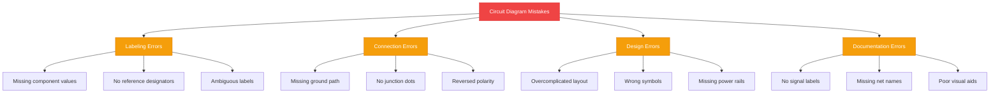
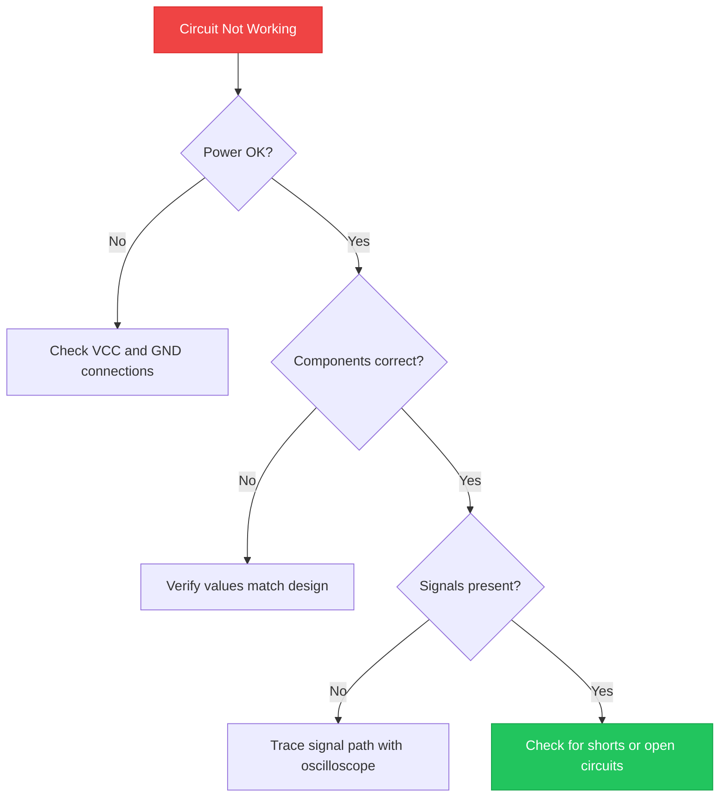

<b>10 kesalahan diagram sirkuit yang paling umum adalah pelabelan yang buruk, koneksi ground yang hilang, mengabaikan polaritas komponen, kawat yang bersilangan tanpa titik persimpangan, desain yang terlalu rumit, nilai komponen yang tidak dicantumkan, penggunaan simbol yang salah, jalur listrik yang hilang, tidak ada penunjuk referensi, dan alur sinyal yang tidak jelas.</b> Kesalahan-kesalahan ini menyebabkan kegagalan fungsi sirkuit, cacat manufaktur, dan berjam-jam pemecahan masalah.



## Pendahuluan

Diagram sirkuit adalah representasi visual dari sebuah rangkaian elektronik. Diagram ini menggunakan simbol-simbol standar untuk menunjukkan bagaimana komponen seperti resistor, kapasitor, dan <a href="https://en.wikipedia.org/wiki/LED" rel="nofollow noopener" target="_blank">LED (Light Emitting Diodes)</a> saling terhubung.

Diagram sirkuit memiliki tiga tujuan:

1. **Perencanaan desain** — Merancang rangkaian sebelum dibangun
2. **Dokumentasi** — Mencatat cara kerja sirkuit untuk orang lain
3. **Pemecahan masalah** — Mengidentifikasi masalah pada rangkaian yang sudah ada

Menghindari kesalahan umum dapat menghemat waktu, mencegah kerusakan komponen, dan menghasilkan sirkuit yang andal. 10 kesalahan berikut ini sering muncul pada skema tingkat pemula dan menengah. Memperbaikinya akan meningkatkan fungsi sirkuit dan membuat diagram lebih mudah dibaca.

## Memahami Kesalahan Umum Diagram Sirkuit

Terdapat 10 kesalahan umum diagram sirkuit yang paling sering menyebabkan masalah:

| Peringkat | Kesalahan | Tingkat Dampak |
|------|---------|--------------|
| 1 | Pelabelan komponen yang buruk | Tinggi |
| 2 | Koneksi ground yang hilang | Tinggi |
| 3 | Mengabaikan polaritas komponen | Tinggi |
| 4 | Kawat bersilangan tanpa titik persimpangan | Sedang |
| 5 | Diagram yang terlalu rumit | Sedang |
| 6 | Nilai komponen tidak dicantumkan | Tinggi |
| 7 | Penggunaan simbol yang salah | Sedang |
| 8 | Koneksi jalur listrik yang hilang | Tinggi |
| 9 | Tidak ada penunjuk referensi | Sedang |
| 10 | Arah alur sinyal yang tidak jelas | Rendah |

Setiap kesalahan menciptakan masalah tertentu selama <a href="/blog/simple-led-driver-circuit/" rel="noopener">pembangunan dan pemecahan masalah sirkuit</a>. Bagian-bagian berikut menjelaskan setiap kesalahan dan cara memperbaikinya.

## Kesalahan 1: Pelabelan Komponen yang Buruk

Melabeli komponen dengan benar adalah fondasi dari diagram sirkuit yang mudah dibaca. Tanpa label yang tepat, siapa pun yang membaca diagram tidak dapat mengidentifikasi komponen, nilainya, atau fungsinya.

### Mengapa Pelabelan Sangat Penting

Pelabelan yang buruk menyebabkan tiga masalah:

1. **Kesalahan manufaktur** — Teknisi perakitan tidak dapat mengidentifikasi komponen yang benar
2. **Keterlambatan debugging** — Insinyur membuang waktu untuk melacak koneksi yang tidak berlabel
3. **Transfer pengetahuan** — Anggota tim baru tidak dapat memahami desain

### Pelabelan yang Baik vs. yang Buruk

**Contoh pelabelan yang buruk:**


Masalah dengan diagram ini:

- `R` tidak memiliki nilai — resistor yang mana? 100Ω atau 100kΩ?
- `LED` tidak memiliki warna atau tegangan — merah (2V) atau biru (3.2V)?
- Tidak ada penunjuk referensi — mustahil membuat daftar material

**Contoh pelabelan yang baik:**


Label yang baik mencakup:

- **Penunjuk referensi** (R1, D1) — pengenal unik untuk setiap komponen
- **Nilai komponen** (330Ω) — spesifikasi yang tepat
- **Jenis atau tegangan** (LED Red 2V) — menjelaskan fungsi

> **Aturan:** Setiap komponen memerlukan penunjuk referensi yang unik dan nilainya yang kritis.

## Kesalahan 2: Mengabaikan Fungsi Sirkuit

Diagram sirkuit harus mencerminkan cara kerja sirkuit yang sebenarnya. Mengabaikan fungsi sirkuit menciptakan diagram yang tampak benar secara visual tetapi gagal saat diterapkan.

### Bagaimana Kesalahan Mempengaruhi Fungsi

Kesalahan-kesalahan ini secara langsung memengaruhi operasi sirkuit:

- **Resistor pull-up yang hilang** — Input mikrokontroler mengambang dan menghasilkan pembacaan acak
- **Tidak ada kapasitor decoupling** — IC menerima daya yang bising dan mengalami gangguan
- **Voltage divider yang salah** — Level sinyal melebihi batas input
- **Pembatas arus yang hilang** — LED dan transistor terbakar

### Tips Pemecahan Masalah

Ikuti proses berikut ketika sirkuit tidak berfungsi:

1. **Verifikasi koneksi daya** — Periksa apakah VCC dan GND mencapai setiap IC
2. **Periksa nilai komponen** — Pastikan resistor dan kapasitor sesuai dengan desain
3. **Uji jalur sinyal** — Gunakan osiloskop untuk melacak sinyal melalui setiap tahap
4. **Periksa hubung singkat** — Uji koneksi yang tidak disengaja antar jalur



## Kesalahan 3: Diagram yang Terlalu Rumit

Diagram yang sederhana lebih mudah dibaca, dibangun, dan didebug. Mengrumitkan diagram dengan komponen yang tidak perlu, kabel yang berantakan, atau detail yang berlebihan membuat skema sulit diikuti.

### Pentingnya Kesederhanaan

Diagram yang terlalu rumit menyebabkan:

- **Kesalahan membaca** — Koneksi penting tenggelam dalam kekacauan
- **Kesalahan perakitan** — Perakitan salah menafsirkan tata letak
- **Keterlambatan pemeliharaan** — Pemecahan masalah memakan waktu lebih lama

### Contoh Diagram yang Disederhanakan

**Pendekatan yang terlalu rumit:**

Menggambar setiap panjang jalur, bentuk komponen fisik, dan detail pemasangan pada skema.

**Pendekatan yang disederhanakan:**

Menggunakan simbol standar, perutean yang rapi, dan pengelompokan logis. Tata letak fisik seharusnya ada di alat desain PCB, bukan di skema.

> **Aturan:** Skema menunjukkan koneksi kelistrikan, bukan penempatan fisik. Jaga agar tetap bersih.

## Menggunakan Perangkat Lunak untuk Menghindari Kesalahan

Perangkat lunak desain sirkuit modern dapat mendeteksi kesalahan sebelum sampai ke bengkel. Alat-alat ini menyediakan pemeriksaan otomatis yang mencegah kesalahan yang paling umum terjadi.

### Perangkat Lunak Desain Sirkuit Populer

| Perangkat Lunak | Jenis | Fitur Utama |
|----------|------|-------------|
| <a href="https://circuitdiagram.org/editor/" rel="noopener">Circuit Diagram Maker</a> | Berbasis browser | Gratis, tidak perlu instalasi |
| <a href="https://www.kicad.org/" rel="nofollow noopener" target="_blank">KiCad</a> | Desktop | Sumber terbuka, alur kerja PCB lengkap |
| <a href="https://easyeda.com/" rel="nofollow noopener" target="_blank">EasyEDA</a> | Berbasis browser | Terintegrasi dengan komponen LCSC |
| <a href="https://www.autodesk.com/products/electronics/overview" rel="nofollow noopener" target="_blank">Fusion 360 Electronics</a> | Desktop | Desain kelas profesional |
| <a href="https://www.diptrace.com/" rel="nofollow noopener" target="_blank">DipTrace</a> | Desktop | Antarmuka ramah pemula |

### Bagaimana Perangkat Lunak Mencegah Kesalahan

Perangkat lunak desain mencegah kesalahan melalui:

1. **Pemeriksaan Aturan Kelistrikan (ERC)** — Menandai pin yang tidak terhubung, daya yang hilang, dan hubung singkat
2. **Perpustakaan komponen** — Menyediakan simbol dan footprint yang benar
3. **Pelabelan net** — Melacak koneksi secara otomatis di seluruh lembar
4. **Pembuatan BOM** — Mencantumkan semua komponen beserta nilai dan nomor suku cadang
5. **Kontrol versi** — Melacak perubahan dan memungkinkan pengembalian

> **Aturan:** Jalankan ERC sebelum menyelesaikan desain apa pun. Perbaiki semua kesalahan, termasuk yang dianggap sepele.

## Alat Bantu Visual dan Pentingnya

Alat bantu visual menjelaskan konsep-konsep kompleks yang tidak dapat dijelaskan hanya dengan teks. Sebuah diagram, tabel, atau anotasi yang ditempatkan dengan baik dapat menghemat ratusan kata.

### Bagaimana Diagram Menjelaskan Konsep

Alat bantu visual meningkatkan kualitas diagram sirkuit melalui:

- **Diagram blok** — Menunjukkan arsitektur sistem secara keseluruhan sebelum skema detail
- **Panah alur sinyal** — Menunjukkan arah pergerakan data atau daya
- **Pewarnaan kode** — Membedakan net daya (merah), ground (hitam), dan sinyal (biru)
- **Kotak callout** — Menyoroti catatan desain atau peringatan penting

### Contoh Alat Bantu Visual yang Efektif

**Diagram blok untuk catu daya:**


**Anotasi alur sinyal:**

```
MCU → Level Shifter → Driver IC → Motor
     3.3V          5V          12V
```

**Label net berwarna:**

```
VCC_RED = +5V power
GND_BLACK = Ground reference
SIG_BLUE = UART transmit
```

Alat bantu visual ini membuat diagram menjadi dokumentasi mandiri. Siapa pun yang membaca diagram dapat memahami desain tanpa memerlukan penjelasan tambahan.

## Referensi Cepat Kesalahan Umum

Gunakan tabel ini untuk memeriksa diagram Anda terhadap 10 kesalahan paling umum:

| Kesalahan | Cara Memperbaikinya |
|---------|---------------|
| Pelabelan yang buruk | Tambahkan penunjuk referensi dan nilai pada setiap komponen |
| Ground yang hilang | Pastikan setiap sirkuit memiliki jalur kembali yang lengkap ke GND |
| Mengabaikan polaritas | Tandai anoda (+) dan katoda (−) pada dioda dan LED |
| Tanpa titik persimpangan | Tambahkan titik di mana kabel benar-benar terhubung |
| Terlalu rumit | Hapus detail yang tidak perlu; jaga skema tetap bersih |
| Nilai yang hilang | Cantumkan semua nilai resistor, kapasitor, dan induktor |
| Simbol yang salah | Gunakan simbol standar IEEE atau IEC |
| Jalur listrik yang hilang | Tampilkan koneksi VCC dan GND pada setiap IC |
| Tidak ada penunjuk referensi | Labeli setiap komponen secara berurutan R1, C1, D1, U1 |
| Alur sinyal yang tidak jelas | Tambahkan panah yang menunjukkan arah data atau daya |

## Kesimpulan

Menghindari kesalahan umum diagram sirkuit dapat menghemat waktu, mencegah kerusakan komponen, dan menghasilkan desain yang andal. 10 kesalahan yang dibahas — dari pelabelan yang buruk hingga alur sinyal yang tidak jelas — menyumbang sebagian besar kesalahan pada skema.

Terapkan prinsip-prinsip desain berikut pada setiap diagram sirkuit:

- **Labeli setiap komponen** dengan penunjuk referensi dan nilai
- **Verifikasi fungsi sirkuit** sebelum menyelesaikan desain
- **Jaga diagram tetap sederhana** dan tanpa detail yang tidak perlu
- **Gunakan perangkat lunak** dengan Pemeriksaan Aturan Kelistrikan (ERC)
- **Tambahkan alat bantu visual** untuk menjelaskan bagian-bagian yang kompleks

Untuk tips desain sirkuit lainnya, baca panduan <a href="/blog/circuit-diagram-for-beginners/" rel="noopener">diagram sirkuit untuk pemula</a> atau jelajahi <a href="/blog/circuit-diagram-maker-best-practices/" rel="noopener">praktik terbaik diagram sirkuit</a>.