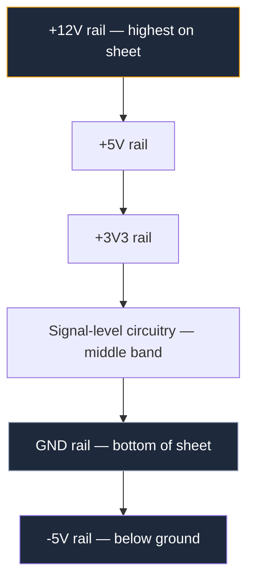
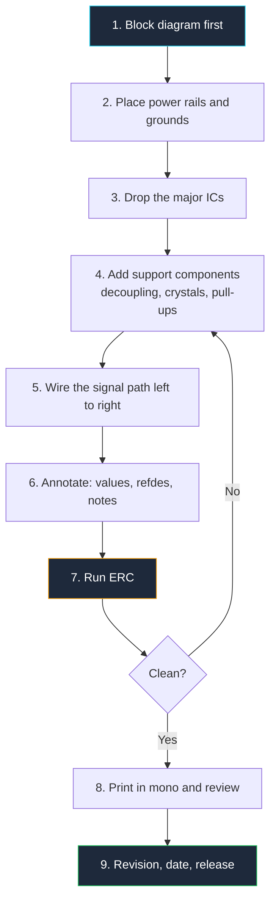

**Sirkuit diagram adalah gambar yang menjelaskan koneksi elektrik dari suatu sirkuit menggunakan simbol yang distandardisasi, bukan foto komponen.** Ini bukan peta lokasi fisik komponen, dan bukan juga foto perangkat jadi. Ini adalah bahasa — dan seperti bahasa lainnya, ia memiliki tata bahasa, dialek, dan konvensi yang diharapkan oleh pembaca berpengalaman untuk Anda ikuti.

Poin terakhir inilah yang paling sering terlewatkan oleh tutorial. Anda bisa menghafal setiap simbol dalam standar tetapi tetap menghasilkan skematik yang tidak ada yang ingin dibaca, karena desain sirkuit diagram itu 30% simbol dan 70% disiplin tata letak. Panduan ini mencakup keduanya. Selesai membaca, Anda akan tahu mengapa sinyal mengalir dari kiri ke kanan, mengapa ground berada di bagian bawah lembar, bentuk mana yang berarti "resistor" di belahan dunia mana, dan cara menyusun gambar yang dapat dipahami oleh reviewer dalam 60 detik tanpa mengajukan satu pertanyaan pun.

## Apa Sebenarnya Sirkuit Diagram Itu

Empat dokumen berbeda mendeskripsikan perangkat keras yang sama, dan mencampuradukkan mereka adalah kesalahan pemula yang paling umum. Masing-masing menjawab pertanyaan yang berbeda.

| Dokumen | Menjawab pertanyaan | Menampilkan | Penggunaan umum |
| :--- | :--- | :--- | :--- |
| **Block diagram** | Apa fungsi-fungsi utama? | Persegi berlabel dan panah | Tinjauan arsitektur, datasheet |
| **Skematik (sirkuit diagram)** | Bagaimana koneksi elektriknya? | Simbol standar, net, nilai | Desain, debugging, tinjauan |
| **Diagram kabel** | Kabel mana yang ke mana secara fisik? | Warna kabel, posisi konektor, harness | Instalasi lapangan, perbaikan otomotif |
| **Tata letak PCB** | Karena tembaga ditempatkan? | Footprint, pad, trace, layer | Manufaktur |

Skematik dioptimalkan untuk *kejelasan logis*. Diagram kabel dioptimalkan untuk *akurasi fisik*. Tata letak PCB dioptimalkan untuk *kemanufakturan dan fisika*. Ketika Anda menggambar skematik, Anda secara eksplisit diperbolehkan menempatkan komponen di mana pun gambar paling mudah dibaca, bahkan jika komponen aslinya berada di sisi papan yang berlawanan. Kebebasan itulah intinya.

Perhatikan di mana skematik berada: semua yang dihasilkan setelahnya berasal dari skematik. Netlist — file teks yang memberi tahu alat PCB pin mana terhubung ke pin mana — diekstrak langsung dari gambar Anda. Jika skematik salah, papan salah, dan tidak ada jumlah routing yang hati-hati yang bisa menyelamatkannya. Skematik adalah sumber kebenaran, itulah mengapa konvensi di bawah ini ada.

## Filosofi Menggambar Skematik

Lembaga standar mendefinisikan simbol. Mereka tidak mendefinisikan selera baik. Konvensi tata letak di bawah ini adalah aturan tak tertulis yang ditegakkan oleh review sesama, dan setiap insinyur berpengalaman menerapkannya secara otomatis. Melanggarnya membuat gambar Anda secara teknis benar tetapi secara fungsional tidak terbaca.

### Hukum 1: Sinyal Mengalir dari Kiri ke Kanan

Masukan masuk dari tepi kiri. Pemrosesan terjadi di tengah. Keluaran keluar dari tepi kanan. Ini mencerminkan arah membaca aksara Latin dan berarti reviewer dapat menelusuri desain dalam satu kali lintasan tanpa harus mundur.

Pengecualian yang sah satu-satunya adalah jalur umpan balik. Umpan balik secara definisi bergerak dari kanan ke kiri, dari keluaran kembali ke masukan, dan setiap pembaca memahami bahwa kabel yang berjalan mundur di atas penguat adalah jaringan umpan balik. Karena konvensi itu sangat kuat, Anda harus menghindari menjalankan sinyal *non-umpan balik* apa pun dari kanan ke kiri — itu akan disalahbaca.

### Hukum 2: Daya di Atas, Ground di Bawah

Sumbu vertikal lembar Anda merepresentasikan tegangan. Rel paling positif berada di paling atas, ground berada di paling bawah, dan suplai negatif berada di bawah ground. Arus, sesuai konvensi, mengalir ke bawah halaman.

Ini memberikan diagnosa gratis: jika kabel pada gambar Anda bergerak *ke atas* ke simbol ground, atau simbol suplai mengarah ke bawah, ada yang salah dalam gambar. Konvensi ini juga membuat tingkat tegangan terlihat jelas secara visual. Seorang pembaca yang melihat sekilas lembar Anda dapat melihat hierarki suplai tanpa membaca satu label pun.

> Gabungkan Hukum 1 dan Hukum 2 dan Anda mendapatkan sistem koordinat: posisi horizontal memberi tahu pembaca *di mana dalam rantai sinyal* sebuah komponen berada, dan posisi vertikal memberi tahu *potensi berapa* ia beroperasi. Setiap simbol yang Anda tempatkan harus menghormati kedua sumbu.

### Hukum 3: Satu Lembar, Satu Fungsi

Sebuah lembar skematik seharusnya memuat satu blok fungsional: suplai daya, MCU dan komponen pendukungnya, front-end analog. Ketika blok menjadi terlalu besar untuk satu lembar, pisahkan dan hubungkan lembar-lembar tersebut dengan port bernama alih-alih mengecilkan simbol dan memaksa masuk.

Ujian praktisnya adalah ukuran font. Jika Anda mengecilkan teks untuk memasukkan lebih banyak komponen pada halaman, Anda sebenarnya sudah membutuhkan lembar kedua sejak lama. Lembar dengan 40 komponen yang terbaca bersih lebih baik daripada lembar dengan 200 komponen yang membutuhkan zoom.

### Hukum 4: Skematik adalah Dokumen, Bukan Gambar

Skematik profesional memiliki **judul blok**, biasanya di sudut kanan bawah, berisi:

- Nama proyek dan papan
- Judul lembar dan nomor lembar ("3 dari 7")
- Nomor revisi dan tanggal
- Nama perancang
- Nama perusahaan

Ini lebih penting daripada kedengarannya. Skematik dicetak, dikirim melalui email, difoto di atas meja, dan ditempel ke dalam presentasi. Tanpa nomor revisi, Anda tidak dapat mengetahui apakah gambar yang ditempel pada prototipe mendeskripsikan prototipe tersebut. Skematik tanpa tanggal dan tanpa versi adalah penyebab utama dari sebagian besar penderitaan debugging perangkat keras.

### Hukum 5: Optimalkan untuk Pembaca, Bukan untuk Pembuat

Setiap jalan pintas yang menghemat waktu Anda saat menggambar akan memakan waktu orang lain saat membaca — biasanya Anda sendiri, enam bulan kemudian. Memutar simbol untuk menghindari belokan kabel, meninggalkan nilai karena "sudah jelas", menggunakan ulang nama net secara longgar: masing-masing adalah setoran kecil ke rekening utang yang selalu ditagih.

Asumsikan pembaca Anda lelah, bekerja dari cetakan hitam-putih, dan tidak familiar dengan desain. Gambarlah untuk orang tersebut.

## Dasar Menggambar Skematik: Menyiapkan Kanvas

Sebelum menempatkan satu simbol pun, siapkan kanvas dengan benar. Pengaturan ini membosankan tetapi menentukan apakah gambar Anda terlihat profesional.

**Bekerja pada grid, dan gunakan snap.** Grid skematik tradisional adalah 0,1 inci (100 mil / 2,54 mm), yang sesuai dengan pitch pin IC through-hole dan header. Setiap pin simbol dan setiap ujung kabel harus berada pada titik potong grid. Pin yang tidak pada grid adalah penyebab utama dari "kabel yang tampak terhubung tetapi tidak" — celah dua ribu inci tidak terlihat di layar dan secara elektrik fatal.

**Pilih ukuran lembar dan gunakan konsisten.** ANSI A (letter) atau ISO A4 untuk blok kecil, ANSI B/A3 untuk lembar yang lebih padat. Ukuran yang konsisten berarti skala cetak yang konsisten di seluruh dokumen.

**Pertahankan simbol dalam satu skala.** Mencampur segitiga op-amp besar dengan resistor kecil membuat gambar terlihat tidak sengaja. Kebanyakan alat menangani ini untuk Anda, tetapi akan rusak saat Anda mulai mengubah skala simbol secara manual untuk memuat semuanya.

**Biarkan ruang putih.** Arahkan sekitar 40% lembar kosong. Ruang putih yang memungkinkan mata mengikuti kabel. Skematik yang padat tidak mengesankan; mereka tidak dapat ditinjau.

**Gunakan hanya kabel ortogonal.** Segmen horizontal dan vertikal dengan sudut 90 derajat. Kabel diagonal dapat diterima dalam sketsa tangan dan tidak di tempat lain — mereka membuat simpul ambigu dan menghancurkan grid visual yang membantu pembaca memindai.

## Simbol Sirkuit Elektronik: Set Inti IEEE/ANSI

Dua standar mendominasi. **IEEE 315** (diterbitkan bersama sebagai ANSI Y32.2) adalah standar Amerika dan ini yang akan Anda lihat di datasheet AS, buku teks, dan sebagian besar material hobi. **IEC 60617** adalah standar internasional, umum di Eropa dan penerbitan akademis. Keduanya benar; mencampurnya dalam satu gambar tidak benar.

| Komponen | IEEE 315 / ANSI (Amerika) | IEC 60617 (Internasional) |
| :--- | :--- | :--- |
| **Resistor** | Zigzag dengan 3–4 puncak | Persegi terbuka polos |
| **Resistor variabel** | Zigzag dengan panah diagonal | Persegi dengan panah diagonal |
| **Induktor** | Serangkaian loop semi-bulat | Serangkaian loop, atau persegi terisi |
| **Gerbang logika** | Bentuk khas (D, lengkung, segitiga) | Persegi dengan kualifier `&`, `≥1`, `=1` |
| **Kapasitor** | Dua pelat sejajar | Dua pelat sejajar (identik) |
| **Dioda** | Segitiga ditambah garis | Segitiga ditambah garis (identik) |

Kesimpulannya: komponen pasif dan gerbang logika berbeda antar standar, sementara semikonduktor sebagian besar universal. Pilih standar yang dibaca oleh audiens Anda dan catat di judul blok jika ada keraguan. Untuk referensi visual simbol demi simbol di luar set inti yang tercakup di sini, lihat [grafik referensi simbol listrik](/blog/electrical-symbols/) kami yang khusus.

### Simbol Resistor

Resistor ANSI berupa zigzag; resistor IEC berupa persegi dengan rasio aspek sekitar 3:1. Keduanya berterminal dua dan tidak terpolarisasi, sehingga orientasi tidak memiliki makna elektrik — tetapi memiliki makna keterbacaan. Gambar resistor seri secara horizontal sepanjang jalur sinyal dan pull-up/pull-down secara vertikal, sehingga pembaca melihat topologi dari geometri saja.

| Varian | Modifikasi simbol | Makna |
| :--- | :--- | :--- |
| **Resistor tetap** | Zigzag atau persegi dasar | Pembatasan arus atau biasing tetap |
| **Potensiometer** | Panah yang menyentuh bagian tengah | Pembagi tiga terminal yang dapat diatur |
| **Rheostat** | Panah diagonal menembus badan | Resistansi dua terminal yang dapat diatur |
| **Termistor** | Badan dengan tanda `θ` atau `t°` | Resistansi tergantung suhu |
| **Fotoresistor (LDR)** | Dua panah mengarah ke dalam | Resistansi tergantung cahaya |
| **Sekring** | Garis menembus atau melingkari badan | Perlindungan arus berlebih pengorbanan |

### Simbol Kapasitor

Kapasitor adalah dua pelat sejajar yang dipisahkan oleh celah yang merepresentasikan dielektrik. Perbedaan kritisnya adalah polaritas:

- **Tidak terpolarisasi:** dua garis lurus sejajar dengan panjang sama. Keramik, film, sebagian besar decoupling. Terminal mana pun menghadap potensi mana pun.
- **Terpolarisasi (elektrolitik/tantalum):** satu garis lurus dan satu garis lengkung, dengan garis lurus menandai terminal positif, ditambah tanda `+` eksplisit. Membalik salah satunya menghasilkan ledakan, asap, atau keduanya.

Selalu gambar pelat positif mengarah ke potensi yang lebih tinggi — ke atas, ketika kapasitor berada di antara rel dan ground. Ketika reviewer memindai kapasitor blok Anda, mereka memeriksa hal itu, dan memiliki semuanya terorientasi secara konsisten membuat pemeriksaan instan.

**Kapasitor decoupling** layak mendapatkan kebiasaan tata letak khusus: gambar masing-masing tepat di sebelah pin daya IC yang dilayaninya, bukan berkerumun di sudut lembar. Skematik adalah tempat Anda mengkomunikasikan *niat* desain, dan "100 nF ini milik pin 8 dari U3" adalah niat yang dibutuhkan oleh insinyur tata letak PCB.

### Simbol Ground dan VCC

Simbol daya adalah simbol yang paling disalahgunakan pada skematik, terutama karena ada beberapa simbol ground dan mereka tidak bisa dipertukarkan.

| Simbol | Nama | Penampilan | Digunakan untuk |
| :--- | :--- | :--- | :--- |
| **Ground sinyal / umum** | Kembalikan umum | Tiga garis horizontal dengan lebar menurun | Referensi 0 V dari sirkuit Anda |
| **Ground bumi** | Pelindung bumi | Garis ke tiga bar menurun, atau trio bergaris | Ground keamanan arus utama, konduktor PE |
| **Ground sasis** | Koneksi rangka | Garis ke bar bergaris/beralis | Kembalikan bodi enclosure atau kendaraan |
| **VCC / VDD** | Suplai positif | Bar naik, panah, atau bendera berlabel | Rel positif yang memberi daya blok |
| **VEE / VSS** | Suplai negatif atau kembali | Bar turun atau bendera berlabel | Rel negatif atau rel sumber FET |

`VCC` dan `VDD` bersifat historis, bukan sewenang-wenang: **VCC** adalah suplai *kolektor* dari perangkat bipolar, **VDD** adalah suplai *drain* dari perangkat efek medan, dan **VEE**/**VSS** adalah rel emitor dan sumber yang sesuai. Gambar modern sering mengabaikan perbedaan ini, tetapi menggunakannya dengan benar menunjukkan kompetensi kepada setiap pembaca yang memperhatikan.

Aturan praktis untuk simbol daya:

1. **Jangan pernah menggambar kabel panjang ke simbol daya.** Pasang langsung, mengarah ke atas untuk suplai dan ke bawah untuk ground.
2. **Label desain multi-rel secara eksplisit.** `+3V3`, `+5V`, `+12V`, `VBAT` — bukan `VCC` generik pada setiap simbol ketika ada empat rel berbeda.
3. **Pertahankan ground terpisah tetap terpisah.** Jika desain memiliki ground analog dan digital yang terisolasi, gunakan simbol berbeda atau nama net berbeda (`AGND`, `DGND`) dan gambar titik ikatan tunggal yang disengaja di mana mereka bertemu. Menggabungkannya secara diam-diam pada skematik menjamin masalah kebisingan yang akan Anda kejar selama seminggu.
4. **Gunakan simbol daya alih-alih menggambar rel di mana-mana.** Dalam lembar padat, lusinan simbol `GND` lokal lebih mudah dibaca daripada satu kabel ground panjang yang meliuk-liuk melewati seluruh gambar.

### Simbol Semikonduktor

| Komponen | Simbol | Aturan pembacaan |
| :--- | :--- | :--- |
| **Dioda** | Segitiga mengarah ke garis | Arus konvensional mengalir sesuai arah segitiga; garis adalah katoda |
| **LED** | Dioda dengan dua panah keluar | Panah selalu mengarah menjauhi badan |
| **Dioda Zener** | Garis dengan ujung bengkok | Dioperasikan terbalik (reverse-biased), jadi sengaja mengarah "mundur" |
| **Dioda Schottky** | Garis dengan ujung berbentuk `S` | Tegangan jatuh maju rendah, pemulihan cepat |
| **Transistor NPN** | Lingkaran, garis basis, panah emitor keluar | Panah keluar = **N**ot **P**ointing i**N** |
| **Transistor PNP** | Panah emitor masuk ke basis | Panah masuk = **P**ointing i**N** |
| **MOSFET saluran N** | Gerbang bar, saluran bar, badan panah masuk | Arah panah mengidentifikasi jenis saluran |
| **MOSFET saluran P** | Badan panah keluar dari saluran | Biasanya digambar di atas beban, sumber ke rel positif |

Orientasikan transistor sehingga arus mengalir dari atas ke bawah: kolektor atau drain di atas, emitor atau sumber di bawah. Ini membuat penguat atau topologi saklar langsung dapat dikenali dan menjaga Anda konsisten dengan Hukum 2.

### Simbol IC dan Op-Amp

Sirkuit terpadu menggunakan salah satu dari dua representasi, dan memilih dengan benar adalah keputusan desain yang nyata.

**Blok persegi panjang.** Digunakan untuk mikrokontroler, memori, logika, regulator — sesuatu yang perilaku internalnya dijelaskan oleh pinnya daripada topologinya. Aturan untuk blok IC yang baik:

- **Atur pin berdasarkan fungsi, bukan berdasarkan urutan fisik.** Masukan di kiri, keluaran di kanan, daya di atas, ground di bawah. Footprint menangani geometri pin fisik; simbol ada agar mudah dibaca. Simbol DIP-8 yang mencantumkan pin 1–4 di sisi kiri semata-mata karena itu adalah pin 1–4 adalah peluang yang terbuang.
- **Label setiap pin dengan fungsinya**, dan tambahkan nomor pin dengan font lebih kecil di sebelah batas.
- **Kelompokkan pin terkait** dengan sedikit jarak antar kelompok: semua pin SPI bersama-sama, semua masukan ADC bersama-sama.
- **Tandai pin active-low** dengan overbar, awalan `n` (`nRESET`), awalan garis miring (`/RESET`), atau akhiran tanda pagar (`RESET#`). Pilih satu konvensi per proyek.
- **Pisahkan IC besar** menjadi beberapa bagian simbol — MCU 100-pin jauh lebih mudah dibaca sebagai tiga blok terpisah (inti/daya, bank GPIO A, bank GPIO B) daripada sebagai satu monolit.

**Segitiga.** Digunakan untuk op-amp dan komparator, di mana bentuknya sendiri mengkomunikasikan "penguat." Masukan inverting ditandai `−` dan masukan non-inverting `+`, puncak adalah keluaran, dan pin suplai masuk dari atas dan bawah. Anda boleh menukar masukan `+` dan `−` secara vertikal agar jaringan umpan balik lebih bersih — itu praktik standar — tetapi Anda harus memindahkan label bersamanya. Op-amp yang salah label adalah kesalahan simbol yang paling mahal dalam desain analog.

Jaringan umpan balik termasuk dalam ruang visual penguat itu sendiri: gambar resistor umpan balik tepat di atas segitiga sehingga loop jelas terlihat. Tata letak op-amp dan timer 555 terperinci, termasuk pertanyaan blok internal versus pinout, dibahas dalam [panduan sirkuit penguat dan osilator](/blog/amplifier-and-oscillator-circuits/).

## Desainator Referensi dan Nilai Komponen

Simbol tanpa desainator dan nilai hanyalah dekorasi. Desainator referensi mengikuti ASME Y14.44 (penerus IEEE 200), dan layak dihafal:

| Awalan | Komponen | Awalan | Komponen |
| :--- | :--- | :--- | :--- |
| **R** | Resistor | **U** | Sirkuit terpadu |
| **C** | Kapasitor | **Q** | Transistor |
| **L** | Induktor | **D** | Dioda, LED |
| **J** | Jack / konektor | **P** | Steker |
| **SW** | Saklar | **K** | Relay |
| **Y** | Kristal, osilator | **T** | Transformator |
| **F** | Sekring | **FB** | Ferrite bead |
| **TP** | Titik uji | **JP** | Jumper |

Nomori berurutan sesuai urutan membaca — kiri ke kanan, atas ke bawah, per lembar. Penomoran berbasis lembar (seri 100 pada lembar 1, seri 200 pada lembar 2) memungkinkan menemukan komponen apa pun secara instan pada gambar multi-lembar.

Untuk nilai, gunakan **notasi huruf-menggantikan-titik-desimal**, praktik menggambar lama yang bertahan karena tahan lama:

| Tulisan | Berarti | Alih-alih |
| :--- | :--- | :--- |
| `4k7` | 4,7 kΩ | `4.7k` |
| `R47` | 0,47 Ω | `0.47R` |
| `100n` | 100 nF | `0.1uF` |
| `1u5` | 1,5 µF | `1.5uF` |
| `2M2` | 2,2 MΩ | `2.2M` |

Alasannya sederhana: titik desimal selebar satu titik. Ia menghilang dalam faks, fotokopi, tangkapan layar terkompresi, atau cetakan resolusi rendah — dan `4.7k` yang salah baca menjadi `47k` adalah sirkuit yang rusak. Sebuah huruf tidak bisa menghilang.

Tambahkan parameter yang benar-benar membatasi komponen: rating tegangan pada elektrolitik, rating daya pada resistor di atas 1/4 W, toleransi pada komponen apa pun dalam jalur timing atau presisi, dielektrik pada keramik dalam sirkuit analog (`X7R` versus `C0G` mengubah perilaku secara signifikan). Semua lainnya termasuk dalam daftar material (bill of materials), bukan pada gambar.

## Kabel, Simpul, dan Net

Cara Anda menangani koneksi menentukan apakah gambar Anda dapat diandalkan.

**Tanda simpul adalah wajib.** Titik terisi di persimpangan kabel berarti "terhubung secara elektrik." Tanpa titik berarti "menyeberang, tidak terhubung." Setiap alat serius menempatkan ini secara otomatis, tetapi Anda harus memverifikasinya, karena simpul yang hilang adalah sirkuit terbuka yang tidak terlihat.

**Jangan pernah menggambar simpul empat arah.** Empat kabel bertemu di satu titik dengan tanda simpul adalah sah tetapi praktik yang buruk. Jika tanda simpul itu hilang — cetakan buruk, artefak JPEG, noda — gambar secara diam-diam mengubah makna dari "keempat terhubung" menjadi "dua pasang menyeberang." Sebaliknya, geser koneksi menjadi dua T-junction tiga arah dengan jarak satu langkah grid. Sekarang topologi bertahan terhadap reproduksi apa pun, dan simpul yang hilang terlihat jelas secara visual.

| Situasi | Rendering yang benar |
| :--- | :--- |
| Dua kabel terhubung | T-junction dengan titik terisi |
| Dua kabel menyeberang, tidak terhubung | Persilangan biasa, tanpa titik, tanpa lompatan |
| Empat kabel pada satu node | Dua T-junction bertangga, bukan satu titik |
| Pin sengaja tidak digunakan | Penanda no-connect `X` eksplisit |
| Koneksi jarak jauh | Label net bernama di kedua ujung |

**Gunakan label net untuk jarak jauh.** Dua kabel yang membawa label `SPI_CLK` terhubung secara elektrik bahkan pada lembar berbeda. Label net lebih baik daripada kabel panjang untuk sesuatu yang melewati lebih dari sepertiga lembar, dan membuat gambar menjadi dokumentasi mandiri. Beri nama net berdasarkan fungsinya (`MOTOR_PWM`, `VBAT_SENSE`), jangan pernah berdasarkan lokasinya.

**Gunakan bus untuk kelompok paralel.** Delapan jalur data yang digambar sebagai `D[0..7]` pada satu garis bus tebal jauh lebih bersih daripada delapan kabel paralel, dan ini adalah pendekatan standar untuk antarmuka lebar mikrokontroler dan memori.

**Tandai no-connect secara eksplisit.** `X` pada pin yang tidak digunakan memberi tahu reviewer "saya telah mempertimbangkan pin ini dan memilih membiarkannya melayang." Pin yang tidak terhubung tanpa tanda apa pun memberi tahu mereka "mungkin saya lupa pin ini." Hasil elektrik sama, hasil review sangat berbeda — dan setiap pemeriksaan aturan elektrik (ERC) akan menandai yang kedua.

## Praktik Terbaik untuk Diagram yang Bersih dan Mudah Dibaca

Daftar periksa yang dikonsolidasikan. Jalankan sebelum Anda menyatakan skematik selesai.

1. **Semua harus pada grid.** Setiap pin, setiap ujung kabel, tanpa pengecualian.
2. **Sinyal kiri ke kanan, daya atas ke bawah.** Simpan routing kanan ke kiri untuk umpan balik nyata.
3. **Hanya kabel ortogonal.** Sudut 90 derajat, tanpa diagonal.
4. **Minimalkan persilangan.** Persilangan adalah pajak kecil pada pembaca. Pindahkan simbol, putar blok, atau konversi ke label net hingga persilangan jarang terjadi.
5. **Jangan ada simpul empat arah.** Buat bertangga menjadi T-junction.
6. **Kelompokkan berdasarkan fungsi** dan berikan setiap kelompok ruang putih yang terlihat atau kotak batas berlabel.
7. **Desainator dan nilai pada setiap komponen.** Tidak bisa ditawar.
8. **Kapasitor decoupling di sebelah pinnya**, bukan berkerumun di sudut.
9. **Ukuran dan orientasi teks konsisten.** Semua label horizontal, atau paling banyak diputar satu arah yang konsisten. Teks terbalik tidak dapat diterima.
10. **Komentari yang tidak jelas.** Catatan teks yang menjelaskan *mengapa* resistor bernilai 4k7 menghemat waktu insinyur berikutnya — seringkali Anda sendiri — satu jam untuk reverse-engineering. Skematik mendukung teks bebas; gunakan.
11. **No-connect eksplisit** pada setiap pin yang sengaja tidak digunakan.
12. **Lengkapi judul blok** dengan revisi dan tanggal, setiap saat.
13. **Jalankan ERC** dan selesaikan setiap peringatan, atau beri anotasi mengapa peringatan dapat diterima.
14. **Cetak dalam hitam-putih** dan bacanya. Jika lolos, sudah selesai. Jika koneksi hanya masuk akal dalam warna, itu belum selesai.

> Tes 60 detik: serahkan skematik Anda kepada seseorang yang belum pernah melihat desain ini. Jika mereka tidak dapat mengidentifikasi masukan daya, blok pemrosesan utama, dan keluaran dalam satu menit, tata letak telah gagal terlepas dari kebenaran elektrik.

Sebagian besar cacat skematik masuk dalam daftar pendek pelanggar berulang — simpul yang hilang, nilai yang ambigu, pin melayang, standar simbol yang dicampuradukkan. Kami mengatalogkannya beserta perbaikannya dalam [10 kesalahan sirkuit diagram umum](/blog/common-circuit-diagram-mistakes/), dan rangkuman aturannya terdapat dalam panduan [praktik terbaik desain skematik](/blog/circuit-diagram-maker-best-practices/).

## Alur Kerja yang Dapat Diulang, dari Kanvas Kosong hingga Skematik yang Ditinjau

Urutan penting. Insinyur yang menempatkan komponen terlebih dahulu dan memikirkan daya kemudian berakhir dengan rel daya yang meliuk-liuk secara canggung melalui tata letak yang sudah selesai — tanda visual skematik yang terburu-buru. Tetapkan rel, lalu gantungkan sirkuit di atasnya.

Langkah 5 layak ditekankan: jalankan *jalur sinyal* terlebih dahulu, secara berurutan, sebelum menghubungkan apa pun. Jika Anda dapat menelusuri masukan ke keluaran dalam satu lintasan kiri-ke-kanan yang bersih, gambar sudah 80% terbaca. Sisanya — jaringan bias, decoupling, proteksi — menempel pada tulang punggung itu.

**[Mulai menggambar skematik Anda sendiri sekarang.](/)** Editor ini menggunakan snap grid 100 mil, menyertakan perpustakaan simbol IEEE/ANSI yang dijelaskan di atas, dan menempatkan tanda simpul secara otomatis, sehingga Anda dapat berlatih konvensi ini tanpa melawan alat. Jelajahi [perpustakaan simbol komponen](/components/) lengkap untuk melihat apa yang tersedia sebelum memulai.

## Enam Domain, Enam Set Konvensi Menggambar

Aturan di atas bersifat universal. Di atasnya, setiap keluarga sirkuit memiliki idiom tata letaknya sendiri — cara khusus insinyur berpengalaman menggambar jenis sirkuit tersebut. Enam panduan ini membahas masing-masing secara mendalam.

### 1. Gerbang Logika dan Dasar Digital

Skematik digital tentang bentuk simbol dan propagasi sinyal, bukan nilai komponen. [Panduan sirkuit diagram gerbang logika](/blog/logic-gate-circuit-diagrams/) membahas bentuk khas ANSI (D bertumpuk untuk AND, perisai lengkung untuk OR, segitiga-melembus-gelembung untuk NOT) dibandingkan persegi IEC/DIN dengan kualifier `&` dan `≥1`, lalu menghubungkannya menjadi sirkuit nyata: gerbang NOT yang dibangun dari satu transistor, gerbang XOR dan NAND dari transistor diskrit, flip-flop silang-coupled, dan penghitung biner multi-tahap termasuk penghitung decade 4017. Tata letak digital memiliki satu aturan tambahan yang layak diketahui sejak awal — masukan gerbang berada di kiri dan tidak pernah menyeberang satu sama lain, karena masukan gerbang yang bersilang adalah kesalahan yang paling sulit ditemukan dalam gambar digital.

### 2. Suplai Daya dan Konversi

Skematik daya adalah satu-satunya tempat di mana gambar harus mengkomunikasikan informasi *fisik*: isolasi, creepage, dan kapasitas arus. [Panduan desain sirkuit suplai daya](/blog/power-supply-circuit-diagrams/) membahas penggambaran batas isolasi sebagai garis vertikal yang memisahkan primer tegangan tinggi dari sekunder tegangan rendah, simbol transformator dengan konvensi titik yang benar, penyearah jembatan yang digambar sebagai berlian alih-alih empat dioda yang berserakan, penempatan kapasitor filter, dan blok regulator seri 78xx. Panduan ini juga membahas konvensi garis tebal versus tipis untuk jalur arus tinggi dalam SMPS, konverter buck, suplai tanpa transformator, dan desain dual-rel.

### 3. Penguat, Osilator, dan Timer

Skematik analog hidup atau mati pada kejelasan umpan balik. [Panduan sirkuit penguat dan osilator](/blog/amplifier-and-oscillator-circuits/) membahas kapan harus menggambar timer 555 sebagai diagram blok internal versus kotak pinout sederhana, cara menyusun resistor umpan balik sehingga loop tidak dapat disalahartikan secara visual, dan cara menggambar jaringan RC penentu frekuensi sehingga komponen timing dapat dikenali dengan sekilas. Tata letak yang dikerjakan mencakup penguat audio LM386 dan TDA2030, pembangkit gelombang sinus, op-amp monostable multivibrator, dan sirkuit penghitung serta pengukur reaksi berbasis 555.

### 4. Sensor, Penyalaan, dan Proteksi

Ini adalah batas antara dunia nyata dan mikrokontroler Anda, dan ini adalah tempat konvensi skematik paling banyak bekerja. [Panduan sirkuit sensor dan proteksi](/blog/sensor-and-protection-circuit-diagrams/) membahas penggambaran resistor pull-up dan pull-down sehingga fungsinya jelas hanya dari posisi, pembagi tegangan untuk LDR dan termistor, tahap penyalaan MOSFET, dan sirkuit debounce yang dibangun dari filter RC atau Schmitt trigger. Panduan ini juga membahas topologi proteksi — polaritas terbalik, clamp overvoltage — di mana menggambar jalur arus dengan jelas memungkinkan reviewer memverifikasi sirkuit benar-benar melindungi apa pun.

### 5. Pengukuran dan Pengujian

Infrastruktur pengujian adalah bagian yang paling jarang digambar dari kebanyakan skematik. [Panduan sirkuit pengukuran dan pengujian](/blog/measurement-test-circuit-diagrams/) membahas penempatan dan pelabelan titik uji `TP`, penggambaran resistor shunt dengan koneksi sense yang eksplisit (koneksi Kelvin adalah masalah gambar sebelum menjadi masalah elektrik), dan merepresentasikan osiloskop atau multimeter sebagai beban dalam diagram Anda. Termasuk pengujian kontinuitas, op-amp voltage follower, tahap sample-and-hold, dan voltmeter batang LM3914.

### 6. Mikrokontroler dan Sistem Tertanam

Diagram yang paling menuntut. [Panduan tata letak skematik mikrokontroler](/blog/microcontroller-circuit-diagrams/) membahas pemisahan pinout MCU besar ke beberapa bagian simbol, penggunaan notasi bus untuk merampingkan kelompok paralel, tata letak osilator kristal dengan kapasitor beban, decoupling per pin, dan pengkabelan periferal eksternal — penggerak motor H-bridge, array sensor, relay, dan tampilan. Contoh yang dikerjakan mencakup robot line-follower, proyek Raspberry Pi, dan sistem manajemen baterai.

## Memilih Perangkat Lunak Sirkuit Diagram yang Tepat

Alat yang Anda gunakan untuk menggambar sama pentingnya dengan konvensi dalam membentuk gambar. Editor skematik yang baik memaksa snap grid, menempatkan tanda simpul secara otomatis, dan menyediakan perpustakaan simbol IEEE/ANSI dan IEC yang lengkap sehingga Anda tidak perlu menggambar resistor dari awal. Yang buruk membiarkan Anda menempatkan komponen di luar grid, melupakan simpul, dan mengekspor gambar yang buram saat dicetak.

Yang perlu dievaluasi sebelum memilih alat:

| Fitur | Mengapa penting | Yang perlu dicari |
| :--- | :--- | :--- |
| **Snap grid** | Pin di luar grid menghasilkan sirkuit terbuka yang tidak terlihat | Snap 100 mil (2,54 mm) wajib, tidak bisa dinonaktifkan |
| **Perpustakaan simbol** | Menggambar simbol dari awal membuang waktu dan memperkenalkan kesalahan | Set IEEE/ANSI dan IEC termasuk, ditambah simbol kustom yang dapat diedit pengguna |
| **Manajemen simpul** | Tanda simpul yang hilang adalah cacat skematik paling umum | Auto-place pada T-junction, auto-remove saat dihapus, verifikasi visual |
| **ERC (pemeriksaan aturan elektrik)** | Menangkap kesalahan struktural sebelum review | Konflik pin, pin tidak terhubung, ketidakcocokan rel daya |
| **Format ekspor** | Skematik harus keluar dari editor pada akhirnya | SVG, PNG, PDF minimal; ekspor netlist untuk handoff PCB |
| **Kolaborasi** | Review dilakukan dalam tim | Tautan bersama, thread komentar, riwayat versi |
| **Biaya** | Keterbatasan anggaran nyata | Tingkat gratis dengan fitur lengkap, atau pembelian satu kali tanpa langganan |

Alat berbasis browser memiliki keunggulan signifikan untuk pekerjaan skematik: tanpa instalasi, berbagi instan melalui URL, dan rendering yang konsisten lintas sistem operasi. Komprominya secara historis adalah kedalaman fitur, tetapi editor web modern sekarang menyamai alat desktop untuk perpustakaan simbol, pemaksaan grid, dan kualitas ekspor yang sebenarnya dibutuhkan oleh menggambar skematik.

**[Coba Circuit Diagram Maker gratis.](/)** Tanpa instalasi, tanpa akun. Editor menyediakan perpustakaan simbol IEEE/ANSI lengkap, snap ke grid 100 mil, auto-place tanda simpul, dan mengekspor SVG, PNG, dan PDF — semua yang direkomendasikan panduan ini, dipaksa oleh alat itu sendiri.

## Format Ekspor: Mengeluarkan Skematik Anda

Skematik yang hanya hidup di dalam satu editor adalah skematik yang tidak dapat ditinjau, dicetak, disematkan dalam dokumentasi, atau diserahkan untuk tata letak PCB. Setiap sesi menggambar harus diakhiri dengan ekspor, dan format yang Anda pilih tergantung pada audiens.

| Format | Terbaik untuk | Kelebihan | Keterbatasan |
| :--- | :--- | :--- | :--- |
| **SVG** | Penyematan web, dokumentasi, penskalaan ke ukuran berapa pun | Vektor — resolusi tak terbatas, ukuran file kecil, dapat diedit di Illustrator/Inkscape | Tidak semua alat PCB mengimpor SVG langsung |
| **PNG** | Presentasi, pesan Slack/Teams, berbagi cepat | Raster dengan latar belakang transparan, tampilan universal | Bergantung resolusi; buram jika diekspor pada DPI rendah |
| **PDF** | Pencetakan, lampiran email, paket tinjauan formal | Berukuran halaman, mempertahankan layer, teks yang dapat dicari | Ukuran file besar pada lembar kompleks |
| **Netlist (JSON/CSV)** | Handoff tata letak PCB | Konektivitas yang dapat dibaca mesin, dapat diimpor oleh KiCad/Eagle/Alumium | Tidak dapat dibaca manusia; membutuhkan alat PCB untuk melihat |
| **LTSpice raw** | Simulasi | Dapat disimulasikan langsung, mempertahankan parameter komponen | Format proprietari, tidak universal |

Alur kerja praktis: ekspor SVG untuk sesuatu yang akan muncul dalam dokumentasi atau di situs web, PNG untuk berbagi instan di mana resolusi cukup, dan PDF untuk paket tinjauan formal. Selalu ekspor pada resolusi 2× atau 3× jika menggunakan PNG untuk cetakan — skematik yang tajam di layar tetapi buram di kertas telah gagal dalam tujuan utamanya.

Sebelum mengekspor, jalankan ERC sekali lagi. Skematik yang diekspor dengan peringatan yang belum diselesaikan adalah catatan permanen dari cacat yang diketahui.

## Diagram Skematik vs. Diagram Kabel: Memahami Perbedaannya

Perbedaan ini lebih sering menjebak pemula daripada konsep lain dalam dokumentasi elektronik, dan mencampuradukkannya dalam proyek nyata bisa mahal.

**Diagram skematik** (sirkuit diagram) menunjukkan bagaimana komponen terhubung *secara elektrik*. Ia menjawab pertanyaan: "Apa sirkuitnya?" Kabel adalah garis abstrak yang mungkin tidak memiliki kemiripan dengan routing fisik. Komponen ditempatkan di mana pun gambar paling mudah dibaca. Resistor mungkin muncul tepat di sebelah IC meskipun komponen aslinya berada beberapa sentimeter jauhnya di papan. Skematik adalah sumber kebenaran untuk desain, debugging, dan tinjauan.

**Diagram kabel** menunjukkan bagaimana komponen terhubung *secara fisik*. Ia menjawab pertanyaan: "Bagaimana cara saya benar-benar mengkabel ini?" Warna kabel, pinout konektor, routing harness, dan posisi fisik komponen adalah informasi yang penting. Diagram kabel adalah yang digunakan oleh teknisi lapangan untuk memasang, memecahkan masalah, atau memperbaiki sistem.

| Karakteristik | Diagram skematik | Diagram kabel |
| :--- | :--- | :--- |
| **Audiens utama** | Perancang, reviewer, debugger | Pemasang, teknisi, insinyur lapangan |
| **Representasi kabel** | Garis abstrak, panjang tidak relevan | Routing nyata, panjang dan warna penting |
| **Penempatan komponen** | Dioptimalkan untuk keterbacaan | Mencerminkan lokasi fisik |
| **Menampilkan** | Konektivitas elektrik, nilai komponen, nama net | Warna kabel, pinout konektor, jalur harness |
| **Digunakan untuk** | Desain, simulasi, tata letak PCB | Instalasi, pemeliharaan, perbaikan |
| **Simbol standar** | Simbol skematik IEEE/ANSI/IEC | Representasi pictorial, kode warna kabel |

Aturan kritis: jangan pernah menggunakan skematik di mana diagram kabel diperlukan, dan jangan pernah menggunakan diagram kabel di mana skematik diperlukan. Skematik yang diberikan kepada teknisi lapangan tidak berguna — mereka tidak dapat menentukan warna kabel atau routing darinya. Diagram kabel yang diberikan kepada insinyur tata letak PCB sama tidak bergunanya — mereka tidak dapat mengekstrak konektivitas net darinya.

Sebagian besar proyek membutuhkan keduanya. Gambar skematik terlebih dahulu (ini desainnya), lalu turunkan diagram kabel darinya untuk dokumentasi instalasi dan layanan.

## Pertanyaan yang Sering Diajukan

**Apakah sirkuit diagram sama dengan diagram skematik?**
Ya. "Sirkuit diagram," "diagram skematik," dan "skematik" digunakan secara bergantian untuk gambar yang menunjukkan koneksi elektrik menggunakan simbol standar. "Diagram kabel" *bukan* sinonim — ia menunjukkan routing kabel fisik, warna, dan posisi konektor alih-alih koneksi logis.

**Haruskah saya menggunakan simbol IEEE/ANSI atau IEC?**
Sesuaikan dengan audiens Anda. Gunakan IEEE 315/ANSI (resistor zigzag) untuk pembaca Amerika Utara, datasheet AS, dan sebagian besar material hobi dan pendidikan. Gunakan IEC 60617 (resistor persegi) untuk dokumen teknis Eropa dan internasional. Jangan pernah mencampurnya dalam satu gambar.

**Mengapa ground harus berada di bagian bawah diagram?**
Karena sumbu vertikal merepresentasikan potensi. Dengan rel paling positif di atas dan ground di bawah, arus konvensional mengalir ke bawah halaman dan hubungan tegangan menjadi terlihat hanya dari geometri. Ini juga memberikan pemeriksaan kesalahan gratis: kabel apa pun yang bergerak ke atas ke simbol ground digambar dengan salah.

**Bagaimana cara mengetahui apakah dua kabel yang bersilang terhubung?**
Cari tanda simpul terisi. Titik berarti terhubung; tanpa titik berarti bersilang tanpa koneksi. Inilah mengapa simpul empat arah adalah praktik yang buruk — makna seluruh node bergantung pada satu titik kecil yang bertahan dari reproduksi.

**Apa perbedaan antara VCC dan VDD?**
`VCC` adalah tegangan suplai kolektor, diwarisi dari sirkuit transistor bipolar. `VDD` adalah tegangan suplai drain, dari sirkuit FET dan CMOS. `VEE` dan `VSS` adalah rel emitor dan sumber yang sesuai. Banyak skematik modern menggunakannya secara longgar, tetapi dalam desain campuran perbedaan ini masih membawa informasi yang berguna.

**Apakah saya perlu menggambar kapasitor decoupling pada skematik?**
Ya, selalu, dan di sebelah pin yang dilayaninya. Decoupling adalah keputusan desain — nilai, jumlah, dan penempatan per pin daya — dan skematik adalah tempat niat itu direkam untuk insinyur tata letak. Menghilangkannya karena "semua orang tahu untuk menambahkannya" secara andal menghasilkan papan tanpa kapasitor tersebut.

**Berapa banyak komponen yang pantas ada di satu lembar?**
Tidak ada angka tetap, tetapi jika Anda mengecilkan simbol atau teks untuk memuat semuanya, Anda telah melewati batasnya. Sekitar 40–60 komponen per lembar dengan ruang putih yang cukup nyaman untuk sebagian besar pembaca. Pisahkan berdasarkan fungsi dan hubungkan lembar dengan port bernama.

**Apa itu ERC dan mengapa ini penting?**
Pemeriksaan aturan elektrik memindai skematik Anda untuk kesalahan struktural: pin tidak terhubung, keluaran yang menggerakkan keluaran, pin daya tanpa sumber, desainator duplikat. Ia menangkap sebagian besar cacat nyata dalam hitungan detik. Jalankan sebelum setiap review dan selesaikan atau beri anotasi setiap peringatan.

## Menyimpulkannya

Desain sirkuit diagram bermuara pada sejumlah kecil keputusan yang diterapkan secara konsisten. Pilih satu standar simbol dan pertahankan. Letakkan masukan di kiri dan keluaran di kanan. Letakkan suplai di atas dan ground di bawah. Gunakan snap grid, pertahankan kabel ortogonal, beri tanda simpul, hindari node empat arah, label setiap komponen, dan lengkapi judul blok. Tidak ada yang sulit. Semuanya adalah kebiasaan.

Cara tercepat untuk membangun kebiasaan itu adalah dengan menggambar. Ambil sirkuit yang sudah Anda pahami — LED dan resistor pembatas arus sudah cukup — dan gambar tiga kali: sekali sembarangan, sekali menerapkan setiap aturan dalam panduan ini, dan sekali dari ingatan sehari kemudian. Perbedaan antara gambar pertama dan kedua adalah apa yang dilihat oleh reviewer, dan yang ketiga memberi tahu Anda konvensi mana yang benar-benar melekat.

Untuk praktik langsung, [panduan langkah demi langkah membaca sirkuit diagram](/blog/how-to-read-a-circuit-diagram-step-by-step-guide/) kami menerapkan konvensi yang sama secara terbalik, yang merupakan cara tercepat untuk menginternalisasinya.

**[Mulai menggambar skematik Anda sendiri sekarang.](/)** Tanpa instalasi, tanpa akun — kanvas dengan snap grid, perpustakaan simbol IEEE/ANSI lengkap, tanda simpul otomatis, dan ekspor gambar atau netlist ketika gambar Anda siap menjadi papan.
