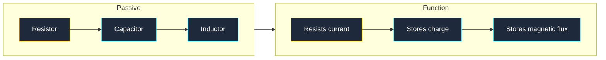
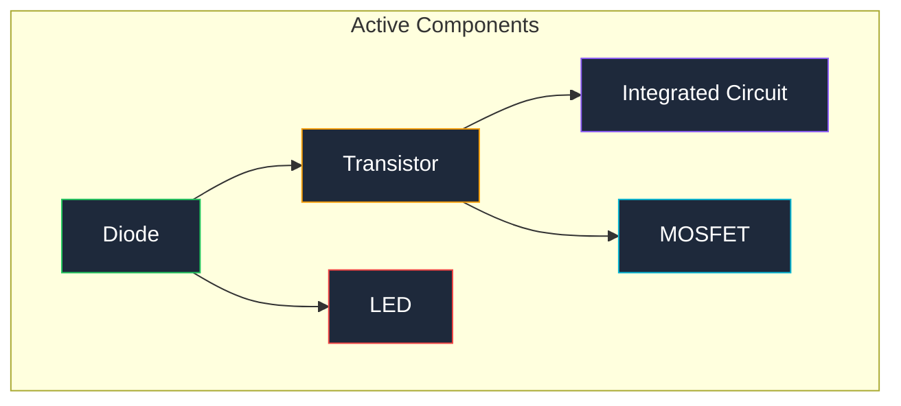
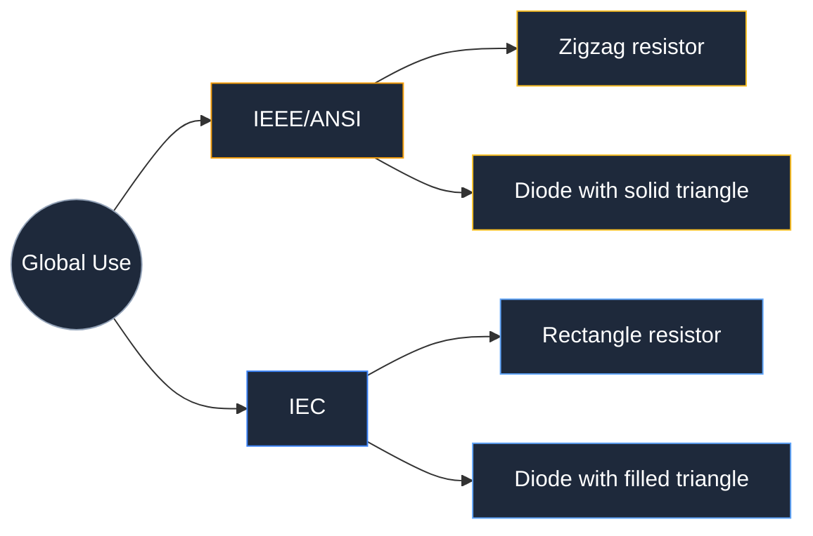

**Simbol elektronik adalah tanda grafis standar yang digunakan untuk merepresentasikan komponen individual dalam diagram sirkuit.** Setiap simbol elektronik sesuai dengan satu jenis komponen, sehingga insinyur, teknisi, dan hobiis di seluruh dunia dapat membaca dan membangun sirkuit yang sama dari gambar yang sama. Tanpa simbol-simbol ini, setiap skema sirkuit akan memerlukan foto atau gambar berlabel dari setiap bagian, yang akan membuat skema tidak terbaca dalam skala besar.

Terdapat sekitar 30 simbol elektronik inti yang mencakup 90% desain sirkuit sehari-hari. Simbol-simbol lainnya muncul dalam domain khusus seperti distribusi daya, kontrol industri, atau rekayasa RF. Panduan ini mengelompokkan setiap simbol berdasarkan kategori, menampilkan bentuk visual yang tepat untuk masing-masing, dan menjelaskan kapan menggunakannya.

## Simbol Komponen Pasif (Resistor, Kapasitor, Induktor)

Komponen pasif tidak memperkuat sinyal. Komponen pasif menahan arus, menyimpan energi dalam medan listrik, atau menyimpan energi dalam medan magnet. Setiap diagram sirkuit dimulai dengan tiga kelompok simbol ini.

### Simbol Resistor

Simbol resistor IEEE (American National Standards Institute) berupa garis zigzag dengan 3 atau 4 puncak. Simbol resistor IEC (International Electrotechnical Commission) berupa persegi panjang sederhana. Keduanya benar; wilayah menentukan mana yang akan Anda lihat.

| Varian Resistor | Bentuk Simbol | Deskripsi |
|---|---|---|
| **Resistor tetap** | Garis zigzag (IEEE) atau persegi panjang (IEC) | Komponen 2-terminal yang membatasi arus |
| **Resistor variabel** | Garis zigzag dengan panah yang menembusnya | Resistor yang nilainya berubah dengan kenop atau sekrup |
| **Potensiometer** | Zigzag dengan panah pada terminal tengah | Resistor variabel 3-terminal yang digunakan sebagai pembagi tegangan |
| **Termistor** | Zigzag dengan garis datar dan ekor seperti hoki | Resistor yang resistansinya berubah dengan suhu |
| **Fotoreistor** | Zigzag dengan dua panah yang mengarah ke dalam | Resistor yang resistansinya berubah dengan tingkat cahaya |
| **Sekring** | Garis zigzag dengan kawat yang melurus melewatinya | Perangkat keselamatan yang meleleh dan membuka sirkuit saat arus berlebih |

### Simbol Kapasitor

Simbol kapasitor menampilkan dua pelat sejajar yang dipisahkan oleh celah. Celah tersebut merepresentasikan bahan dielektrik di antara pelat.

| Varian Kapasitor | Bentuk Simbol | Deskripsi |
|---|---|---|
| **Non-polar** | Dua garis sejajar lurus dengan celah | Digunakan untuk kopling AC, penyaringan, dan pengaturan waktu |
| **Polar (elektrolitik)** | Satu garis lurus dan satu gari melengkung, dengan tanda + | Tipe polar; harus dipasang dengan polaritas yang benar |
| **Kapasitor variabel** | Dua garis sejajar dengan panah yang menembusnya | Kapasitas yang dapat diatur, umum dalam sirkuit penalaan radio |

### Simbol Induktor

Simbol induktor berupa serangkaian loop semi-bulatan yang merepresentasikan gulungan kawat. Induktor dengan garis di atas loop menunjukkan induktor dengan inti besi.

| Varian Induktor | Bentuk Simbol | Deskripsi |
|---|---|---|
| **Induktor inti udara** | 3 hingga 5 loop | Induktor tanpa bahan inti magnetik |
| **Induktor inti besi** | Loop dengan garis horizontal di atas | Induktor dengan inti besi yang meningkatkan induktansi |
| **Induktor inti ferit** | Loop dengan dua garis sejajar di atas | Induktor dengan inti ferit untuk penggunaan frekuensi tinggi |

## Simbol Komponen Aktif (Semikonduktor)

Komponen aktif memerlukan sumber daya dan dapat mengontrol atau memperkuat aliran arus. Semikonduktor membentuk kelompok terbesar simbol komponen aktif.

### Simbol Dioda

Dioda memungkinkan arus mengalir dalam satu arah saja. Simbolnya berupa segitiga yang mengarah ke garis datar. Segitiga menunjuk dari anoda (positif) ke katoda (negatif).

| Varian Dioda | Bentuk Simbol | Deskripsi |
|---|---|---|
| **Dioda standar** | Segitiga dengan garis di ujung | Katup satu arah untuk arus elektrik |
| **Dioda Zener** | Segitiga dengan garis yang memiliki ujung miring (bengkok di kedua ujung) | Dioda yang dirancang untuk menghantarkan arus balik pada tegangan breakdown tertentu |
| **Dioda Schottky** | Segitiga dengan garis berbentuk S | Dioda peralihan cepat dengan penurunan tegangan maju yang rendah |
| **LED** | Segitga dioda dengan dua panah yang mengarah ke luar | Dioda yang memancarkan cahaya saat terhubung maju |
| **Fotodioda** | Segitiga dioda dengan dua panah yang mengarah ke dalam | Dioda yang menghasilkan arus saat terkena cahaya |
| **Dioda TVS** | Dioda dengan garis bengkok di kedua ujung | Penebat tegangan transien yang menahan lonjakan tegangan |

### Simbol Transistor

Transistor beralih atau memperkuat sinyal. Terdapat dua keluarga utama: transistor sambungan bipolar (BJT) dan transistor medan-semikonduktor logam-oksida (MOSFET).

| Varian Transistor | Bentuk Simbol | Deskripsi |
|---|---|---|
| **NPN BJT** | Lingkaran dengan garis vertikal, dua garis diagonal, dan panah pada emitor yang mengarah ke luar | Saklar yang dikendalikan arus; arus basis mengontrol aliran kolektor ke emitor |
| **PNP BJT** | Lingkaran dengan garis vertikal, dua garis diagonal, dan panah pada emitor yang mengarah ke dalam | Sama seperti NPN tetapi dengan arah arus terbalik |
| **N-channel MOSFET** | Garis vertikal dengan tiga terminal (gate, drain, source) dan panah ke dalam pada substrat | Saklar yang dikendalikan tegangan dengan impedansi masukan yang sangat tinggi |
| **P-channel MOSFET** | Garis vertikal dengan tiga terminal dan panah ke luar pada substrat | Sama seperti N-channel tetapi dengan polaritas terbalik |
| **JFET (N-channel)** | Garis vertikal dengan tiga terminal dan panah ke dalam pada gate | Resistor yang dikendalikan tegangan yang digunakan dalam sirkuit analog |

### Simbol Integrated Circuit

Simbol integrated circuit (IC) berupa persegi panjang dengan label pin di setiap sisi. Simbol IC tidak menunjukkan sirkuit internal; hanya menunjukkan fungsi pin.

| Varian IC | Bentuk Simbol | Deskripsi |
|---|---|---|
| **Op-amp** | Segitiga dengan 5 pin (+in, -in, V+, V-, out) | Penguat analog yang digunakan dalam pemrosesan sinyal |
| **IC digital** | Persegi panjang dengan pin bernomor | Gerbang logika, mikrokontroler, atau chip memori |
| **Regulator tegangan** | Persegi panjang dengan 3 pin (in, out, ground) | Chip yang mempertahankan tegangan keluaran tetap |

## Simbol Sumber Daya dan Ground

Setiap sirkuit memerlukan sumber energi elektrik dan referensi ground umum. Simbol-simbol ini muncul di setiap tepi skema.

| Simbol Sumber | Bentuk Simbol | Deskripsi |
|---|---|---|
| **Sumber tegangan DC (baterai)** | Garis sejajar dengan panjang bergantian (panjang = +, pendek = -) | Sumber arus searah (DC) yang terdiri dari satu atau lebih sel |
| **Sumber tegangan AC** | Lingkaran dengan gelombang sinus di dalam | Sumber arus bolak-balik (AC) seperti jaringan listrik |
| **Ground (bumi)** | Tiga garis horizontal dengan lebar berkurang | Koneksi fisik ke ground bumi |
| **Ground chassis** | Tiga garis yang mengarah ke bawah membentuk segitiga terbalik | Chassis atau rangka logam perangkat |
| **Ground sinyal** | Segitiga terisi atau terbuka yang mengarah ke bawah | Titik referensi umum untuk pengukuran sinyal |
| **VCC / VDD** | Garis horizontal pendek dengan label di atas | Jalur suplai daya positif untuk IC |
| **VSS / GND** | Garis horizontal pendek dengan label di bawah | Jalur suplai negatif atau ground |

## Simbol Koneksi dan Sambungan

Simbol-simbol ini menunjukkan bagaimana kawat, kabel, dan terminal terhubung dalam skema. Memahami simbol-simbol ini dengan benar mencegah sirkuit pendek dan papan yang salah rangkai.

| Simbol Koneksi | Bentuk Simbol | Deskripsi |
|---|---|---|
| **Sambungan kawat (titik)** | Titik padat di persimpangan dua garis | Dua kawat disolder dan terhubung di titik ini |
| **Persilangan kawat (tanpa titik)** | Dua garis bersilang tanpa titik | Dua kawat saling menumpuk tanpa terhubung |
| **Terminal / titik uji** | Lingkaran kecil terbuka di ujung kawat | Titik koneksi untuk probe atau kabel eksternal |
| **Konektor** | Pasangan garis sejajar atau trapesium | Pasangan steker dan soket yang digunakan untuk menghubungkan kabel |
| **Sambungan (splice)** | Titik pada kawat dengan 3 atau lebih cabang | Titik di mana beberapa kawat berbagi satu node elektrik |

## Simbol Perangkat Mekanis dan Output

Simbol-simbol ini merepresentasikan komponen yang menciptakan gerakan fisik, menghasilkan suara, atau memberikan indikator visual.

| Perangkat | Bentuk Simbol | Deskripsi |
|---|---|---|
| **Saklar (SPST)** | Garis terputus dengan titik tumpu | Saklar tunggal-pole tunggal-throw ON/OFF |
| **Tombol tekan** | Garis horizontal di atas dua kontak dengan piston vertikal | Saklar kontak sementara yang menutup saat ditekan |
| **Koil relay** | Persegi panjang dengan garis diagonal menembusnya (IEC) atau loop (IEEE) | Saklar elektromekanis yang diaktifkan oleh koil |
| **Motor** | Lingkaran dengan huruf M di dalam | Perangkat yang mengubah energi elektrik menjadi gerakan rotasi |
| **Speaker** | Bentuk corong atau kerucut | Transduser yang mengubah sinyal elektrik menjadi suara |
| **Lampu** | Lingkaran dengan salib di dalam | Lampu bohlam atau lampu pijar |
| **Trafo** | Dua gulungan induktor dengan garis sejajar di antaranya | Mentransfer energi AC antar sirkuit pada level tegangan yang berbeda |
| **Sekring** | Persegi panjang dengan kawat menembusnya (IEC) atau zigzag (IEEE) | Perangkat keselamatan yang membuka sirkuit saat arus melebihi batas |

## Standar Simbol IEEE vs. IEC: Apa Bedanya?

Dua standar simbol yang dominan adalah IEEE/ANSI (American National Standards Institute) dan IEC (International Electrotechnical Commission). Simbol IEEE lebih umum di Amerika Serikat, sedangkan simbol IEC digunakan di seluruh Eropa dan sebagian besar dunia lainnya.

Perbedaan visual terbesar antara IEEE dan IEC adalah pada resistor, ground, dan dioda.

| Komponen | Simbol IEEE/ANSI | Simbol IEC | Perbedaan Utama |
|---|---|---|---|
| **Resistor** | Garis zigzag | Persegi panjang | Zigzag vs. kotak |
| **Ground (bumi)** | Tiga garis horizontal | Satu garis horizontal dengan garis vertikal | Lebih detail vs. disederhanakan |
| **Dioda** | Segitiga terbuka mengarah ke garis | Segitiga terisi mengarah ke garis | Terbuka vs. segitiga padat |
| **Koil relay** | Loop (seperti induktor) | Persegi panjang dengan garis diagonal | Representasi koil vs. kotak |
| **Sekring** | Garis zigzag dengan kawat menembus | Persegi panjang dengan kawat menembus | Zigzag vs. kotak |

Kedua standar tidak ada yang "lebih baik." Pilih standar yang sesuai dengan audiens Anda dan gunakan secara konsisten di seluruh skema. Menggabungkan simbol dari kedua standar dalam satu lembar akan membingungkan pembaca.

## Referensi Desainator Komponen (R1, C1, U1, D1)

Setiap simbol elektronik pada skema memiliki desainator referensi yang menghubungkan simbol ke daftar komponen. Desainator menggunakan awalan huruf diikuti dengan nomor berurutan.

| Awalan | Jenis Komponen | Contoh |
|---|---|---|
| **R** | Resistor | R1, R2, R14 |
| **C** | Kapasitor | C1, C2, C10 |
| **L** | Induktor | L1, L2 |
| **D** | Dioda atau LED | D1, D2 |
| **Q** | Transistor | Q1, Q2 |
| **U** | Integrated circuit | U1, U2 |
| **J** | Konektor atau jack | J1, J2 |
| **SW** | Saklar | SW1, SW2 |
| **K** | Relay | K1 |
| **F** | Sekring | F1 |
| **T** | Trafo | T1 |
| **X** | Osilator kristal | X1 |
| **Y** | Osilator kristal (alternatif) | Y1 |

Saat membaca skema, desainator referensi menghubungkan setiap simbol elektronik ke entri yang sesuai dalam daftar komponen (BOM). R1 pada skema sesuai dengan R1 dalam BOM, yang mencantumkan nomor komponen yang tepat, nilai, dan toleransi.

## Cara Menggambar Simbol Elektronik dalam Diagram Sirkuit

Menggambar simbol elektronik dengan akurat sangat penting. Zigzag yang tidak tertutup dengan benar dapat disalahartikan sebagai sekring. Titik yang hilang pada persimpangan dapat mengubah node yang terhubung menjadi sirkuit terbuka.

Lima aturan menghasilkan skema yang bersih dan mudah dibaca.

1. Gunakan ketebalan garis yang konsisten untuk semua simbol pada lembar yang sama
2. Gambar setiap resistor sebagai zigzag 4 puncak (IEEE) atau persegi panjang yang bersih (IEC) tanpa celah
3. Tempatkan titik di setiap persimpangan di mana 3 kawat atau lebih bertemu
4. Beri label setiap desainator referensi di samping simbolnya, bukan di dalamnya
5. Pertahankan jarak yang seragam antara kawat sejajar minimal 3 mm di layar

Anda dapat menggambar setiap simbol elektronik yang terdaftar di sini dalam hitungan detik dengan [circuit diagram maker](https://www.circuitdiagrammaker.com/). Editor menggunakan standar IEEE/ANSI secara default dan memungkinkan Anda menempatkan setiap simbol dengan satu klik.

## Kesalahan Simbol Elektronik Umum yang Harus Dihindari

Lima kesalahan muncul berulang kali dalam skema siswa dan hobiis. Masing-masing menyebabkan kegagalan pembangunan nyata.

1. Bingung dengan panah transistor NPN dan PNP: panah NPN mengarah ke luar (tidak mengarah ke dalam), panah PNP mengarah ke dalam
2. Menghilangkan tanda orientasi dioda: tanpa garis, simbol terlihat seperti kawat
3. Menukar polaritas kapasitor elektrolitik: pelat melengkung selalu merupakan terminal negatif
4. Menggambar simbol ground di setiap pin yang terhubung ke ground daripada menggunakan label net: ini membuat skema berantakan dengan kawat yang berlebihan
5. Lupa menambahkan titik pada persimpangan: dua kawat yang bersilang tanpa titik tidak terhubung, yang menyebabkan sirkuit terbuka selama perakitan

## Pertanyaan yang Sering Diajukan

**Apa simbol elektronik yang paling umum dalam diagram sirkuit?**

Simbol ground (GND) adalah simbol elektronik yang paling umum. Simbol ini muncul setidaknya sekali dalam setiap skema dan sering kali beberapa kali. Ground menyediakan referensi 0V yang menjadi patokan semua tegangan lainnya. Tanpa simbol ground, skema tidak memiliki titik referensi dan sirkuit tidak dapat berfungsi sebagaimana mestinya.

**Berapa banyak simbol elektronik yang perlu saya ketahui untuk membaca sebagian besar skema?**

Sekitar 30 simbol inti mencakup 90% skema sirkuit sehari-hari. 10 simbol yang paling kritis adalah resistor, kapasitor, induktor, dioda, LED, transistor NPN, MOSFET, op-amp, saklar, dan ground. Setelah Anda mengenali 10 simbol tersebut, Anda dapat menelusuri jalur sinyal melalui sebagian besar sirkuit pemula dan menengah.

**Apa arti R1 pada diagram sirkuit?**

R1 adalah desainator referensi. Huruf R mengidentifikasi komponen sebagai resistor, dan angka 1 membedakannya dari resistor lainnya (R2, R3, dan seterusnya). Pola yang sama berlaku untuk setiap jenis komponen: C1 adalah kapasitor pertama, U1 adalah integrated circuit pertama, D1 adalah dioda pertama, dan seterusnya.

**Mengapa simbol resistor terlihat berbeda dalam skema AS dan Eropa?**

AS menggunakan standar IEEE/ANSI, yang merepresentasikan resistor sebagai garis zigzag. Eropa menggunakan standar IEC, yang merepresentasikan resistor sebagai persegi panjang sederhana. Kedua simbol memiliki arti komponen yang sama. Wilayah dan standar gambar menentukan bentuk mana yang akan Anda temui.

**Bagaimana saya mengetahui arah orientasi dioda dalam sirkuit?**

Segitiga dalam simbol dioda menunjuk ke arah aliran arus konvensional. Garis datar di ujung segitiga menandai katoda (terminal negatif). Arus mengalir dari anoda (alas segitiga) melalui dioda dan keluar melalui katoda (sisi garis). Dalam skema, anoda terhubung ke suplai positif dan katoda terhubung ke ground atau beban.

## Kesimpulan dan Langkah Selanjutnya

Panduan ini mencakup setiap kelompok simbol elektronik utama: komponen pasif (resistor, kapasitor, induktor), komponen aktif (dioda, transistor, IC), sumber daya dan ground, tanda koneksi dan sambungan, serta perangkat mekanis dan output. Anda juga mempelajari perbedaan utama antara standar IEEE dan IEC dan bagaimana desainator referensi menghubungkan simbol ke komponen nyata.

Untuk menerapkan simbol-simbol ini secara praktis, buka [online circuit diagram maker](https://www.circuitdiagrammaker.com/) dan tempatkan 10 simbol paling umum pada skema kosong. Bangun sirkuit LED sederhana dengan resistor, saklar, dan simbol baterai. Telusuri jalur arus dari jalur positif melalui setiap simbol ke ground. Latihan tersebut memperkuat setiap kelompok simbol dalam panduan ini.

Untuk penjelajahan lebih mendalam tentang membaca skema lengkap, lihat panduan kami tentang [cara membaca diagram sirkuit](/blog/how-to-read-a-circuit-diagram-step-by-step-guide/). Saat Anda siap membangun proyek nyata pertama Anda, gambar skemanya di [circuit diagram editor](/editor/) dan ekspor sebagai gambar atau netlist untuk breadboard Anda.
