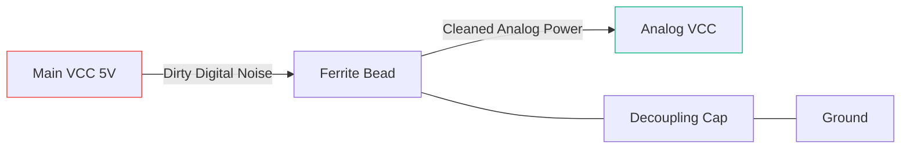

Elektronik digital berkecepatan tinggi menghasilkan banyak kebisingan elektromagnetik. Tanpa mitigasi, interferensi frekuensi tinggi ini merembes ke saluran analog yang sensitif atau menyebar ke luar, menyebabkan perangkat Anda gagal dalam pengujian emisi FCC.

Senjata utama melawan gangguan ini adalah **ferrite bead**. Memahami simbol skema dan penempatannya menentukan apakah sirkuit Anda beroperasi dengan bersih atau tenggelam dalam kebisingannya sendiri.

## 1. Memvisualisasikan Simbol Manik Ferit

Manik ferit beroperasi secara inheren seperti induktor yang sangat merugi. Oleh karena itu, simbol skematiknya berkaitan erat dengan simbol induktor standar, namun disesuaikan untuk menekankan peran spesifiknya.

```mermaid
graph LR
    A[Inductor Basis] --> B(Standard Inductor Symbol)
    A --> C(Rectangle Over Wire)
    B -.-> D(Addition of a dashed line or solid bar)
    D --> E[IEEE Ferrite Symbol]
    C --> F[IEC Ferrite Symbol]
    
    style E fill:#0f172a,stroke:#3b82f6
    style F fill:#0f172a,stroke:#10b981
```

| Sifat | Standar IEEE/ANSI | Standar IEC | Catatan |
| :--- | :--- | :--- | :--- |
| **Bentuk** | Rangkaian setengah lingkaran dengan palang/kotak | Balok persegi panjang padat | Hasil yang identik secara fungsional |
| **Awalan Penunjuk** | `FB` | `FB` atau `L` | Sangat disarankan untuk menggunakan `FB` untuk mencegah kebingungan dengan induktor daya |
| **Satuan Pengukuran** | Ohm (Ω) pada MHz tertentu | Ohm (Ω) pada MHz tertentu | Berbeda dengan induktor yang diukur dalam Henries (H) |

> **Perbedaan Penting:** Jangan pernah menilai manik ferit berdasarkan induktansi. Manik-manik ferit ditentukan berdasarkan **impedansinya (dalam Ohm) pada frekuensi tertentu** (biasanya 100 MHz).

## 2. Mekanisme Operasional Inti

Mengapa menggunakan manik ferit dan bukan induktor standar?

* **Induktor** menyimpan energi dan mengembalikannya ke sirkuit. Ini sangat reaktif dan menghemat energi.
* **Manik ferit** dirancang secara aktif untuk menjadi *lossy*. Pada frekuensi tinggi, ia berperilaku seperti resistor, mengubah kebisingan frekuensi tinggi yang tidak diinginkan secara langsung menjadi panas.

| Rentang Frekuensi | Perilaku Manik Ferit | Hasil di Sirkuit |
| :--- | :--- | :--- |
| **Frekuensi Rendah / DC** | Di bawah 1 MHz | Bertindak seperti kawat sederhana (~0 Ω). Daya DC mengalir dengan bebas. |
| **Frekuensi Resonansi** | Sangat Reaktif | Menyimpan energi secara singkat. |
| **Frekuensi Tinggi** | Lebih dari 50 MHz+ | Bertindak seperti resistor bernilai tinggi. Memblokir dan menghilangkan kebisingan RF sebagai panas. |

## 3. Praktik Terbaik untuk Penempatan Skema

Memanfaatkan simbol FB dengan baik memerlukan penempatan yang strategis. Menamparkan manik-manik ferit secara acak pada skema sebenarnya dapat memperburuk dering dan resonansi.

### Memisahkan Catu Daya (Pi-Filter)

Penggunaan paling umum untuk simbol `FB` adalah mengisolasi daya digital kotor dari daya analog bersih.

Dalam konfigurasi di atas (bagian dari Pi-Filter), manik ferit memblokir transien frekuensi tinggi agar tidak memasuki saluran AVCC, sementara kapasitor membuang sisa riak ke tanah.

### Penekanan EMI Jalur Data

Saat merutekan kabel data USB panjang atau jejak HDMI, simbol `FB` sering kali ditempatkan secara seri di dekat konektor. Hal ini memastikan bahwa kabel panjang yang terbuka secara fisik tidak berfungsi sebagai antena dan memancarkan kebisingan CPU ke seluruh ruangan.

Untuk menambahkan manik ferit ke skema berikutnya, buka **[Editor Diagram Sirkuit](/editor/)**, cari "Ferrite", dan tentukan peringkat impedansi Anda!