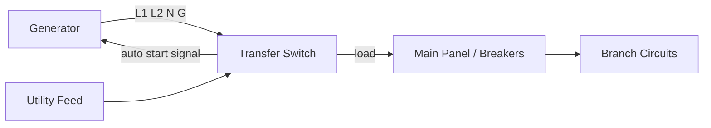
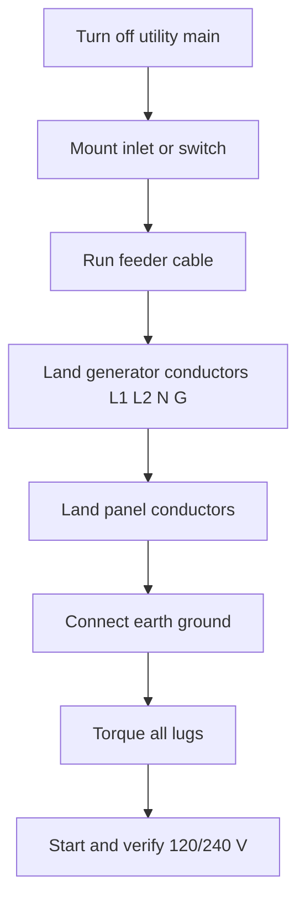
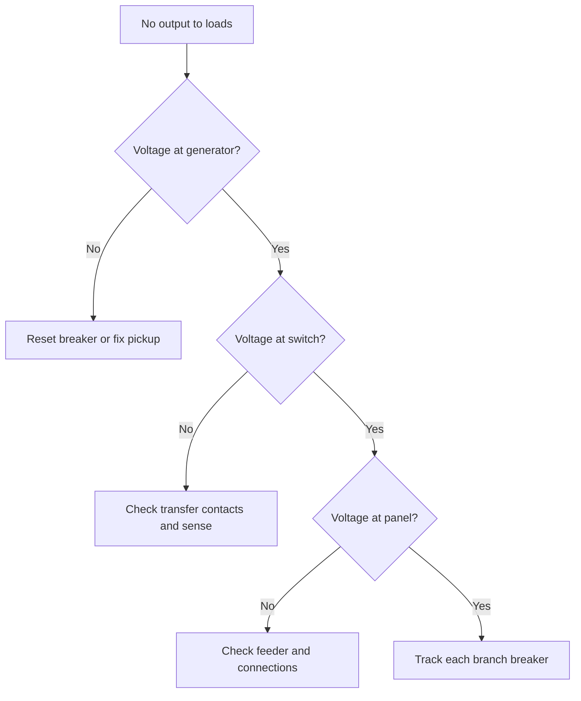

## Pengenalan Diagram Kabel Generator

**<b>Diagram kabel generator adalah skema elektrik yang menunjukkan cara generator terhubung ke saklar transfer, panel pemutus arus, dan beban yang dilayani generator.</b> Gambar ini memetakan setiap konduktor, terminal, saklar, dan pemutus arus pada jalur daya dari output generator ke sirkuit yang diberi daya.

Diagram kabel generator membimbing 3 pekerjaan: instalasi generator, pemeliharaan terjadwal, dan diagnosis gangguan. Diagram yang akurat menunjukkan titik pendaratan yang benar untuk setiap kabel sehingga orang yang mengkabeli unit tidak pernah menebak.

Ada 3 manfaat utama menggunakan diagram yang akurat:

1. Mengkonfirmasi koneksi yang benar untuk setiap konduktor sebelum mengalirkan arus
2. Mencegah backfeeding, gangguan yang mengalirkan arus ke jaringan utilitas selama pemadaman
3. Mengurangi waktu pemecahan masalah ketika sirkuit tidak memiliki daya

Diagram ini memiliki 4 kegunaan utama: instalasi generator siaga, pemasangan generator portabel, kabel saklar transfer, dan distribusi daya ke sirkuit cabang. Komponen intinya adalah saklar transfer otomatis (ATS), pemutus arus sirkuit, kit interlock, kotak masuk generator, dan koneksi ground dan neutral.

## Komponen Inti Kabel Generator

**<b>Lima komponen inti membawa jalur daya pada sistem generator rumah: saklar transfer, pemutus arus utama, kit interlock, kotak masuk, dan ikatan ground dan neutral.</b>**

<table>
  <thead>
    <tr><th>Component</th><th>Function in the wiring process</th></tr>
  </thead>
  <tbody>
    <tr>
      <td><strong>Automatic transfer switch (ATS)</strong></td>
      <td>Mendeteksi kehilangan daya utilitas, menyalakan generator, dan mentransfer beban ke suplai generator.</td>
    </tr>
    <tr>
      <td><strong>Main circuit breaker</strong></td>
      <td>Mematikan panel untuk perawatan dan melindungi sirkuit cabang dari beban berlebih.</td>
    </tr>
    <tr>
      <td><strong>Interlock kit</strong></td>
      <td>Penutup mekanis yang mencegah pemutus arus utama utilitas dan pemutus generator menutup pada saat bersamaan.</td>
    </tr>
    <tr>
      <td><strong>Generator inlet box</strong></td>
      <td>Soket tahan cuaca di dinding luar tempat kabel generator masuk.</td>
    </tr>
    <tr>
      <td><strong>Ground and neutral bond</strong></td>
      <td>Tiang tanah dan ikatan yang menjaga stabilitas sistem dan membawa arus gangguan dengan aman ke tanah.</td>
    </tr>
  </tbody>
</table>

Komponen berubah sesuai jenis generator. Generator portabel mendukung panel kecil melalui kotak masuk 30-amp (A) dan interlock. Generator siaga yang dipasang permanen dipasangkan dengan ATS 200 A dan pemutus arus bertaraf transfer sendiri. Diagram kabel menandai rating setiap unit sehingga pemasang memilih ukuran pemutus dan ukuran kabel yang sesuai.

## Instruksi Pengekabelan Langkah demi Langkah

Untuk mengkabeli generator, siapkan 8 alat dan peralatan keselamatan: multimeter, obeng berisolasi, pengupas kabel, pengupas kabel, kunci torsi, tangga, kacamata keselamatan, dan sarung tangan kerja. Baca diagram lengkap sebelum menyentuh panel.

Ikuti panduan pengekabelan langkah demi langkah ini untuk pemasangan saklar transfer:

1. Matikan pemutus arus utama utilitas dan verifikasi panel mati dengan multimeter
2. Pasang kotak masuk atau saklar transfer di dinding pada lokasi yang tercantum
3. Jalankan kabel feeder antara kotak masuk generator dan panel
4. Pasang konduktor generator pada kotak masuk: L1, L2, neutral (N), dan ground (G)
5. Pasang konduktor beban pada saklar transfer atau pemutus berinterlock
6. Hubungkan tiang ground tanah ke ground bar
7. Kencangkan setiap lug sesuai spesifikasi pabrikan
8. Nyalakan generator dan konfirmasi 120/240 V antara fase yang benar dengan pengecekan live

Hindari 5 kesalahan instalasi umum ini:

1. Melewatkan interlock, dan daya generator mengalir ke jaringan utilitas
2. Membalik L1 dan L2, dan peralatan 240 V melihat fase yang salah
3. Membiarkan neutral mengambang, dan perangkat ground-fault berperilaku tidak benar
4. Menggunakan kabel berukuran terlalu kecil, dan sirkuit memanas pada beban penuh
5. Menggunakan kabel jack ganda, dan terminal hidup terekspos di satu ujung

Pilih metode pengekabelan yang tepat sesuai jenis generator. Generator portabel dipasangkan dengan kotak masuk berinterlock; generator siaga memerlukan ATS. Sesuaikan rating interlock atau ATS dengan pemutus feeder generator.

## Pemecahan Masalah Masalah Kabel Umum

Ada 6 masalah kabel generator umum dengan gejala yang dapat diidentifikasi:

| Issue | Symptom | First check |
| :--- | :--- | :--- |
| Pemutus arus generator trip | Generator menyala, tidak ada output | Atur ulang pemutus arus, kurangi beban |
| Koneksi neutral terbuka | Lampu redup dan berdengung | Ukur 120 V dari L1 ke N dan L2 ke N |
| Fase terbalik | Peralatan baru gagal pada 240 V | Konfirmasi urutan L1 dan L2 di panel |
| Ground longgar | Setrum saat menyentuh peralatan | Periksa kontinuitas dari chassis ke tiang tanah |
| Feeder berukuran kecil | Kabel hangus dan penurunan tegangan pada beban | Bandingkan ukuran kabel dengan rating pemutus |
| ATS tidak menyala | Tidak ada transfer selama pemadaman | Verifikasi sirkuit sensing dan sumber baterai/pengisian |

Gunakan proses pengukuran untuk setiap gangguan:

1. Ukur tegangan pada output generator terlebih dahulu; harapkan 120/240 V tanpa beban
2. Ukur pada sisi beban saklar transfer berikutnya
3. Periksa kontinuitas pada setiap konduktor ground dan neutral
4. Isolasi setiap cabang dengan membuka pemutus arus hingga gangguan hilang, jika diduga beban berlebih cabang

Hubungi tukang listrik berlisensi ketika panel bertegangan, ketika gangguan berlanjut setelah pemeriksaan ini, atau ketika pintu masuk servis harus dibuka. Pekerjaan sisi jalur pada meter utilitas dan konduktor suplai adalah tanggung jawab profesional.

## Langkah Keselamatan Saat Mengkabeli Generator

Pengekabelan generator memiliki 4 bahaya: keracunan karbon monoksida (CO), sengatan listrik, backfeed ke jaringan utilitas, dan kebakaran dari sirkuit yang kelebihan beban.

Ikuti 10 langkah keselamatan ini:

1. Jalankan generator di luar ruangan setidaknya 6 meter (20 kaki) dari jendela, pintu, dan ventilasi
2. Pasang alarm karbon monoksida di dalam gedung sebelum menggunakan generator apa pun
3. Matikan pemutus arus utama utilitas dan verifikasi tegangan nol sebelum menyentuh panel
4. Gunakan interlock atau saklar transfer sehingga daya generator tidak pernah mengalir ke jaringan
5. Gunakan sarung tangan kering, kacamata keselamatan, dan alas kaki non-konduktif
6. Berdiri dalam kondisi kering dan jaga generator serta panel tetap kering dalam cuaca hujan
7. Gunakan kabel ekstensi yang dirating untuk arus penuh generator
8. Ground generator sesuai instruksi pabrikan
9. Matikan generator sebelum mengisi bahan bakar dan biarkan mesin mendingin
10. Simpan alat pemadam api yang dirating di dekat instalasi generator

**<b>Jangan pernah menjalankan generator di area tertutup dan jangan pernah mencolokkan generator ke stopkontak dinding.</b> Kedua praktik ini menyebabkan penumpukan CO dan backfeeding, dan masing-masing bisa berakibat fatal.

Prosedur darurat: matikan generator dan putuskan hubungannya jika Anda mencium bau kabel terbakar, melihat asap, atau merasakan kesemutan dari bagian logam mana pun. Buka pemutus arus utama jika terjadi gangguan konduktor, dan hubungi tukang listrik berlisensi. Untuk paparan CO, keluar dari gedung, pindah ke udara segar, dan hubungi layanan darurat.

## Bantuan Visual dan Diagram

Tata letak kabel di bagian atas panduan ini menunjukkan jalur 4 fase dari output generator ke beban cabang. Lembar komponen di atas daftar langkah mengidentifikasi setiap bagian dalam rantai distribusi daya.

Baca diagram generator dengan mengikuti 4 petunjuk:

1. Lacak konduktor output generator (L1, L2, N, G) ke saklar terlebih dahulu
2. Temukan jalur kembali neutral dan jalur ground yang terpisah
3. Catat setiap rating pemutus arus yang tercetak pada diagram
4. Periksa posisi saklar transfer untuk posisi utilitas dan generator

| Line | Conventional color | Function |
| :--- | :--- | :--- |
| L1 | Black | Phase A, 120 V ke neutral |
| L2 | Red | Phase B, 120 V ke neutral |
| N | White | Kembali neutral |
| G | Green or bare | Ground peralatan |

Gunakan lembar referensi ini saat berdiri di samping panel selama pekerjaan. Buat salinan pribadi tata letak kabel di editor browser sebelum memotong kabel: [buka editor sirkuit](/editor/).

## FAQ Tentang Kabel Generator

**Bolehkah saya mencolokkan generator ke stopkontak dinding?**

Tidak. Mencolokkan generator ke stopkontak dinding melakukan backfeed daya ke jalur utilitas, mengalirkan panel dari sisi yang salah, dan berisiko sengatan listrik untuk kru utilitas.

**Apakah saya memerlukan saklar transfer otomatis (ATS)?**

Hanya generator siaga yang memerlukan ATS untuk start tanpa pengawasan. Generator portabel dengan pemutus berinterlock memberikan transfer manual yang aman dengan biaya lebih rendah.

**Berapa ukuran generator yang saya butuhkan?**

Jumlahkan daya watt berjalan dari sirkuit yang ingin Anda beri daya dan sisakan sekitar 20% cadangan di atas total. Unit 3.000 watt (W) mencakup lampu, kulkas, dan pengisi daya ponsel; unit 7.500 W mencakup hal-hal tersebut ditambah pompa sumur dan blower tungku.

**Bolehkah saya menjalankan generator dengan kabel ekstensi?**

Ya, untuk beban portabel kecil. Gunakan kabel yang dirating untuk arus penuh generator dan jaga generator tetap kering di luar ruangan. Kabel ekstensi tidak melindungi sirkuit hardwired selama pemadaman listrik.

**Apakah saya perlu meng-ground generator portabel?**

Ground generator sesuai manual generator. Pengaturan ikatan neutral-ground pada unit mempengaruhi cara koneksi ke saklar transfer dan panel.

**Apakah saya memerlukan izin atau inspeksi?**

Banyak area memerlukan izin dan inspeksi untuk koneksi generator permanen. Periksa kode kelistrikan lokal, konfirmasi ikatan neutral-ground sesuai manual, dan kirimkan pertanyaan kabel ke tukang listrik Anda.

Tambahkan pertanyaan di kolom komentar, dan tim akan menjawab topik kabel generator baru di panduan berikutnya.
