Membangun inverter daya—mengubah aki mobil 12V menjadi arus bolak-balik 220V yang mampu menjalankan peralatan rumah tangga—adalah sebuah ritual bagi para insinyur elektronik.

Sebelum mengangkat besi solder, Anda harus mencapai pemahaman yang sempurna tentang skema yang mendasarinya. Sirkuit tegangan tinggi tidak kenal ampun, dan diagram yang digambar dengan buruk menjamin MOSFET terbakar atau sengatan listrik yang parah. Panduan ini menguraikan arsitektur dasar inverter gelombang persegi.

> **Peringatan Keselamatan:** Daya AC 220V mematikan. Artikel ini merupakan eksplorasi logika skematik dan desain teoretis, bukan cetak biru manufaktur. Jangan pernah membangun sirkuit tegangan tinggi tanpa pelatihan kelistrikan tingkat lanjut.

## Arsitektur Tiga Pilar

Tidak peduli betapa rumitnya inverter modern, skema selalu dapat dibagi secara visual dan logis menjadi tiga blok fungsional yang berbeda.

```mermaid
flowchart LR
    DC_SRC[(12V DC Battery)] --> OSC[1. Oscillator Block]
    OSC -- Low Power Square Wave --> AMP[2. Power Switch Block]
    AMP -- High Current 12V Wave --> TX[3. Step-Up Transformer]
    TX -- Magnetic Induction --> AC_OUT((220V AC Output))
    
    style OSC fill:#0f172a,stroke:#3b82f6
    style AMP fill:#0f172a,stroke:#f59e0b
    style TX fill:#0f172a,stroke:#ef4444
```

### Tahap 1: Osilator (Otak)

Arus Searah (DC) dari baterai mengalir dalam garis lurus. Transformator tidak dapat bergerak dalam garis lurus; mereka membutuhkan medan magnet yang berfluktuasi. Oleh karena itu, kita harus mengubah DC menjadi gelombang AC buatan (biasanya 50Hz atau 60Hz tergantung wilayah geografis).

| Komponen yang Digunakan | Peran Skema | Mengapa Dipilih |
| :--- | :--- | :--- |
| **Pengatur Waktu IC CD4047 / 555** | Multivibrator Astabil | Menghasilkan gelombang persegi yang sangat stabil melalui penghitungan konstanta waktu RC. |
| **Jaringan Resistor & Kapasitor** | Kalibrator waktu | Nilai (misalnya, `R=100kΩ`, `C=0,1μF`) secara unik menentukan frekuensi 50Hz yang tepat. |

### Tahap 2: Saklar Daya (Otot)

Chip logika menghasilkan gelombang 50Hz murni, tetapi pada batas arus yang sangat rendah (seringkali di bawah 20mA). Jika Anda memasukkannya ke dalam transformator, itu tidak akan menghasilkan fluks magnet yang cukup untuk menjalankan bola lampu.

Kami menempatkan transistor berdaya tinggi di antara osilator dan kumparan transformator.

1. Sinyal lemah osilator mengenai **Gerbang** MOSFET N-Channel yang besar (seperti IRF3205).
2. MOSFET bertindak sebagai relay tugas berat elektronik.
3. Ia dengan cepat mengalihkan arus listrik yang sangat besar dari baterai 12V langsung melalui kumparan transformator 50 kali per detik.

### Tahap 3: Transformator Step-Up

Pada titik skema ini, kita memiliki arus 12V dalam jumlah besar yang berdenyut bolak-balik. Tahap terakhir memerlukan routing ini melalui kumparan primer transformator.

| Fitur | Detail Skema | Implikasi Dunia Nyata |
| :--- | :--- | :--- |
| **Kumparan Primer (Kiri)** | Konfigurasi ketukan tengah (`12V - 0 - 12V`) | Memungkinkan peralihan dorong-tarik bolak-balik dari dua MOSFET bergantian. |
| **Garis Inti** | Dua garis padat digambar vertikal | Merupakan inti besi/ferit yang diperlukan untuk induksi magnetik efisiensi tinggi. |
| **Kumparan Sekunder (Kanan)** | Rasio belitan meningkat secara besar-besaran | Fisika meningkatkan fluks magnet 12V yang berdenyut menjadi gelombang 220V yang mematikan dan mudah menguap. |

## Pertimbangan Menggambar

Saat menggunakan **[Editor Diagram Sirkuit](/editor/)** untuk menyusun desain ini, ingatlah praktik terbaik tata letak:

* Gambarkan garis berat yang membawa arus Baterai 12V lebih tebal dari garis osilator berdaya rendah.
* Ground pin Sumber MOSFET secara eksplisit dan unik; jangan mengarahkannya kembali ke dekat ground osilator sensitif untuk mencegah gangguan kebisingan.
* Gambarkan output 220V secara grafis! Tempatkan label peringatan dan port keluaran (seperti simbol soket) daripada membiarkan kabel telanjang berakhir di ruang kosong.