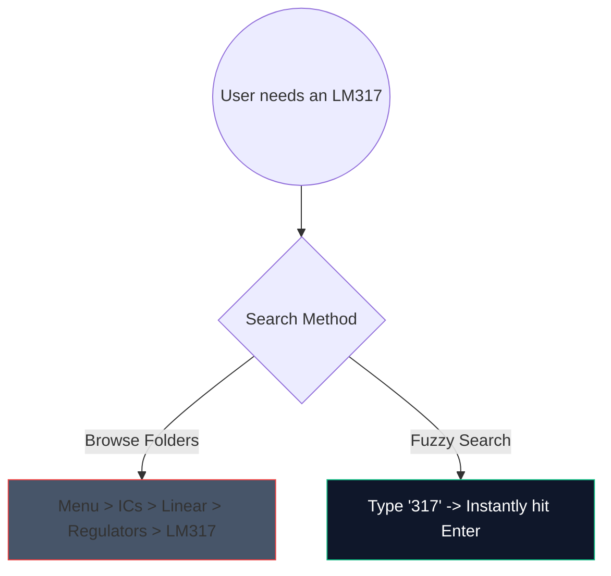

Hari-hari mengunduh perangkat lunak desktop 2 gigabyte yang berat hanya untuk membuat sketsa rangkaian amplifier sederhana sudah berakhir. CAD (Computer-Aided Design) berbasis browser telah hadir dan sangat cepat.

Inilah tepatnya bagaimana Anda dapat memanfaatkan alat web modern untuk menghasilkan skema berkualitas produksi dalam waktu kurang dari 5 menit.

## Mengapa Desain Sirkuit Berbasis Browser?

Jika Anda seorang pendidik, pelajar, atau penghobi menulis dokumentasi, kecepatan dan aksesibilitas mengalahkan fitur-fitur mentah.

```mermaid
flowchart LR
    subgraph Traditional Workflow
    DL[Download/Install] --> CONF[Configure Libraries] --> DRAW1[Draw]
    end
    
    subgraph Web Workflow
    URL[Go to URL] --> DRAW2[Draw immediately]
    end
    
    style URL fill:#0f172a,stroke:#3b82f6
    style DRAW2 fill:#1e293b,stroke:#10b981
```

| Metrik | Aplikasi Desktop | Pembuat Diagram Sirkuit |
| :--- | :--- | :--- |
| **Ruang Penyimpanan** | 1GB - 5GB+ | 0 MB (Berbasis Cloud) |
| **Kompatibilitas OS** | Seringkali port khusus Windows atau buggy | Kompatibel dengan Web secara universal |
| **Waktu Mulai** | 15–30 detik | < 1 detik |
| **Portabilitas** | Terbatas pada satu mesin | Dapat diakses di mana saja |

## Peretasan Alur Kerja Inti untuk Kecepatan

Saat menggunakan editor web, penggunaan pintasan keyboard mengubah pengalaman dari "mengklik" menjadi kondisi aliran tanpa gangguan.

Berikut adalah pintasan dengan ROI tertinggi yang perlu diingat di editor kami:

| Aksi | Perintah Tombol Pintas | Manfaat Alur Kerja |
| :--- | :--- | :--- |
| **Perutean Kabel** | `W` | Mengalihkan kursor Anda secara instan ke mode koneksi, memungkinkan perutean jaringan cepat tanpa berpindah ke toolbar. |
| **Rotasi Komponen** | `R` (sambil memegang bagian) | Mengorientasikan resistor atau transistor sebelum menempatkannya akan menghemat banyak waktu pembersihan nantinya. |
| **Pilihan Duplikat** | `Ctrl + D` atau `Alt-Drag` | Jangan mencabut 8 LED dari menu; tempatkan satu, konfigurasikan, dan duplikat 7 kali secara instan. |
| **Pan Kanvas** | `Spasi + Seret` | Jaga tingkat zoom Anda tetap konsisten saat menavigasi tata letak yang besar dan rumit. |

## Memanfaatkan Pencarian Komponen

Mencari secara visual melalui menu dropdown yang besar itu membosankan. Kami mengintegrasikan mekanisme pencarian fuzzy yang kuat.

Cukup tekan bilah pencarian dan ketik `NPN` daripada mengklik `Semikonduktor -> Transistor -> BJT`. Alat ini langsung menyusun kecocokan dengan probabilitas tertinggi.

## Mengekspor untuk Penggunaan Profesional

Membuat diagram hanyalah setengah dari perjuangan; memasukkannya ke dalam tesis atau blog teknis Anda adalah separuh lainnya.

Selalu ekspor pola sirkuit Anda sebagai **SVG (Scalable Vector Graphics)** bila memungkinkan, bukan PNG atau JPG. SVG menyimpan garis yang ditentukan secara matematis, bukan piksel, yang berarti Anda dapat menskalakan skema Anda hingga ukuran papan reklame dan skema tersebut akan tetap tajam tanpa keburaman rasterisasi.

Siap menguji kecepatan Anda? **[Luncurkan Aplikasi](/editor/)** dan coba buat sirkuit LED berkedip 555 pengatur waktu!