Membuka skema yang rumit untuk pertama kalinya terasa seperti menatap bahasa asing. Lusinan garis berpotongan, singkatan samar, dan simbol bergerigi bergabung menjadi dinding kebisingan visual.

Namun, insinyur berpengalaman tidak membaca skema dengan menatap keseluruhan halaman. Mereka mengisolasi, melacak, dan menaklukkan. Berikut adalah metodologi langkah demi langkah untuk menguraikan diagram sirkuit apa pun.

## Langkah 1: Isolasi Infrastruktur Tenaga Inti

Sebelum memahami apa yang *dilakukan* sebuah sirkuit, Anda harus memahami *bagaimana ia bernafas*.

Setiap skema memiliki titik masuk energi listrik. Tugas pertama Anda adalah menemukan semua rel tegangan utama dan referensi ground.

```mermaid
flowchart TD
    A[Start: Scan Edges] --> B{Look for Power Symbols}
    B -- Found Battery/Jack --> C[Trace the initial VCC and GND lines]
    B -- Found Net Labels --> D[Locate generic +5V, +3.3V pads]
    C --> E[Are there Voltage Regulators?]
    D --> E
    E -- Yes --> F[Mentally divide circuit into Voltage Zones]
    E -- No --> G[Circuit runs on single voltage]
    
    style A fill:#0f172a,stroke:#3b82f6
    style F fill:#1e293b,stroke:#f59e0b
```



| Simbol/Teks | Arti | Persyaratan Tindakan |
| :--- | :--- | :--- |
| `VCC` / `VDD` | Tegangan suplai positif untuk IC. | Lacak ini untuk memastikan setiap IC menerima daya. |
| `GND` / `VSS` | Referensi kesamaan. | Asumsikan semua simbol ini terhubung secara fisik. |
| `LDO` / `uang` | Sebuah chip yang mengatur tegangan turun. | Perhatikan komponen apa saja yang bersifat hilir yang memanfaatkan tegangan rendah yang baru. |

## Langkah 2: Mengungkap Misteri "Otak" (IC)

Setelah Anda mengetahui ke mana aliran listrik mengalir, carilah persegi panjang terbesar di halaman. Sirkuit Terpadu (IC) menentukan fungsi utama skema.

Jika Anda menemukan IC berlabel `U1` dengan nomor komponen samar seperti `NE555` atau `ATmega328P`, segera hentikan pembacaan skema. Buka tab baru dan tarik **lembar data**.

Anda tidak perlu memahami fisika semikonduktor internal; cukup lihat "Diagram Pinout" lembar data. Jika pin 4 adalah `RESET` dan pin 8 adalah `VCC`, segera petakan logika tersebut kembali ke gambar.

## Langkah 3: Lacak Input dan Output

Sirkuit adalah mesin yang berfungsi. Mereka menerima masukan lingkungan, mengolahnya, dan mengeluarkan suatu hasil.

```mermaid
quadrantChart
    title Input/Output Hardware Identification
    x-axis Analog/Physical --> Digital/Data
    y-axis Input Devices --> Output Devices
    quadrant-1 Digital Receivers (e.g. WiFi)
    quadrant-2 Digital Displays (e.g. OLEDs)
    quadrant-3 Physical Actuators (e.g. Motors)
    quadrant-4 Physical Sensors (e.g. Thermistors)
    "Push Button": [0.1, 0.4]
    "Photoresistor": [0.2, 0.2]
    "UART RX": [0.8, 0.4]
    "UART TX": [0.8, 0.6]
    "Speaker": [0.3, 0.8]
    "LED": [0.4, 0.7]
```

Telusuri kabel keluar dari IC pusat. Jika pin IC terhubung ke LED, itu adalah keluaran visual. Jika pin terhubung ke saklar SPST ke ground, itu adalah input manusia.

## Langkah 4: Validasi Persimpangan dan Penyeberangan

Kesalahan membaca yang paling umum bagi pemula melibatkan kesalahpahaman kabel yang saling bersilangan.

* **Sebuah Titik Menghasilkan Simpul:** Jika dua garis yang berpotongan memiliki titik padat pada persimpangannya, keduanya secara fisik disolder/disambungkan menjadi satu. Arus dapat mengalir di antara mereka.
* **Tidak Ada Titik yang Menghasilkan Jembatan:** Jika dua garis membentuk tanda silang polos (+), keduanya *tidak* bersentuhan. Mereka mirip dengan dua jalan raya yang saling berpapasan di jalan layang.

## Langkah 5: Kenali Sub-Sirkuit (Senjata Rahasia)

Insinyur jarang merancang sirkuit seluruhnya dari awal. Mereka merekatkan sub-sirkuit modular standar. Begitu Anda belajar mengenali 'kata-kata' visual ini, Anda berhenti membaca 'huruf' satu per satu.

| Pola Visual | Sub-Sirkuit Standar | Fungsi |
| :--- | :--- | :--- |
| Kapasitor melintasi dari `VCC` ke `GND` tepat di sebelah IC. | **Pemisahan Kapasitor** | Menyerap kebisingan. Abaikan saat menganalisis aliran logis. |
| Resistor dari pin digital yang membungkus hingga `+5V`. | **Resistor Penarik** | Mencegah pin mengambang; memastikan keadaan default TINGGI yang stabil. |
| Dua resistor ditempatkan secara seri antara tegangan dan ground, disadap di tengahnya. | **Pembagi Tegangan** | Menurunkan tegangan secara proporsional agar dapat dibaca dengan aman oleh pin sensor. |

Praktikkan teori ini. Buka **[Editor Diagram Sirkuit](/editor/)**, muat templat, dan petakan kekuatan, otak, masukan, dan keluaran untuk Anda sendiri!