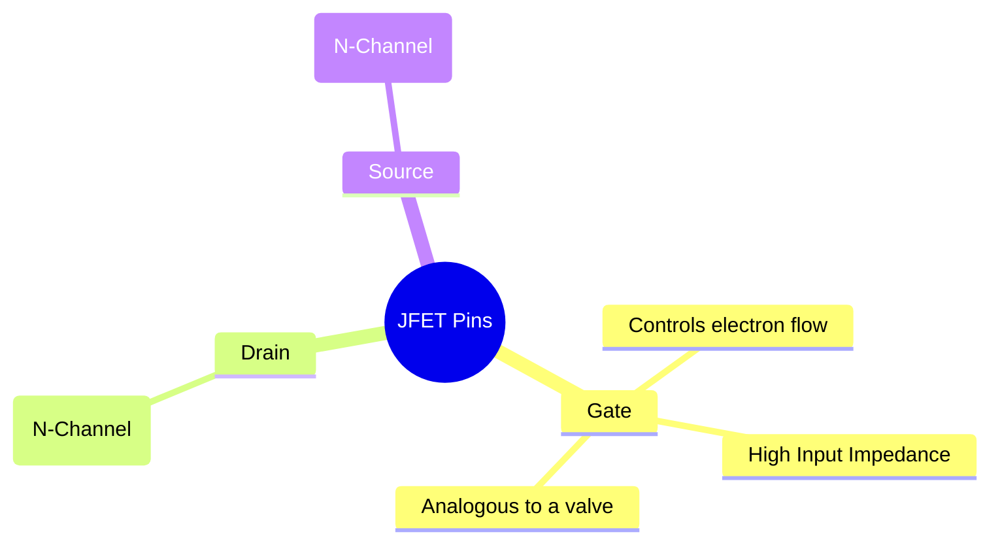

Sebelum perkembangan besar-besaran MOSFET, **JFET** (Junction Field-Effect Transistor) adalah rajanya amplifikasi impedansi input tinggi. Meskipun tidak sering digunakan dalam logika digital modern, mereka tetap menjadi artefak yang sangat diperlukan dalam preamplifier audio fidelitas tinggi, instrumentasi sensitif, dan sirkuit RF.

Memahami simbol skema JFET sangat penting bagi siapa pun yang mempelajari desain rangkaian analog diskrit.

## 1. Anatomi Simbol JFET

Berbeda dengan Bipolar Junction Transistor (BJT) yang merupakan perangkat yang dikontrol arusnya, JFET adalah perangkat yang **dikontrol tegangannya**. Simbol skema mencoba untuk secara visual mewakili konstruksi fisik saluran semikonduktor internalnya.

Simbolnya terdiri dari garis vertikal lurus yang melambangkan saluran, dengan dua garis horizontal yang menghubungkannya (Saluran dan Sumber). Garis tegak lurus ketiga membentuk Gerbang, lengkap dengan panah yang menentukan polaritas semikonduktor.

### JFET Saluran-N vs. Saluran-P

Sama seperti BJT yang memiliki NPN dan PNP, JFET hadir dalam dua rasa berbeda.

| Karakteristik | JFET Saluran-N | JFET Saluran-P |
| :--- | :--- | :--- |
| **Simbol Panah** | Arahkan **IN** menuju garis saluran | Titik **OUT** menjauh dari saluran |
| **Operator Mayoritas** | Elektron | lubang |
| **Vgs untuk Pinch-Off** | Tegangan Negatif (misalnya -5V) | Tegangan Positif (misalnya +5V) |
| **Operasi Khas**| Biasanya ON -> Terapkan rangkaian tegangan negatif untuk mematikan | Biasanya ON -> Terapkan rangkaian tegangan positif untuk mematikan |

> **Trik Memori:** "Menunjuk KE DALAM" berarti **N**-Saluran. Lihatlah panah di Gerbang. Jika mengarah ke dalam garis, Anda berurusan dengan JFET N-Channel (seperti 2N5457 yang populer).

## 2. Operasi: Mode Deplesi

Salah satu karakteristik yang paling menentukan dari JFET adalah bahwa ia merupakan perangkat **Mode Deplesi**. Hal ini sangat memengaruhi cara Anda mendesain skema di sekitarnya.

* **MOSFET (Mode Peningkatan):** Biasanya MATI. Anda harus memberikan tegangan ke gerbang untuk menyalakannya.
* **JFET (Mode Deplesi):** Biasanya AKTIF. Dengan 0 Volt di gerbang, arus maksimum mengalir dari Drain ke Sumber. Anda harus menerapkan tegangan *bias terbalik* (negatif untuk N-Channel) untuk memperluas wilayah penipisan dan secara harfiah "menjepit" aliran elektron, mematikan perangkat.

```mermaid
flowchart LR
    VGS[V_GS = 0V] --> I1[Maximum Drain Current flows]
    VGS2[V_GS = -2V] --> I2[Current is restricted]
    VGS3[V_GS = -5V] --> I3[Pinch-Off reached. Circuit is OFF]
    
    style VGS fill:#1e293b,stroke:#f59e0b
    style VGS3 fill:#1e293b,stroke:#ef4444
```

## 3. Aplikasi Skema Khas

Karena Gerbang JFET dibias terbalik selama operasi, pada dasarnya arus nol mengalir ke dalamnya. Hal ini menghasilkan impedansi masukan yang sangat tinggi (sering kali diukur dalam ratusan Megaohm).

| Aplikasi Sirkuit | Mengapa JFET Dipilih | Petunjuk Skema |
| :--- | :--- | :--- |
| **Preamplifier Audio** | Kebisingan yang sangat rendah dan impedansi input yang besar mencegah pemuatan pickup gitar elektrik yang sensitif. | Sering terlihat bertindak sebagai tahap buffer Source Follower. |
| **Sakelar Analog** | Karena tegangannya murni dikontrol tanpa arus gerbang, maka tegangan tersebut menginjeksikan transien switching nol ke dalam jalur sinyal. | Ditempatkan secara seri dengan sinyal analog melewati saluran sumber pembuangan. |
| **Sumber Arus Konstan** | JFET berperilaku seperti penyerap arus konstan ketika gerbang dihubungkan langsung ke sumber. | Terminal gerbang dihubungkan langsung ke terminal Sumber. |

Saat membuat diagram sirkuit analog khusus ini, presisi adalah kuncinya. Pastikan orientasi panah Gerbang Anda benar untuk mencegah kegagalan produksi. Gunakan pustaka semikonduktor terpisah yang dikuratori di **[Pembuat Diagram Sirkuit](/editor/)** untuk menempatkan simbol JFET N-Channel dan P-Channel standar secara akurat di kanvas Anda berikutnya.