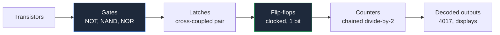
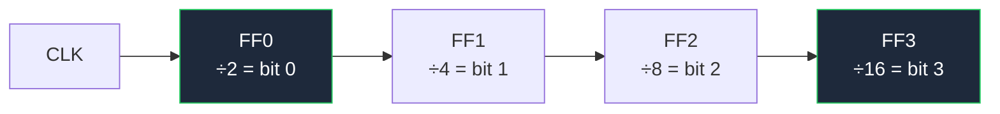

**Diagram rangkaian gerbang logika menggambarkan perilaku, bukan nilai komponen.** Perbedaan tunggal ini mengubah cara Anda menggambar rangkaian. Skematik analog bergantung pada apakah pembaca dapat menemukan resistor 4k7; skematik digital bergantung pada apakah pembaca dapat melacak propagasi sinyal melalui rantai gerbang tanpa kehilangan tempat. Hampir tidak ada nilai yang perlu diberi anotasi — sehingga setiap tingkat kejelasan harus berasal dari pilihan simbol dan tata letak.

Panduan ini mencakup kedua dialek simbol, kemudian menapaki hierarki ke atas: gerbang yang dibangun dari transistor mentah, gerbang yang disusun menjadi flip-flop, flip-flop yang dirantai menjadi penghitung, dan akhirnya IC penghitung nyata. Ini adalah salah satu dari enam panduan domain di bawah [panduan lengkap kami tentang diagram rangkaian](/blog/complete-guide-to-circuit-diagrams/), yang mencakup konvensi tata letak universal yang menjadi dasar aturan ini.

## Dua Dialek Simbol: Bentuk Khas ANSI vs Persegi Panjang IEC

Logika digital adalah satu-satunya bidang di mana standar Amerika dan internasional berbeda secara drastis. Di tempat lain — resistor, kapasitor, dioda — bentuknya serupa atau identik. Dalam logika, bentuknya tidak dapat dikenali sama sekali.

**Bentuk khas ANSI/IEEE 91-1984** memberikan setiap gerbang siluet unik. Anda mengenali fungsi hanya dari garis luar, pada tingkat zoom apa pun, dalam penglihatan pinggir.

**IEC 60617-12** (sering disebut gaya DIN, setelah standar Jerman lama DIN 40700) menggunakan satu persegi panjang untuk setiap gerbang, dengan simbol kualifikasi di dalamnya yang menamai fungsi.

| Gerbang | Bentuk khas ANSI | Persegi panjang IEC / DIN | Boolean |
| :--- | :--- | :--- | :--- |
| **AND** | Punggung datar, hidung setengah lingkaran — huruf "D" | Persegi panjang dengan `&` | `Y = A · B` |
| **OR** | Punggung melengkung, hidung runcing — perisai | Persegi panjang dengan `≥1` | `Y = A + B` |
| **NOT** | Segitiga dengan gelembung pada output | Persegi panjang dengan `1` ditambah gelembung | `Y = Ā` |
| **NAND** | Bentuk AND ditambah gelembung output | `&` ditambah gelembung output | `Y = A · B` terbalik |
| **NOR** | Bentuk OR ditambah gelembung output | `≥1` ditambah gelembung output | `Y = A + B` terbalik |
| **XOR** | Bentuk OR ditambah garis punggung melengkung kedua | Persegi panjang dengan `=1` | `Y = A ⊕ B` |
| **XNOR** | Bentuk XOR ditambah gelembung output | `=1` ditambah gelembung output | `Y = A ⊕ B` terbalik |
| **Buffer** | Segitiga polos, tanpa gelembung | Persegi panjang dengan `1` | `Y = A` |

Kualifikasi IEC lebih logis dari yang terlihat pada pandangan pertama. `&` secara harfiah berarti "and". `≥1` berarti "output benar ketika *setidaknya satu* input benar" — yang persis berarti OR. `=1` berarti "output benar ketika *tepat satu* input benar" — persis XOR. Begitu Anda membacanya dengan cara ini, Anda tidak akan pernah melupakannya.

**Mana yang sebaiknya Anda gunakan?** Bentuk khas ANSI untuk apa pun yang dibaca oleh manusia, persegi panjang IEC ketika organisasi Anda mewajibkannya atau ketika Anda menggambar gerbang kompleks di mana bentuk khas tidak ada. Keunggulan ANSI nyata: halaman berisi bentuk khas dapat dipindai, sedangkan halaman berisi persegi panjang identik memaksa pembaca memeriksa setiap kualifikasi. Apa pun pilihan Anda, jangan pernah mencampurnya dalam satu lembar.

### Gelembung Adalah Seluruh Cerita

Lingkaran kecil pada pin berarti inversi. Itu adalah konvensi paling berat dalam penggambaran digital:

- Gelembung pada **output** — fungsi dinegasikan. AND menjadi NAND.
- Gelembung pada **input** — input tersebut diinversi sebelum gerbang bertindak.
- Gelembung pada **input jam** — flip-flop terpicu pada tepi turun alih-alih tepi naik.
- Gelembung pada pin IC, ditambah nama seperti `nCS` atau `RESET#` — sinyal tersebut **aktif rendah**: menjalankan tugasnya ketika didorong ke 0 V.

Karena gelembung kecil, jaga agar tetap bersih. Jangan biarkan kabel menyentuh atau tumpang tindih dengan gelembung, dan jangan pernah menempatkan dua gerbang terlalu dekat sehingga gelembung output satu secara visual menyatu dengan garis input gerbang berikutnya.

## Aturan Menggambar Khusus untuk Skematik Digital

Konvensi universal tetap berlaku — input di kiri, output di kanan, daya di atas, ground di bawah, lurus ke grid. Pekerjaan digital menambahkan empat aturannya sendiri.

**1. Input gerbang tidak pernah menyilang satu sama lain.** Jika dua kabel yang memberi makan satu gerbang menyilang saat masuk, tukar urutan input. Untuk AND, OR, NAND, NOR, dan XOR inputnya dapat ditukar, sehingga tidak ada alasan. Input gerbang yang bersilang adalah kesalahan paling sulit ditemukan dalam gambaran digital karena terlihat sempurna normal.

**2. Propagasi dibaca dari kiri ke kanan, selalu.** Rangkaian digital sering berputar, dan putarannya bermakna — latch adalah sebuah putaran. Pertahankan setiap jalur maju secara ketat dari kiri ke kanan sehingga putaran menonjol sebagai satu-satunya kabel mundur di lembar.

**3. Grup paralel diringkas menjadi bus.** Delapan jalur data yang digambar secara individual adalah delapan peluang kesalahan baca. `D[0..7]` pada satu garis tebal adalah satu kesalahan.

**4. Beri label domain jam.** Setiap lembar dengan lebih dari satu jam harus menamai mereka (`CLK_16M`, `CLK_SLOW`) dan menjaga setiap domain secara visual terkelompok. Garis jam secara konvensi digambar lurus dan tidak terputus — jam yang berkelok melalui enam sudut terlihat seperti garis data.



Setiap langkah dalam rantai tersebut digambar dengan simbol yang sama pada tingkat abstraksi yang lebih tinggi. Memahami anak tangga paling bawah membuat sisanya menjadi jelas, jadi mulai dari sana.

## Membangun Gerbang dari Transistor

Setiap simbol gerbang menyembunyikan susunan transistor. Menggambar susunan tersebut adalah latihan yang sangat berguna, karena menjelaskan mengapa NAND dan NOR adalah gerbang yang murah dan alami, sedangkan AND dan OR adalah yang mahal.

### Rangkaian Gerbang NOT

Gerbang paling sederhana adalah inversi NPN emitor umum:

- Input melalui resistor basis (beberapa kΩ) ke basis transistor NPN.
- Resistor kolektor (1 kΩ–10 kΩ) dari kolektor naik ke VCC.
- Emitor langsung ke ground.
- Output diambil pada kolektor.

Input tinggi membuat transistor jenuh, menarik kolektor — dan karena itu output — turun ke sekitar 0,2 V. Input rendah membuat transistor mati, sehingga resistor kolektor menarik output naik ke VCC. Input tinggi menghasilkan output rendah: inversi.

Gambar persis seperti yang ditentukan panduan hub dan fungsinya terlihat: VCC di atas, resistor kolektor vertikal, transistor di bawahnya dengan panah emitor menunjuk ke bawah ke jalur ground, input masuk dari kiri, output keluar dari kanan pada simpul kolektor. Seluruh gerbang dapat dibaca dalam sekali pandang.

### Gerbang NAND Menggunakan Transistor

Sekarang susun dua transistor secara seri antara simpul output dan ground: emitor transistor atas terhubung ke kolektor transistor bawah, dan emitor bawah ke ground. Masing-masing basis mendapat inputnya sendiri melalui resistor basis. Satu resistor kolektor ke VCC melayani keduanya.

Output ditarik rendah **hanya ketika kedua transistor mengalirkan arus**, yang membutuhkan kedua input tinggi. Setiap kombinasi input lainnya meninggalkan setidaknya satu transistor mati, sehingga resistor pull-up menang dan output tetap tinggi.

| A | B | Q1 | Q2 | Output |
| :--- | :--- | :--- | :--- | :--- |
| 0 | 0 | mati | mati | **1** |
| 0 | 1 | mati | hidup | **1** |
| 1 | 0 | hidup | mati | **1** |
| 1 | 1 | hidup | hidup | **0** |

Itu adalah tabel kebenaran NAND. Transistor seri memberikan NAND secara gratis — dan itulah tepatnya mengapa NAND adalah blok bangunan universal keluarga logika nyata, bukan AND.

**Letakkan dua transistor yang sama secara paralel** — kedua kolektor pada simpul output, kedua emitor pada ground — dan output ditarik rendah ketika *salah satu* mengalirkan arus. Itu adalah NOR. Seri sama dengan NAND, paralel sama dengan NOR. Dua susunan, kedua gerbang, tanpa suku cadang tambahan.

Untuk mendapatkan AND yang sesungguhnya, Anda membutuhkan NAND diikuti oleh inverter: tiga transistor alih-alih dua. AND dan OR secara harfiah lebih mahal daripada sepupu terbaliknya, itulah mengapa datasheet penuh dengan paket NAND dan NOR.

### Gerbang XOR Menggunakan Transistor

XOR adalah titik di mana konstruksi diskrit berhenti menjadi elegan. Identitas Boolean adalah:

```
Y = (A · B̄) + (Ā · B)
```

Output tinggi ketika input berbeda. Dalam bentuk diskrit, itu berarti dua inverter untuk menghasilkan `Ā` dan `B̄`, kemudian dua pasang pull-down seri — satu untuk `A · B̄`, satu untuk `Ā · B` — dengan kedua pasang berbagi satu resistor pull-up kolektor untuk wire-OR hasilnya. Enam transistor dan lima resistor untuk satu gerbang.

Gambar sebagai dua bagian yang terpisah jelas, satu untuk setiap istilah produk, ditumpuk secara vertikal dan bertemu di simpul output bersama. Jika Anda mencoba menggambar keenam transistor dalam satu baris, itu langsung menjadi tidak terbaca. Ini juga saat yang tepat untuk mencatat bahwa dalam desain nyata Anda akan menggunakan seper tujuh dari 74HC86 — versi diskrit ada untuk mengajarkan identitas, bukan untuk dibangun.

## Rangkaian Flip-Flop

Flip-flop adalah apa yang terjadi ketika Anda memberi makan output gerbang kembali ke inputnya sendiri. Putaran itu memberikan memori pada rangkaian — satu bit.

### Latch SR

Silangkan dua gerbang NOR: output gerbang 1 memberi makan input gerbang 2, dan output gerbang 2 memberi makan input gerbang 1. Input bebas yang tersisa menjadi **S** (set) dan **R** (reset), dan dua output adalah **Q** dan **Q̄**.

- Pulsa S tinggi: Q menjadi tinggi dan tetap tinggi setelah S kembali rendah.
- Pulsa R tinggi: Q menjadi rendah dan tetap rendah.
- Keduanya rendah: latch menahan status sebelumnya — ini adalah memori.
- Keduanya tinggi: dilarang, karena kedua output dipaksa rendah dan kontrak "Q̄ adalah kebalikan dari Q" rusak.

Tukar gerbang NOR dengan gerbang NAND dan Anda mendapatkan versi aktif rendah, di mana inputnya adalah `S̄` dan `R̄` dan posisi diam adalah keduanya tinggi.

> Latch SR adalah satu-satunya tempat di mana aturan tidak-silang disengaja dilanggar. Penggambaran konvensional menempatkan kedua gerbang satu di atas yang lain dengan kabel umpan balik secara jelas bersilang di antara mereka, karena bentuk X itu *adalah* tanda tangan yang dapat dikenali dari latch. Gambar dengan cara lain dan pembaca tidak akan mengenalinya.

### Flip-Flop D dan JK

Tambahkan jam dan latch menjadi flip-flop yang hanya mengubah status pada momen yang ditentukan.

| Tipe | Input | Perilaku | Catatan menggambar |
| :--- | :--- | :--- | :--- |
| **D** | D, CLK | Q mengambil nilai D pada tepi jam | Paling umum; satu input data, tanpa status terlarang |
| **JK** | J, K, CLK | J menyetel, J mereset, keduanya tinggi toggle | Mode toggle inilah yang memungkinkan penghitung |
| **T** | T, CLK | Toggle ketika T tinggi | JK dengan J dan K diikat bersama |

Pada tingkat skematik, Anda hampir selalu menggambar ini sebagai persegi panjang, bukan sebagai gerbang dasar. Konvensi untuk blok: input D atau J/K di kiri, jam di kiri dengan gelembung jika dipicu tepi turun, Q di kanan atas, Q̄ di kanan bawah, dan set/reset asinkron di tepi atas dan bawah. Mengikuti tata letak ini berarti setiap pembaca langsung mengenali blok tanpa membaca nomor komponen.

## Rangkaian Penghitung Biner

Flip-flop JK dengan kedua input diikat tinggi toggle pada setiap tepi jam. Outputnya oleh karena itu tepat setengah dari frekuensi input — tahap bagi-2. Rantai mereka dan setiap tahap membagi lagi:



Baca empat output Q bersama dan Anda memiliki bilangan biner 4-bit yang bertambah sekali per jam input: penghitung biner yang menghitung 0 hingga 15. Karena setiap tahap memberi jam pada tahap berikutnya, ini adalah penghitung **asinkron** atau **ripple** — tahap-tahap diperbarui secara berurutan alih-alih bersamaan, sehingga ada periode penyelesaian singkat setelah setiap jam di mana output tidak valid.

Aturan menggambar untuk penghitung:

- **Kiri ke kanan berdasarkan urutan bit.** Bit 0 di kiri, bit paling signifikan di kanan. Jangan pernah membalik ini; pembaca mengasumsikannya secara absolut.
- **Berikan label setiap output dengan bobot bitnya**, `Q0`/`Q1`/`Q2`/`Q3` atau `÷2`/`÷4`/`÷8`/`÷16`.
- **Jalankan jam di sepanjang garis horizontal lurus** di bawah atau di atas rantai dan turunkan cabang ke atas ke setiap tahap. Jangan merangkai jam secara diagonal antar flip-flop.
- **Ikat input asinkron yang tidak terpakai secara eksplisit** ke jalur tidak-aktifnya dan tunjukkan itu. Pin reset yang mengambang pada penghitung adalah kegagalan lapangan yang dijamin.

Untuk penghitung **sinkron**, setiap flip-flop berbagi satu jam dan logika kombinatorial memutuskan bit mana yang toggle. Gambar berubah karakter secara total: satu garis jam bersih ke setiap tahap, ditambah blok segitiga gerbang AND yang menyebar ke seluruh lembar. Ini lebih banyak suku cadang dan lebih banyak menggambar, dan ini menghilangkan masalah penyelesaian ripple.

## IC 4017 Penghitung Desimal

Dalam praktik, Anda jarang menggambar penghitung dari flip-flop — Anda menggunakan IC penghitung. CD4017 adalah yang klasik: penghitung Johnson 5-tahap dengan output terdekoder, memberikan **sepuluh output yang menjadi tinggi satu demi satu, secara berurutan, satu per pulsa jam**. Ini adalah inti dari hampir semua penghias LED, sekuenser, dan rangkaian penghitung langkah yang pernah dibuat.

Pinout-nya juga merupakan argumen terbaik untuk aturan panduan hub tentang mengatur pin IC berdasarkan fungsi alih-alih urutan fisik:

| Pin | Fungsi | Pin | Fungsi |
| :--- | :--- | :--- | :--- |
| 1 | Q5 | 9 | Q8 |
| 2 | Q1 | 10 | Q4 |
| 3 | Q0 | 11 | Q9 |
| 4 | Q2 | 12 | Carry out |
| 5 | Q6 | 13 | Clock inhibit |
| 6 | Q7 | 14 | Clock |
| 7 | Q3 | 15 | Reset |
| 8 | VSS (GND) | 16 | VDD |

Sepuluh output tersebar di kedua sisi paket tanpa urutan yang berguna. Jika Anda menggambar simbol dalam urutan pin fisik, `Q0` hingga `Q9` berbelok di sekitar blok dan setiap kabel yang Anda pasang bersilang dengan yang lain. Gambar secara fungsional — jam, inhibit, dan reset ditumpuk di kiri, `Q0` hingga `Q9` dalam urutan numerik di sisi kanan, VDD di atas, VSS di bawah, dengan nomor pin dalam teks kecil di sebelah masing-masing — dan penghias LED sepuluh menjadi sepulah kabel horizontal paralel tanpa persilangan.

Tiga pin kontrol penting ketika Anda menggambar satu:

- **Clock (14)** menggerakkan urutan pada tepi naik.
- **Clock inhibit (13)** membekukan penghitung selama tinggi. Ikat ke ground jika tidak terpakai — jangan biarkan mengambang.
- **Reset (15)** mengembalikan hitungan ke `Q0` selama tinggi. Ikat ke ground jika tidak terpakai, atau kendalikan dari output yang Anda inginkan sebagai langkah terakhir dalam urutan yang dipersingkat. Memberi makan `Q4` kembali ke reset, misalnya, mengubah 4017 menjadi sekuenser 4-langkah, dan kabel umpan balik itu adalah salah satu dari sedikit kabel kanan-ke-kiri yang termasuk dalam lembar digital.
- **Carry out (12)** berpulsa sekali per sepuluh jam, sehingga memberi makan jam dari 4017 kedua untuk bertingkat melampaui sepuluh langkah.

Penghias LED khas oleh karena itu dibaca: osilator astabil 555 di kiri yang menghasilkan jam, 4017 di tengah, sepuluh LED dengan resistor pembatas arus yang menyebar ke kanan, dan kedua simbol daya vertikal. Pembangkitan jam untuk jenis rangkaian ini dibahas dalam [panduan rangkaian penguat dan osilator](/blog/amplifier-and-oscillator-circuits/), dan jika 4017 memberi makan sesuatu yang lebih besar dari LED, tahap pengalihan dalam [panduan rangkaian sensor dan perlindungan](/blog/sensor-and-protection-circuit-diagrams/) adalah yang termasuk di antara mereka.

## Daftar Periksa Skematik Digital

Jalankan ini sebelum Anda menyatakan gambaran logika selesai:

1. Hanya satu standar simbol — bentuk khas ANSI atau persegi panjang IEC, jangan pernah keduanya.
2. Tidak ada input gerbang yang bersilang di mana pun.
3. Setiap gelembung terpisah jelas dari kabel sekitarnya.
4. Sinyal aktif rendah diberi nama secara konsisten (`nRESET`, `/RESET` atau `RESET#` — pilih satu).
5. Setiap input yang tidak terpakai diikat ke level yang ditentukan, digambar secara eksplisit.
6. Setiap output yang tidak terpakai ditandai dengan no-connect `X`.
7. Bit penghitung dan register dalam urutan naik kiri-ke-kanan.
8. Garis jam lurus, berlabel, dan dikelompokkan berdasarkan domain.
9. Kapasitor decoupling digambar di pin daya masing-masing IC — logika CMOS menarik puncak arus pada setiap transisi dan di sinilah Anda mencatat niat itu.
10. Nilai pull-up dan pull-down diberi anotasi meskipun rangkaian "digital".

**[Mulai menggambar skematik Anda sendiri sekarang.](/editor/)** Perpustakaan gerbang mencakup bentuk khas ANSI dan persegi panjang IEC, ditambah flip-flop, penghitung, dan 4017, sehingga Anda dapat menyusun penghias atau rantai pembagi dalam beberapa menit. Jika Anda ingin bekerja dari tabel kebenaran alih-alih menempatkan gerbang secara manual, [pengubah tabel kebenaran ke rangkaian logika](/truth-table-to-logic-circuit/) menghasilkan jaringan gerbang untuk Anda, dan [penyederhana ekspresi Boolean](/boolean-expression-simplifier/) menyederhanakan ekspresi terlebih dahulu sehingga Anda menggambar rangkaian paling kecil alih-alih yang paling jelas.
