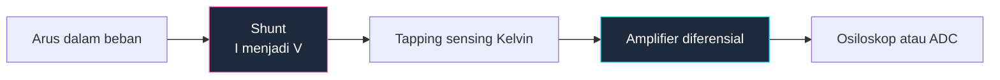

**Infrastruktur pengujian adalah bagian yang paling jarang digambar dari sebagian besar skematik.** Desainer menghabiskan seminggu untuk jalur sinyal lalu melakukan debug papan dengan ujung probe yang diseimbangkan pada lead resistor, karena tidak ada satu pun yang tertulis dalam gambar bahwa "kita perlu mengukur ini." Titik uji hampir tidak memakan biaya saat desain dan mustahil ditambahkan setelah fabrikasi.

Panduan ini membahas cara menggambar sisi pengukuran dari sebuah sirkuit: titik uji, shunt, beban instrumen, dan sirkuit analog kecil yang memungkinkan pengukuran. Ini dibangun di atas konvensi universal dalam [panduan lengkap diagram sirkuit](/blog/complete-guide-to-circuit-diagrams/) kami.

## Titik Uji Adalah Komponen

Titik uji memiliki referensi desainator — `TP` — dan termasuk dalam skematik seperti komponen lainnya. Gambar sebagai lingkaran kecil atau bendera yang melekat pada net, dengan desainator di sampingnya.

Yang perlu ditandai pada setiap titik uji:

- **Nilai yang diharapkan.** `TP3 — 3.30 V ±2%` atau `TP7 — 5 V kotak, 1 kHz, 50% duty cycle`. Ini mengubah skematik Anda menjadi prosedur pengujian. Seseorang dengan multimeter dan gambar Anda dapat memvalidasi papan tanpa bertanya apa pun kepada Anda.
- **Fungsinya.** `TP4 — node umpan balik regulator` memberitahu debugger masa depan mengapa titik uji ini ada.

Aturan penempatan yang lebih penting dari kedengarannya:

**Letakkan titik uji ground di samping setiap titik uji sinyal.** Pengukuran osiloskop membutuhkan dua koneksi. Papan dengan dua belas titik uji sinyal dan satu terminal ground di sudut jauh adalah papan yang akan Anda ukur dengan buruk, karena ground lead yang panjang menambahkan induktan dan mengubah tepi bersih menjadi ringing. Kelompokkan secara berpasangan dan skematik mengkomunikasikan niat tersebut ke tata letak.

**Uji net yang tidak dapat dijangkau dengan cara lain.** Setiap net yang hanya ada di antara dua BGA ball, atau di bawah shield, atau di dalam blok hierarki, tidak terlihat pada papan yang sudah jadi. Net-net inilah yang membutuhkan titik uji, bukan yang sudah terpapar pada header.

**Uji kedua sisi dari sesuatu yang bisa gagal terbuka.** Sekering, resistor seri, ferrite bead, dan konektor. Titik uji di setiap sisi mengubah "papan mati" menjadi pengukuran lima detik.

**Tandai titik uji tanpa beban.** Jika titik uji berada pada node impedansi tinggi di mana kapasitansi probe akan mengganggu sirkuit, tandai: `TP9 — gunakan probe 10:1 saja`.

## Menggambar Instrumen sebagai Beban

Instrumen bukan pengamat ajaib. Instrumen adalah beban, dan pada node impedansi tinggi instrumen mengubah sirkuit yang sedang Anda ukur. Ketika skematik mendokumentasikan pengaturan pengujian, gambar instrumen sebagaimana adanya.

| Instrumen | Digambar sebagai | Nilai tipikal |
| :--- | :--- | :--- |
| **Osiloskop, input langsung** | Resistor sejajar dengan kapasitor ke ground | 1 MΩ ∥ 15–25 pF |
| **Osiloskop, probe pasif 10:1** | Sama, R lebih tinggi, C lebih rendah | 10 MΩ ∥ 10–15 pF |
| **Multimeter digital, DC volt** | Resistor ke ground | ~10 MΩ |
| **Probe aktif/diferensial** | Blok buffer dengan impedansi input dicatat | R tinggi, ~1–2 pF |

Gambar instrumen di dalam **persegi garis putus-putus** berlabel dengan nama instrumen dan impedansi inputnya. Garis putus-putus adalah cara standar untuk mengatakan "ini bukan bagian dari produk" — konvensi yang sama yang digunakan untuk perakitan opsional dan komponen mekanik. Pembaca kemudian dapat langsung melihat bahwa 20 pF yang menggantung dari node adalah artefak pengukuran, bukan komponen desain.

20 pF itu penting. Pada node 1 MΩ, kapasitansi tersebut membentuk filter low-pass dengan frekuensi cutoff sekitar 8 kHz, sehingga probe osiloskop pada pembagi impedansi tinggi akan menunjukkan sinyal yang tidak ada tanpa probe. Pada osilator kristal, kapasitansi probe dapat menghentikan osilator sama sekali. Menggambar probe sebagai beban adalah cara Anda memprediksi hal tersebut sebelum Anda kebingungan.

**Ground osiloskop berreferensi earth.** Ini adalah anotasi paling penting dalam setiap skematik pengujian. Probe ground osiloskop yang menggunakan catu daya AC terhubung ke pin earth pada kabel powernya. Jika Anda mengaitkannya ke node yang tidak berpotensi earth, Anda membuat short circuit melalui konduktor earth gedung — menghancurkan probe, sirkuit, atau keduanya. Pada sirkuit berreferensi mains seperti catu daya tanpa transformator atau primer SMPS yang tidak terisolasi, ini adalah bahaya yang nyata bukan sekadar ketidaknyamanan.

Jawaban yang benar adalah probe diferensial, osiloskop dengan input terisolasi, atau transformator isolasi pada *device under test*. Jawaban yang salah adalah me-nonaktifkan pin earth pada osiloskop, yang mengapung seluruh chassis instrumen — termasuk setiap permukaan logam yang akan Anda sentuh — ke potensi apapun tempat probe ground diaitkan. Jika skematik mendokumentasikan pengukuran pada sirkuit yang tidak terisolasi, letakkan peringatan tersebut dalam kotak catatan pada lembar.

## Mengukur Arus dengan Osiloskop

Osiloskop mengukur tegangan. Untuk melihat arus, Anda mengonversinya, dan konversi tersebut harus tertera pada skematik.

### Resistor Shunt

Shunt adalah resistor kecil dan presisi yang ditempatkan pada jalur arus, sehingga `V = I × R`. Konvensi menggambar:

- **Gambar shunt pada jalur arus dengan garis tebal**, dan koneksi sensing dengan garis tipis. Perbedaan berat garis itulah ceritanya: arus mengalir melalui shunt, arus mikro mengalir ke amplifier.
- **Tandai nilai dengan presisi miliohm** dalam notasi huruf: `R010` untuk 10 mΩ, `0R05` untuk 50 mΩ.
- **Tandai penurunan skala penuh dan daya buang.** Shunt 10 mΩ pada 5 A menurunkan 50 mV dan menghasilkan panas 250 mW. Kedua angka tersebut adalah batasan desain — penurunan menentukan penguatan amplifier, daya buang menentukan package.
- **Tentukan toleransi dan koefisien suhu.** Shunt 5% menghasilkan pengukuran arus 5%. Tulis `1%, 50 ppm/°C` pada gambar.

**Low-side versus high-side** adalah keputusan topologi yang harus dibuat jelas oleh skematik. Shunt low-side duduk di antara return beban dan ground: sederhana, berreferensi ground, dapat diukur dengan op-amp biasa — tetapi mengangkat referensi ground beban sebesar penurunan shunt, dan tidak dapat mendeteksi gangguan yang melewati jalur return. Shunt high-side duduk di antara catu daya dan beban: mempertahankan ground utuh dan mendeteksi semua gangguan, tetapi tegangan sensing berada pada penuh tegangan supply, sehingga membutuhkan amplifier current-sense khusus dengan range common-mode yang memadai. Tandai tegangan common-mode di sebelah amplifier — angka inilah yang menentukan komponen.

### Sensing Kelvin (Empat Kabel)

Pada nilai miliohm, resistansi kabel Anda sendiri merupakan kesalahan yang signifikan. Solusinya adalah koneksi Kelvin: pisahkan jalur **force** yang membawa arus dari jalur **sense** yang mengukur tegangan, dan ambil koneksi sensing dari *tepi dalam* elemen shunt itu sendiri.

Ini masalah menggambar sebelum menjadi masalah listrik. Pada skematik, gambar empat koneksi yang berbeda ke simbol shunt — dua koneksi force tebal di ujung luar, dua koneksi sense tipis mengambil dari bagian dalam — dan tambahkan catatan `KELVIN — sense at inner pads`. Shunt empat terminal yang digambar dengan dua kabel terlihat identik dengan shunt dua terminal, dan insinyur tata letak akan menghubungkannya sebagai komponen dua terminal kecuali Anda menentukan sebaliknya.

### Probe Arus

Probe arus jenis clamp mengukur medan magnet di sekitar konduktor dan sama sekali tidak membutuhkan koneksi listrik. Gambar sebagai blok berlabel yang dikopling dengan kabel menggunakan simbol kopling — dua garis paralel di samping konduktor, seperti inti transformator — dan tandai bandwidth dan range arus. Keunggulan utama yang perlu dicatat pada gambar: tidak ada referensi earth, sehingga tidak ada bahaya earth.

## Sirkuit Kecil yang Memungkinkan Pengukuran

### Sirkuit Penguji Kontinuitas

Instrumen pengujian sederhana yang paling berguna: sebuah baterai, resistor seri, indikator, dan dua probe. Arus mengalim dan LED menyala ketika probe dihubungkan.

Versi sederhana memiliki kekurangan nyata yang perlu didokumentasikan: LED dan resistor akan menyala pada beberapa ratus ohm, sehingga penguji melaporkan "kontinuitas" melewati resistor. Jika Anda perlu membedakan solder joint 0,5 Ω dari jalur kebocoran 200 Ω, sirkuit membutuhkan komparator: arus probe melewati resistor sensing kecil, dibandingkan dengan referensi, dan mengaktifkan buzzer hanya di bawah ambang batas.

Dalam kedua kasus, **tandai ambang batas**: `menunjukkan di bawah 10 Ω`. Penguji yang ambang batasnya tidak didokumentasikan memberikan jawaban yang tidak dapat Anda interpretasikan. Tegangan probe open-circuit juga harus ditandai, karena penguji yang memberikan 3 V pada sirkuit yang diuji dapat memajubias junction semikonduktor dan melaporkan kontinuitas melalui transistor.

### Voltage Follower

Op-amp yang outputnya dihubungkan langsung kembali ke input inverting memiliki penguatan tepat satu — yang terdengar tidak berguna sampai Anda menyadari bahwa ia mengubah impedansi. Impedansi tinggi masuk, impedansi rendah keluar.

Itu menjadikannya solusi standar untuk masalah beban pengukuran. Letakkan follower di antara pembagi impedansi tinggi dan ADC atau multimeter Anda, dan pembagi akan melihat impedansi input op-amp alih-alih impedansi instrumen.

Catatan menggambar:

- **Jalur umpan balik adalah kawat kosong**, output ke input inverting, digambar di atas segitiga seperti biasanya. Tidak ada komponen dalam loop. Persegi kosong di atas amplifier adalah tanda pengenal yang dikenal dari sebuah follower.
- **Gunakan op-amp input FET untuk sumber impedansi tinggi yang sesungguhnya** dan tandai alasannya: `FET input — diperlukan Ib < 10 pA`. Arus bias input op-amp bipolar yang mengalir melalui sumber 10 MΩ merupakan kesalahan yang dapat diukur.
- **Tandai impedansi input** yang Anda andalkan, dan pastikan guard trace atau proteksi input digambar bersebelahan dengan pin input.

### Sirkuit Sample and Hold

Sample-and-hold menangkap tegangan pada satu saat dan menahannya tetap stabil sementara sesuatu yang lain — biasanya ADC — membacanya. Tiga komponen: switch analog, kapasitor hold, dan buffer.

Skematik harus mengkomunikasikan tiga spesifikasi yang tidak dimiliki oleh komponen saja:

- **Laju penurunan.** Tegangan yang ditahan mengalir ke bawah karena kebocoran mengosongkan kapasitor: `dV/dt = I_leak / C`. Tandai penurunan yang dapat diterima selama waktu tahan. Inilah yang menentukan nilai kapasitor dan arus bias input buffer.
- **Dielktrik kapasitor.** Tulis pada gambar. Polipropilena atau PTFE untuk kapasitor hold; keramik Y5V memiliki absorpsi dielktrik yang akan "mengingat" tegangan sebelumnya dan merusak sampel Anda. Ini adalah salah satu kasus langka di mana dielktrik lebih penting daripada kapasitansi.
- **Waktu akuisisi.** Berapa lama switch harus tetap tertutup agar kapasitor mencapai nilai akhir, ditentukan oleh impedansi sumber dan `C`. Tandai lebar pulsa sample minimum di sebelah input kontrol.

Gambar switch sebagai simbol switch analog dengan input kontrolnya berlabel jelas `SAMPLE`, kapasitor hold secara vertikal ke ground tepat setelahnya, dan buffer di sebelah kanan. Kiri ke kanan: sample, hold, read.

### Voltmeter dan Bar Graph LM3914

LM3914 mengubah tegangan analog menjadi tampilan LED sepuluh tingkat: tangga komparator linear terhadap pembagi referensi internal.

Pin yang mendefinisikan desain:

- **Input sinyal (pin 5)** — tegangan yang diukur.
- **Pembagi rendah dan tinggi (pin 4 dan 6)** — ini menentukan jendela tampilan. Menghubungkannya ke referensi dan ground memberikan 0 V hingga skala penuh; menghubungkannya ke dua tegangan lain memberikan meter skala yang diperluas yang hanya menampilkan, misalnya, 10,5 V hingga 14,5 V untuk aki mobil. Tandai jendela pada gambar, karena kedua pin ini *adalah* spesifikasinya.
- **Referensi keluar dan referensi adjust (pin 7 dan 8)** — referensi 1,25 V melintasi resistor menentukan arus referensi, dan arus LED mengikuti sekitar sepuluh kali nilai tersebut. Tandai nilai resistor referensi dan arus LED yang dihasilkan.
- **Mode (pin 9)** — dihubungkan ke supply positif untuk mode bar, dibiarkan terbuka untuk mode titik. Ini adalah keputusan satu pin yang sepenuhnya mengubah tampilan, sehingga label secara eksplisit: `pin 9 → V+ : BAR MODE`.

Detail yang paling sering salah pada skematik: **output LM3914 adalah constant-current sink, sehingga LED tidak membutuhkan resistor seri.** Gambar sepuluh LED yang dihubungkan langsung dari supply ke sepuluh output, dan tambahkan catatan bahwa `arus LED ditentukan oleh referensi pin 7/8 — tanpa resistor seri`. Jika tidak, reviewer berikutnya akan "memperbaiki" gambar Anda dengan menambahkan sepuluh resistor yang tidak melakukan apa pun selain membuang tegangan headroom.

Kaskade dua perangkat untuk tampilan dua puluh tingkat, dan gambar rantai referensi di antara mereka secara eksplisit alih-alih mengasumsikannya.

## Desain Test Bench: Urutan yang Dikerjakan

Ketika Anda menggambar fixture pengujian alih-alih produk, tata letak lembar berubah sedikit. Urutan yang berguna, kiri ke kanan:

1. **Daya masuk dan catu daya instrumen**, dipisahkan dengan jelas dari catu daya device under test.
2. **Device under test**, digambar sebagai blok garis putus-putus hanya dengan pin yang disentuh fixture.
3. **Kondisioning sinyal** — pembagi, follower, shunt, dan amplifier di antara DUT dan instrumen.
4. **Instrumen**, dalam kotak garis putus-putus dengan impedansi ditandai.
5. **Skema grounding**, digambar secara eksplisit. Tunjukkan satu titik pertemuan ground fixture dan ground DUT, karena ground loop adalah penyebab utama pengukuran yang buruk dan skematik adalah tempat Anda mencegahnya.

> Jika skematik fixture pengujian tidak menunjukkan tempat ground bergabung, Anda belum mendesain fixture — Anda menggambar sebuah harapan. Setiap masalah pengukuran yang terlihat seperti noise adalah keputusan grounding yang tidak dicatat seseorang.

## Daftar Periksa Skematik Pengukuran

1. Setiap net yang sulit dijangkau memiliki `TP` dengan nilai yang diharapkan ditandai.
2. Titik uji ground dipasangkan dengan titik uji sinyal.
3. Titik uji di kedua sisi setiap sekering, elemen seri, dan konektor.
4. Instrumen digambar dalam kotak garis putus-putus dengan impedansi input ditandai.
5. Kapasitansi probe dipertimbangkan dan ditandai pada node impedansi tinggi.
6. Bahaya earth-referenced ditandai pada pengukuran yang tidak terisolasi.
7. Shunt digambar dengan jalur force tebal dan jalur sense tipis.
8. Nilai shunt, toleransi, koefisien suhu, penurunan skala penuh, dan daya buang ditandai.
9. Koneksi Kelvin digambar sebagai empat koneksi terpisah dengan catatan eksplisit.
10. Amplifier sensing high-side ditandai dengan range common-mode.
11. Dielktrik kapasitor hold ditentukan; penurunan dan waktu akuisisi ditandai.
12. Jendela LM3914, mode pin, dan resistor referensi ditandai; tanpa resistor seri LED.
13. Skema grounding fixture digambar, dengan titik ikatan tunggal ditunjukkan.

**[Mulai menggambar skematik Anda sendiri sekarang.](/editor/)** Titik uji, shunt, buffer op-amp, switch analog, dan tampilan LED bar semuanya ada di perpustakaan, dan Anda dapat mengatur berat garis untuk memisahkan jalur force dari jalur sense sesuai dengan yang dijelaskan panduan ini. Ketika sirkuit yang sedang Anda uji adalah osilator atau amplifier, [panduan sirkuit amplifier dan osilator](/blog/amplifier-and-oscillator-circuits/) membahas cara menggambar, dan [panduan desain sirkuit catu daya](/blog/power-supply-circuit-diagrams/) membahas pertanyaan isolasi yang menentukan apakah Anda dapat dengan aman meletakkan probe pada sirkuit tersebut.