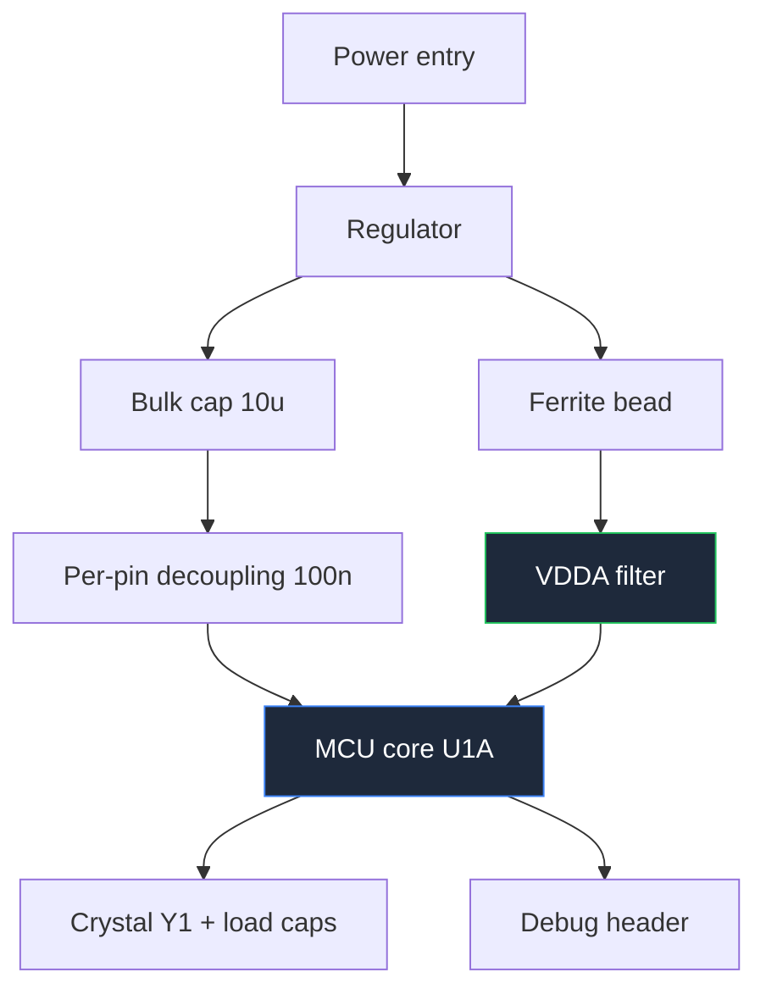

**Skematik mikrokontroler adalah jenis diagram sirkuit yang paling sulit digambar dengan baik, karena komponen di tengahnya memiliki lebih banyak pin daripada seluruh sisa papan digabungkan.** MCU 100-pin yang digambar sebagai satu persegi menghasilkan lembaran di mana setiap kawat menempuh empat kawat lainnya dan tidak ada yang bisa menemukan apa pun. Teknik-teknik dalam panduan ini ada untuk mencegah hal tersebut.

Ini adalah panduan domain yang paling menuntut dari enam panduan domain dalam [panduan lengkap kami untuk diagram sirkuit](/blog/complete-guide-to-circuit-diagrams/), dan di sinilah konvensi universal memberikan manfaat paling besar.

## Pisahkan MCU Menjadi Bagian Simbol Fungsional

Keputusan yang memberikan dampak paling besar dalam skematik mikrokontroler: jangan menggambar MCU sebagai satu simbol. Pisahkan menjadi beberapa bagian dari komponen fisik yang sama — `U1A`, `U1B`, `U1C` — masing-masing digambar sebagai persegi tersendiri, dikelompokkan berdasarkan fungsi.

Pemisahan yang umum:

| Bagian | Berisi | Ditempatkan dengan |
| :--- | :--- | :--- |
| **U1A — Inti** | Semua pin VDD/VSS, VDDA, VREF, reset, pin kristal, pin debug | Pohon daya dan kristal, lembar sendiri atau sudut |
| **U1B — Port A/B** | GPIO yang digunakan untuk sensor dan masukan | Rangkaian kondisioning sensor |
| **U1C — Port C/D** | GPIO yang digunakan untuk keluaran dan driver | Driver motor, relay, LED |
| **U1D — Komunikasi** | Pin UART, SPI, I²C, USB | Konektor dan pengubah level |

Manfaatnya berlipat ganda. Begitu pin daya dan kristal diisolasi dalam simbol mereka sendiri, jaringan desipulasi dapat ditempatkan di sebelahnya tanpa bersaing untuk ruang dengan empat puluh kawat GPIO. Begitu GPIO yang digunakan untuk kontrol motor berada dalam simbolnya sendiri, Anda dapat menempatkannya tepat di sebelah driver motor dan koneksi menjadi empat kawat paralel pendek alih-alih empat kawat yang menembus seluruh lembaran.

Aturan untuk memisahkan:

- **Setiap pin muncul tepat satu kali** di semua bagian. Menduplikasi pin menciptakan error netlist yang akan ditangkap oleh ERC, dan menghilangkan pin menciptakan pin yang tidak terhubung ke mana pun.
- **Gunakan referensi yang sama dengan sufiks huruf.** `U1A`, `U1B`, dan `U1C` adalah satu chip fisik; `U1`, `U2`, `U3` adalah tiga chip berbeda.
- **Tambahkan catatan pada setiap bagian** yang menyatakan rentang pin paket mana yang dicakupnya.
- **Pertahankan daya dalam satu bagian.** Menyebar pin VDD ke tiga simbol menghancurkan tujuannya.

Di dalam setiap persegi, atur pin **berdasarkan fungsi, bukan berdasarkan urutan fisik**. Masukan di kiri, keluaran di kanan, daya di atas, tanah di bawah, dan pin terkait dikelompokkan dengan celah visual kecil antar kelompok. Tulis nomor pin dalam teks kecil di batas dan nama pin dalam teks normal di dalam. Footprint menangani geometri fisik; simbol ada untuk dibaca.

## Notasi Bus

Ketika delapan atau lebih sinyal terkait berjalan bersama, satukan menjadi bus. Bus digambar sebagai satu garis yang lebih tebal berlabel dengan rentang: `D[0..7]`, `ADDR[0..15]`, `LCD[4..7]`.

Konvensi:

- **Labeli bus di kedua ujung** dengan rentang yang identik. Label tersebut yang membuat koneksi; garis hanyalah bantuan visual.
- **Garis serong memotong bus dengan lebar bit di sampingnya** — tanda standar untuk "ini adalah bundel, dan ini jumlahnya".
- **Pecahkan sinyal individual dengan cabang pendek ber sudut**, masing-masing dilabeli dengan nama anggotanya. Sudut tersebut yang membedakan pecahan bus dari simpul biasa.
- **Jangan pernah mencampur sinyal tidak terkait dalam satu bus.** Bus adalah sekelompok sinyal dengan tujuan bersama, bukan bundel kawat yang nyaman. Menempatkan `RESET` dalam bus data adalah kesalahan nyata, bukan hanya berantakan.

Buslah yang membuat antarmuka tampilan paralel atau memori dapat digambar. LCD karakter HD44780 16×2 dalam mode 4-bit membutuhkan `D4` hingga `D7` ditambah `RS` dan `E`. Digambar sebagai enam kawat individual, itu akan mengaburkan lembaran; digambar sebagai `LCD[4..7]` ditambah dua jalur kontrol bernama, itu membutuhkan satu baris dan langsung terbaca.

## Osilator Kristal

Rangkaian kristal kecil, dan di sinilah desain gagal secara misterius. Empat elemen, yang semuanya termasuk dalam gambar:

**Kristal** di antara dua pin osilator, `XIN` dan `XOUT` (atau `OSC_IN`/`OSC_OUT`). Beri anotasi frekuensi, spesifikasi kapasitansi beban, dan toleransi dalam ppm. Kapasitansi beban bukan informasi opsional — ia menentukan komponen selanjutnya.

**Dua kapasitor beban**, satu dari setiap pin kristal ke tanah. Nilainya diturunkan dari kapasitansi beban yang ditentukan kristal dan kapasitansi liar papan:

```
C1 = C2 = 2 × (C_load − C_stray)
```

Dengan kristal 10 pF dan sekitar 3 pF kapasitansi liar, masing-masing menghasilkan sekitar 14 pF. Tulis kedua `C_load` kristal dan nilai liar yang Anda asumsikan pada gambar, karena orang berikutnya yang mengganti kristal perlu tahu bagaimana Anda mendapatkan 14 pF.

**Resistor seri** di sisi `XOUT`, jika datasheet MCU memerlukannya. Ini membatasi level drive dan mencegah penggerakan berlebihan pada kristal. Beberapa keluarga membutuhkannya, beberapa tidak — periksa, dan jika Anda menghilangkannya, catatan bahwa Anda telah memeriksanya.

**Catatan tata letak.** Loop osilator harus secara fisik kecil dan dijaga oleh tanah. Skematik tidak dapat memaksakan itu, maka tulis: `KEEP CRYSTAL LOOP < 10 mm, GUARD WITH GROUND`. Ini adalah contoh paling jelas dalam seluruh desain embedded dari anotasi skematik yang hanya ada untuk mengontrol tata letak.

Gambar kristal dan dua kapasornya sebagai kelompok yang ketat dan simetris tepat di sebelah pin osilator MCU. Simetri bermakna — kapasitor beban yang asimetris menghasilkan drive yang asimetris — jadi jika gambar Anda tampak miring, perbaiki gambarnya.

## Desipulasi dan Pohon Daya

MCU dengan enam pin VDD membutuhkan enam kapasitor desipulasi, dan skematik adalah tempat hal itu ditentukan.

- **Satu 100 nF keramik per pasangan VDD/VSS**, digambar tepat di sebelah pin yang dilayaninya. Tidak dikelompokkan di sudut. Seluruh tujuan anotasi adalah untuk menunjukkan *kapasitor mana* milik *pin mana*, karena insinyur tata letak akan menempatkannya sesuai itu.
- **Satu kapasitor bulk 4,7 µF hingga 10 µF per perangkat**, digambar sekali di dekat masukan daya ke MCU.
- **Suplai analog terpisah.** `VDDA` mendapatkan ferit bead dari jalur digital ditambah 1 µF dan 100 nF miliknya sendiri. Gambar bead secara eksplisit, labeli `FB1`, dan beri anotasi impedansinya pada frekuensi yang Anda pedulikan. Gambar koneksi tanah analog sebagai satu titik ikatan yang disengaja ke tanah digital, dan labeli — skematik yang menggabungkan `AGND` dan `DGND` tanpa terlihat adalah skematik yang menjamin noise ADC.
- **Tegangan referensi** mendapatkan filter tersendiri, digambar sebagai kelompok kecil sendiri, dengan sumber referensi diberi anotasi.

Pola yang berguna adalah menggambar seluruh jaringan desipulasi sebagai blok berlabel sendiri pada lembar yang sama dengan bagian simbol inti, dengan catatan: `C4–C9: satu per pin VDD, tempatkan dalam 3 mm`. Sepuluh kapasitor berbaris dengan satu catatan yang jelas lebih mudah dibaca dan lebih dapat ditindaklanjuti daripada sepuluh kapasitor yang tersebar di sekitar persegi MCU.

**Jaringan reset:** pull-up 10 kΩ ke VDD ditambah kapasitor 100 nF ke tanah pada pin reset, dengan tombol reset dan jalur reset header debug bergabung pada simpul yang sama. Banyak MCU memiliki pull-up internal — jika Anda mengandalkannya, tulis itu pada gambar agar tidak ada yang menandai komponen yang hilang.

**Header debug:** tidak pernah opsional. Header SWD lima pin (`SWDIO`, `SWCLK`, `nRST`, `VDD`, `GND`) atau header ISP enam pin hampir tidak memerlukan biaya dan merupakan perbedaan antara papan yang dapat didebug dan tumpukan kertas. Gambar dengan pin satu ditandai dengan jelas.



## Rangkaian Driver Motor dan H-Bridge

H-bridge membalik tegangan melintasi motor menggunakan empat sakelar. Gambar sebagai huruf **H** yang sebenarnya — dua sakelar di atas terhubung ke suplai, dua di bawah terhubung ke tanah, dan motor melintang batang tengah. Bentuknya adalah penjelasannya, dan susunan lain akan sia-sia.

Anotasi yang harus muncul:

- **Pasangan diagonal mana yang menyala untuk arah mana.** Tabel pendek pada lembaran — `Q1+Q4 = maju, Q2+Q3 = mundur` — mengubah gambar menjadi dokumentasi.
- **Waktu mati.** Jika kedua sakelar dalam satu kaki menghantar secara bersamaan, mereka menghubungkan pendek suplai. Tulis `DEAD TIME ≥ 500 ns` di samping gerbang drive. Tidak ada simbol yang mengekspresikan batasan ini, sehingga teks harus melakukannya.
- **Dioda flyback atau penjepit** di setiap sakelar, kecuali perangkat memiliki dioda badan yang memadai dan Anda menyatakan demikian secara eksplisit.
- **Suplai motor dan logika terpisah.** Gambar `VMOTOR` dan `VLOGIC` sebagai jalur yang berbeda dengan label berbeda, dan tunjukkan titik tunggal di mana tanah mereka bertemu. Arus motor yang kembali melalui tanah logika adalah penyebab paling umum mikrokontroler mengatur ulang setiap kali motor mulai berputar.

Untuk driver terbungkus, gambar IC sebagai blok fungsional alih-alih bridge internal. **L293D** adalah yang klasik: dua bridge penuh dalam paket 16 pin, dengan suplai logika pada pin 16, suplai motor pada pin 8, pin enable 1 dan 9, empat masukan dan empat keluaran, dan empat pin tanah di tengah paket yang berfungsi ganda sebagai jalur heatsink. Dua detail yang layak dianotasi: sufiks `D` berarti dioda penjepit internal sudah termasuk — L293 biasa tidak memiliki, jadi jika Anda menggantinya, Anda harus menambahkan delapan dioda eksternal. Dan pin tanah tengah adalah jalur termal, jadi beri anotasi `PINS 4,5,12,13 — GROUND AND HEATSINK, CONNECT TO COPPER POUR`.

**L298N** membutuhkan dioda eksternal dan membawa keluar pin arus-sense, yang harus digambar dengan jalur sense tipis ke resistor shunt, persis seperti yang dibahas dalam [panduan rangkaian pengukuran dan pengujian](/blog/measurement-test-circuit-diagrams/).

Ketika driver menjadi **PCB** alih-alih modul, anotasi skematik yang dipertahankan adalah yang berkaitan dengan arus: tandai jalur motor tebal, catat arus puncak, letakkan kapasitor bulk pada pin suplai driver dan beri anotasi `place within 10 mm of VS`, dan tentukan titik ikatan tanah.

## Larutan Sensor: Gambar Satu, Catat Sisanya

Robot line-follower menggunakan tiga hingga lima sensor inframerah reflektif dalam satu baris. Setiap kanal identik: LED IR dengan resistor pembatas arus, fototransistor dengan pull-up, dan comparator atau koneksi langsung ke input ADC.

Jangan menggambar lima salinan identik. Gambar **satu kanal secara detail lengkap**, bungkus dalam kotak, dan labeli kotak itu `SENSOR CHANNEL — 5 PLACES, S1..S5`. Kemudian gambar empat sisanya sebagai blok berulang yang ringkas atau tabel referensi. Ini adalah praktik standar untuk rangkaian berulang dan jauh lebih mudah dibaca daripada lima salinan, karena pembaca hanya perlu memverifikasi topologi sekali.

Yang perlu dianotasi:

- **Jarak sensor** sebagai catatan mekanis, karena ini menentukan perilaku robot dan tidak terlihat dalam skematik.
- **Arus LED** dan apakah LED dikontrol atau selalu menyala.
- **Apakah keluaran analog atau thresholded.** Larutan yang memberi makan ADC dan larutan yang memberi makan comparator adalah desain berbeda; lembaran harus menyatakan yang mana.
- **Penolakan cahaya ambient**, jika desain memodulasi LED.

Aturan "gambar satu, catat sisanya" yang sama berlaku untuk matriks LED, bank relay, dan penguat multikanal.

## Raspberry Pi dan Desain Berbasis Modul

Ketika Raspberry Pi adalah prosesor, skematik berubah sifatnya: Anda tidak mendesain komputer, Anda mendesain apa yang terpasang padanya. Jadi gambar Pi sebagai **blok header 40-pin** dan tunjukkan hanya pin yang benar-benar Anda gunakan.

Aturan untuk desain berbasis modul:

- **Namakan setiap pin yang Anda gambar dengan nomor header dan nomor GPIO**, `PIN 12 / GPIO18`, karena keduanya muncul dalam perangkat lunak dan dokumentasi.
- **Anotasi level logika: 3,3 V, dan pin GPIO tidak tahan 5 V.** Ini adalah kesalahan paling merusak dalam proyek Pi. Setiap periferal 5 V membutuhkan pengubah level, yang digambar secara eksplisit.
- **Anotasi batas arus** — per-pin dan total — di sebelah blok header.
- **Tunjukkan daya Pi secara terpisah.** Suplai Pi sendiri bukan jalur yang Anda hasilkan secara sembarangan; anotasi kebutuhan arus.
- **Gambar pin header yang tidak terpakai sebagai catatan**, bukan sebagai empat puluh cabang yang tidak menuju ke mana pun.

**Mesin pemungutan suara elektronik** yang dibangun di atas Pi, pada level skematik, adalah sekumpulan tombol yang telah di-debounce dengan pull-up, tampilan, dan mungkin antarmuka pencetak atau penyimpanan. Rekayasa yang menarik ada di antarmuka tombol dan tampilan, jadi berikan detail itu dan gambar Pi sebagai blok. Debounce tombol dibahas dalam [panduan rangkaian sensor dan perlindungan](/blog/sensor-and-protection-circuit-diagrams/).

**Papan pemberitahuan IoT yang dikontrol web** juga sederhana dalam perangkat keras: Pi, antarmuka tampilan, suplai daya yang sesuai untuk keduanya, dan pengubahan level jika diperlukan. Nilai skematik adalah dokumentasi mode antarmuka tampilan, pin yang dikonsumsi, dan anggaran daya. Gambar tampilan sebagai blok dengan antarmuka yang dinamai — `SPI, 4-wire` atau `I²C, addr 0x3C` — karena mode antarmuka menentukan jumlah pin dan tidak dapat disimpulkan dari nomor suku cadang.

## Rangkaian Sistem Manajemen Baterai

Skematik BMS adalah tempat konvensi tegangan vertikal memberikan hasil terbaik, karena rangkaian secara harfiah adalah tangga tegangan.

**Gambar tumpukan sel secara vertikal**, sel paling positif di atas, negatif paket di bawah. Terminal positif setiap sel adalah simpul dalam urutan menaik, dan koneksi sense menyentuh simpul-simpul itu dalam urutan menaik yang sama. Digambar dengan cara ini, tangga itu bisa diperiksa sendiri: koneksi sense yang terhubung ke sel yang salah secara visual jelas karena memutus urutan monoton.

Elemen yang termasuk dalam gambar:

- **Titik sense per-sel**, digambar sebagai garis tipis dengan resistor seri kecil dan kapasitor filter di setiap titik. Anotasi nilai resistor sense — ini membatasi arus kesalahan ke IC monitor.
- **Penyeimbangan**, baik pasif (resistor dan sakelar di setiap sel) atau aktif. Gambar satu kanal penyeimbangan secara detail dan catat pengulangan, seperti pada larutan sensor. Anotasi arus penyeimbangan.
- **MOSFET proteksi.** Paket Li-ion secara konvensional menggunakan dua MOSFET N-channel back-to-back dalam jalur *negatif* — satu untuk pengisian, satu untuk pembuangan — sehingga dioda badan setiap perangkat memblokir satu arah. Gambar keduanya secara eksplisit dengan dioda badan mereka terlihat dan labeli `CHG` dan `DSG`, karena susunan back-to-back tampak seperti kesalahan bagi siapa pun yang belum melihatnya, dan mendapatkan orientasi yang salah menghasilkan paket yang tidak bisa dimatikan.
- **Shunt arus sense** dalam jalur negatif yang sama, dengan koneksi sense Kelvin digambar sebagai garis tipis.
- **Pengukuran suhu**, satu atau lebih termistor NTC digambar sebagai pembagi dengan penempatan fisik mereka dicatat — `mounted on cell 3 tab`. Penempatan adalah seluruh pengukuran, dan hanya catatan skematik yang mencatatnya.
- **Konektor paket dan jalur pra-charge**, jika ada.

Tambahkan catatan dalam kotak dengan kimia paket, jumlah sel, tegangan nominal dan maksimum, serta arus pengisian dan pembuangan maksimum. Skematik BMS tanpa angka-angka itu tidak dapat ditinjau, karena setiap ambang batas dalam desain diturunkan dari mereka.

## Daftar Periksa Skematik Mikrokontroler

1. MCU besar dipisahkan menjadi bagian simbol fungsional dengan referensi yang konsisten dan sufiks huruf.
2. Setiap pin paket muncul tepat satu kali di semua bagian.
3. Pin diatur berdasarkan fungsi dalam setiap simbol, dengan nomor pin di batas.
4. Satu 100 nF per pin VDD, digambar di sebelah pin tersebut, ditambah kapasitansi bulk.
5. `VDDA` difilter dengan ferit bead dan kapasitor sendiri; tanah analog dan digital disatukan pada satu titik yang digambar.
6. Kristal dengan dua kapasitor beban, nilai diturunkan dan ditunjukkan, ditambah catatan tata letak.
7. Jaringan reset digambar, termasuk ketergantungan pada pull-up internal sebagai catatan teks.
8. Header debug atau pemrograman hadir dengan pin 1 ditandai.
9. Bus dilabeli identik di kedua ujung, dengan slash lebar dan pecahan bersudut.
10. Driver motor digambar sebagai H, dengan tabel arah, catatan waktu mati, dan jalur suplai terpisah.
11. Rangkaian berulang digambar sekali dan diberi anotasi dengan multiplicitasnya.
12. Level logika dan batas arus modul dianotasi; pengubah level digambar jika diperlukan.
13. Pin yang tidak terpakai secara eksplisit dihubungkan atau ditandai tidak terhubung.
14. Setiap pin konektor diberi nomor dan suku cadang pasangannya ditentukan.

> Ujian untuk skematik mikrokontroler adalah apakah seseorang dapat menemukan rangkaian pendukung pin tertentu dalam waktu kurang dari sepuluh detik. Jika desipulasi untuk `VDD3` berjarak dua ratus milimeter dari `VDD3`, gambar telah gagal, tidak peduli seberapa benar netlistnya.

**[Mulai menggambar skematik Anda sendiri sekarang.](/editor/)** Simbol IC multi-bagian, bus, kristal, H-bridge, konektor, dan blok tampilan semuanya ada di pustaka, dan grid menjaga kelompok desipulasi tetap sejajar di sebelah pin yang dilayaninya. Jika proyek Anda dimulai dengan Arduino alih-alim MCU telanjang, [Arduino circuit maker](/arduino-circuit-maker/) memiliki pinout papan yang sudah digambar sebelumnya, dan [p converter schematic to breadboard](/schematic-to-breadboard/) mengubah gambar yang selesai menjadi panduan pembangunan.
