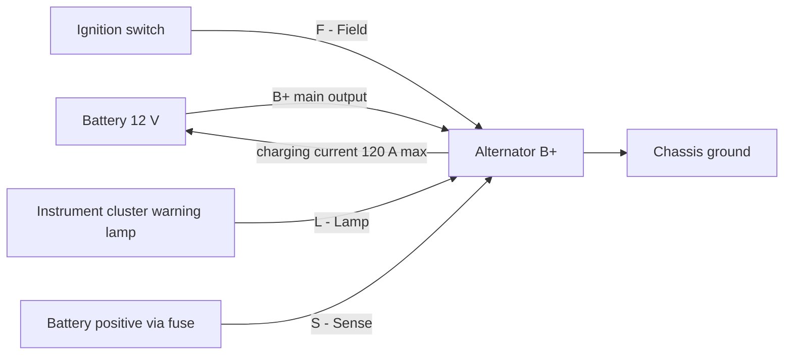
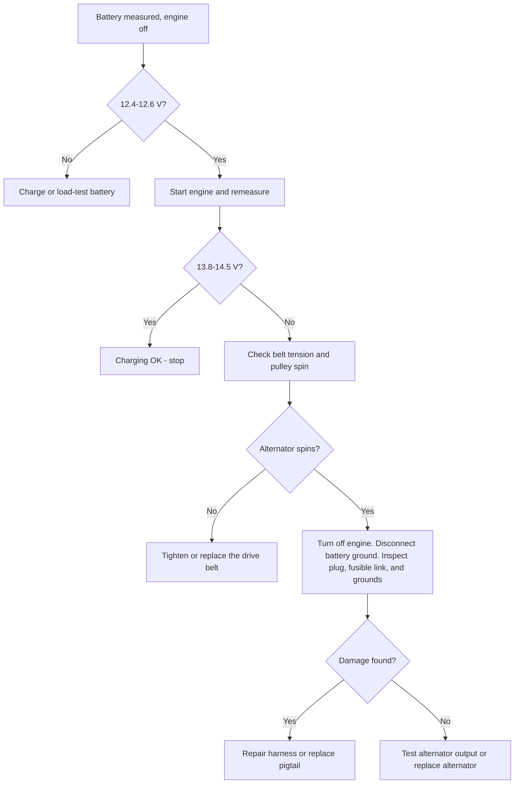
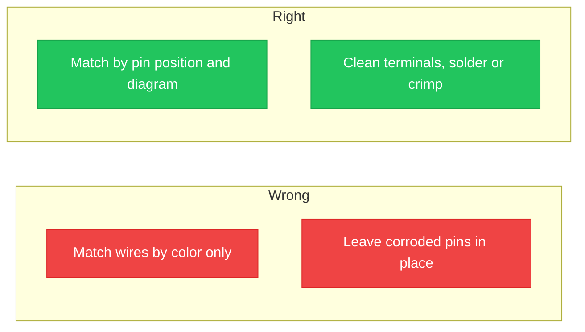

**<b>Diagram kabel alternator Kia Sedona 2005 adalah skema yang memetakan bagaimana alternator, baterai, regulator tegangan, dan kabel harness terhubung di dalam rangkaian pengisian daya.</b> Sistem pengisian menjaga baterai tetap terisi dan menyuplai sistem kelistrikan kapan pun mesin berjalan.

Diagram kabel adalah gambar dari rangkaian listrik. Gambar tersebut menunjukkan setiap terminal, kabel, warna, dan titik sambungan pada Kia Sedona 2005. Tata letak kabel dibaca dari terminal output utama B+ ke baterai, dan dari konektor kecil empat pin (kode pabrik **E-70**) ke panel instrumen, rangkaian pengapian, dan jalur sensus regulator.

Ada 3 manfaat utama membaca diagram kabel alternator:

1. Mendiagnosis kerusakan pengisian sebelum mengganti suku cadang
2. Menghubungkan kembali alternator baru atau pigtail dengan benar
3. Menghindari kerusakan pada regulator tegangan akibat koneksi yang salah

Diagram ini memiliki 4 penggunaan utama: penggantian alternator, pemecahan masalah sistem pengisian, perbaikan harness dan konektor, dan pemeriksaan tegangan terhadap output tertinggi. Tata letak kabel memiliki 5 bagian utama: alternator, baterai, regulator tegangan internal, rangkaian lampu pengisian, dan kabel harness yang menghubungkannya.

Sistem pengisian Sedona V6 2005 memiliki peringkat sekitar 120 ampere (A) pada 12 volt (V). Sistem yang sehat mengisi pada 13,8–14,5 V diukur melintasi baterai saat mesin berjalan.

## Memahami Diagram Kabel Alternator

Alternator mengubah energi mekanis putar dari mesin yang disalurkan melalui belt serpentine menjadi daya listrik. Rotor berputar di dalam stator dan menghasilkan arus bolak-balik (AC). Dioda penyearah mengubah AC menjadi arus searah (DC). Regulator tegangan menahan output dalam kisaran 13,8–14,5 V.

Tata letak diagram kabel menempatkan alternator di bagian tengah dengan 2 titik sambungan: satu terminal B+ dan satu konektor multi-pin. Garis pada diagram merepresentasikan kabel. Setiap garis membawa label warna yang sesuai dengan harness pabrik. Baca kabel pengisian berat dari baterai ke terminal B+ terlebih dahulu, lalu lacak rangkaian konektor kecil ke tujuannya.

| Terminal | Nama | Fungsi pada Sedona 2005 |
| :--- | :--- | :--- |
| **B+** | Output utama | Kabel berukuran besar ke positif baterai melalui fusible link. Aktif kapan pun baterai terhubung. |
| **S** | Sensus | Membawa tegangan baterai kembali ke regulator internal. |
| **L** | Lampu | Menggerakkan lampu peringatan pengisian dan menyalakan medan saat startup. |
| **F** | Medan / pengapian | Mengaktifkan pengisian saat kunci kontak diputar ke posisi ON. |
| **GND** | Ground balik | Ground negatif baterai melalui sasis. |

> Sedona 2005 menggunakan regulator tegangan internal. Jangan pernah menghubungkan regulator eksternal dan jangan pernah melewati colokan konektor untuk menjalankan kabel medan secara langsung.

## Kode Warna dan Fungsi Kabel

Diagram kabel Kia mengidentifikasi setiap kabel dengan kode warna dua karakter. Warna dasar ditulis terlebih dahulu dan warna garis ditulis kedua. Manual pabrik Sedona 2005 menggunakan kode-kode ini:

| Kode | Warna | Kode | Warna |
| :--- | :--- | :--- | :--- |
| **B** | Hitam | **O** | Oranye |
| **W** | Putih | **P** | Merah muda |
| **R** | Merah | **Br** | Cokelat |
| **G** | Hijau | **Gr** | Abu-abu |
| **L** | Biru | **Y** | Kuning |
| **Lg** | Hijau muda | **Pp** | Ungu |

Kode seperti W/B dibaca sebagai kabel putih dengan garis hitam, dan B/W dibaca sebagai kabel hitam dengan garis putih. Mengikuti kode warna selama perbaikan mencegah koneksi terbalik yang dapat merusak regulator.

Pada konektor alternator, rangkaian blok kecil membawa fungsi-fungsi berikut:

- Rangkaian **L** — menyuplai lampu pengisian; biasanya kabel merah atau hitam pada colokan
- Rangkaian **S** — sensus; biasanya putih
- Rangkaian **F** — medan; biasanya biru
- **GND** — ground balik baterai; biasanya hitam

> Pigtail penggantian dikirim dengan warna yang berbeda dari harness pabrik. Cocokkan fungsi kabel berdasarkan posisi pin konektor, bukan berdasarkan warna. Baca nomor pin pada permukaan konektor sebelum menyambung.

Kabel output B+ berjalan pada 6 AWG (13,3 mm²) dan tetap aktif kapan pun baterai terhubung, bahkan saat pengapian mati.

## Masalah Umum dan Tips Pemecahan Masalah

Ada 6 gejala umum gangguan kabel alternator pada Sedona 2005:

1. Lampu peringatan pengisian tetap menyala saat berkendara
2. Lampu depan meredup saat idle dan terang seiring kecepatan mesin
3. Baterai terkuras semalaman
4. Aksesoris listrik berkedip-kedip
5. Bau terbakar di colokan alternator
6. Mesin mogok atau gagal dihidupkan kembali

Masalah umum terjadi pada 5 titik dalam rangkaian pengisian: colokan alternator, sambungan baterai, fusible link, belt serpentine, dan ground strap.

**Nilai referensi sistem pengisian:**

| Pemeriksaan | Pembacaan Sehat |
| :--- | :--- |
| Tegangan baterai, mesin mati | 12,4–12,6 V |
| Tegangan baterai, mesin berjalan | 13,8–14,5 V |
| Output tertinggi alternator | 120 A |

Ikuti panduan pemecahan masalah langkah demi langkah secara berurutan:

1. Ukur baterai dengan mesin mati. Pembacaan di bawah 12,4 V berarti baterai terkuras atau rusak. Isi atau lakukan uji beban pada baterai terlebih dahulu.
2. Hidupkan mesin dan ukur kembali di baterai. Sistem pengisian yang sehat menunjukkan 13,8–14,5 V.
3. Jika tegangan tetap mendekati nilai istirahat, periksa ketegangan belt serpentine dan pastikan puli alternator berputar bersama mesin.
4. Matikan mesin, lepaskan terminal negatif baterai, dan periksa konektor dan kabel harness dari plastik yang meleleh, korosi, atau pin yang gosong.
5. Periksa fusible link antara terminal B+ dan baterai untuk link yang putus.
6. Uji ground strap mesin ke sasis untuk resistensi tinggi pada sambungan baterai.
7. Hubungkan kembali semuanya, hidupkan mesin, dan pastikan lampu pengisian mati.

> Jika alternator pengganti tetap tidak mengisi daya, kerusakan terletak pada kabel harness atau ground, bukan pada alternator baru. Uji rangkaian konektor sebelum mengganti suku cadang untuk kedua kalinya.

## Alat Bantu Visual dan Diagram

Tata letak kabel di bagian atas panduan ini menunjukkan jalur B+ melalui fusible link dan rangkaian konektor E-70. Gambar di bawah memetakan setiap terminal alternator ke fungsinya dan warna kabel yang umum:

Diagram ini menunjukkan 5 terminal: B+, L, S, F, dan GND. Setiap kartu mencantumkan huruf terminal, nama rangkaian, dan pekerjaan fisik yang dilakukan kabel dalam tata letak kabel. Gunakan gambar selama perbaikan untuk mengonfirmasi fungsi setiap kabel sebelum menghubungkan kembali.

Kesalahan kabel umum muncul sebagai kebiasaan yang salah atau benar. Bandingkan kedua kolom:

Ada 4 kesalahan kabel umum yang harus dihindari:

1. Mencocokkan rangkaian konektor kecil berdasarkan warna bukan posisi pin
2. Menggunakan kembali pigtail yang meleleh atau berkarat
3. Membiarkan mur terminal B+ longgar atau terlalu kencang
4. Melewati pelepasan negatif baterai dan terjadinya loncatan busur dari terminal B+ ke bodi

## Tindakan Keselamatan

Lepaskan terminal negatif baterai sebelum menyentuh kabel alternator mana pun. Terminal B+ membawa tegangan penuh baterai setiap saat, dan kunci pas yang menyentuh terminal dan bodi alternator akan terjadi loncatan busur yang ganas.

Ikuti 8 tindakan keselamatan berikut:

1. Lepaskan terminal negatif baterai terlebih dahulu dan hubungkan kembali terakhir
2. Gunakan perkakas berinsulasi di sekitar terminal B+
3. Lepaskan perhiasan logam sebelum bekerja
4. Kenakan kacamata keselamatan
5. Bekerja pada mesin yang dingin; bodi alternator menjadi panas
6. Jauhkan percikan api dari baterai; gas hidrogen mudah terbakar
7. Kencangkan mur B+ sesuai spesifikasi
8. Periksa polaritas kembali sebelum menghubungkan kembali baterai

> Kabel negatif baterai memberikan ground ke seluruh bodi. Melepaskannya mengisolasi rangkaian pengisian dan merupakan langkah paling penting sebelum perbaikan kelistrikan apa pun.

## Kesimpulan

Memahami diagram kabel alternator Sedona menjaga sistem pengisian tetap andal dan membuat perbaikan DIY lebih aman. Tata letak kabel memetakan 5 bagian utama, menunjukkan output B+ ke baterai, dan melacak rangkaian konektor kecil ke lampu pengisian, sensus, dan medan.

Baca kode warna sebelum menyentuh kabel apa pun. Mengikuti langkah-langkah pemecahan masalah mengisolasi masalah umum pada colokan alternator, fusible link, sambungan baterai, belt, dan ground. Terapkan tindakan keselamatan sebelum bekerja pada sistem kelistrikan.

Jika kerusakan pengisian tetap terjadi setelah pemeriksaan kabel, mintalah bantuan profesional. Regulator tegangan yang salah kabel akan merusak alternator, dan teknisi dengan data harness pabrik dapat mengisolasi kerusakan lebih cepat.

Untuk latihan, buat dan simpan skema sistem pengisian Anda sendiri di editor browser gratis: [buka editor rangkaian](/editor/).