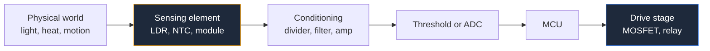

**Desain sirkuit antarmuka sensor adalah titik di mana posisi skematik berhenti menjadi kosmetik dan mulai menjadi dokumentasi.** Sebuah resistor 10 kΩ yang digambar di atas node adalah pull-up. Resistor yang sama persis yang digambar di bawah node yang sama adalah pull-down. Komponen yang sama, nilai yang sama, fungsi yang berlawanan — dan satu-satunya hal yang memberitahu pembaca mana yang Anda maksud adalah di mana Anda meletakkannya di halaman.

Itu menjadikan lapisan antarmuka antara dunia fisik dan mikrokontroler Anda sebagai tempat terbaik untuk mempelajari disiplin skematik. Panduan ini mencakup pull-up dan divider, front-end sensor, tahap switching, debounce, dan sirkuit perlindungan. Panduan ini membangun konvensi tata letak dari [panduan lengkap sirkuit diagram](/blog/complete-guide-to-circuit-diagrams/).

## Posisi Mengkodekan Fungsi

Sumbu vertikal sebuah skematik merepresentasikan potensial. Diterapkan pada sirkuit antarmuka, ini memberikan konvensi yang tidak dapat dilanggar:

| Komponen | Cara Menggambar | Kesimpulan Pembaca |
| :--- | :--- | :--- |
| **Resistor pull-up** | Vertikal, dari node naik ke simbol suplai | Node dalam kondisi high saat diam |
| **Resistor pull-down** | Vertikal, dari node turun ke ground | Node dalam kondisi low saat diam |
| **Resistor seri** | Horizontal, pada jalur sinyal | Pembatas arus atau pencocokan impedansi |
| **Kapasitor bypass** | Vertikal, dari node turun ke ground | Penyaringan noise |
| **Divider** | Dua resistor vertikal dalam satu kolom, tap di tengah | Penskalaan tegangan |

Gambar pull-up secara horizontal ke samping dan pembaca harus menelusuri kabel untuk mengetahui ke mana ia pergi. Gambar secara vertikal ke atas ke simbol `VCC` dan tidak ada yang perlu ditelusuri. Informasinya ada dalam geometri.

Nilai yang perlu ditulis anotasi daripada diasumsikan:

- **10 kΩ** adalah pull-up default untuk input logika umum atau tombol.
- **4.7 kΩ** adalah pull-up I²C standar pada 100 kHz di bus pendek; turunkan ke 2.2 kΩ untuk 400 kHz atau jejak yang lebih panjang. Pull-up I²C wajib karena bus bersifat open-drain — perangkat hanya bisa menarik ke bawah, tidak pernah ke atas. Gambar kedua pull-up `SDA` dan `SCL` bersebelahan di dekat bus master dan beri label blok `I2C PULL-UPS`.
- **100 kΩ atau lebih tinggi** untuk desain daya rendah di mana arus pull-up penting.
- **Pull-up internal** tersedia di sebagian besar pin mikrokontroler. Jika Anda mengandalkannya, tulis catatan pada skematik: `PA3 menggunakan pull-up internal — tidak ada komponen eksternal`. Jika tidak, reviewer berikutnya menandai resistor yang hilang, atau lebih buruk lagi, menambahkan satu.

## Divider Tegangan dan Sensor Resistif

Sebagian besar sensor murah hanyalah resistor yang berubah nilainya. Untuk membaca dengan ADC, Anda mengubah resistansi menjadi tegangan dengan divider:

```
Vout = Vin × R2 / (R1 + R2)
```

Keputusan desain adalah kaki mana yang menahan sensor, dan itu menentukan arah pergerakan output.

### Sirkuit Detektor Cahaya LDR

Sebuah resistor yang bergantung pada cahaya (LDR) turun ke beberapa ratus ohm dalam cahaya terang dan naik ke ratusan kiloohm dalam kegelapan.

- **LDR di atas, resistor tetap ke ground:** output naik seiring cahaya meningkat. Terang sama dengan high.
- **Resistor tetap di atas, LDR ke ground:** output turun seiring cahaya meningkat. Terang sama dengan low.

Keduanya adalah sirkuit yang benar. Hanya satu yang sesuai dengan firmware Anda. Jadi skematik harus menunjukkan susunan secara tegas — dan karena keduanya hanyalah "dua resistor dalam satu kolom", *satu-satunya* cara untuk membuatnya tidak ambigu adalah menggambar mereka dalam urutan fisik yang benar dengan tap ditandai dengan jelas dan menulis anotasi tujuan: `bright → high` di samping tap. Satu label teks mencegah sekelompok bug yang memakan waktu seharian.

Pilih resistor tetap sebagai kira-kira nilai geometris rata-rata dari resistansi gelap dan terang LDR, dan tulis kedua titik ujung pada gambar: `LDR: 1k bright / 200k dark`. Itu adalah tujuan desain yang tidak dapat diungkapkan oleh nomor komponen.

### Sirkuit Termostat Termistor

Sebuah termistor NTC menurun resistansinya saat memanas. Termostat mengubahnya menjadi keputusan switching, dan skematik terbaca sebagai empat blok dari kiri ke kanan:

1. **Divider.** NTC ditambah resistor tetap, tap ke komparator.
2. **Setpoint.** Divider potensiometer yang memberi input komparator lainnya. Gambar sebagai cerminan dari divider sensor — simetri memberitahu pembaca bahwa kedua tegangan ini sedang dibandingkan.
3. **Komparator dengan histeresis.** Resistor dari output kembali ke input **non-inverting**. Tanpa itu, relay akan bergetar di ambang batas. Karena ini umpan balik positif, ia menuju ke input `+`, dan itu terlihat dalam gambar jika label input Anda jujur.
4. **Tahap output.** Transistor atau MOSFET yang menggerakkan kumparan relay.

Dua detail yang perlu ada pada gambar: komparator seperti LM393 memiliki **output open-collector** dan membutuhkan resistor pull-up — gambarkan, karena komponen akan tampak tidak berfungsi tanpanya. Dan tulis anotasi lebar histeresis dalam derajat atau milivolt di samping resistor umpan balik, karena nilai resistor tersebut adalah satu-satunya tempat spesifikasi itu berada.

### Modul Sensor Adalah Blok, Bukan Sirkuit

Sebuah detektor gerak PIR seperti HC-SR501 yang umum adalah modul: sensor piroelektrik, penguat, komparator, dan timer yang sudah dirakit di papan kecil dengan tiga pin. Jangan mencoba menggambar bagian dalamnya.

Gambar sebagai **persegi panjang berlabel** dengan pin yang dinamai berdasarkan fungsi — `VCC`, `OUT`, `GND` — dan tulis anotasi fakta listrik yang bergantung pada sirkuit Anda:

- Rentang suplai dan arus yang ditarik.
- Level logika output. Banyak modul PIR menghasilkan logika 3,3 V bahkan saat ditenagai dari 5 V, yang sangat penting jika Anda memberi input 5 V yang mengharapkan sinyal penuh.
- Perilaku output: level yang tetap high selama periode retrigger yang dapat disesuaikan, bukan pulsa.
- Setiap penyesuaian onboard (sensitivitas, penundaan) sebagai catatan, karena itu bukan komponen skematik tetapi merupakan instruksi pembuatan.

Perlakuan yang sama berlaku untuk pengukur jarak ultrasonik, modul breakout IMU, dan modul GPS. Sebuah blok dengan pin bernama dan level beranotasi adalah skematik yang *lebih baik* daripada gambar internal palsu, karena mendeskripsikan apa yang sebenarnya dapat Anda kendalikan.



## Sirkuit Switching MOSFET

Pin mikrokontroler hanya dapat menghasilkan beberapa miliampere. Sesuatu yang nyata — motor, relay, strip LED — membutuhkan sakelar, dan untuk beban DC itu berarti MOSFET.

### Switching N-Channel Low-Side

Topologi default, dan yang paling mudah digambar dengan benar:

- **Beban antara rel positif dan drain.** Beban di atas, transistor di bawahnya — sesuai dengan konvensi arus dari atas ke bawah.
- **Source langsung ke ground.**
- **Gate digerak dari GPIO melalui resistor seri**, biasanya 22 Ω hingga 220 Ω. Ini meredam gema dan membatasi arus yang harus disuplai pin ke kapasitansi gate.
- **Pull-down gate 10 kΩ hingga 100 kΩ.** Ini adalah komponen yang paling sering dihilangkan. Saat mikrokontroler dalam reset, pin-impedansinya tinggi dan gate mengambang — yang dapat sebagian menyalakan MOSFET. Pull-down menjamin beban mati saat daya menyala. Gambar secara vertikal turun ke ground dari node gate, tempat fungsinya tidak salah lagi.
- **Dioda flyback di seluruh beban induktif**, katode ke rel positif. Gambar tepat di samping beban, paralel dengannya, membentuk loop tertutup yang terlihat dengan kumparan. Loop itu adalah jalur arus saat medan runtuh, dan jika tidak ada di gambar, ia tidak akan ada di papan, dan MOSFET akan mati.

Anotasi yang penting: ambang gate. MOSFET "logic level" adalah yang dispesifikasi untuk menyala penuh pada tegangan gate yang Anda miliki sebenarnya. Tulis `VGS(th) ≤ 2.5 V — logic level required` di samping simbol saat menggerakkan dari 3,3 V. MOSFET standar yang dispesifikasi pada 10 V akan mengkonduksi sebagian pada 3,3 V, menjadi panas, dan gagal perlahan — mode kegagalan terburuk yang ada. Juga tulis anotasi `RDS(on) at VGS = 3.3 V`, bukan angka utama dari halaman depan datasheet.

### Switching P-Channel High-Side

Saat beban harus memiliki koneksi ground tetap, Anda mengubah sisi positif dengan MOSFET P-channel: source ke rel positif, drain ke beban, beban ke ground.

Aturan menggambar sedikit berubah. Transistor sekarang berada **di atas** beban, yang benar — arus masih mengalir dari atas ke bawah. Gate harus ditarik *di bawah* source untuk menyala, sehingga sirkuit penggerak biasanya mencakup transistor N-channel atau output open-drain yang menarik gate ke bawah, ditambah resistor pull-up dari gate ke source untuk mematikannya secara default. Gambar pull-up itu sebagai resistor vertikal pendek antara gate dan source; itu adalah padanan P-channel dari pull-down gate N-channel, dan menghilangkannya memiliki konsekuensi yang sama.

## Sirkuit Debounce Sakelar

Sakelar mekanis tidak menutup sekali. Ia menutup, memantul terbuka, menutup lagi — biasanya selama 1 hingga 20 ms. Mikrokontroler yang melakukan polling cukup cepat melihat ledakan penekanan.

Tiga solusi perangkat keras, dalam urutan kualitas menaik:

**Filter RC saja.** Resistor pull-up, sakelar ke ground, resistor seri ke kapasitor ke ground, dan node yang sudah difilter ke pin input. Pilih `R × C` sekitar 10 ms hingga 50 ms. Kelemahannya adalah tepi yang difilter lambat, dan memberi tepi lambat ke input logika biasa dapat menyebabkan input bergetar saat melewati ambang batas. Dapat diterima untuk ADC mikrokontroler atau polling lambat; tidak untuk clock atau input interupsi.

**Filter RC ditambah Schmitt trigger.** Solusi umum yang benar. Node yang difilter memberi input Schmitt-trigger seperti inverter 74HC14, yang histeresisnya mengubah ramp lambat menjadi satu tepi cepat yang bersih. Gambar simbol Schmitt dengan glyph histeresisnya di dalam badan buffer — bentuk langkah kecil itu adalah seluruh tujuan komponen, dan menggantinya dengan simbol buffer biasa diam-diam menghapus desain.

**Sakelar SPDT ditambah latch SR.** Debounce yang sempurna. Sakelar single-pole double-throw ditambah dua gerbang NAND yang saling terhubung menahan pada kontak pertama dan mengabaikan semua pantulan berikutnya. Ia membutuhkan sakelar tiga-terminal, itulah mengapa kurang umum. Gambar latch dalam konfigurasi bersilang konvensional sehingga dapat dikenali, seperti yang dijelaskan dalam [panduan sirkuit diagram gerbang logika](/blog/logic-gate-circuit-diagrams/).

Berapa pun yang Anda gunakan, tulis anotasi konstanta waktu pada gambar — `RC ≈ 22 ms` — karena angka itu adalah spesifikasi dan komponen hanyalah implementasinya.

## Perlindungan Polaritas Terbalik

Seseorang akan menghubungkan baterai secara terbalik. Dua jawaban standar, dan gambarnya berbeda dengan cara yang instruktif.

**Dioda seri.** Satu dioda pada rel positif, anoda ke baterai. Sederhana, jelas benar dari simbol saja, dan biayanya adalah penurunan forward — 0,7 V untuk silikon, 0,3 V untuk Schottky. Pada rel 12 V itu dapat diterima; pada baterai 3,7 V itu merupakan bagian signifikan dari anggaran energi Anda. Tulis anotasi penurunan dan rating arus.

**MOSFET P-channel "dioda ideal".** MOSFET P-channel pada rel positif dengan gate dirujuk ke ground melalui resistor, ditambah penjepit Zener melintasi gate-source untuk melindungi gate pada rel tegangan tinggi. Penurunan menjadi `I × RDS(on)`, sering kali beberapa milivolt.

Versi MOSFET memiliki perangkap khusus yang harus ada di setiap tinjauan skematik: **sirkuit ini berfungsi karena arah dioda body internal MOSFET, dan dioda body digambar sebagai bagian dari simbol.** Orientasi transistor yang salah membuat Anda membangun sesuatu yang either memblokir arus normal atau mengkonduksi arus terbalik — dan dalam kedua kasus skematik tampak sepenuhnya masuk akal. Gambar dioda body secara eksplisit, beri label source dan drain berdasarkan nama pada simbol, dan verifikasi orientasi berdasarkan datasheet bukan berdasarkan ingatan Anda tentang simbol. Kemudian tulis anotasi tugas Zener, karena Zener melintasi gate-source tampak dekoratif sampai Anda mengetahui ia ada untuk mencegah oksida gate gagal pada 30 V.

## Perlindungan Overvoltage

Tiga topologi, tiga gambar yang sangat berbeda:

| Pendekatan | Komponen | Perilaku | Catatan Menggambar |
| :--- | :--- | :--- | :--- |
| **Penjepit Zener atau TVS** | Resistor seri ditambah Zener/TVS paralel ke ground | Menyerap transien, membatasi tegangan | Gambar perangkat paralel secara vertikal ke ground, tepat di input |
| **Crowbar** | SCR yang dipicu oleh Zener, ditambah sekring | Sengaja menkorat rel dan meledakkan sekring | Gambar sekring — sirkuit tidak lengkap dan berbahaya tanpanya |
| **Pemutusan seri** | FET N-channel pada rel, kontrol komparator | Membuka rel di atas ambang batas | Gambar divider sensing tipis, jalur daya tebal |

Dua aturan umum. **Komponen perlindungan ditempatkan di konektor**, digambar sebagai item paling kiri pada lembar, sebelum apa pun yang mereka lindungi — urutan gambar harus sesuai dengan urutan listrik sehingga pembaca dapat melihat bahwa tidak ada yang melewati perlindungan. Dan **tulis anotasi tegangan penjepit dan rating energi**, karena nomor komponen TVS mengkodekan keduanya dan tidak ada reviewer yang menghafal nomor komponen TVS.

Khususnya untuk crowbar, sekring tidak opsional dan bukan detail: SCR mengunci dan tetap menyala, sehingga sekring adalah satu-satunya yang mengakhiri kejadian. Skematik crowbar tanpa sekring mendeskripsikan sirkuit yang menghancurkan dirinya sendiri.

## Daftar Periksa Skematik Antarmuka

1. Setiap pull-up digambar secara vertikal ke atas ke simbol suplai; setiap pull-down secara vertikal ke bawah ke ground.
2. Ketergantungan pada pull-up internal mikrokontroler dicatat dalam teks.
3. Pull-up I²C ada, dikelompokkan dan diberi label.
4. Tap divider ditandai dengan jelas dengan arah output — `bright → high`, `hot → low`.
5. Titik ujung sensor dianotasi: resistansi gelap dan terang, rentang suhu, level logika output modul.
6. Modul digambar sebagai blok berlabel dengan pin dinamai berdasarkan fungsi, tidak pernah sebagai bagian internal yang dibuat-buat.
7. Setiap gate MOSFET memiliki resistor seri dan pull-down atau pull-up ke kondisi default-off.
8. Persyaratan ambang gate dianotasi saat tegangan penggerak adalah 3,3 V atau 5 V.
9. Dioda flyback di seluruh beban induktif, digambar paralel dengan beban, katode ke rel positif.
10. Konstanta waktu debounce dianotasi; simbol Schmitt trigger digambar dengan glyph histeresis.
11. Komponen perlindungan digambar di konektor, upstream dari semua yang mereka lindungi.
12. Sirkuit crowbar menyertakan sekring.
13. Output open-collector komparator diberi pull-up.

**[Mulai menggambar skematik Anda sendiri sekarang.](/editor/)** LDR, termistor, MOSFET, Schmitt trigger, relay, Zener, dan sakelar semuanya ada di perpustakaan komponen, dan grid menjaga divider tetap selaras dalam kolom vertikal yang rapi. Setelah front-end sensor Anda digambar, [panduan tata letak skematik mikrokontroler](/blog/microcontroller-circuit-diagrams/) membahas pemasangannya ke MCU, dan [panduan desain sirkuit catu daya](/blog/power-supply-circuit-diagrams/) membahas rel yang men-suplai keduanya.
