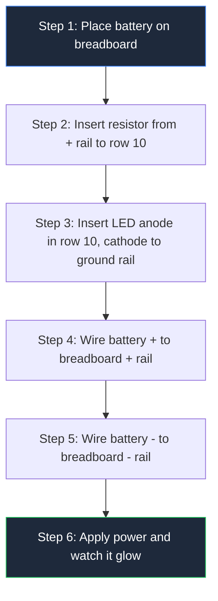
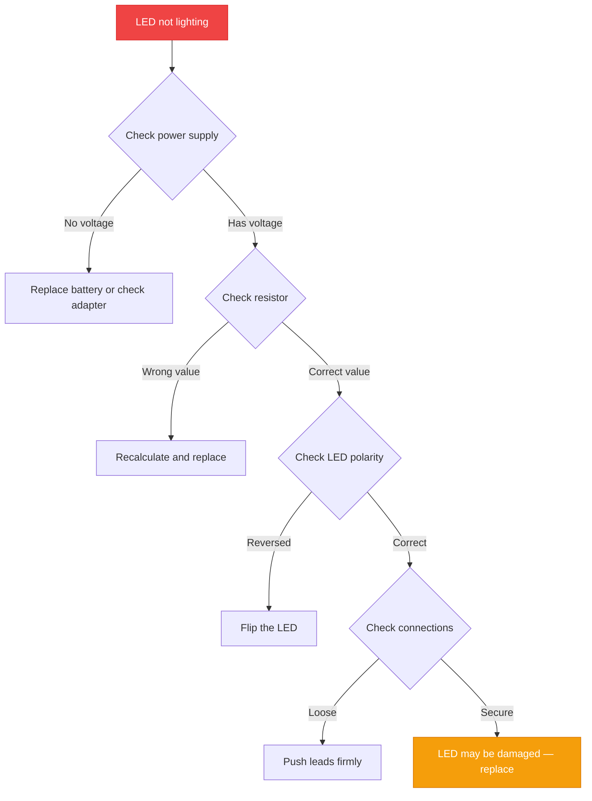

**Membuat sirkuit driver LED sederhana hanya membutuhkan 3 komponen, 5 menit, dan tanpa pengalaman sebelumnya.** Panduan ini akan memandu Anda melalui setiap langkah — mulai dari memilih komponen hingga menguji sirkuit yang sudah jadi — sehingga Anda dapat menyalakan LED pertama tanpa membakarnya. Jika Anda baru mengenal elektronik, mulailah dengan panduan [diagram sirkuit untuk pemula](/blog/circuit-diagram-for-beginners/) untuk mempelajari dasar-dasarnya sebelum membangun proyek ini.


## Mengapa LED Terbakar Tanpa Driver

LED adalah **perangkat yang membutuhkan arus besar**. Berbeda dengan lampu pijar, LED tidak memiliki resistansi internal untuk memperlambat aliran listrik. Jika Anda menghubungkan baterai 9V langsung ke LED, LED akan menarik arus tanpa batas — lalu mati dalam hitungan detik.

Sirkuit driver LED menyelesaikan masalah ini. Sirkuit ini berada di antara suplai daya dan LED, mengontrol secara tepat berapa banyak arus yang mengalir melaluinya. Versi paling sederhana menggunakan **satu resistor**.

> **Aturannya:** Setiap LED membutuhkan resistor pembatas arus. Tidak ada pengecualian.

## Yang Anda Butuhkan (Daftar Komponen)

| Komponen | Spesifikasi | Fungsi |
|-----------|--------------|---------|
| **Suplai Daya** | Baterai 9V atau adaptor USB 5V | Menyediakan tegangan |
| **LED** | 5mm merah (atau warna apa pun) | Memancarkan cahaya |
| **Resistor** | 330Ω (1/4W) | Membatasi arus |
| **Breadboard** | Ukuran apa pun | Platform prototipe |
| **Kabel Jumper** | 4x male-to-male | Koneksi |

**Total biaya:** Kurang dari $2 di sebagian besar toko elektronik.

## Memahami Spesifikasi LED (Dua Angka yang Paling Penting)

Setiap LED memiliki dua spesifikasi kritis yang tertera pada datasheet-nya:

**Tegangan Maju (Vf)** — Penurunan tegangan pada LED saat menyala. Setiap warna memiliki nilai yang berbeda:

| Warna LED | Tegangan Maju |
|-----------|----------------|
| Merah | 1.8V – 2.2V |
| Kuning | 2.0V – 2.2V |
| Hijau | 2.0V – 3.0V |
| Biru | 3.0V – 3.5V |
| Putih | 3.0V – 3.5V |

**Arus Maju (If)** — Arus yang dibutuhkan LED untuk menghasilkan cahaya. Sebagian besar LED standar beroperasi pada **20mA (0.02A)**.

> **Tips singkat:** Paket LED itu sendiri memberi tahu Anda polaritasnya. **Kaki yang lebih panjang** adalah anoda (+). **Tepi rata** pada badan LED menandai katoda (−).

## Perhitungan Resistor (Satu Rumus)

Nilai resistor mengikuti <a href="https://en.wikipedia.org/wiki/Ohm%27s_law" rel="nofollow noopener" target="_blank">Hukum Ohm</a>:

$$R = \frac{V_{supply} - V_{LED}}{I_{LED}}$$

**Contoh: LED merah dengan baterai 9V**

```
V_supply = 9V
V_LED    = 2V
I_LED    = 0.02A

R = (9V - 2V) / 0.02A = 350Ω
```

Gunakan nilai standar terdekat: **330Ω atau 360Ω**.

**Contoh: LED biru dengan USB 5V**

```
R = (5V - 3.2V) / 0.02A = 90Ω → Gunakan 100Ω
```

**Contoh: LED putih dengan suplai 12V**

```
R = (12V - 3.3V) / 0.02A = 435Ω → Gunakan 470Ω
```

### Pengecekan Daya

Resistor juga perlu menangani panas yang dihasilkannya:

```
P = V × I = 7V × 0.02A = 0.14W
```

Resistor standar **1/4W (0.25W)** dapat menangani ini dengan aman.

## Membangunnya: Langkah demi Langkah



### Langkah 1: Pasang Baterai

Pasang baterai 9V pada konektornya. Hubungkan **kabel merah** (positif) ke **rel merah (+)** pada breadboard. Hubungkan **kabel hitam** (negatif) ke **rel biru (−)**.

### Langkah 2: Masukkan Resistor

Masukkan salah satu kaki resistor 330Ω ke **rel +**. Masukkan kaki lainnya ke **baris 10** (lubang mana pun di baris tersebut).

### Langkah 3: Hubungkan LED

Identifikasi kaki LED. **Kaki yang lebih panjang** adalah anoda (+). Masukkan anoda ke **baris 10** (baris yang sama dengan resistor). Masukkan katoda (kaki yang lebih pendek) ke **rel −**.

### Langkah 4: Uji

LED seharusnya menyala stabil. Jika tidak:

- **Periksa polaritas** — Balik LED
- **Periksa koneksi** — Masukkan kaki dengan kuat ke breadboard
- **Periksa nilai resistor** — Pastikan nilainya 330Ω, bukan 33Ω atau 3.3kΩ

## Kesalahan Umum (Dan Cara Menghindarinya)

| Kesalahan | Apa yang Terjadi | Cara Memperbaiki |
|---------|--------------|---------------|
| Tanpa resistor | LED terbakar seketika | Selalu tambahkan resistor pembatas arus |
| Polaritas salah | LED tidak menyala | Balik LED — anoda ke +, katoda ke − |
| Resistor terlalu kecil | LED sangat terang lalu mati | Gunakan nilai resistansi yang lebih besar |
| Resistor terlalu besar | LED redup | Gunakan nilai resistansi yang lebih kecil |
| Koneksi longgar | LED berkedip | Masukkan semua kaki dengan kuat ke breadboard |

## Beberapa LED dalam Rangkaian Seri

Perlu menyalakan dua LED atau lebih dari satu suplai? Hubungkan dalam seri (rantai anoda-ke-katoda):

```
Total V_LED = Vf₁ + Vf₂ + Vf₃ + ...

R = (V_supply - Total V_LED) / I_LED
```

**Contoh: Tiga LED merah (masing-masing 2V) dengan suplai 12V**

```
Total V_LED = 2V + 2V + 2V = 6V
R = (12V - 6V) / 0.02A = 300Ω → Gunakan 330Ω
```

## Ketika Anda Membutuhkan Lebih dari Sekadar Resistor

Resistor berfungsi untuk sirkuit LED tunggal yang sederhana. Untuk aplikasi yang lebih lanjut, Anda membutuhkan driver khusus:

| Tipe Driver | Kasus Penggunaan | Contoh |
|-------------|----------|---------|
| **Resistor** | LED tunggal, suplai tetap | Lampu indikator |
| **Driver transistor** | LED arus tinggi | Penerangan kendaraan |
| **Driver IC** | Arus konstan, pengaturan kecerahan | Strip LED, tampilan |
| **Kontroler PWM** | Pengaturan kecerahan | Penerangan smart home |

## Daftar Periksa Keselamatan

- **Selalu gunakan resistor** — Bahkan untuk sirkuit tegangan rendah
- **Putuskan daya** sebelum memodifikasi sirkuit
- **Periksa polaritas** sebelum mengalirkan daya
- **Gunakan daya yang sesuai** — Resistor 1/8W dalam sirkuit 1W akan terbakar
- **Buang LED mati** bersama sampah elektronik, bukan sampah biasa

## Alur Pemecahan Masalah



## Proyek Dunia Nyata

Setelah Anda menguasai sirkuit driver LED dasar, Anda dapat membangun:

- **Indikator status Arduino** — Sinyalkan status program dengan LED berwarna
- **Lampu dashboard kendaraan** — Iluminasi kluster gauge kustom
- **Lampu malam** — Sirkuit LED rendah daya dengan sensor cahaya
- **Instalasi seni LED** — Tampilan matriks dan perangkat POV
- **Indikator darurat** — Lampu peringatan dengan baterai cadangan

Untuk tips desain sirkuit lainnya, lihat panduan kami tentang [praktik terbaik diagram sirkuit](/blog/circuit-diagram-maker-best-practices/).

## Selanjutnya

Latih membangun sirkuit dengan berbagai warna LED dan nilai resistor. Setiap warna memiliki tegangan maju yang berbeda, sehingga perhitungan resistor juga berubah. Setelah Anda nyaman dengan sirkuit LED tunggal, jelajahi driver transistor untuk menyalakan dan mematikan LED dengan mikrokontroler seperti <a href="https://www.arduino.cc/en/Guide" rel="nofollow noopener" target="_blank">Arduino</a>.

Pelajari [cara membaca diagram sirkuit](/blog/how-to-read-a-circuit-diagram-step-by-step-guide/) untuk memahami skema yang lebih kompleks. Saat Anda siap merancang sirkuit sendiri, gunakan [pembuat diagram sirkuit online](/blog/how-to-make-circuit-diagram-online/) kami untuk membuat skema profesional.
