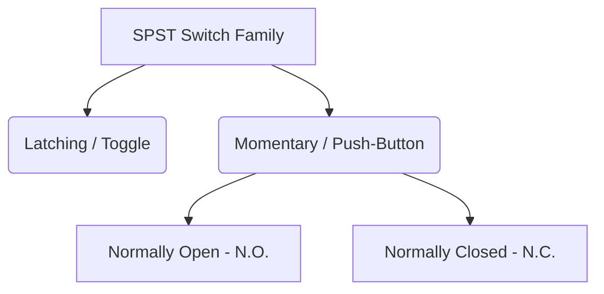

Inti dari setiap antarmuka yang digunakan manusia untuk mengontrol listrik terletak pada saklar mekanis. Inkarnasi komponen ini yang paling sederhana dan paling umum adalah **SPST**, atau sakelar Single Pole Single Throw.

Baik Anda merancang pemutus listrik bertegangan tinggi atau sekadar memetakan tombol tekan pada papan tempat memotong roti Arduino, simbol SPST adalah titik awal logis Anda.

## 1. Apa Sebenarnya Arti SPST

Teknisi mengklasifikasikan sakelar menggunakan dua variabel: **Pole** dan **Throws**.

* **Tiang (P):** Jumlah sirkuit listrik independen yang dapat dikontrol sakelar secara bersamaan. 
* **Throw (T):** Jumlah status tertutup (posisi ON) yang dimiliki setiap kutub.

Oleh karena itu, SPST adalah *Kutub Tunggal* (mengontrol satu sirkuit) dan *Lemparan Tunggal* (hanya memiliki satu posisi konduktif tertutup).

```mermaid
flowchart LR
    A[Human Input] --> B((SPST Mechanism))
    B -- Open / Default --> C[Infinite Resistance / OFF]
    B -- Closed / Actuated --> D[Zero Resistance / ON]
    
    style B fill:#0f172a,stroke:#f59e0b
```

## 2. Membaca Simbol Skema SPST

Simbol IEEE standar untuk saklar SPST sangat intuitif—seperti apa fungsinya.

| Elemen Visual | Makna di Dunia Nyata |
| :--- | :--- |
| **Dua Lingkaran Terbuka** | Bantalan kontak listrik stasioner tempat kabel berakhir. |
| **Garis Putus Diagonal** | Lengan konduktif mekanis, secara fisik terputus dari bantalan kedua untuk menunjukkan status default 'Terbuka'. |
| **Penunjuk (`S` atau `SW`)** | Tag referensi standar. misalnya, `SW1`. |

> **Asumsi Keadaan Normal:** Kecuali ditentukan lain, sakelar mekanis ditarik dalam **keadaan istirahat yang tidak digerakkan**. Untuk saklar lampu SPST standar, ini berarti skema menggambarkannya sebagai OFF.

## 3. Variasi SPST: Tombol Tekan

Sakelar pengalih tetap berada di tempat Anda meletakkannya (mengunci). Tombol tekan hanya berfungsi saat jari Anda berada di atasnya (sesaat). Penunjukan SPST berlaku untuk keduanya, namun simbolnya sedikit berubah untuk membedakan mode interaksi manusia.

| Tipe Sakelar | Perubahan Skema | Contoh Dunia Nyata |
| :--- | :--- | :--- |
| **Tombol Tekan (TIDAK)** | Alih-alih lengan miring, jembatan datar melayang *di atas* kedua bantalan kontak. Menekan ke bawah akan menjembatani kesenjangan tersebut. | Tombol keyboard, tombol power komputer, tombol bel pintu. |
| **Tombol Tekan (N.C.)** | Jembatan datar terletak *di bawah* atau menyentuh bantalan, menjaga sirkuit tetap AKTIF secara default. Menekan akan memutus koneksi. | Tombol Emergency Stop (E-Stop) pada alat berat. |

## 4. Peringatan Implementasi Perangkat Keras

Saat menggabungkan sakelar SPST ke dalam rangkaian logika digital (seperti pin Raspberry Pi GPIO), desain skema yang naif akan menyebabkan perilaku perangkat lunak yang sangat tidak dapat diprediksi.

### Masalah "Pin Mengambang".

Jika Anda menghubungkan satu sisi saklar SPST ke 5V dan sisi lainnya langsung ke pin mikrokontroler, apa yang terjadi jika saklar terbuka? Pin tidak terbaca 0V—pin terputus dan "mengambang", bertindak seperti antena yang menangkap elektromagnetisme di sekitarnya.

**Perbaikannya: Resistor Pull-Down**

Selalu sertakan resistor (biasanya 10kΩ) yang terhubung antara pin digital dan Ground.

1. **Matikan:** Pin membaca 0V dengan aman melalui resistor.
2. **Hidupkan:** Pasokan 5V mengalahkan resistor, memicu status TINGGI yang aman.

Gabungkan variasi SPST ke dalam desain Anda dengan aman melalui **[Editor Diagram Sirkuit](/editor/)**. Perluas perpustakaan 'Switches' kiri untuk menemukan N.O. dan implementasi N.C.!