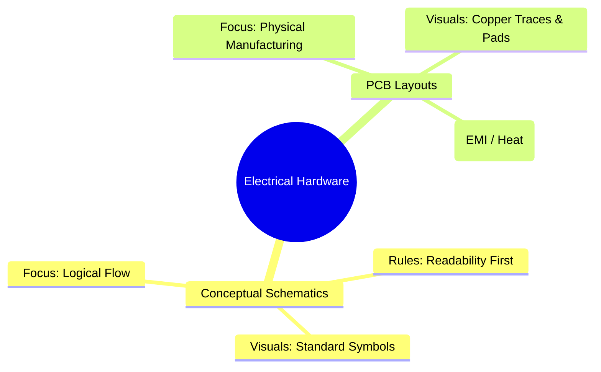
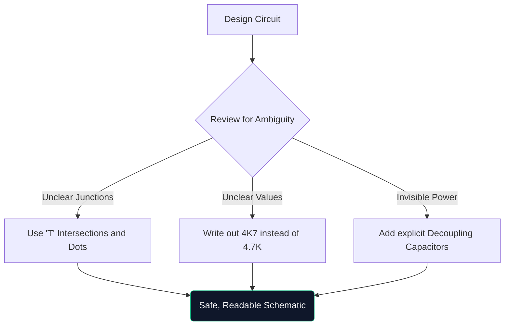

Selamat datang di kelas master definitif tentang diagram sirkuit. Baik Anda meretas prototipe Arduino di akhir pekan atau mempelajari teknik elektro, memahami arsitektur skema tidak dapat dinegosiasikan.

Panduan ini melampaui dasar-dasarnya, mengevaluasi bagaimana diagram modern dibuat, diverifikasi, dan diproduksi.

## Skema Teoretis vs. Tata Letak PCB

Kebingungan yang sangat umum adalah perbedaan antara diagram skematik dan tata letak Papan Sirkuit Cetak (PCB). Mereka adalah representasi yang sepenuhnya berbeda dari kebenaran kelistrikan yang sama.

| Sifat | Diagram Skema | Tata Letak PCB |
| :--- | :--- | :--- |
| **Tujuan** | Untuk memahami *bagaimana* rangkaian bekerja secara logis | Untuk menentukan *kemana* tembaga pergi secara fisik |
| **Representasi Komponen** | Simbol abstrak (segitiga, zigzag) | Bantalan tapak fisik 1:1 (mis., SOIC-8, 0805) |
| **Koneksi** | Garis geometris sempurna | Jejak Tembaga Sudut 45 Derajat |
| **Lingkungan** | Kertas berlatar belakang putih bersih | Ruang 3D literal berlapis-lapis |

## Anatomi Skema Tingkat Lanjut

Ketika sirkuit berkembang melebihi 100 komponen, paradigma visual pun berubah. Anda tidak bisa begitu saja menghubungkan semuanya dengan kabel yang ditarik.

1. **Blok Judul**: Skema profesional selalu menampilkan blok di sudut kanan bawah yang menunjukkan Nama Perusahaan, Insinyur Pencatatan, Nomor Revisi, dan Tanggal.
2. **Label & Port Bersih**: Kabel tidak menghubungkan sub-sistem; label bernama bisa. Jika dua kabel diberi label `CLK_OUT`, berarti keduanya tersambung secara listrik, meskipun berada pada halaman yang berbeda.
3. **Blok Hierarki**: Desain besar (seperti motherboard komputer) menggunakan hierarki. Sebuah blok persegi panjang berlabel "Memory Interface" berisi halaman skema yang sepenuhnya terpisah di dalamnya.

## Aturan "Gambar Defensif"

Mirip dengan mengemudi defensif, gambar defensif menyiratkan asumsi bahwa orang yang membaca skema Anda akan salah memahaminya kecuali Anda secara eksplisit membimbing mereka.

> **Mengapa menulis `4K7`?** Dalam skema yang dicetak atau difotokopi, titik desimal kecil (`.`) mudah hilang karena artefak. Menulis `4.7K` berisiko seseorang membacanya sebagai `47K`, yang dapat merusak suatu komponen. Menulis `4K7` menjadikan pengali berfungsi sebagai koma desimal, sehingga praktis menghilangkan kesalahan pembacaan.

## Transisi ke Alat CAD Digital

Menggambar pada kertas grafik sangat bagus untuk brainstorming, namun praktis tidak berguna untuk produksi. Saat Anda memigrasikan desain Anda ke alat seperti [Pembuat Diagram Sirkuit](/editor/), Anda memperoleh beberapa kekuatan super:

* **Netlists**: Alat digital yang membuktikan koneksi secara matematis.
* **Dapat digunakan kembali**: Menyalin-menempelkan catu daya teregulasi yang rumit dari proyek sebelumnya menghemat waktu.
* **Kualitas Vektor**: Mengekspor sebagai SVG menjamin garis yang sangat tajam terlepas dari seberapa besar Anda memperbesar.

Lompatan dari teori ke kenyataan dimulai dengan garis yang jelas. Mulailah perjalanan Anda hari ini!