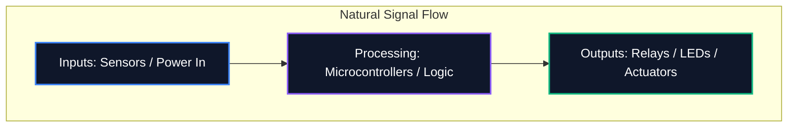

Che tu stia condividendo un diagramma su un forum o inviandolo per la fabbricazione professionale di PCB, la leggibilità del tuo schema è importante tanto quanto la sua correttezza logica. Uno schema disordinato porta a errori di routing, componenti fraintesi e perdite di tempo.

Questa guida descrive le migliori pratiche fondamentali utilizzate dagli ingegneri elettronici professionisti per creare schemi circuitali puliti, manutenibili e altamente leggibili.

## 1. Flusso dello schema: da sinistra a destra, dall'alto in basso

Uno schema è un documento tecnico e, come ogni documento, dovrebbe essere letto in modo naturale. Nella progettazione elettronica, la convenzione standard prevede che gli ingressi fluiscano da sinistra e le uscite escano da destra.

Allo stesso modo, le tensioni più alte dovrebbero essere posizionate esplicitamente nella parte superiore dello schema e le tensioni più basse o la messa a terra nella parte inferiore.



## 2. Simboli di potenza e terra

Non tracciare mai cavi lunghi e tortuosi che collegano insieme ogni singolo pin di terra. Crea una ragnatela impossibile da leggere. Utilizzare invece i simboli di alimentazione e terra locali sul componente.

| Cattiva pratica | Migliori pratiche | Perché è importante |
| :--- | :--- | :--- |
| Legare tutte le masse con un unico filo continuo | Utilizzo dei simboli `GND` locali su ciascun componente | Riduce il disordine visivo; definisce esplicitamente i percorsi di ritorno senza tracciamenti complessi |
| Posizionamento delle linee VCC che si incrociano sulle tracce del segnale | Utilizzando i simboli locali `VCC` / `+5V` rivolti verso l'alto | Impedisce che le linee di segnale vengano confuse visivamente con l'erogazione di potenza |
| Etichettare motivi diversi con lo stesso simbolo | Differenziazione della terra analogica (AGND) e della terra digitale (DGND) | Fondamentale per evitare anelli di terra e propagazione del rumore nei progetti a segnale misto |

## 3. Punti di giunzione contro incroci

Uno degli errori più pericolosi nella progettazione di uno schema è l'ambiguità nel punto in cui i fili si incrociano.

```mermaid
graph TD
    A[Is it a connection?]
    A --> B{Is there a junction dot?}
    B -- Yes --> C[Wires are electrically connected (Node)]
    B -- No --> D[Wires are crossing without connecting]
    
    style A fill:#1e293b,stroke:#f59e0b
    style C fill:#1e293b,stroke:#10b981
    style D fill:#1e293b,stroke:#ef4444
```

> **Suggerimento professionale:** Non utilizzare mai giunzioni a "4 vie" (una croce a forma di "+"). Se è necessario che quattro fili si incontrino, spostarli in due giunzioni a "T" a 3 vie. Ciò elimina completamente l'ambiguità; se il punto di giunzione scompare durante la stampa o il ridimensionamento, la forma a "T" implica ancora inequivocabilmente una connessione, mentre una croce nuda no.

## 4. Raggruppamento di componenti logici

Quando si ha a che fare con schemi di grandi dimensioni contenenti microcontrollori con oltre 64 pin, provare a collegare fisicamente ogni filo al componente è un esercizio inutile. Gli strumenti professionali utilizzano invece le **Net Labels**.

Raggruppa i blocchi funzionali del tuo circuito in zone visive. Ad esempio, posiziona l'alimentatore in un angolo, l'MCU al centro e i driver del motore in un altro. Collegali esclusivamente utilizzando etichette di rete descrittive (ad esempio, `SPI_MOSI`, `UART_TX`, `MOTOR_PWM`).

## 5. Designatori e valori di riferimento

Un simbolo di resistenza nuda non dice nulla allo spettatore. Ogni componente deve avere un designatore di riferimento univoco e un valore esplicito.

| Categoria componente | Prefisso standard | Esempio |
| :--- | :--- | :--- |
| **Resistenze** | "R" | `R1 (10kΩ)` |
| **Condensatori** | "C" | `C4 (100nF)` |
| **Circuiti Integrati** | "U" o "IC" | "U2 (LM358)" |
| **Diodi / LED** | `D` | "D1 (1N4148)" |
| **Transistor/MOSFET** | "Q" | "Q1 (2N2222)" |
| **Induttori** | `L` | `L1 (4,7μH)` |
| **Connettori/basette** | "J" o "P" | "J1 (presa di alimentazione)" |

L'adesione a queste convenzioni garantisce che il tuo schema sarà immediatamente compreso da qualsiasi ingegnere, ovunque nel mondo. Inizia ad applicare queste regole oggi stesso nell'[Editor degli schemi elettrici](/editor/).