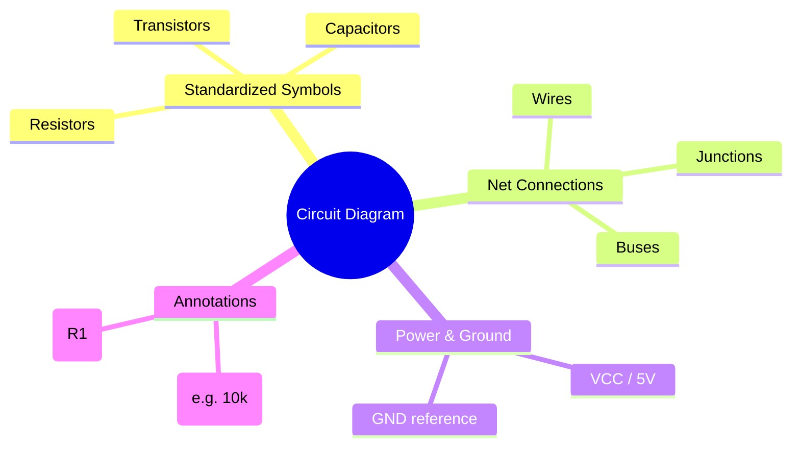
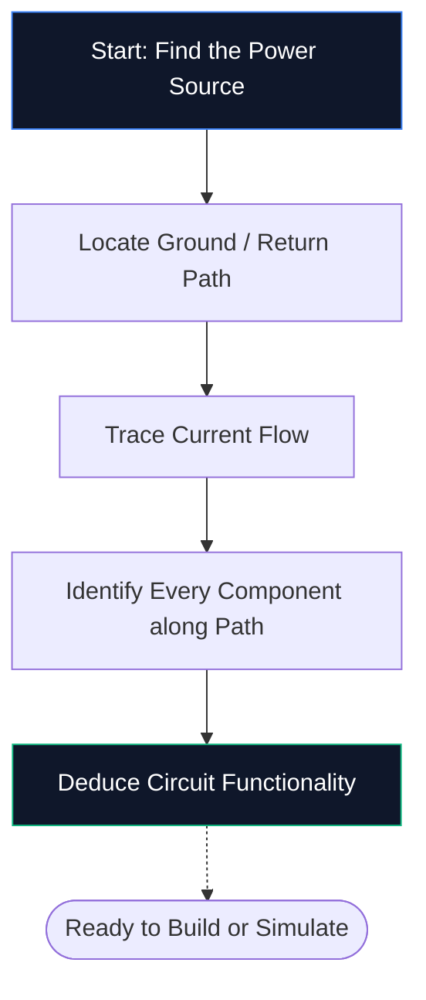

Se non hai mai aperto un editor di schemi prima, questa è l'unica guida di cui hai bisogno. Esamineremo gli aspetti fondamentali: cos'è uno schema circuitale, come decodificare i simboli e come disegnare il tuo primo schema all'interno di **Circuit Diagram Maker**, il tutto senza installare un singolo software.

## Cos'è esattamente uno schema elettrico?

Uno schema elettrico è una mappa dell'elettricità. Proprio come una mappa della metropolitana mostra come le stazioni si collegano senza rappresentare i tunnel in scala, uno schema circuitale mostra come si collegano i componenti elettronici senza preoccuparsi delle dimensioni fisiche o del posizionamento della scheda.

Invece di disegni realistici, gli schemi utilizzano **simboli standardizzati**. Un resistore appare come una linea a zigzag, un condensatore come due piastre parallele e un diodo come un triangolo che incontra una barra. Questa abbreviazione universale mantiene i diagrammi puliti, stampabili e leggibili in ogni paese e lingua.

> **Perché le astrazioni contano:** Un resistore fisico è un minuscolo cilindro con bande colorate, ma su uno schema a 50 componenti quel dettaglio creerebbe caos visivo. I simboli comprimono l'immagine in modo che il tuo cervello possa concentrarsi su *come le cose si collegano* piuttosto che su *come appaiono*.

## I 10 simboli da conoscere per ogni principiante

Prima di poter leggere (o disegnare) un singolo schema, è necessario riconoscere gli elementi costitutivi principali. Memorizza la tabella qui sotto e sarai in grado di decodificare a vista la maggior parte dei circuiti hobbistici.

| Forma simbolo | Componente | Funzione primaria | Designatore |
| :--- | :--- | :--- | :--- |
| **Linea a zigzag** | Resistore | Limita il flusso di corrente | "R" |
| **Due linee parallele** | Condensatore | Memorizza la carica, filtra il rumore | "C" |
| **Serie di loop** | Induttore | Immagazzina energia in un campo magnetico | `L` |
| **Triangolo + barra** | Diodo | Consente corrente in una direzione | `D` |
| **Triangolo + barra + frecce** | LED | Emette luce quando polarizzato direttamente | "D" / "LED" |
| **Linee parallele lunghe/brevi** | Batteria | Fornisce tensione CC | `BT` |
| **Tre righe impilate** | Terra | Punto di riferimento a 0 V | `GND` |
| **Forma triangolare** | Amplificatore operazionale | Amplifica la differenza di tensione | "U" / "IC" |
| **Rettangolo con perni** | Circuito integrato | Esegue funzioni complesse | "U" / "IC" |
| **Linee rette** | Fili | Portare corrente tra i componenti | *(Nessuno)* |

## Come leggere uno schema in cinque passaggi

La lettura di uno schema elettrico segue ogni volta lo stesso processo mentale. Esercitati in questi cinque passaggi su qualsiasi schema e il modello diventerà una seconda natura.

1. **Trova la fonte di alimentazione**: cerca il simbolo della batteria o etichette come VCC, 5 V o 3,3 V. È qui che l'energia elettrica entra nel circuito.
2. **Individua terra**: trova il simbolo di terra a tre linee o un'etichetta GND. Ogni circuito deve avere un percorso di ritorno.
3. **Traccia il flusso di corrente**: segui i cavi dal terminale positivo, attraverso ciascun componente e di nuovo a terra. La corrente convenzionale scorre dal positivo al negativo.
4. **Identifica ogni componente** — Abbina ciascun simbolo alla tabella sopra, quindi leggi l'etichetta accanto per i valori esatti (ad esempio 10 kΩ significa 10.000 ohm).
5. **Comprendi lo scopo**: chiediti cosa fa il circuito. Un LED più un resistore è un semplice indicatore luminoso. Un amplificatore operazionale con resistori di retroazione è un amplificatore di segnale.

## Il tuo primo schema: il circuito LED

Ogni principiante dell'elettronica inizia da qui: un LED alimentato tramite un resistore limitatore di corrente. Apri l'[editor di Circuit Diagram Maker](/editor/) e segui.

**Conduttura dell'architettura del circuito:**

```mermaid
graph LR
    PWR(Battery 9V) -- Positive Wire --> R1(Resistor 330Ω)
    R1 -- Controlled Current --> D1((Red LED))
    D1 -- Return Path --> GND(Ground)
    
    style PWR fill:#1e293b,stroke:#f59e0b
    style R1 fill:#1e293b,stroke:#3b82f6
    style D1 fill:#1e293b,stroke:#ef4444
    style GND fill:#1e293b,stroke:#64748b
```

**Istruzioni dettagliate:**

1. Trascina il simbolo **Batteria** dalla barra laterale sull'area di disegno.
2. Posiziona un **resistore** a destra della batteria.
3. Posiziona un **LED** a destra del resistore.
4. Premere **W** per attivare la modalità Filo.
5. Fare clic sul terminale positivo della batteria, quindi fare clic sul pin sinistro del resistore per disegnare un filo.
6. Collegare il pin destro del resistore all'anodo del LED.
7. Ricollegare il catodo del LED al terminale negativo della batteria.
8. Fare doppio clic sul resistore e digitare **330 Ω**.
9. Fare clic su **Esporta → SVG** per salvare un file di qualità pubblicazione.

## Cinque errori comuni (e come evitarli)

| Errore | Cosa va storto | Soluzione rapida |
| :--- | :--- | :--- |
| **Percorso di terra mancante** | Il circuito sembra aperto; la corrente non può circolare | Cablare sempre un percorso di ritorno a terra |
| **Incroci di filo senza punti** | Due fili che si incrociano sembrano collegati quando non lo sono | Aggiungi un punto di giunzione solo dove i fili si uniscono effettivamente |
| **Nessun valore componente** | I revisori non possono verificare il tuo design | Etichetta ogni resistore, condensatore e circuito integrato |
| **Cablaggio disordinato** | I fili diagonali o sovrapposti riducono la leggibilità | Utilizza il percorso Manhattan (solo orizzontale e verticale) |
| **Nessun designatore di riferimento** | Diventa impossibile creare l'elenco delle parti | Etichetta ciascuna parte R1, C1, U1, D1 e così via |

## Dove andare dopo

Una volta che avrai acquisito dimestichezza nel disegnare schemi di base, esplora queste risorse per salire di livello:

* **[Spiegazione dei simboli dello schema elettrico](/blog/circuit-diagram-symbols-explained/)**: approfondimento su ogni categoria di simboli
* **[Come realizzare uno schema circuitale online](/blog/how-to-make-circuit-diagram-online/)**: tecniche avanzate e suggerimenti sul flusso di lavoro
* **[Libreria componenti](/components/)**: sfoglia tutti gli oltre 40 simboli disponibili in Circuit Diagram Maker