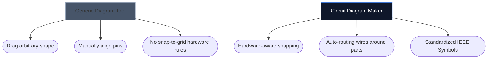

La scelta dello strumento giusto per disegnare i tuoi schemi elettronici può spesso determinare la velocità con cui puoi eseguire l'iterazione su un nuovo progetto hardware. Mentre i progettisti PCB avanzati necessitano di ambienti desktop pesanti, gli hobbisti, gli studenti e i produttori spesso hanno bisogno di qualcosa di completamente diverso: accessibilità e velocità.

Di seguito, analizziamo come il nostro strumento si confronta con le principali alternative del settore.

## Matrice di categorizzazione degli strumenti

Prima di approfondire i singoli strumenti, è fondamentale capire quale livello di software richiede effettivamente il tuo progetto. Usare un software PCB aziendale per disegnare un layout LED a 4 componenti è eccessivo.

## 1. Creatore di schemi circuitali contro Fritzing

Fritzing è famoso per colmare il divario tra la prototipazione della breadboard e gli schemi. Tuttavia, Fritzing richiede l'installazione e nel corso degli anni ha avuto difficoltà con gli aggiornamenti di manutenzione.

| Caratteristica | Creatore di schemi elettrici | Fritzing |
| :--- | :--- | :--- |
| **Obiettivo primario** | Layout schematici standard | Visualizzazioni breadboard |
| **Installazione** | Nessuno (100% basato su browser) | Installazione desktop richiesta |
| **Costo** | 100% gratuito | A pagamento (Donationware) |
| **Curva di apprendimento** | Estremamente basso | Moderato |

> **Il verdetto:** Se hai specificamente bisogno di visualizzare i cavi fisici che si tuffano in una breadboard, Fritzing è superiore. Se hai bisogno di schemi elettronici standard e universali *istantaneamente*, usa Circuit Diagram Maker.

## 2. Circuit Diagram Maker contro KiCad e Altium

KiCad è una leggendaria suite PCB open source e Altium Designer è lo standard del settore aziendale. Sono immensamente potenti.

| Livello di capacità | Creatore di schemi elettrici | KiCad/Altium |
| :--- | :--- | :--- |
| **Tipo di uscita** | Immagini SVG/PNG | File Gerber, distinta base, Pick&Place |
| **Simulazione** | Visivo / Semplicistico | Integrazione profonda di SPICE |
| **Velocità al primo schema** | < 10 secondi | 10–30 minuti (impostazione/configurazione) |

> **Il verdetto:** Usa KiCad o Altium quando invii strati di rame a una fabbrica a Shenzhen. Utilizza Circuit Diagram Maker quando alleghi uno schema a un compito di fisica, a un post di blog o a una domanda sul forum.

## 3. Circuit Diagram Maker contro draw.io / Lucidchart

Strumenti di creazione di diagrammi generici come draw.io sono incredibilmente popolari per i diagrammi di flusso. Tuttavia, non hanno una comprensione semantica dell’elettronica.

Quando si utilizza uno strumento elettronico dedicato, l'editor comprende che un filo non può semplicemente "terminare" in modo casuale senza una giunzione e mappa intrinsecamente le proprietà standard (come gli Ohm sui resistori).

## Quale strumento è adatto a te?

Lo strumento migliore è quello che ti toglie di mezzo. Per un'ideazione rapida, compiti didattici e pubblicazioni web, [Circuit Diagram Maker](/editor/) offre una combinazione imbattibile di velocità ed estetica moderna.