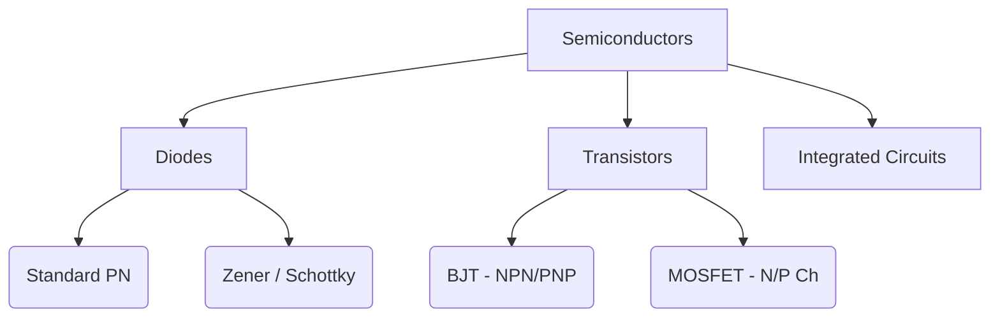

I simboli elettronici sono il linguaggio universale dell'ingegneria hardware. Proprio come le note musicali dettano l’altezza e il ritmo, i simboli dei circuiti trasmettono funzioni elettriche, proprietà e connettività su un pezzo di carta.

In questa guida completa, analizziamo la morfologia visiva degli elementi più importanti che incontrerai in qualsiasi schema.

## Differenze tra gli standard globali: IEEE e IEC

Prima di approfondire i simboli specifici, è fondamentale riconoscere che i simboli possono apparire diversi a seconda di dove è stato disegnato lo schema. I due standard dominanti sono **IEEE/ANSI** (principalmente nelle Americhe) e **IEC** (europeo e internazionale).

```mermaid
flowchart LR
    subgraph Regional Standards
    A((Schematic Origin))
    A -- US / Americas --> B[IEEE / ANSI]
    A -- Europe / Int'l --> C[IEC]
    end
    
    B -.-> D(Zigzag Resistors)
    C -.-> E(Rectangle Resistors)
    
    style B fill:#1e293b,stroke:#f59e0b
    style C fill:#1e293b,stroke:#3b82f6
```

In Circuit Diagram Maker utilizziamo principalmente lo standard IEEE/ANSI, poiché rimane molto popolare negli ecosistemi digitali e hobbistici, sebbene entrambi siano tecnicamente corretti.

## Componenti passivi

I componenti passivi non richiedono una fonte di alimentazione esterna per funzionare e non possono amplificare un segnale.

| Componente | Aspetto del simbolo standard | Descrizione funzionale |
| :--- | :--- | :--- |
| **Resistenza** | Definito da una linea a zigzag netta e frastagliata. Le varianti variabili presentano una freccia che perfora la linea. | Dissipa l'energia sotto forma di calore per limitare il flusso di corrente elettrica. |
| **Condensatore** | Due linee parallele separate da uno spazio. Le varianti polarizzate curvano una delle linee per indicare il terminale negativo. | Immagazzina temporaneamente l'energia elettrica in un campo elettrico. |
| **Induttore** | Una serie di anelli o semicerchi arrotondati che rappresentano bobine di filo. | Si oppone ai cambiamenti nel flusso di corrente immagazzinando energia in un campo magnetico. |

## Componenti attivi (semiconduttori)

I componenti attivi richiedono una fonte di alimentazione e possono controllare il flusso di elettricità, spesso amplificando i segnali.

| Componente | Indicatori visivi | Utilizzo principale |
| :--- | :--- | :--- |
| **Diodo** | Un triangolo che punta verso una linea piatta. La linea indica il catodo (negativo). | Una valvola unidirezionale per l'elettricità. |
| **LED** | Un simbolo di diodo standard con due piccole frecce rivolte verso l'esterno, che indicano l'emissione di luce. | Indicatori visivi e optoelettronica. |
| **Transistor BJT** | Una linea verticale fiancheggiata da tre connessioni: base, collettore e un emettitore con una freccia che indica NPN o PNP. | Interruttori e amplificatori controllati in corrente. |
| **MOSFET** | Presenta linee di confine separate che evidenziano il gate isolato e i diodi del substrato interno. | Commutazione controllata in tensione per alta potenza. |

## Dispositivi meccanici e di output

Queste parti interagiscono con il mondo fisico, ricevendo input umani o generando output fisico.

| Componente | Stenografia schematica | Applicazione |
| :--- | :--- | :--- |
| **Cambia (SPST)** | Una linea spezzata che può ruotare verso il basso per completare il circuito. | Controllo di accensione/spegnimento di base. |
| **Relè** | Solitamente raffigurato come un induttore (la bobina interna) accoppiato con contatti di commutazione isolati. | Commutazione di carichi ad alta tensione tramite microcontrollori a bassa tensione. |
| **Motore** | Un cerchio contenente una "M", spesso con terminali positivi e negativi designati. | Conversione della corrente elettrica in cinetica rotazionale. |

> **Suggerimento per la progettazione:** ogni volta che si utilizzano interruttori o relè meccanici, includere sempre un *diodo flyback* tra i carichi induttivi per proteggere i componenti a semiconduttore dai picchi di tensione!

Comprendere questi simboli è il primo passo verso la fluidità del circuito. Dai un'occhiata al nostro [editor online](/editor/) per trascinare, rilasciare e sperimentare istantaneamente queste forme.