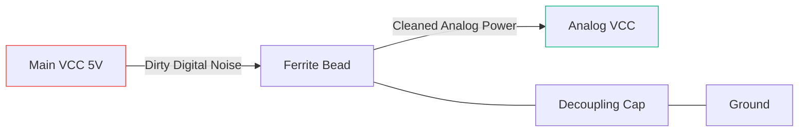

L'elettronica digitale ad alta velocità crea molto rumore elettromagnetico. Senza mitigazione, questa interferenza ad alta frequenza si diffonde nelle linee analogiche sensibili o si irradia verso l'esterno, causando il fallimento spettacolare del dispositivo nei test sulle emissioni FCC.

L'arma principale contro questa interferenza è la **perlina di ferrite**. Comprendere il suo simbolo schematico e il suo posizionamento determina se il tuo circuito funziona in modo pulito o è annegato nel suo stesso rumore.

## 1. Visualizzazione del simbolo della perla di ferrite

Una perla di ferrite funziona intrinsecamente come un induttore con forti perdite. Per questo motivo, il suo simbolo schematico è strettamente correlato al simbolo dell'induttore standard, ma adattato per enfatizzarne il ruolo specifico.

```mermaid
graph LR
    A[Inductor Basis] --> B(Standard Inductor Symbol)
    A --> C(Rectangle Over Wire)
    B -.-> D(Addition of a dashed line or solid bar)
    D --> E[IEEE Ferrite Symbol]
    C --> F[IEC Ferrite Symbol]
    
    style E fill:#0f172a,stroke:#3b82f6
    style F fill:#0f172a,stroke:#10b981
```

| Caratteristica | Standard IEEE/ANSI | Norma CEI | Note |
| :--- | :--- | :--- | :--- |
| **Forma** | Serie di semicerchi con barra/scatola | Un solido blocco rettangolare | Funzionalmente identico nel risultato |
| **Prefisso designatore** | `FB` | `FB` o `L` | Si consiglia vivamente di utilizzare `FB` per evitare confusione con gli induttori di potenza |
| **Unità di misura** | Ohm (Ω) a MHz specifici | Ohm (Ω) a MHz specifici | A differenza degli induttori misurati in Henries (H) |

> **Distinzione cruciale:** Non valutare mai una perlina di ferrite in base all'induttanza. Le sfere di ferrite sono specificate dalla loro **impedenza (in Ohm) a una frequenza specifica** (tipicamente 100 MHz).

## 2. Meccanica operativa fondamentale

Perché utilizzare una perlina di ferrite invece di un induttore standard?

* Un **induttore** immagazzina energia e la restituisce al circuito. È altamente reattivo e preserva l'energia.
* Una **perla di ferrite** è progettata attivamente per essere *con perdite*. Alle alte frequenze si comporta come un resistore, convertendo il rumore ad alta frequenza indesiderato direttamente in calore.

| Gamma di frequenza | Comportamento della perla di ferrite | Risultato sul circuito |
| :--- | :--- | :--- |
| **Bassa frequenza/CC** | Sotto 1 MHz | Funziona come un semplice filo (~0 Ω). La corrente continua passa liberamente. |
| **Frequenza di risonanza** | Altamente reattivo | Immagazzina energia per breve tempo. |
| **Alta frequenza** | Oltre 50 MHz+ | Agisce come un resistore di alto valore. Blocca e dissipa il rumore RF sotto forma di calore. |

## 3. Migliori pratiche per il posizionamento degli schemi

L'utilizzo corretto del simbolo FB richiede un posizionamento strategico. L'applicazione casuale di perline di ferrite su uno schema può effettivamente peggiorare il suono e la risonanza.

### Alimentatori di disaccoppiamento (filtri Pi)

L'uso più comune in assoluto per un simbolo "FB" è isolare l'alimentazione digitale sporca dall'alimentazione analogica pulita.

Nella configurazione sopra (parte di un filtro Pi), il cordone di ferrite impedisce ai transitori ad alta frequenza di entrare nella linea AVCC, mentre il condensatore devia qualsiasi ondulazione rimanente verso terra.

### Soppressione EMI della linea dati

Quando si instradano cavi dati USB lunghi o tracce HDMI, i simboli "FB" vengono spesso posizionati in serie vicino al connettore. Ciò garantisce che il lungo cavo fisicamente esposto non agisca come un'antenna e irradi il rumore della CPU attraverso la stanza.

Per aggiungere una perlina di ferrite al tuo prossimo schema, apri **[Editor di schemi elettrici](/editor/)**, cerca "Ferrite" e specifica il tuo valore di impedenza!