Costruire un inverter di potenza, ovvero convertire una batteria per auto da 12 V in corrente alternata da 220 V in grado di far funzionare gli elettrodomestici, è un rito di passaggio per gli ingegneri elettronici.

Prima di sollevare un saldatore, è necessario acquisire una comprensione impeccabile dello schema sottostante. I circuiti ad alta tensione non perdonano e un diagramma mal disegnato garantisce MOSFET bruciati o gravi scosse elettriche. Questa guida analizza l'architettura fondamentale di un inverter ad onda quadra.

> **Avviso di sicurezza:** L'alimentazione CA da 220 V è letale. Questo articolo è un'esplorazione della logica schematica e della progettazione teorica, non un progetto di produzione. Non costruire mai circuiti ad alta tensione senza una formazione elettrica avanzata.

## L'architettura dei tre pilastri

Non importa quanto sia complesso un inverter moderno, lo schema può sempre essere diviso visivamente e logicamente in tre blocchi funzionali distinti.

```mermaid
flowchart LR
    DC_SRC[(12V DC Battery)] --> OSC[1. Oscillator Block]
    OSC -- Low Power Square Wave --> AMP[2. Power Switch Block]
    AMP -- High Current 12V Wave --> TX[3. Step-Up Transformer]
    TX -- Magnetic Induction --> AC_OUT((220V AC Output))
    
    style OSC fill:#0f172a,stroke:#3b82f6
    style AMP fill:#0f172a,stroke:#f59e0b
    style TX fill:#0f172a,stroke:#ef4444
```

### Fase 1: L'oscillatore (il cervello)

La corrente continua (CC) proveniente da una batteria scorre in linea retta. I trasformatori non possono avanzare su una linea retta; richiedono campi magnetici fluttuanti. Pertanto, dobbiamo convertire la CC in un'onda CA artificiale (tipicamente 50 Hz o 60 Hz a seconda della regione geografica).

| Componente utilizzato | Ruolo schematico | Perché è stato scelto |
| :--- | :--- | :--- |
| **CD4047IC/555Timer** | Multivibratore astabile | Emette un'onda quadra notevolmente stabile calcolando una costante di tempo RC. |
| **Rete di resistori e condensatori** | Calibratori di temporizzazione | I valori (ad esempio, "R=100kΩ", "C=0,1μF") determinano in modo univoco la frequenza precisa di 50 Hz. |

### Fase 2: Gli interruttori di potenza (il muscolo)

Il chip logico produce un'onda incontaminata da 50 Hz, ma con limiti di corrente eccezionalmente bassi (spesso inferiori a 20 mA). Se lo alimentassi in un trasformatore, non genererebbe abbastanza flusso magnetico per far funzionare una lampadina.

Posizioniamo transistor ad alta potenza tra l'oscillatore e le bobine del trasformatore.

1. Il segnale debole dell'oscillatore colpisce il **Gate** di un massiccio MOSFET a canale N (come l'IRF3205).
2. Il MOSFET funge da relè elettronico per carichi pesanti.
3. Commuta furiosamente l'enorme amperaggio della batteria da 12 V direttamente attraverso le bobine del trasformatore 50 volte al secondo.

### Fase 3: il trasformatore step-up

A questo punto dello schema, abbiamo enormi quantità di corrente a 12 V che pulsa avanti e indietro. La fase finale richiede l'instradamento attraverso le bobine primarie di un trasformatore.

| Caratteristica | Dettagli schematici | Implicazioni nel mondo reale |
| :--- | :--- | :--- |
| **Bobina primaria (sinistra)** | Configurazione con presa centrale (`12V - 0 - 12V`) | Consente la commutazione push-pull avanti e indietro tra due MOSFET alternati. |
| **Linee principali** | Due linee continue tracciate verticalmente | Rappresenta il nucleo di ferro/ferrite necessario per l'induzione magnetica ad alta efficienza. |
| **Bobina secondaria (destra)** | Rapporto di avvolgimento notevolmente aumentato | La fisica trasforma il flusso magnetico pulsante da 12 V in un'onda letale e volatile da 220 V. |

## Considerazioni sul disegno

Quando utilizzi l'**[Editor di schemi circuitali](/editor/)** per redigere questo progetto, ricorda le migliori pratiche di layout:

* Traccia le linee spesse che trasportano la corrente della batteria da 12 V più spesse delle linee dell'oscillatore a bassa potenza.
* Mettere a terra i pin della sorgente MOSFET in modo esplicito e univoco; non riportarli vicino alla terra sensibile dell'oscillatore per evitare l'accoppiamento del rumore.
* Delinea graficamente le uscite 220V! Posizionare etichette di avvertenza e porte di uscita (come il simbolo di una presa) anziché lasciare i fili scoperti che terminano nel vuoto.