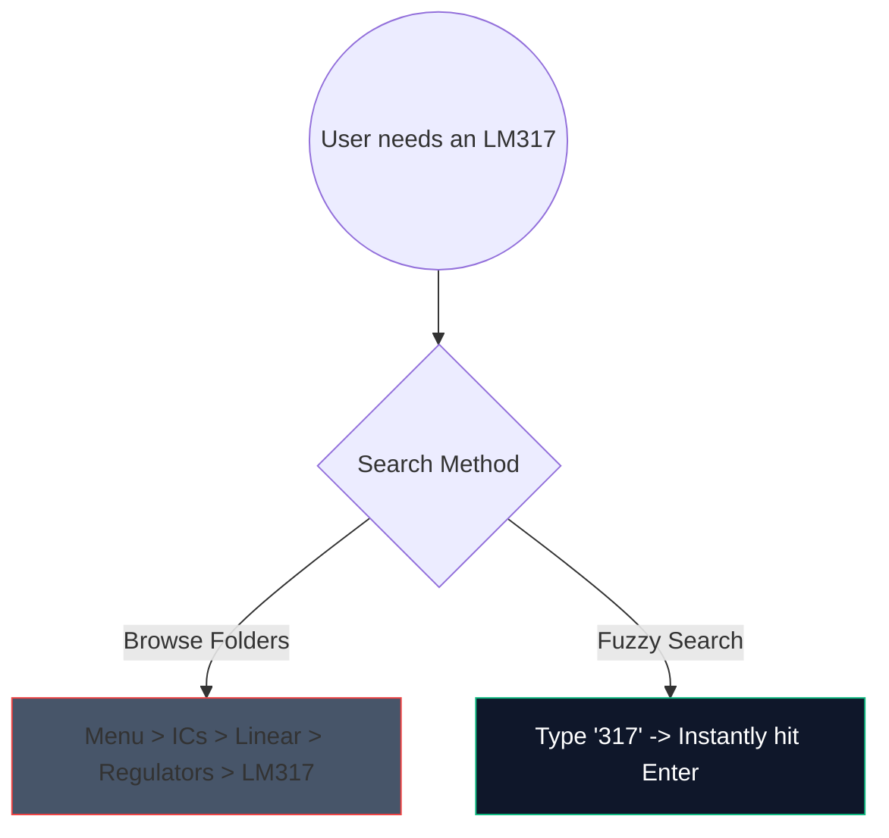

Sono finiti i giorni in cui si scaricavano pesanti software desktop da 2 gigabyte solo per disegnare un semplice circuito di amplificatore. Il CAD (Computer-Aided Design) basato su browser è qui ed è straordinariamente veloce.

Ecco esattamente come utilizzare i moderni strumenti Web per generare schemi di qualità produttiva in meno di 5 minuti.

## Perché la progettazione di circuiti basata su browser?

Se sei un educatore, uno studente o un hobbista che scrive documentazione, la velocità e l'accessibilità prevalgono sulle funzionalità grezze.

```mermaid
flowchart LR
    subgraph Traditional Workflow
    DL[Download/Install] --> CONF[Configure Libraries] --> DRAW1[Draw]
    end
    
    subgraph Web Workflow
    URL[Go to URL] --> DRAW2[Draw immediately]
    end
    
    style URL fill:#0f172a,stroke:#3b82f6
    style DRAW2 fill:#1e293b,stroke:#10b981
```

| Metrico | Applicazione desktop | Creatore di schemi elettrici |
| :--- | :--- | :--- |
| **Spazio di archiviazione** | 1GB - 5GB+ | 0 MB (basato su cloud) |
| **Compatibilità del sistema operativo** | Spesso porte solo Windows o con bug | Universalmente compatibile con il Web |
| **Ora di avvio** | 15–30 secondi | < 1 secondo |
| **Portabilità** | Confinato in una macchina | Accessibile ovunque |

## Trucchi fondamentali per il flusso di lavoro per aumentare la velocità

Quando si utilizza un editor web, l'utilizzo delle scorciatoie da tastiera trasforma l'esperienza dal "fare clic in giro" a uno stato di flusso ininterrotto.

Ecco le scorciatoie con il ROI più alto da memorizzare nel nostro editor:

| Azione | Comando di scelta rapida | Vantaggio del flusso di lavoro |
| :--- | :--- | :--- |
| **Instradamento dei cavi** | "W" | Passa istantaneamente il cursore alla modalità di connessione, consentendo il routing rapido della rete senza spostarsi su una barra degli strumenti. |
| **Rotazione dei componenti** | `R` (tenendo la parte) | Orientare i resistori o i transistor prima di posizionarli consente di risparmiare enormi quantità di tempo per la pulizia successiva. |
| **Selezione duplicata** | `Ctrl + D` o `Alt-Trascina` | Non estrarre 8 LED dal menu; posizionane uno, configuralo e duplicalo 7 volte istantaneamente. |
| **Tela panoramica** | `Barra spaziatrice + trascina` | Mantiene costante il livello di zoom durante la navigazione in layout enormi e complessi. |

## Utilizzo della ricerca componenti

La ricerca visiva attraverso enormi menu a discesa è noiosa. Abbiamo integrato un robusto meccanismo di ricerca fuzzy.

Basta premere la barra di ricerca e digitare "NPN" anziché fare clic su "Semiconduttori -> Transistor -> BJT". Lo strumento individua immediatamente la corrispondenza con la probabilità più alta.

## Esportazione per uso professionale

Creare il diagramma è solo metà dell'opera; inserirlo nella tua tesi o nel tuo blog tecnico è l'altra metà.

Esporta sempre i tuoi modelli di circuito come **SVG (Scalable Vector Graphics)** quando possibile, anziché PNG o JPG. Un SVG memorizza linee definite matematicamente anziché pixel, il che significa che puoi ridimensionare il tuo schema fino alle dimensioni di un cartellone pubblicitario e rimarrà perennemente nitido senza sfocature di rasterizzazione.

Pronto a testare la tua velocità? **[Avvia l'app](/editor/)** e prova a creare un circuito LED lampeggiante da 555 timer!