Aprire uno schema complesso per la prima volta è come guardare una lingua aliena. Decine di linee che si intersecano, abbreviazioni criptiche e simboli frastagliati si fondono in un muro di rumore visivo.

Tuttavia, gli ingegneri esperti non leggono gli schemi fissando l'intera pagina. Isolano, tracciano e conquistano. Ecco la metodologia passo passo per decifrare qualsiasi schema elettrico.

## Passaggio 1: isolare l'infrastruttura elettrica centrale

Prima di capire cosa *fa* un circuito, devi capire *come respira*.

Ogni schema ha punti di ingresso per l'energia elettrica. Il tuo primo compito è individuare tutti i principali binari di tensione e i riferimenti di terra.

```mermaid
flowchart TD
    A[Start: Scan Edges] --> B{Look for Power Symbols}
    B -- Found Battery/Jack --> C[Trace the initial VCC and GND lines]
    B -- Found Net Labels --> D[Locate generic +5V, +3.3V pads]
    C --> E[Are there Voltage Regulators?]
    D --> E
    E -- Yes --> F[Mentally divide circuit into Voltage Zones]
    E -- No --> G[Circuit runs on single voltage]
    
    style A fill:#0f172a,stroke:#3b82f6
    style F fill:#1e293b,stroke:#f59e0b
```



| Simbolo/Testo | Significato | Requisito di azione |
| :--- | :--- | :--- |
| `VCC` / `VDD` | Tensione di alimentazione positiva per circuiti integrati. | Traccialo per garantire che ogni circuito integrato riceva alimentazione. |
| `GND` / `VSS` | Il punto di riferimento comune. | Supponiamo che tutti questi simboli siano fisicamente collegati insieme. |
| `LDO` / `buck` | Un chip che regola la tensione in basso. | Notare quali componenti sono a valle utilizzando la nuova tensione più bassa. |

## Passaggio 2: demistificare il "cervello" (IC)

Una volta che sai dove scorre il potere, cerca i rettangoli più grandi sulla pagina. I circuiti integrati (IC) dettano la funzione primaria dello schema.

Se incontri un circuito integrato etichettato "U1" con un codice articolo criptico come "NE555" o "ATmega328P", smetti immediatamente di leggere lo schema. Apri una nuova scheda ed estrai la **scheda tecnica**.

Non è necessario comprendere la fisica interna dei semiconduttori; basta guardare il "Diagramma dei pinout" della scheda tecnica. Se il pin 4 è "RESET" e il pin 8 è "VCC", mappare immediatamente la logica nel disegno.

## Passaggio 3: monitora gli input e gli output

I circuiti sono macchine funzionali. Ricevono input ambientali, li elaborano e producono un risultato.

```mermaid
quadrantChart
    title Input/Output Hardware Identification
    x-axis Analog/Physical --> Digital/Data
    y-axis Input Devices --> Output Devices
    quadrant-1 Digital Receivers (e.g. WiFi)
    quadrant-2 Digital Displays (e.g. OLEDs)
    quadrant-3 Physical Actuators (e.g. Motors)
    quadrant-4 Physical Sensors (e.g. Thermistors)
    "Push Button": [0.1, 0.4]
    "Photoresistor": [0.2, 0.2]
    "UART RX": [0.8, 0.4]
    "UART TX": [0.8, 0.6]
    "Speaker": [0.3, 0.8]
    "LED": [0.4, 0.7]
```

Tracciare i cavi verso l'esterno dai circuiti integrati centrali. Se un pin IC si collega a un LED, si tratta di un'uscita visiva. Se un pin si collega a un interruttore SPST che va a terra, si tratta di un input umano.

## Passaggio 4: convalida di svincoli e incroci

L'errore di lettura più comune per i principianti riguarda l'incomprensione dei fili che si incrociano.

* **Un punto forma un nodo:** Se due linee che si intersecano presentano un punto solido nel punto in cui si incrociano, sono fisicamente saldate/collegate insieme. La corrente può fluire tra di loro.
* **Nessun punto produce un ponte:** Se due linee formano una croce semplice (+), *non* si toccano. Sono simili a due autostrade che si sovrappongono su un cavalcavia.

## Passo 5: Riconoscere i sottocircuiti (l'arma segreta)

Gli ingegneri raramente progettano circuiti interamente da zero. Incollano insieme sottocircuiti modulari standard. Una volta che impari a riconoscere queste "parole" visive, smetti di leggere le singole "lettere".

| Modello visivo | Sottocircuito standard | Funzione |
| :--- | :--- | :--- |
| Passaggio del condensatore da "VCC" a "GND" proprio accanto a un circuito integrato. | **Condensatore di disaccoppiamento** | Assorbe il rumore. Ignoralo quando analizzi il flusso logico. |
| Resistore da un pin digitale avvolto fino a `+5V`. | **Resistenza pull-up** | Previene i perni mobili; garantisce uno stato predefinito ALTO stabile. |
| Due resistori posti in serie tra tensione e terra, collegati al centro. | **Partitore di tensione** | Riduce una tensione in modo proporzionale per essere letta in modo sicuro da un pin del sensore. |

Metti in pratica questa teoria. Apri l'**[Editor degli schemi elettrici](/editor/)**, carica un modello e mappa tu stesso la potenza, il cervello, gli ingressi e le uscite!