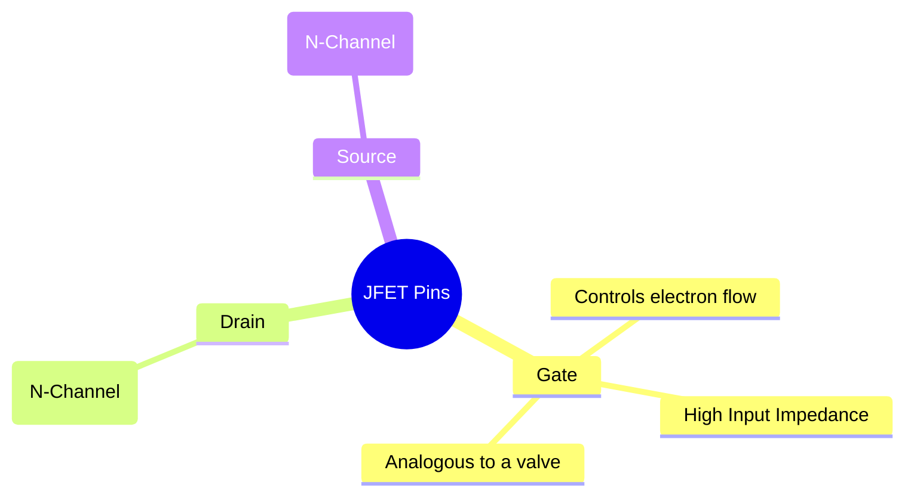

Prima della massiccia proliferazione dei MOSFET, il **JFET** (transistor a effetto di campo a giunzione) era il re dell'amplificazione ad alta impedenza di ingresso. Anche se non vengono utilizzati così frequentemente nella logica digitale moderna, rimangono artefatti indispensabili nei preamplificatori audio ad alta fedeltà, nella strumentazione sensibile e nei circuiti RF.

Comprendere il simbolo dello schema JFET è essenziale per chiunque approfondisca la progettazione di circuiti analogici discreti.

## 1. Anatomia del simbolo JFET

A differenza dei transistor a giunzione bipolare (BJT) che sono dispositivi controllati in corrente, un JFET è un dispositivo **controllato in tensione**. Il simbolo schematico tenta di rappresentare visivamente la costruzione fisica del suo canale semiconduttore interno.

Il simbolo è costituito da una linea retta verticale che rappresenta il canale, a cui si agganciano due linee orizzontali (Drenaggio e Sorgente). Una terza linea perpendicolare forma il Gate, completo di una freccia che detta la polarità del semiconduttore.

### JFET a canale N e JFET a canale P

Proprio come i BJT hanno NPN e PNP, i JFET sono disponibili in due versioni distinte.

| Caratteristico | JFET a canale N | JFET canale P |
| :--- | :--- | :--- |
| **Simbolo Freccia** | Punta **IN** verso la linea del canale | Punti **OUT** lontani dal canale |
| **Portatori di maggioranza** | Elettroni | Fori |
| **Vgs per Pinch-Off** | Tensione negativa (ad es. -5 V) | Tensione positiva (ad esempio +5 V) |
| **Operazione tipica**| Normalmente ACCESO -> Applicare un array di tensione negativa per spegnere | Normalmente ACCESO -> Applicare un array di tensione positiva per spegnere |

> **Trucco della memoria:** "Puntare IN" significa **N**-canale. Guarda la freccia sul cancello. Se punta verso l'interno della linea, hai a che fare con un JFET a canale N (come il popolare 2N5457).

## 2. Operazione: la modalità di esaurimento

Una delle caratteristiche più distintive di un JFET è che si tratta di un dispositivo in **modalità di esaurimento**. Ciò influisce notevolmente sul modo in cui progetti gli schemi attorno ad essi.

* **MOSFET (modalità di miglioramento):** Normalmente sono spenti. È necessario applicare una tensione al cancello per accenderli.
* **JFET (modalità di esaurimento):** Sono normalmente attivi. Con 0 Volt al gate, la corrente massima fluisce dal Drain alla Source. È necessario applicare una tensione di *polarizzazione inversa* (negativa per il canale N) per espandere la regione di svuotamento e letteralmente "spezzare" il flusso di elettroni, spegnendo il dispositivo.

```mermaid
flowchart LR
    VGS[V_GS = 0V] --> I1[Maximum Drain Current flows]
    VGS2[V_GS = -2V] --> I2[Current is restricted]
    VGS3[V_GS = -5V] --> I3[Pinch-Off reached. Circuit is OFF]
    
    style VGS fill:#1e293b,stroke:#f59e0b
    style VGS3 fill:#1e293b,stroke:#ef4444
```

## 3. Applicazioni schematiche tipiche

Poiché il gate di un JFET è polarizzato inversamente durante il funzionamento, al suo interno scorre essenzialmente corrente nulla. Ciò produce un'impedenza di ingresso astronomicamente elevata (spesso misurata in centinaia di Megaohm).

| Applicazione del circuito | Perché vengono scelti i JFET | Indizi schematici |
| :--- | :--- | :--- |
| **Preamplificatori audio** | Il rumore estremamente basso e l'enorme impedenza di ingresso impediscono il caricamento di pickup sensibili per chitarra elettrica. | Spesso visto agire come uno stadio buffer del Source Follower. |
| **Interruttori analogici** | Poiché sono controllati esclusivamente in tensione senza corrente di gate, iniettano transitori a commutazione zero nel percorso del segnale. | Posto in serie con un segnale analogico che passa attraverso il canale drain-source. |
| **Fonti a corrente costante** | Un JFET si comporta nativamente come un dissipatore di corrente costante quando il gate è collegato direttamente alla sorgente. | Terminale di gate collegato direttamente al terminale di origine. |

Quando si creano diagrammi di questi circuiti analogici specializzati, la precisione è fondamentale. Assicurati che l'orientamento della freccia del cancello sia corretto per evitare errori di produzione. Utilizza la libreria curata di semiconduttori discreti in **[Circuit Diagram Maker](/editor/)** per posizionare con precisione i simboli JFET standard N-Channel e P-Channel sulla tua prossima tela.