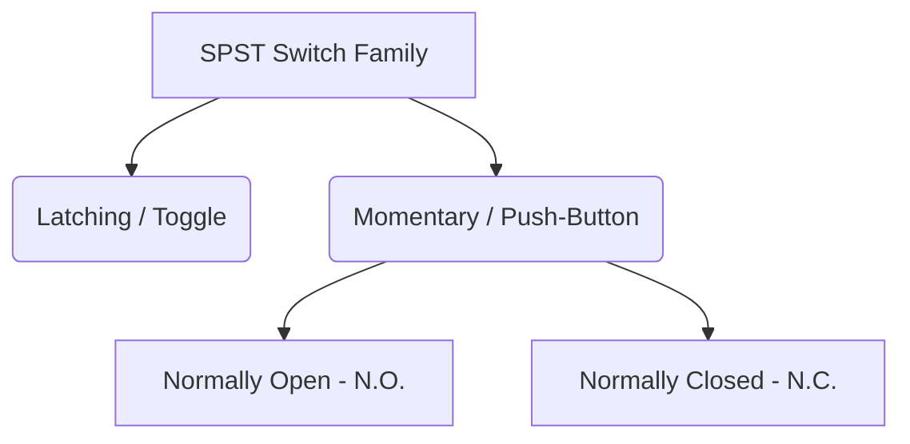

Al centro di ogni interfaccia utilizzata dagli esseri umani per controllare l’elettricità si trova l’interruttore meccanico. L'incarnazione più semplice e onnipresente di questo componente è l'**SPST**, o interruttore Single Pole Single Throw.

Che tu stia progettando un interruttore di rete ad alta tensione o semplicemente tracciando un pulsante su una breadboard Arduino, il simbolo SPST è il tuo punto di partenza logico.

## 1. Cosa significa effettivamente SPST

Gli ingegneri classificano gli interruttori utilizzando due variabili: **Pali** e **Lancia**.

* **Polo (P):** Il numero di circuiti elettrici indipendenti che l'interruttore può controllare simultaneamente. 
* **Lancio (T):** Il numero di stati chiusi (posizioni ON) di ciascun polo.

Pertanto, un SPST è un *polo singolo* (controlla un circuito) e un *lancio singolo* (ha solo una posizione chiusa e conduttiva).

```mermaid
flowchart LR
    A[Human Input] --> B((SPST Mechanism))
    B -- Open / Default --> C[Infinite Resistance / OFF]
    B -- Closed / Actuated --> D[Zero Resistance / ON]
    
    style B fill:#0f172a,stroke:#f59e0b
```

## 2. Lettura del simbolo schematico SPST

Il simbolo IEEE standard per un interruttore SPST è altamente intuitivo: assomiglia letteralmente a ciò che fa.

| Elemento visivo | Significato nel mondo reale |
| :--- | :--- |
| **Due cerchi aperti** | I contatti elettrici fissi dove terminano i fili. |
| **Linea spezzata diagonale** | Il braccio conduttivo meccanico, fisicamente disgiunto dal secondo pad per indicare uno stato predefinito "Aperto". |
| **Designatore (`S` o `SW`)** | Tag di riferimento standard. ad esempio, "SW1". |

> **Presupposto dello stato normale:** Se non diversamente specificato, gli interruttori meccanici sono disegnati nel loro **stato non azionato, a riposo**. Per un interruttore della luce SPST standard, ciò significa che lo schema lo raffigura come OFF.

## 3. Variazioni dell'SPST: Pulsanti

Un interruttore a levetta rimane dove lo metti (blocco). Un pulsante si attiva solo mentre il dito è posizionato su di esso (momentaneo). La designazione SPST si applica a entrambi, ma i simboli cambiano leggermente per distinguere le modalità di interazione umana.

| Tipo di interruttore | Modifica schematica | Esempio del mondo reale |
| :--- | :--- | :--- |
| **Pulsante (N.A.)** | Invece di un braccio angolato, un ponte piatto si libra *sopra* i due pad di contatto. Spingere verso il basso colma il divario. | Tasti della tastiera, pulsanti di accensione del computer, pulsanti del campanello. |
| **Pulsante (N.C.)** | Il ponte piatto poggia *sotto* o tocca i pad, mantenendo il circuito ON per impostazione predefinita. Spingendo verso il basso si interrompono le connessioni. | Pulsanti di arresto di emergenza (E-Stop) su macchinari pesanti. |

## 4. Avvisi sull'implementazione dell'hardware

Quando si incorpora un interruttore SPST in un circuito logico digitale (come un pin GPIO del Raspberry Pi), una progettazione schematica ingenua porterà a un comportamento del software disastrosamente imprevedibile.

### Il problema del "perno mobile".

Se colleghi un lato di un interruttore SPST a 5 V e l'altro lato direttamente al pin del microcontrollore, cosa succede quando l'interruttore è aperto? Il pin non legge 0 V: è disconnesso e "fluttuante", agendo come un'antenna che capta l'elettromagnetismo circostante.

**La soluzione: resistori pull-down**

Includere sempre un resistore (tipicamente 10kΩ) collegato tra il pin digitale e la terra.

1. **Spegnimento:** il pin legge 0 V in modo sicuro attraverso il resistore.
2. **Accensione:** l'alimentazione a 5 V sovraccarica il resistore, attivando uno stato ALTO sicuro.

Incorpora le variazioni SPST nei tuoi progetti in modo sicuro tramite **[Editor di schemi elettrici](/editor/)**. Espandi la libreria "Interruttori" a sinistra per trovare N.O. e implementazioni N.C.!