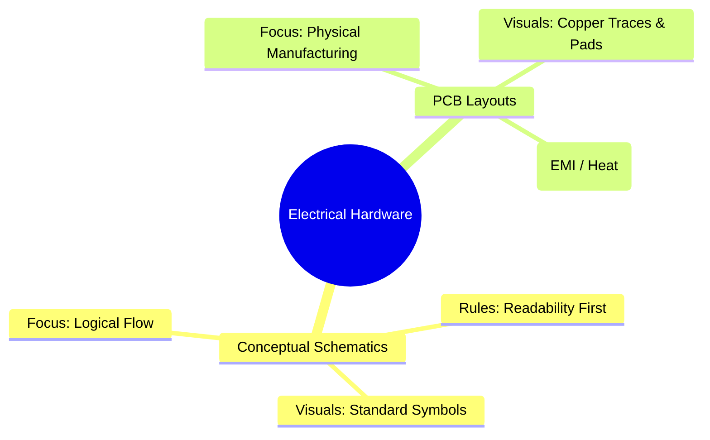
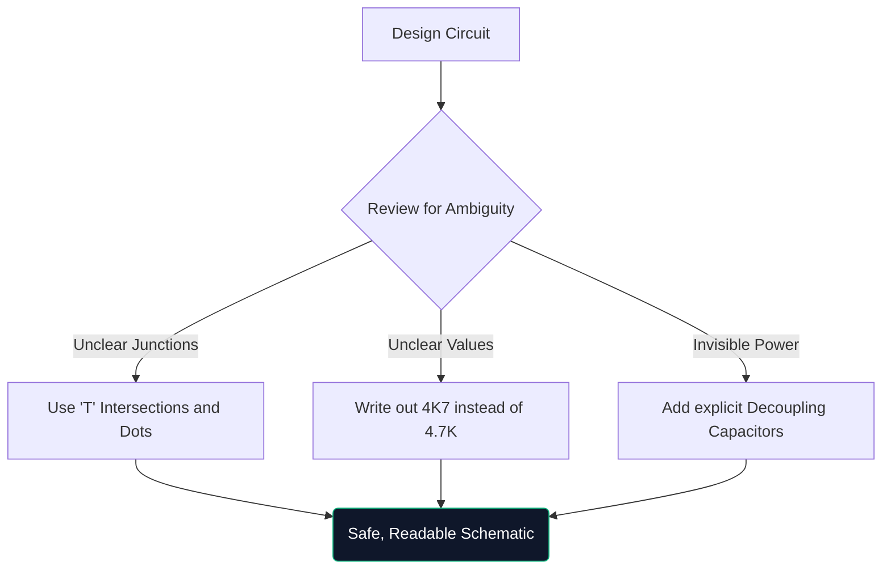

Benvenuti alla masterclass definitiva sugli schemi elettrici. Che tu stia realizzando prototipi Arduino durante un fine settimana o studiando ingegneria elettrica, la comprensione dell'architettura schematica non è negoziabile.

Questa guida va oltre le nozioni di base, valutando il modo in cui i diagrammi moderni vengono costruiti, verificati e prodotti.

## Schemi teorici e layout PCB

Un punto di confusione molto comune è la differenza tra un diagramma schematico e il layout di una scheda a circuito stampato (PCB). Sono rappresentazioni completamente diverse della stessa verità elettrica.

| Caratteristica | Diagramma schematico | Disposizione PCB |
| :--- | :--- | :--- |
| **Scopo** | Capire *come* funziona logicamente il circuito | Per dettare *dove* va fisicamente il rame |
| **Rappresentazione dei componenti** | Simboli astratti (triangoli, zigzag) | Pad fisici con impronta 1:1 (ad es. SOIC-8, 0805) |
| **Connessioni** | Linee geometriche perfette | Tracce di rame con angolo di 45 gradi |
| **Ambiente** | Carta di sfondo bianca e pulita | Spazio 3D letterale multistrato |

## Anatomia di uno schema avanzato

Quando i circuiti superano i 100 componenti, i paradigmi visivi cambiano. Non puoi semplicemente collegare tutto con fili tirati.

1. **Blocchi del titolo**: gli schemi professionali presentano sempre un blocco nell'angolo in basso a destra che indica il nome dell'azienda, l'ingegnere registrato, il numero di revisione e la data.
2. **Etichette di rete e porte**: i cavi non collegano i sottosistemi; le etichette con nome lo fanno. Se due fili sono etichettati "CLK_OUT", sono collegati elettricamente, anche se si trovano su pagine diverse.
3. **Blocchi gerarchici**: i progetti di grandi dimensioni (come la scheda madre di un computer) utilizzano la gerarchia. Un singolo blocco rettangolare etichettato "Memory Interface" contiene al suo interno una pagina schematica completamente separata.

## La regola del "disegno difensivo"

Simile alla guida difensiva, il disegno difensivo implica presumere che la persona che legge il tuo schema lo fraintenderà a meno che tu non la guidi esplicitamente.

> **Perché scrivere `4K7`?** Negli schemi stampati o fotocopiati, un minuscolo punto decimale (`.`) scompare facilmente a causa di artefatti. Scrivere "4.7K" rischia che qualcuno lo legga come "47K", il che potrebbe friggere un componente. Scrivendo "4K7" il moltiplicatore funge da punto decimale, eliminando praticamente gli errori di lettura.

## Transizione agli strumenti CAD digitali

Disegnare su carta millimetrata è ottimo per il brainstorming, ma praticamente inutile per la produzione. Quando esegui la migrazione dei tuoi progetti a uno strumento come [Circuit Diagram Maker](/editor/), ottieni diversi superpoteri:

* **Netlist**: strumenti digitali dimostrano matematicamente le connessioni.
* **Riutilizzabilità**: il copia e incolla di alimentatori regolati complessi di progetti precedenti consente di risparmiare ore.
* **Qualità vettoriale**: l'esportazione in formato SVG garantisce linee perfettamente nitide indipendentemente dall'ingrandimento.

Il salto dalla teoria alla realtà inizia con una linea ben tracciata. Inizia il tuo viaggio oggi!