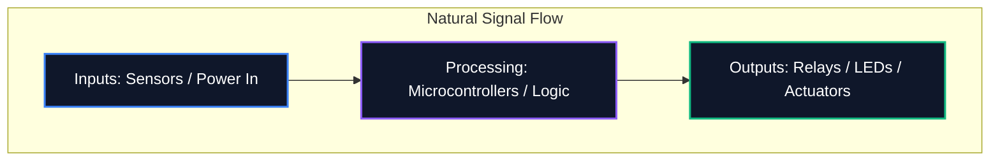

フォーラムで図を共有する場合でも、プロの PCB 製造に提出する場合でも、回路図の読みやすさは論理的な正確さと同じくらい重要です。回路図が乱雑であると、配線エラー、コンポーネントの誤解、時間の無駄が発生します。

このガイドでは、プロのエレクトロニクス エンジニアがクリーンで保守しやすく、可読性の高い回路図を作成するために使用する主要なベスト プラクティスについて概説します。

## 1. 回路図の流れ: 左から右、上から下

回路図は技術文書であり、他の文書と同様に、自然に読む必要があります。電子設計では、標準的な規則により、入力は左側から流れ、出力は右側から出ることが規定されています。

同様に、より高い電圧を回路図の上部に明示的に配置し、より低い電圧またはグランドを下部に配置する必要があります。



## 2. 電源およびアースのシンボル

すべてのアース ピンを接続する、長く曲がりくねったワイヤを引かないでください。読み取ることが不可能なクモの巣を作成します。代わりに、コンポーネントでローカルの電源および接地シンボルを使用します。

|悪い習慣 |ベストプラクティス |なぜそれが重要なのか |
| :--- | :--- | :--- |
|すべてのアースを 1 本の連続したワイヤで結ぶ |各コンポーネントでローカルの「GND」シンボルを利用 |視覚的な煩雑さを軽減します。複雑なトレースを行わずにリターン パスを明示的に定義します。
|信号トレースを横切る VCC ラインの配置 |上向きのローカル `VCC` / `+5V` シンボルを使用する |信号線が電力供給と視覚的に混同されるのを防ぎます |
|異なる根拠に同じ記号を付ける |アナログ グラウンド (AGND) とデジタル グラウンド (DGND) の区別 |混合信号設計におけるグランド ループとノイズ伝播を回避するために重要 |

## 3. ジャンクション ドットと交差

回路図設計における最も危険な間違いの 1 つは、ワイヤが交差する場所が曖昧であることです。

```mermaid
graph TD
    A[Is it a connection?]
    A --> B{Is there a junction dot?}
    B -- Yes --> C[Wires are electrically connected (Node)]
    B -- No --> D[Wires are crossing without connecting]
    
    style A fill:#1e293b,stroke:#f59e0b
    style C fill:#1e293b,stroke:#10b981
    style D fill:#1e293b,stroke:#ef4444
```

> **プロのヒント:** 「4 方向」ジャンクション (「+」のような十字形) は決して使用しないでください。 4 本のワイヤを接続する必要がある場合は、それらを 2 つの 3 方向「T」ジャンクションにオフセットします。これにより、曖昧さが完全に排除されます。印刷または拡大縮小時にジャンクション ドットが消えても、「T」字形は依然として接続を明確に暗示しますが、裸の十字はそうではありません。

## 4. 論理コンポーネントのグループ化

64 個以上のピンを備えたマイクロコントローラーを含む大規模な回路図を扱う場合、すべての配線を物理的にコンポーネントに引き込もうとするのは無駄な作業です。代わりに、プロフェッショナル ツールは **Net Labels** を利用します。

回路の機能ブロックを視覚的なゾーンにグループ化します。たとえば、電源を 1 つの隅に、MCU を中央に、モータードライバーを別の隅に配置します。純粋に記述的なネット ラベル (「SPI_MOSI」、「UART_TX」、「MOTOR_PWM」など) を使用してそれらを接続します。

## 5. 参照指定子と値

裸の抵抗器のシンボルは見る人に何も伝えません。すべてのコンポーネントには、一意の参照指定子と明示的な値が必要です。

|コンポーネントのカテゴリ |標準プレフィックス |例 |
| :--- | :--- | :--- |
| **抵抗器** | `R` | `R1(10kΩ)` |
| **コンデンサ** | `C` | `C4 (100nF)` |
| **集積回路** | `U` または `IC` | `U2 (LM358)` |
| **ダイオード / LED** | `D` | `D1 (1N4148)` |
| **トランジスタ/MOSFET** | `Q` | `Q1 (2N2222)` |
| **インダクタ** | `L` | `L1(4.7μH)` |
| **コネクタ/ヘッダー** | `J` または `P` | `J1(パワージャック)` |

これらの規則に従うことで、世界中のどこにいても、どのエンジニアにも回路図が即座に理解されることが保証されます。 [回路図エディタ](/editor/) でこれらのルールの適用を今すぐ始めてください。