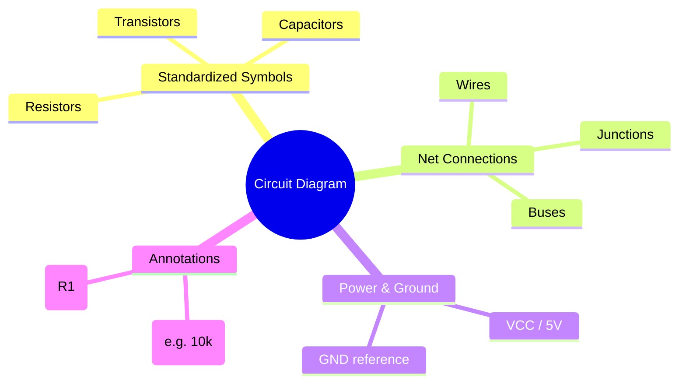
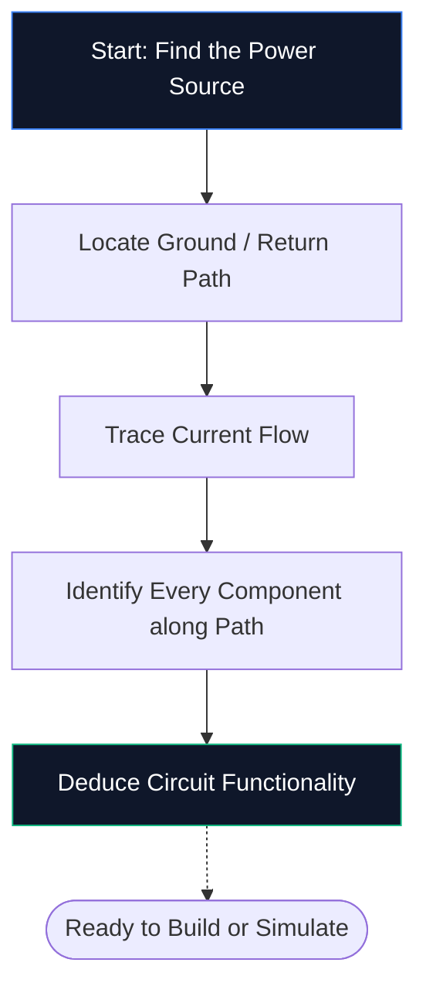

これまでに回路図エディタを開いたことがない場合、必要なガイドはこれだけです。ソフトウェアを 1 つもインストールせずに、回路図とは何か、シンボルをデコードする方法、**Circuit Diagram Maker** 内で最初の回路図を描く方法など、基本を順を追って説明します。

## 回路図とは何ですか?

回路図は電気の地図です。地下鉄の路線図が、トンネルの縮尺に合わせて描かずに駅がどのように接続されているかを示すのと同じように、回路図は、物理的なサイズや基板の配置を気にすることなく、電子コンポーネントがどのように接続されるかを示します。

回路図では、現実的な図面の代わりに **標準化されたシンボル** が使用されます。抵抗器はジグザグの線、コンデンサは 2 つの平行な板、ダイオードは棒と交わる三角形として表示されます。この普遍的な略記により、図はすべての国や言語でクリーンで印刷可能、読みやすくなります。

> **抽象化が重要な理由:** 物理抵抗器は色付きのバンドが付いた小さな円柱ですが、50 個のコンポーネントの回路図では、その詳細が視覚的な混乱を生み出すことになります。シンボルは画像を圧縮するので、脳は *どのように見えるか* ではなく *どのように接続するか* に集中できます。

## すべての初心者が知っておくべき 10 の記号

単一の回路図を読んだり、描いたりする前に、中心となる構成要素を認識する必要があります。以下の表を覚えておけば、ほとんどの趣味の回路をすぐに解読できるようになります。

|記号の形状 |コンポーネント |一次関数 |指定者 |
| :--- | :--- | :--- | :--- |
| **ジグザグライン** |抵抗器 |電流の流れを制限します | `R` |
| **2 本の平行線** |コンデンサ |電荷を蓄積し、ノイズをフィルタリングします。 `C` |
| **一連のループ** |インダクタ |磁場にエネルギーを蓄える | `L` |
| **三角形 + バー** |ダイオード |一方向の電流を許容します。 `D` |
| **三角形 + バー + 矢印** | LED |順バイアス時に発光 | `D` / `LED` |
| **長い/短い平行線** |バッテリー | DC電圧を供給 | `BT` |
| **3 つの積み上げ線** |地面 | 0 V の基準点 | `GND` |
| **三角形の形状** |オペアンプ |電圧差を増幅 | `U` / `IC` |
| **ピン付きの長方形** |集積回路 |複雑な機能を実行します | `U` / `IC` |
| **直線** |ワイヤー |コンポーネント間で電流を流す | *(なし)* |

## 5 つのステップで回路図を読む方法

回路図を読むときは、毎回同じ思考プロセスに従います。回路図上でこれら 5 つのステップを練習すれば、そのパターンが自然に身に付きます。

1. **電源を見つける** — バッテリーの記号や、VCC、5 V、3.3 V などのラベルを探します。ここが電気エネルギーが回路に入る場所です。
2. **アースを見つける** — 3 本線のアース記号または GND ラベルを見つけます。すべての回路にはリターン パスが必要です。
3. **電流の流れを追跡** — プラス端子から各コンポーネントを通ってアースに戻る配線をたどります。従来の電流はプラスからマイナスに流れます。
4. **すべてのコンポーネントを特定する** — 各記号を上の表と照合し、その横にあるラベルを読んで正確な値を確認します (たとえば、10 kΩ は 10,000 オームを意味します)。
5. **目的を理解する** — 回路が何をするのかを自問してください。 LED と抵抗を組み合わせたシンプルなインジケーターライトです。帰還抵抗を備えたオペアンプは信号増幅器です。

## 最初の回路図: LED 回路

すべてのエレクトロニクス初心者は、電流制限抵抗を介して電力を供給される LED から始めます。 [Circuit Diagram Maker editor](/editor/)を開き、手順に従ってください。

**回路アーキテクチャのパイプライン:**

**詳しい手順:**

1. **バッテリー** シンボルをサイドバーからキャンバスにドラッグします。
2. **抵抗**をバッテリーの右側に配置します。
3. **LED** を抵抗器の右側に配置します。
4. **W** を押してワイヤ モードを有効にします。
5. バッテリーのプラス端子をクリックし、次に抵抗器の左側のピンをクリックしてワイヤを描画します。
6. 抵抗の右ピンを LED のアノードに接続します。
7. LED のカソードをバッテリーのマイナス端子に配線します。
8. 抵抗をダブルクリックし、「**330 Ω**」と入力します。
9. [**エクスポート → SVG**] をクリックして出版品質のファイルを保存します。

## よくある 5 つの間違い (およびその回避方法)

|間違い |何が問題なのか |クイックフィックス |
| :--- | :--- | :--- |
| **地上パスが見つかりません** |回路が開いているように見えます。電流が流れない |リターンパスは必ずアースに配線してください。
| **ドットのないワイヤー交差** |交差する 2 本のワイヤは、実際には接続されていないように見えます。ワイヤが実際に結合する場所にのみジャンクション ドットを追加します。
| **コンポーネント値がありません** |レビュー担当者はあなたのデザインを検証できません |すべての抵抗、コンデンサ、IC にラベルを付けます。
| **配線が面倒** |ワイヤが斜めまたは重なっていると、可読性が低下します。マンハッタン ルーティングを使用する (水平および垂直のみ) |
| **参照指定子はありません** |パーツリストが作成できなくなる |各部品に R1、C1、U1、D1 などのラベルを付けます。

## 次にどこへ行くか

基本的な回路図の描画に慣れたら、次のリソースを参照してレベルアップしてください。

* **[回路図シンボルの説明](/blog/circuit-diagram-symbols-explained/)** — すべてのシンボル カテゴリを詳しく説明します
* **[回路図をオンラインで作成する方法](/blog/how-to-make-circuit-diagram-online/)** — 高度なテクニックとワークフローのヒント
* **[コンポーネント ライブラリ](/components/)** — 回路図メーカーで利用可能な 40 以上のシンボルをすべて参照します