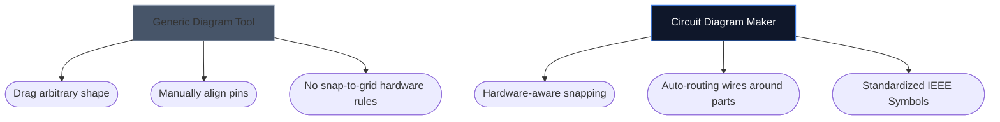

電子回路図を描画するための適切なツールの選択により、新しいハードウェア プロジェクトをどれだけ速く反復できるかが決まります。高度な PCB 設計者は重量のあるデスクトップ環境を必要としますが、愛好家、学生、メーカーは、まったく異なるもの、つまりアクセシビリティと速度を必要とすることがよくあります。

以下では、当社のツールが業界の主要な代替手段とどのように比較できるかを分析します。

## ツール分類マトリックス

個々のツールに入る前に、プロジェクトが実際にどの層のソフトウェアを必要とするかを理解することが重要です。エンタープライズ PCB ソフトウェアを使用して 4 コンポーネント LED レイアウトをスケッチするのはやりすぎです。

## 1. 回路図メーカー vs. Fritzing

Fritzing は、ブレッドボードのプロトタイピングと回路図の間のギャップを埋めることで有名です。ただし、Fritzing はインストールが必要であり、長年にわたってメンテナンス アップデートに苦労してきました。

|特集 |回路図メーカー |フリッツィング |
| :--- | :--- | :--- |
| **主な焦点** |標準的な回路図レイアウト |ブレッドボードの視覚化 |
| **インストール** |なし (100% ブラウザベース) |デスクトップのインストールが必要 |
| **コスト** |完全無料 |有料 (ドネーションウェア) |
| **学習曲線** |非常に低い |中程度 |

> **評決:** 特にブレッドボードに突き刺さる物理ワイヤーを視覚化する必要がある場合は、Fritzing の方が優れています。標準的で汎用的な電子回路図が「すぐに」必要な場合は、Circuit Diagram Maker を使用してください。

## 2. 回路図メーカー vs. KiCad および Altium

KiCad は伝説的なオープンソース PCB スイートであり、Altium Designer はエンタープライズ業界標準です。彼らは非常に強力です。

|機能層 |回路図メーカー | KiCad / アルティウム |
| :--- | :--- | :--- |
| **出力タイプ** | SVG/PNG 画像 |ガーバー ファイル、BOM、ピック&プレイス |
| **シミュレーション** |ビジュアル / シンプル |深い SPICE 統合 |
| **最初のスキーマまでの速度** | < 10 秒 | 10 ～ 30 分 (セットアップ/構成) |

> **評決:** 銅の層を深センの工場に送る場合は、KiCad または Altium を使用してください。物理学の課題、ブログ投稿、またはフォーラムの質問に回路図を添付する場合は、回路図メーカーを使用します。

## 3. 回路図メーカー vs.draw.io / Lucidchart

フローチャートでは、draw.io などの汎用図作成ツールが非常に人気があります。しかし、彼らはエレクトロニクスの意味的理解を欠いています。

専用の電子ツールを使用すると、エディタはワイヤが接合部なしで単純にランダムに「終端」できないことを理解し、本質的に標準プロパティ (オームから抵抗器など) をマッピングします。

## どのツールがあなたに適していますか?

最良のツールとは、邪魔にならないツールです。素早いアイデア出し、教育課題、Web 出版のために、[Circuit Diagram Maker](/editor/) はスピードとモダンな美しさの比類のない組み合わせを提供します。