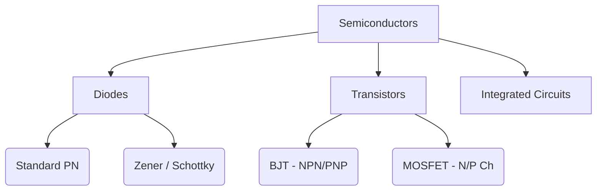

電子シンボルはハードウェア エンジニアリングの世界共通言語です。音符がピッチとリズムを決定するのと同じように、回路シンボルは電気的な機能、特性、接続性を紙上で伝えます。

この包括的なガイドでは、回路図で遭遇する最も重要な要素の視覚的形態を詳しく解説します。

## グローバル標準の違い: IEEE と IEC

特定のシンボルについて説明する前に、回路図が描かれた場所に応じてシンボルの外観が異なる可能性があることを認識することが重要です。 2 つの主要な規格は、**IEEE/ANSI** (主に南北アメリカ) と **IEC** (ヨーロッパおよび国際) です。

```mermaid
flowchart LR
    subgraph Regional Standards
    A((Schematic Origin))
    A -- US / Americas --> B[IEEE / ANSI]
    A -- Europe / Int'l --> C[IEC]
    end
    
    B -.-> D(Zigzag Resistors)
    C -.-> E(Rectangle Resistors)
    
    style B fill:#1e293b,stroke:#f59e0b
    style C fill:#1e293b,stroke:#3b82f6
```

Circuit Diagram Maker では、IEEE/ANSI 規格を主に使用します。IEEE/ANSI 規格はデジタルおよび趣味のエコシステムで依然として高い人気を誇っていますが、どちらも技術的には正しいものです。

## 受動部品

受動コンポーネントは動作するために外部電源を必要とせず、信号を増幅することはできません。

|コンポーネント |標準シンボルの外観 |機能説明 |
| :--- | :--- | :--- |
| **抵抗** |鋭いギザギザのジグザグ線で定義されます。変数のバリアントには、線を突き刺す矢印が付いています。 |電力を熱として放散し、電流の流れを制限します。 |
| **コンデンサ** |ギャップで区切られた 2 本の平行線。極性のあるバージョンでは、線の 1 つが湾曲してマイナス端子を示します。 |電気エネルギーを電場に一時的に蓄えます。 |
| **インダクタ** |ワイヤのコイルを表す一連の丸いループまたは半円。 |磁場にエネルギーを蓄積することで、電流の流れの変化に対抗します。 |

## アクティブコンポーネント (半導体)

アクティブコンポーネントは電源を必要とし、電気の流れを制御し、多くの場合信号を増幅します。

|コンポーネント |視覚的なインジケーター |コアの使用法 |
| :--- | :--- | :--- |
| **ダイオード** |平らな線を指す三角形。線はカソード（マイナス）を示します。 |電気用の一方向弁です。 |
| **LED** |外側を向いた 2 つの小さな矢印が付いた標準的なダイオードのシンボルで、発光を示します。 |視覚的インジケーターとオプトエレクトロニクス。 |
| **BJT トランジスタ** | NPN または PNP を示す矢印が付いた、ベース、コレクタ、およびエミッタの 3 つの接続が両側にある垂直線。 |電流制御のスイッチとアンプ。 |
| **MOSFET** |分離されたゲートと内部基板ダイオードを強調する分離された境界線が特徴です。 |高出力を実現する電圧制御スイッチング。 |

## 機械および出力デバイス

これらの部品は物理世界と相互作用し、人間の入力を受け取るか、物理的な出力を生成します。

|コンポーネント |回路図の略記 |アプリケーション |
| :--- | :--- | :--- |
| **スイッチ (SPST)** |下に回転して回路を完成できる破線。 |基本的なオン/オフ電源制御。 |
| **リレー** |通常は、絶縁されたスイッチ接点に結合されたインダクタ (内部コイル) として表されます。 |低電圧マイクロコントローラーを介して高電圧負荷を切り替えます。 |
| **モーター** | 「M」を含む円。多くの場合、指定されたプラスとマイナスの端子が付いています。 |電流を回転運動に変換します。 |

> **設計のヒント:** 機械式スイッチまたはリレーを使用するときは、半導体コンポーネントを電圧スパイクから保護するために、誘導負荷の両端に常に *フライバック ダイオード*を含めてください。

これらの記号を理解することは、回路を流暢に扱うための第一歩です。 [オンライン エディター](/editor/) をチェックして、これらの形状をドラッグ アンド ドロップし、即座に試してみてください。