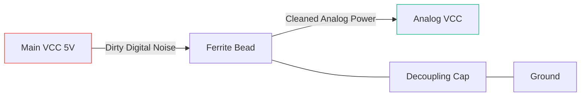

高速デジタル電子機器は多くの電磁ノイズを発生します。緩和策を講じないと、この高周波干渉が敏感なアナログ回線に侵入したり、外部に放射したりして、デバイスが FCC エミッション テストに見事に不合格となる原因となります。

この干渉に対する主な武器は **フェライト ビーズ**です。回路図のシンボルと配置を理解することで、回路が正常に動作するか、それとも回路自体のノイズに埋もれるかが決まります。

## 1. フェライト ビーズのシンボルの視覚化

フェライト ビーズは本質的に損失の大きいインダクタのように動作します。このため、その回路図シンボルは標準的なインダクタのシンボルと密接に関連していますが、その特定の役割を強調するように調整されています。

```mermaid
graph LR
    A[Inductor Basis] --> B(Standard Inductor Symbol)
    A --> C(Rectangle Over Wire)
    B -.-> D(Addition of a dashed line or solid bar)
    D --> E[IEEE Ferrite Symbol]
    C --> F[IEC Ferrite Symbol]
    
    style E fill:#0f172a,stroke:#3b82f6
    style F fill:#0f172a,stroke:#10b981
```

|特性 | IEEE/ANSI 規格 | IEC規格 |メモ |
| :--- | :--- | :--- | :--- |
| **形状** |バー/ボックス付きの半円のシリーズ | 写真立体的な長方形のブロック |機能的には同じ結果になります |
| **指定子のプレフィックス** | `FB` | `FB` または `L` |パワーインダクタとの混同を避けるために、「FB」の使用を強くお勧めします。
| **測定単位** |特定の MHz でのオーム (Ω) |特定の MHz でのオーム (Ω) |ヘンリー (H) で測定されるインダクタとは異なります。

> **重要な違い:** フェライト ビーズをインダクタンスで評価しないでください。フェライト ビーズは、特定の周波数** (通常は 100 MHz) での **インピーダンス (オーム単位) によって指定されます。

## 2. 核となる運用メカニズム

標準インダクタの代わりにフェライトビーズを使用するのはなぜですか?

* **インダクタ**はエネルギーを蓄積し、回路に戻します。反応性が高く、エネルギーを保存します。
* **フェライト ビーズ**は、*損失*になるように積極的に設計されています。高周波では抵抗器のように動作し、不要な高周波ノイズを直接熱に変換します。

|周波数範囲 |フェライトビーズの挙動 |サーキットでの結果 |
| :--- | :--- | :--- |
| **低周波/DC** | 1MHz未満 |単純なワイヤ (~0 Ω) のように機能します。 DC 電力は自由に通過します。 |
| **共振周波数** |反応性が高い |エネルギーを一時的に蓄えます。 |
| **高周波** | 50MHz以上 |大きな値の抵抗器のように機能します。 RF ノイズをブロックし、熱として放散します。 |

## 3. 回路図配置のベストプラクティス

FB シンボルを適切に使用するには、戦略的な配置が必要です。回路図上でフェライト ビーズをランダムに叩くと、実際にはリンギングと共鳴が悪化する可能性があります。

### 電源のデカップリング (Pi フィルター)

「FB」シンボルの絶対的に最も一般的な用途は、クリーンなアナログ電源からダーティなデジタル電源を分離することです。

上記の構成 (Pi フィルターの一部) では、フェライト ビーズが高周波過渡現象が AVCC ラインに入るのをブロックし、コンデンサーが残りのリップルをグランドに分路します。

### データラインのEMI抑制

長い USB データ ケーブルや HDMI トレースを配線する場合、「FB」シンボルがコネクタの近くに直列に配置されることがよくあります。これにより、物理的に露出した長いワイヤがアンテナとして機能して部屋中に CPU ノイズを放射することがなくなります。

次の回路図にフェライト ビーズを追加するには、**[回路図エディタ](/editor/)** を開き、「フェライト」を検索して、インピーダンス定格を指定します。