12V の車のバッテリーを家庭用電化製品を動作させることができる 220V の交流に変換するパワー インバーターの構築は、エレクトロニクス エンジニアにとって通過儀礼です。

はんだごてを持ち上げる前に、基礎となる回路図を完璧に理解する必要があります。高電圧回路は容赦なく、不適切に描かれた図は MOSFET の焼損や重大な感電を確実にします。このガイドでは、基本的な方形波インバーターのアーキテクチャを詳しく説明します。

> **安全警告:** 220V AC 電源は致命的です。この記事は、製造の青写真ではなく、回路図ロジックと理論的設計の探求です。高度な電気トレーニングを受けずに、高電圧回路を決して構築しないでください。

## 3 本柱のアーキテクチャ

最新のインバータがどれほど複雑であっても、回路図は常に視覚的および論理的に 3 つの異なる機能ブロックに分割できます。

```mermaid
flowchart LR
    DC_SRC[(12V DC Battery)] --> OSC[1. Oscillator Block]
    OSC -- Low Power Square Wave --> AMP[2. Power Switch Block]
    AMP -- High Current 12V Wave --> TX[3. Step-Up Transformer]
    TX -- Magnetic Induction --> AC_OUT((220V AC Output))
    
    style OSC fill:#0f172a,stroke:#3b82f6
    style AMP fill:#0f172a,stroke:#f59e0b
    style TX fill:#0f172a,stroke:#ef4444
```

### ステージ 1: オシレーター (頭脳)

バッテリーからの直流電流（DC）は直線的に流れます。変圧器は直線を昇圧することはできません。変動する磁場が必要です。したがって、DC を人工 AC 波 (通常は地理的地域に応じて 50 Hz または 60 Hz) に変換する必要があります。

|使用されるコンポーネント |概略的な役割 |選ばれる理由 |
| :--- | :--- | :--- |
| **CD4047 IC / 555 タイマー** |非安定マルチバイブレータ | RC時定数の計算により極めて安定した方形波を出力します。 |
| **抵抗器とコンデンサのネットワーク** |タイミングキャリブレーター |値 (例: 「R=100kΩ」、「C=0.1μF」) は、正確な 50Hz 周波数を一意に決定します。 |

### ステージ 2: パワースイッチ (筋肉)

ロジック チップは純粋な 50Hz の波形を生成しますが、電流制限は非常に低くなります (多くの場合 20mA 未満)。それを変圧器に供給しても、電球を点灯させるのに十分な磁束は生成されません。

発振器とトランスコイルの間に高出力トランジスタを配置します。

1. 発振器の弱い信号が、大規模な N チャネル MOSFET (IRF3205 など) の **ゲート** に到達します。
2. MOSFET は電子耐久性リレーとして機能します。
3. 12V バッテリーからの大量のアンペア数を、変圧器のコイルを介して 1 秒間に 50 回激しく切り替えます。

### ステージ 3: 昇圧トランス

回路図のこの時点では、大量の 12V 電流が前後にパルスしています。最終ステージでは、これを変圧器の一次コイルに配線する必要があります。

|特集 |回路図の詳細 |現実世界への影響 |
| :--- | :--- | :--- |
| **一次コイル (左)** |センタータップ構成 (`12V - 0 - 12V`) | 2 つの交互 MOSFET による前後のプッシュプル スイッチングが可能です。 |
| **コアライン** |垂直に引かれた 2 本の実線 |高効率の磁気誘導に必要な鉄・フェライトコアを指します。 |
| **二次コイル (右)** |巻線比大幅アップ |物理学により、パルス状の 12V の磁束が致死性の揮発性の 220V の波に変化します。 |

## 描画に関する考慮事項

**[回路図エディタ](/editor/)** を利用してこの設計を作成する場合は、レイアウトのベスト プラクティスに留意してください。

* 12V バッテリー電流を流す太線は、低電力発振器の線よりも太く描きます。
* MOSFET ソース ピンを明示的かつ一意に接地します。ノイズ結合を防ぐために、敏感な発振器のグランドの近くに配線を戻さないでください。
* 220V 出力をグラフィックで描写します。裸のワイヤ終端を空いたままにするのではなく、警告ラベルと出力ポート (ソケット シンボルなど) を配置します。