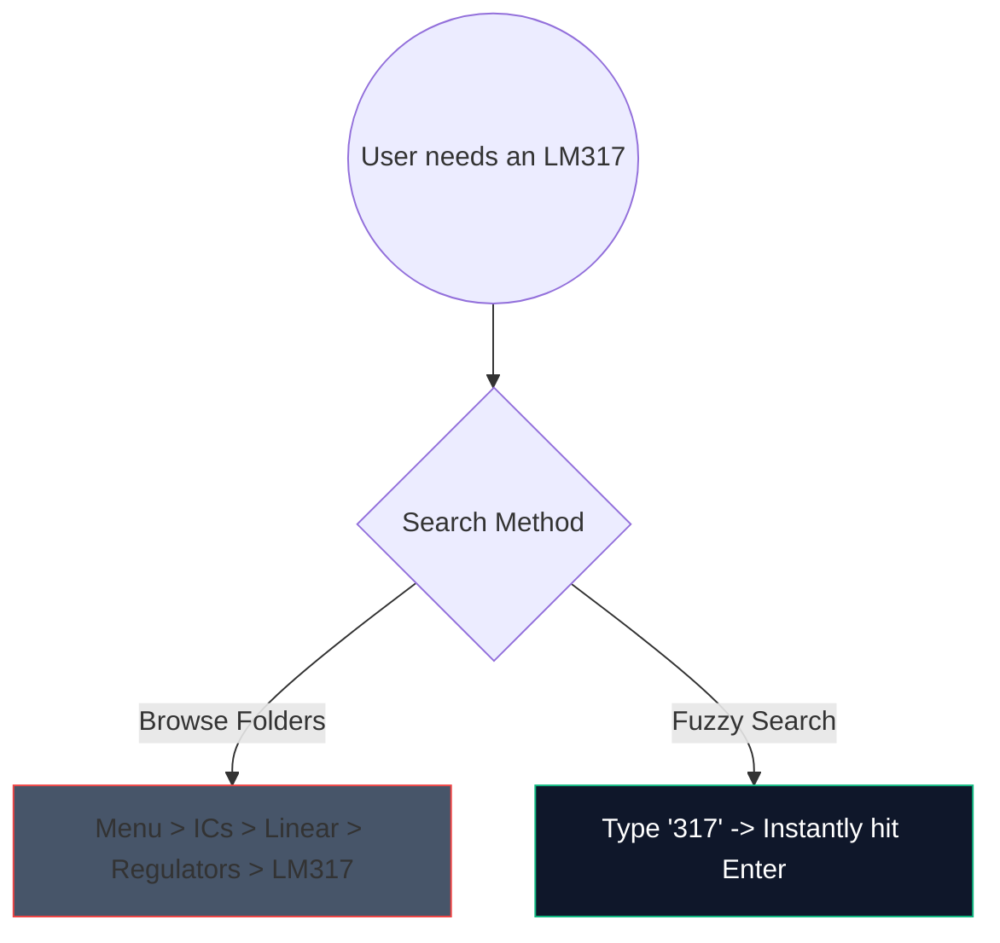

単純なアンプ回路をスケッチするためだけに、重い 2 GB のデスクトップ ソフトウェアをダウンロードする時代は終わりました。ブラウザベースの CAD (コンピューター支援設計) が登場し、驚異的に高速です。

ここでは、最新の Web ツールを利用して、実稼働品質の回路図を 5 分以内に生成する方法を正確に説明します。

## なぜブラウザベースの回路設計なのか?

あなたが教育者、学生、または趣味でドキュメントを作成している場合、速度とアクセシビリティは生の機能よりも優先されます。

```mermaid
flowchart LR
    subgraph Traditional Workflow
    DL[Download/Install] --> CONF[Configure Libraries] --> DRAW1[Draw]
    end
    
    subgraph Web Workflow
    URL[Go to URL] --> DRAW2[Draw immediately]
    end
    
    style URL fill:#0f172a,stroke:#3b82f6
    style DRAW2 fill:#1e293b,stroke:#10b981
```

|メトリック |デスクトップアプリケーション |回路図メーカー |
| :--- | :--- | :--- |
| **保管スペース** | 1GB - 5GB+ | 0 MB (クラウドベース) |
| **OS の互換性** |多くの場合、Windows 専用ポートまたはバグのあるポートです。ユニバーサル Web 互換 |
| **起動時間** | 15 ～ 30 秒 | < 1 秒 |
| **移植性** | 1 台のマシンに限定される |どこでもアクセス可能 |

## スピードを上げるためのコアワークフローハック

Web エディターを使用する場合、キーボード ショートカットを使用すると、エクスペリエンスが「クリック操作」から中断のないフロー状態に変わります。

エディターで覚えておくべき、ROI が最も高いショートカットを次に示します。

|アクション |ホットキー コマンド |ワークフローのメリット |
| :--- | :--- | :--- |
| **配線ルーティング** | `W` |カーソルを接続モードに瞬時に切り替え、ツールバーに移動せずに迅速なネット ルーティングを可能にします。 |
| **コンポーネントの回転** | `R` (部分を押しながら) |抵抗やトランジスタを配置する前に方向を変えると、後のクリーンアップ時間を大幅に節約できます。 |
| **選択範囲が重複しています** | `Ctrl + D` または `Alt + ドラッグ` |メニューから 8 個の LED を取り出さないでください。 1 つ配置して構成し、即座に 7 回複製します。 |
| **パンキャンバス** | `スペースバー + ドラッグ` |大規模で複雑なレイアウトをナビゲートしながら、ズーム レベルを一定に保ちます。 |

## コンポーネント検索の利用

膨大なドロップダウン メニューを視覚的に検索するのは面倒です。堅牢なあいまい検索メカニズムを統合しました。

「半導体 -> トランジスタ -> BJT」をクリックするのではなく、検索バーを押して「NPN」と入力するだけです。このツールは、最も可能性の高い一致を即座に厳選します。

## 業務用にエクスポートする

図の作成はまだ戦いの半分に過ぎません。残りの半分は、論文や技術ブログにそれを組み込むことです。

回路パターンは、可能な限り、PNG や JPG ではなく、**SVG (スケーラブル ベクター グラフィックス)** としてエクスポートしてください。 SVG にはピクセルではなく数学的に定義された線が保存されます。つまり、回路図をビルボード サイズまで拡大でき、ラスター化のぼやけがなく常に鮮明なままになります。

速度をテストする準備はできましたか? **[アプリを起動](/editor/)**して、555 タイマー点滅の LED 回路を作成してみます。