複雑な回路図を初めて開くと、宇宙人の言語を見つめているような気分になります。何十もの交差する線、不可解な略語、ギザギザの記号が視覚的なノイズの壁に溶け込みます。

しかし、経験豊富なエンジニアは、ページ全体を見つめて回路図を読むことはありません。彼らは孤立し、追跡し、征服します。ここでは、回路図を解読するための段階的な方法論を示します。

## ステップ 1: コア電力インフラストラクチャを分離する

回路が「何をする」かを理解する前に、回路が「どのように呼吸する」かを理解する必要があります。

すべての回路図には電気エネルギーのエントリ ポイントがあります。最初のタスクは、すべての主要な電圧レールと接地基準を見つけることです。

```mermaid
flowchart TD
    A[Start: Scan Edges] --> B{Look for Power Symbols}
    B -- Found Battery/Jack --> C[Trace the initial VCC and GND lines]
    B -- Found Net Labels --> D[Locate generic +5V, +3.3V pads]
    C --> E[Are there Voltage Regulators?]
    D --> E
    E -- Yes --> F[Mentally divide circuit into Voltage Zones]
    E -- No --> G[Circuit runs on single voltage]
    
    style A fill:#0f172a,stroke:#3b82f6
    style F fill:#1e293b,stroke:#f59e0b
```



|記号/テキスト |意味 |行動要件 |
| :--- | :--- | :--- |
| `VCC` / `VDD` | IC 用の正の電源電圧。 |これを追跡して、すべての IC が電力を受け取っていることを確認します。 |
| `GND` / `VSS` |共通接地基準。 |これらのシンボルはすべて物理的に接続されていると仮定します。 |
| `LDO` / `バック` |電圧を下げるチップです。 |どのコンポーネントが新しい低電圧を利用しているかに注目してください。 |

## ステップ 2: 「脳」(IC) を分かりやすく理解する

電力がどこに流れているかがわかったら、ページ上の最大の長方形を探します。集積回路 (IC) は、回路図の主な機能を決定します。

「NE555」や「ATmega328P」などの不可解な部品番号を持つ「U1」というラベルが付いた IC を見つけた場合は、すぐに回路図を読むのをやめてください。新しいタブを開き、**データシート**を取得します。

半導体の内部物理を理解する必要はありません。データシートの「ピン配置図」を見てください。ピン 4 が「RESET」、ピン 8 が「VCC」の場合は、そのロジックを直ちに図面にマッピングし直します。

## ステップ 3: 入力と出力を追跡する

回路は機能する機械です。彼らは環境からの入力を受け取り、それを処理し、結果を出力します。

```mermaid
quadrantChart
    title Input/Output Hardware Identification
    x-axis Analog/Physical --> Digital/Data
    y-axis Input Devices --> Output Devices
    quadrant-1 Digital Receivers (e.g. WiFi)
    quadrant-2 Digital Displays (e.g. OLEDs)
    quadrant-3 Physical Actuators (e.g. Motors)
    quadrant-4 Physical Sensors (e.g. Thermistors)
    "Push Button": [0.1, 0.4]
    "Photoresistor": [0.2, 0.2]
    "UART RX": [0.8, 0.4]
    "UART TX": [0.8, 0.6]
    "Speaker": [0.3, 0.8]
    "LED": [0.4, 0.7]
```

中央の IC から外側に向かって配線をトレースします。 IC ピンが LED に接続されている場合、それは視覚的な出力となります。ピンがグランドに接続されている SPST スイッチに接続されている場合、それは人間による入力です。

## ステップ 4: ジャンクションと交差点を検証する

初心者にとって最も一般的な読み取りエラーは、相互に交差するワイヤーの誤解です。

* **点が結び目を生み出す:** 2 つの交差する線の交差部分に実線の点がある場合、それらは物理的にはんだ付け/接続されています。電流はそれらの間を流れることができます。
* **ドットがない場合はブリッジになります:** 2 本の線が単純な十字 (+) を形成している場合、それらは接触しません。これらは、高架上で相互に通過する 2 つの高速道路に似ています。

## ステップ 5: サブサーキットを認識する (秘密兵器)

エンジニアが回路を完全にゼロから設計することはほとんどありません。これらは標準のモジュラーサブ回路を接着します。これらの視覚的な「単語」を認識できるようになると、個々の「文字」を読むのをやめます。

|視覚的なパターン |標準サブ回路 |機能 |
| :--- | :--- | :--- |
| IC のすぐ隣で「VCC」と「GND」を結ぶコンデンサ。 | **デカップリング コンデンサ** |ノイズを吸収します。論理フローを分析する場合は無視してください。 |
|デジタル ピンからの抵抗は「+5V」までラップされます。 | **プルアップ抵抗** |ピンの浮きを防止します。安定した HIGH デフォルト状態を保証します。 |
| 2 つの抵抗が電圧とグランドの間に直列に配置され、中間でタップされています。 | **分圧器** |センサーピンで安全に読み取れるように電圧を比例的に降下させます。 |

この理論を実践してください。 **[回路図エディタ](/editor/)** を開いてテンプレートをロードし、電源、頭脳、入力、出力を自分で計画してください。