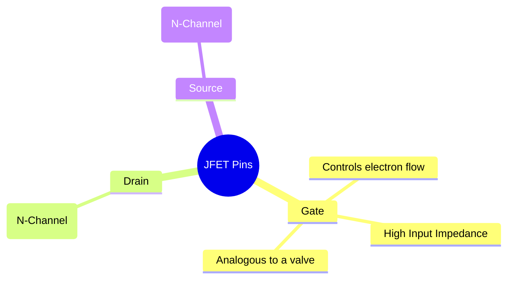

MOSFET が大規模に普及する前は、**JFET** (接合電界効果トランジスタ) が高入力インピーダンス増幅の王様でした。現代のデジタル ロジックではそれほど頻繁には使用されていませんが、高忠実度のオーディオ プリアンプ、高感度の機器、RF 回路では依然として不可欠な製品です。

JFET の回路図シンボルを理解することは、ディスクリート アナログ回路設計を深く掘り下げる人にとって不可欠です。

## 1. JFET シンボルの構造

電流制御デバイスであるバイポーラ接合トランジスタ (BJT) とは異なり、JFET は **電圧制御** デバイスです。回路図シンボルは、内部半導体チャネルの物理構造を視覚的に表現しようとしています。

シンボルは、チャネルを表す真っ直ぐな垂直線と、それに引っ掛かる 2 本の水平線 (ドレインとソース) で構成されます。 3 番目の垂直線はゲートを形成し、半導体の極性を示す矢印が付いています。

### N チャネル JFET と P チャネル JFET

BJT に NPN と PNP があるのと同じように、JFET には 2 つの異なる種類があります。

|特徴 | NチャンネルJFET | P チャネル JFET |
| :--- | :--- | :--- |
| **記号の矢印** | **IN** をチャネル ラインに向ける |チャンネルから離れた **OUT** を指します |
| **主要な通信会社** |電子 |穴 |
| **ピンチオフの VGS** |負の電圧 (例: -5V) |正電圧 (例: +5V) |
| **一般的な操作**|通常オン -> 負の電圧アレイを印加してオフ |通常オン -> 正の電圧アレイを印加してオフ |

> **思い出のトリック:** 「IN を指す」は **N** チャネルを意味します。ゲートの矢印を見てください。それがラインの内側を向いている場合は、N チャネル JFET (人気のある 2N5457 など) を扱っていることになります。

## 2. 動作: 枯渇モード

JFET の最も特徴的な特徴の 1 つは、JFET が **デプレッション モード** デバイスであることです。これは、回路図をどのように設計するかに大きく影響します。

* **MOSFET (エンハンスメント モード):** 通常はオフです。ゲートをオンにするには、ゲートに電圧を印加する必要があります。
* **JFET (デプレッション モード):** 通常はオンです。ゲートが 0 ボルトの場合、最大電流がドレインからソースに流れます。 *逆バイアス*電圧 (N チャネルの場合はマイナス) を印加して空乏領域を拡大し、電子の流れを文字通り「ピンチオフ」してデバイスをオフにする必要があります。

```mermaid
flowchart LR
    VGS[V_GS = 0V] --> I1[Maximum Drain Current flows]
    VGS2[V_GS = -2V] --> I2[Current is restricted]
    VGS3[V_GS = -5V] --> I3[Pinch-Off reached. Circuit is OFF]
    
    style VGS fill:#1e293b,stroke:#f59e0b
    style VGS3 fill:#1e293b,stroke:#ef4444
```

## 3. 典型的な回路図のアプリケーション

JFET のゲートは動作中に逆バイアスされるため、そこに流れる電流は実質的にゼロになります。これにより、天文学的に高い入力インピーダンスが得られます (多くの場合、数百メガオームで測定されます)。

|回路応用 | JFETが選ばれる理由 |概略的な手がかり |
| :--- | :--- | :--- |
| **オーディオ プリアンプ** |非常に低いノイズと大きな入力インピーダンスにより、敏感なエレキギターのピックアップの負荷を防ぎます。 |多くの場合、ソース フォロワーのバッファー ステージとして機能します。 |
| **アナログ スイッチ** |これらはゲート電流なしで純粋に電圧制御されるため、信号経路にスイッチング過渡現象が発生しません。 |ドレイン-ソースチャネルを通過するアナログ信号と直列に配置されます。 |
| **定電流源** | JFET は、ゲートがソースに直接接続されている場合、定電流シンクとしてネイティブに動作します。 |ゲート端子はソース端子に直接配線されています。 |

これらの特殊なアナログ回路を図示する場合、精度が重要です。製造上の欠陥を防ぐために、ゲート矢印の方向が正しいことを確認してください。 **[回路図メーカー](/editor/)** の厳選されたディスクリート半導体ライブラリを使用して、標準の N チャネルおよび P チャネル JFET シンボルを次のキャンバスに正確に配置します。